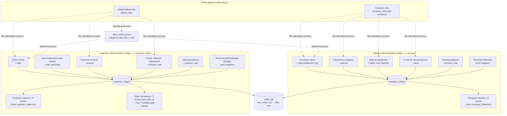
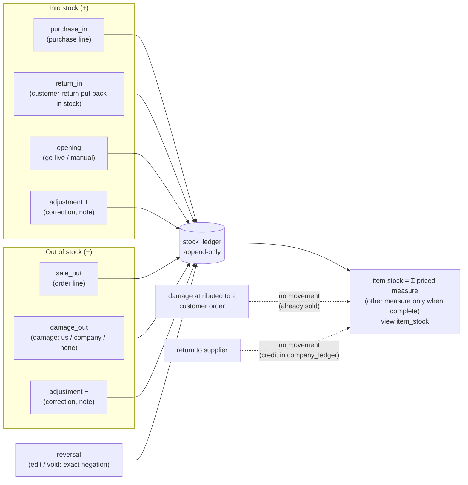
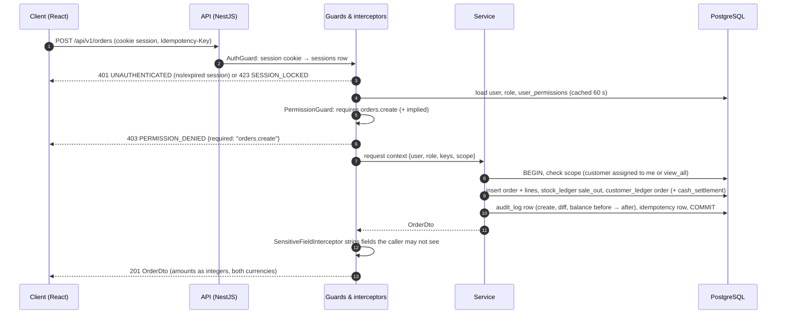

> Extracted from `spec/mizan-factory-system-spec-v1.2.md` (Deliverable 2). Section numbers are unchanged, so cross-references to other deliverables resolve in the full document or in the sibling files of this folder.

# Deliverable 2 — Architecture

## 2.1 Stack, reuse and deviations

| Layer | Choice (same as the palette system) | Notes |
|---|---|---|
| Frontend | React 18 + TypeScript SPA (Vite), React Router, TanStack Query for server state, a small store for session/preferences, react-i18next with ICU messages, the palette component library (`@factory/ui`) and its design-token pipeline (A-01) | Mizan is a **separate application and repository** with its own token file, message catalogs, logo and name; it depends on `@factory/ui` as a package, never forks it. |
| Backend | Node.js + NestJS (TypeScript), REST API under `/api/v1`, Prisma ORM (A-02) | One module per bounded context (auth, users, materials, purchases, customers, orders, companies, damages, history, reports, settings) plus two shared kernels: `money` and `ledger`. |
| Database | PostgreSQL 15+ with extensions `pgcrypto` (uuid), `pg_trgm` (search), `citext` (usernames) | Single database; ledgers are ordinary tables with revoked UPDATE/DELETE privileges. |
| Hosting | Docker Compose on a Linux VPS behind Nginx/Caddy with TLS; PostgreSQL container with a persistent volume; nightly backups to object storage (A-03) | Section 2.14. |
| Auth transport | Opaque server-side session in an httpOnly, Secure, SameSite=Lax cookie (A-04) | Same login UI pattern as the palette system (username + password, no e-mail). |

**Deviations from the palette stack: none.** Every requirement is met on this stack. Two additions that are configuration, not deviations: the `pg_trgm` extension for script-normalised search and a per-request idempotency store (a table) for safe retries on poor connections.

**What is reused from the palette system (and how):** the component library and tokens pipeline, the i18n pipeline (message catalogs, build-time missing-key check, ICU plural rules), the RTL utilities (logical properties, direction context), the theming mechanism (data-theme attribute + CSS variables), the auth screens' behaviour, the list/detail/form page patterns, the permission-guard pattern on the API. Section 2.10.11 lists the components by name.

## 2.2 Domain model

### 2.2.1 Conventions

- Primary keys are `uuid` (generated by `gen_random_uuid()`); human-facing numbers (`number`) come from per-type sequences and are unique.
- **Mutable entities** (users, items, item_month_prices, companies, customers, purchases, purchase_lines, orders, order_lines, damages, settings) carry the audit set: `created_at timestamptz not null default now()`, `created_by uuid not null → users`, `updated_at timestamptz not null`, `updated_by uuid not null → users`, `deleted_at timestamptz null`, `deleted_by uuid null → users`, and `version integer not null default 1` for optimistic locking (lines and settings excepted, they are versioned through their parent).
- **Append-only tables** (customer_ledger, company_ledger, stock_ledger, audit_log, company_rates, global_rates, order_payment_type_changes, login_attempts, idempotency_keys) carry a creation timestamp and creator only (`created_at`/`created_by`, or the domain names `changed_at`/`changed_by` on payment-type changes and `attempted_at` on login attempts, which have no creator because the attempt may be anonymous); they are never updated or deleted (database privileges enforce it, section 2.13). A wrong ledger row is corrected by a *reversal* row. This is deliberate: an `updated_by` or `deleted_at` on a ledger row would be a way to change history.
- Money columns are `bigint` in minor units: `*_iqd` = whole dinars, `*_usd_cents` = cents. Rates are `numeric(14,4)` IQD per USD. Quantities: `qty_count integer`, `qty_kg numeric(12,3)`.
- Timestamps are `timestamptz` (stored UTC); business dates (`order_date`, `purchase_date`, `entry_date`, `month`) are `date` in Asia/Baghdad terms.
- Soft-deleted rows are excluded by default from every list query; unique constraints are partial (`where deleted_at is null`).
- Text search columns `name_normalized` are maintained by the application on every write using the algorithm in section 2.10.7.

### 2.2.2 Enumerations (PostgreSQL enum types)

| Type | Values |
|---|---|
| `user_role` | `admin`, `employee` |
| `currency` | `IQD`, `USD` |
| `pricing_unit` | `per_piece`, `per_kg` |
| `measure` | `count`, `kg` |
| `rate_source` | `company`, `global`, `manual` |
| `price_source` | `month`, `override` |
| `doc_status` | `active`, `void` |
| `payment_type` | `cash`, `borrowed` |
| `customer_entry_type` | `order`, `cash_settlement`, `payment`, `credit`, `refund`, `adjustment`, `opening`, `settlement_change`, `reversal` |
| `company_entry_type` | `purchase`, `payment`, `adjustment`, `credit`, `opening`, `settlement_change`, `reversal` |
| `payment_method` | `cash`, `transfer`, `other` — **Proposed — not requested** (FR-617); default `cash` |
| `auth_method` | `password`, `ticket_pin` |
| `cost_source` | `month`, `fallback`, `none` |
| `stock_movement_type` | `purchase_in`, `sale_out`, `damage_out`, `return_in`, `opening`, `adjustment`, `reversal` |
| `stock_ref_type` | `purchase_line`, `order_line`, `damage`, `manual` |
| `damage_attribution` | `none`, `customer_order`, `us`, `company` |
| `return_status` | `not_returnable`, `pending`, `returned`, `returned_credited`, `written_off` |
| `stock_effect` | `reduced`, `none`, `returned_in` |
| `audit_action` | `create`, `update`, `void`, `delete`, `login`, `logout`, `login_failed`, `lockout`, `lock`, `unlock`, `switch_user`, `permission_change`, `password_change`, `password_reset`, `rate_change`, `price_change`, `ledger_entry`, `assignment_change`, `status_change`, `settings_change`, `export` |

### 2.2.3 Entities and fields

Audit-set columns (2.2.1) are implied on mutable entities and not repeated. `→` marks a foreign key. `UK` unique (partial on `deleted_at is null` where the entity is soft-deletable).

**users**

| Field | Type | Rules |
|---|---|---|
| id | uuid PK | |
| username | citext UK | 3–32 chars `[a-z0-9._]`, stored lower-case |
| phone | text UK null | digits only after normalisation; sign-in alias |
| display_name | text | any script |
| role | user_role | |
| password_hash | text | Argon2id |
| must_change_password | boolean | default true on create/reset |
| pin_hash / pin_length | text null / integer null | Argon2id of the PIN and its digit count; used for unlocking and for device-bound quick sign-in (2.8); a PIN shorter than the shared-device minimum is refused on shared devices with a "set a longer PIN" prompt |
| preset_key | text null | `sales` / `warehouse` / `accountant` |
| preset_version | integer null | preset version applied |
| is_active | boolean | default true |
| last_login_at | timestamptz null | |
| failed_login_count | integer | reset on success |
| locked_until | timestamptz null | lockout (FR-101) |

**user_permissions** (set semantics; admins have no rows)

| Field | Type | Rules |
|---|---|---|
| user_id | uuid → users | PK part |
| permission_key | text | PK part; validated against the catalog in code |
| granted_by | uuid → users | |
| granted_at | timestamptz | |

**sessions**

| Field | Type | Rules |
|---|---|---|
| id | uuid PK | |
| user_id | uuid → users | |
| token_hash | text UK | SHA-256 of the opaque cookie token |
| created_at / last_seen_at | timestamptz | |
| absolute_expires_at | timestamptz | shared device: created + 12 h; personal device: created + 30 days |
| idle_expires_at | timestamptz | shared device: last_seen + 5 min lock timeout + 4 h lock grace; personal device: equals `absolute_expires_at` (PIN or password unlock any time until then); reset on unlock (2.8) |
| is_locked / locked_at | boolean / timestamptz null | FR-106 |
| is_shared_device | boolean | copied from the client preference at login |
| auth_method | auth_method | `password` or `ticket_pin` (quick sign-in); copied onto every audit row written by the session |
| device_label | text null | e.g. "Floor tablet 2" (client preference) |
| user_agent / ip | text / inet | |
| revoked_at / revoke_reason | timestamptz null / text null | logout, switch_user, deactivation, password reset |

**device_tickets**: `id uuid PK`, `user_id → users`, `ticket_hash text UK` (SHA-256 of the 256-bit device ticket), `device_label text null`, `created_at`, `expires_at` (created + 7 days), `last_used_at`, `revoked_at timestamptz null`. Issued at password sign-in; enables PIN quick sign-in from the lock screen on that browser only (2.8).

**login_attempts** (append-only): `id bigserial`, `username_attempted text`, `user_id uuid null`, `ip inet`, `succeeded boolean`, `attempted_at timestamptz`.

**idempotency_keys** (append-only, expiring): `key text PK`, `user_id uuid`, `request_hash text`, `response_status integer`, `response_body jsonb`, `created_at`, `expires_at` (24 h).

**settings** (one row per key, seeded at first boot): `key text PK`, `value jsonb`, `created_at`, `created_by`, `updated_at`, `updated_by`; no `deleted_at` (the key set is fixed) and no `version` (each key is a single value, last write wins and is logged). Keys: `week_start` ("sat"), `date_format` ("dd/MM/yyyy"), `idle_lock_shared_minutes` (5), `idle_lock_default_minutes` (30), `allow_negative_stock` (true), `go_live_date` (date), `default_customer_currency` ("IQD"), `rate_guard_percent` (20), `order_edit_window_days` (null = until the period is locked), `purchase_edit_window_days` (null), `allow_edit_after_payment` (false), `locked_through` (date, null — **Proposed — not requested**, FR-1109), `settle_tolerance_iqd` (250), `settle_tolerance_usd_cents` (25), `pin_min_length_shared` (6), `pin_min_length_personal` (4), `allow_pin_switch_on_shared` (true), `rate_stale_days` (3 — **Proposed — not requested**).

**global_rates** (append-only): `id uuid PK`, `rate_iqd_per_usd numeric(14,4)`, `effective_from timestamptz`, `note text`, `created_at`, `created_by`. Current rate = the row with the latest `effective_from ≤ now()`.

**items**

| Field | Type | Rules |
|---|---|---|
| id | uuid PK | |
| name | text | required |
| name_normalized | text | maintained by the app; UK among active items |
| code | text UK null | **Proposed — not requested** (FR-310) |
| pricing_unit | pricing_unit | required |
| min_stock_count / min_stock_kg | integer null / numeric(12,3) null | **Proposed — not requested** (FR-310) |
| notes | text null | |
| is_active | boolean | default true |

Derived (view `item_stats`, section 2.2.6): `stock_count`, `stock_kg`, `first_bought_on`, `last_sold_on`.

**item_month_prices**

| Field | Type | Rules |
|---|---|---|
| id | uuid PK | |
| item_id | uuid → items | |
| month | date | first day of month (check `extract(day)=1`); UK (item_id, month) |
| bought_iqd / bought_usd_cents | bigint null / bigint null | both present or both null |
| bought_entered_currency / bought_rate | currency null / numeric(14,4) null | rate used for the calculated side |
| sale_iqd / sale_usd_cents | bigint null / bigint null | both present or both null |
| sale_entered_currency / sale_rate | currency null / numeric(14,4) null | |
| note | text null | |

**companies**

| Field | Type | Rules |
|---|---|---|
| id | uuid PK | |
| name / name_normalized | text / text | name_normalized UK among active |
| contact_name / phone / address / notes | text null | |
| settlement_currency | currency | default IQD; change admin-only + note |
| assigned_user_id | uuid → users null | FR-711 |
| is_active | boolean | |

**company_rates** (append-only): `id uuid PK`, `company_id → companies`, `rate_iqd_per_usd numeric(14,4)`, `effective_from timestamptz`, `note text null`, `created_at`, `created_by`. Current rate = latest `effective_from ≤ now()`; a company with no rate row falls back to the global rate and the UI says so.

**customers**

| Field | Type | Rules |
|---|---|---|
| id | uuid PK | |
| name / name_normalized | text / text | duplicates allowed with a warning |
| phone / address / notes | text null | phone normalised digits for search |
| settlement_currency | currency | default from settings |
| assigned_user_id | uuid → users null | FR-502 |
| is_system | boolean | true only for "Walk-in customer" (**Proposed — not requested**) |
| credit_limit_iqd / credit_limit_usd_cents | bigint null / bigint null | **Proposed — not requested** (FR-616): warning when a borrowed order would exceed it |
| is_active | boolean | |

**purchases**

| Field | Type | Rules |
|---|---|---|
| id | uuid PK | |
| number | integer UK | sequence `purchase_number_seq` |
| company_id | uuid → companies null | null = stock only, no debt |
| purchase_date | date | ≤ today (Asia/Baghdad) |
| acting_user_id | uuid → users | defaults to created_by; admins may set another employee |
| notes | text null | ≤ 2,000 chars |
| rate_iqd_per_usd / rate_source | numeric(14,4) / rate_source | "rate for this document": defaults to the company rate (or global), may be typed per deal (`manual`); changing it recomputes the calculated side of non-overridden lines (2.3.3) |
| status | doc_status | |
| void_reason / voided_by / voided_at | text null / uuid null / timestamptz null | |
| discount_iqd / discount_usd_cents | bigint / bigint | default 0; **Proposed — not requested** (FR-616): order/purchase-level discount or "round down", a pair at the document rate |
| total_iqd / total_usd_cents | bigint / bigint | Σ active line totals − discount, per currency; recomputed in the same transaction (display cache; the ledger entry copies these values) |

**purchase_lines**

| Field | Type | Rules |
|---|---|---|
| id | uuid PK | |
| purchase_id | uuid → purchases | |
| line_no | integer | display order |
| item_id | uuid → items | |
| qty_count / qty_kg | integer null / numeric(12,3) null | the priced measure is required and > 0 |
| priced_measure | measure | snapshot of the item's pricing unit |
| unit_price_iqd / unit_price_usd_cents | bigint / bigint | the entered one is authoritative; the calculated one is stored rounded for display only |
| price_entered_currency | currency | |
| price_source / month_price_id | price_source / uuid → item_month_prices null | `month` = defaulted from the price list, `override` = unit price typed |
| rate_iqd_per_usd / rate_source | numeric(14,4) / rate_source | copied from the document rate at save; `manual` with the implied rate when **both** unit prices were typed; a document-rate change recomputes the calculated side of every line whose `rate_source ≠ manual`, whatever its `price_source` |
| line_total_iqd / line_total_usd_cents | bigint / bigint | entered currency: unit price × priced measure, rounded; other currency: the entered-currency line total converted at the document rate, rounded (2.3.4); when both unit prices were typed (`rate_source = manual` on the line) each total is its own product |
| note | text null | |
| created_at / created_by / deleted_at | | lines are replaced as a set on edit (old lines soft-deleted) |

**orders**: as `purchases` with `customer_id → customers` (required), `order_date`, `payment_type payment_type`, and the same status/void/total columns; `rate_source` is `global` or `manual`.

**order_lines**: as `purchase_lines` with `order_id → orders`; the price is the sale price; plus the **cost snapshot** taken at save time for the Profit report (2.11): `cost_unit_iqd bigint null`, `cost_unit_usd_cents bigint null` (the material's bought price pair for the order month, or the latest earlier month), `cost_month_price_id uuid → item_month_prices null`, `cost_source cost_source` (`month`, `fallback`, `none`). The snapshot never changes after save; editing a past month's price does not touch it. On an order edit, a replaced line **keeps the previous line's snapshot** when its item and the order month are unchanged; a line with a new item, or any line when the edit moves the order to another month, re-snapshots at that month's bought price.

**order_payment_type_changes** (append-only): `id uuid PK`, `order_id → orders`, `from_type payment_type`, `to_type payment_type`, `note text` (required), `ledger_entry_id → customer_ledger` (the settlement or reversal entry written), `changed_at`, `changed_by`.

**customer_ledger** (append-only) — sign convention: **positive increases what the customer owes**.

| Field | Type | Rules |
|---|---|---|
| id | uuid PK | |
| customer_id | uuid → customers | |
| entry_type | customer_entry_type | |
| amount_iqd / amount_usd_cents | bigint / bigint | signed; both always present |
| entered_currency | currency null | the currency typed or physically received; on `cash_settlement` rows it is the currency the customer handed over (FR-604); null only on `order`, `settlement_change` and `reversal` rows |
| rate_iqd_per_usd / rate_source | numeric(14,4) / rate_source | rate used to fill the calculated side |
| posting_seq | bigint | from `customer_ledger_seq`; defines posting order (2.2.6) — `created_at` is the transaction time and ties within one transaction |
| entry_date | date | business date |
| order_id | uuid → orders null | link for per-order status |
| damage_id | uuid → damages null | credits from returns |
| reverses_entry_id | uuid → customer_ledger null | set on `reversal` rows; a row may be reversed at most once (UK) |
| performed_by_user_id | uuid → users | who received/handled the money; defaults to created_by |
| note | text null | required for credit, refund, adjustment, opening, reversal |
| idempotency_key | text UK null | |
| voucher_number | integer UK null | sequence `voucher_number_seq`, assigned to `payment`, `refund` and `cash_settlement` rows for printed vouchers (**Proposed — not requested**, FR-614) |
| method | payment_method null | **Proposed — not requested** (FR-617); null on non-money rows |
| created_at / created_by | | |

**company_ledger** (append-only) — sign convention: **positive increases what we owe the company**. Same columns as customer_ledger with `company_id → companies`, `entry_type company_entry_type`, `purchase_id → purchases null`, `damage_id → damages null`, `performed_by_user_id` (who paid), `voucher_number` (payments to companies), `method` and `posting_seq` from `company_ledger_seq`.

**stock_ledger** (append-only) — sign convention: **positive adds to stock**.

| Field | Type | Rules |
|---|---|---|
| id | uuid PK | |
| item_id | uuid → items | |
| movement_type | stock_movement_type | |
| qty_count / qty_kg | integer null / numeric(12,3) null | signed; **null = this movement did not carry that measure** (never 0 as a stand-in); the item's priced measure is never null |
| posting_seq | bigint | from `stock_ledger_seq`; posting order for movement lists |
| ref_type / ref_id | stock_ref_type null / uuid null | purchase_line, order_line, damage, manual |
| reverses_entry_id | uuid → stock_ledger null | |
| entry_date | date | |
| unit_cost_iqd / unit_cost_usd_cents | bigint null / bigint null | opening stock valuation only |
| note | text null | required for opening, adjustment, reversal |
| created_at / created_by | | |

**damages**

| Field | Type | Rules |
|---|---|---|
| id | uuid PK | |
| number | integer UK | sequence `damage_number_seq` |
| item_id | uuid → items | |
| qty_count / qty_kg | integer null / numeric(12,3) null | at least one > 0 |
| damage_date | date | ≤ today |
| acting_user_id | uuid → users | |
| reason | text null | optional (R-18) |
| attribution | damage_attribution | default `none` |
| order_id | uuid → orders null | when attribution = customer_order |
| company_id | uuid → companies null | when attribution = company |
| purchase_id | uuid → purchases null | optional, when attribution = company |
| is_returnable | boolean | |
| return_status | return_status | derived default: `not_returnable` or `pending` |
| returned_at / returned_by | timestamptz null / uuid null | |
| stock_effect | stock_effect | `none` when attribution = customer_order, else `reduced` (A-30); `returned_in` after "Return to stock" on a customer-order damage record |
| est_value_iqd / est_value_usd_cents | bigint null / bigint null | snapshot: qty × month bought price (report use) |
| status / void_reason / voided_by / voided_at | doc_status / … | |
| notes | text null | |

**audit_log** (append-only)

| Field | Type | Rules |
|---|---|---|
| id | bigserial PK | |
| occurred_at | timestamptz | |
| actor_user_id | uuid → users null | null = system job |
| action | audit_action | |
| entity_type | text | table name or `session`, `settings` |
| entity_id | text | uuid or key |
| entity_label | text | e.g. "Order #1042", "Company: Al-Noor" |
| changes | jsonb | `{ "field": { "old": …, "new": … } }`; money as `{iqd, usd_cents}`; balances as `{before, after, currency}` |
| note | text null | user-supplied note/reason when the action had one |
| related | jsonb | ids for record-level History tabs, e.g. `{ "customer_id": "…", "order_id": "…" }` |
| request_id / session_id | uuid / uuid null | |
| ip / user_agent | inet null / text null | |

### 2.2.4 Entity-relationship diagram

```mermaid
erDiagram
    USERS ||--o{ USER_PERMISSIONS : "granted"
    USERS ||--o{ SESSIONS : "opens"
    USERS ||--o{ DEVICE_TICKETS : "quick_signin"
    USERS |o--o{ CUSTOMERS : "assigned_to"
    USERS |o--o{ COMPANIES : "assigned_to"
    USERS |o--o{ AUDIT_LOG : "acts"
    USERS ||--o{ GLOBAL_RATES : "sets"
    USERS ||--o{ SETTINGS : "updates"
    USERS ||--o{ IDEMPOTENCY_KEYS : "owns"
    USERS |o--o{ LOGIN_ATTEMPTS : "attempts"
    USERS ||--o{ PURCHASES : "acting_user"
    USERS ||--o{ ORDERS : "acting_user"
    USERS ||--o{ DAMAGES : "acting_user"
    USERS ||--o{ CUSTOMER_LEDGER : "performed_by"
    USERS ||--o{ COMPANY_LEDGER : "performed_by"
    USERS ||--o{ STOCK_LEDGER : "created_by"
    CUSTOMER_LEDGER ||--o{ ORDER_PAYMENT_TYPE_CHANGES : "settlement_or_reversal"
    COMPANIES ||--o{ COMPANY_RATES : "rate_history"
    COMPANIES |o--o{ PURCHASES : "supplies"
    COMPANIES ||--o{ COMPANY_LEDGER : "balance_entries"
    PURCHASES ||--|{ PURCHASE_LINES : "contains"
    PURCHASES |o--o{ COMPANY_LEDGER : "linked_to"
    ITEMS ||--o{ PURCHASE_LINES : "bought_as"
    ITEMS ||--o{ ORDER_LINES : "sold_as"
    ITEMS ||--o{ ITEM_MONTH_PRICES : "priced_per_month"
    ITEMS ||--o{ STOCK_LEDGER : "movements"
    ITEMS ||--o{ DAMAGES : "damaged"
    CUSTOMERS ||--o{ ORDERS : "places"
    CUSTOMERS ||--o{ CUSTOMER_LEDGER : "balance_entries"
    ORDERS ||--|{ ORDER_LINES : "contains"
    ORDERS ||--o{ ORDER_PAYMENT_TYPE_CHANGES : "type_history"
    ORDERS |o--o{ CUSTOMER_LEDGER : "linked_to"
    ORDERS |o--o{ DAMAGES : "attributed_order"
    PURCHASES |o--o{ DAMAGES : "attributed_purchase"
    COMPANIES |o--o{ DAMAGES : "attributed_company"
    DAMAGES |o--o{ COMPANY_LEDGER : "credit"
    DAMAGES |o--o{ CUSTOMER_LEDGER : "credit"
    PURCHASE_LINES |o--o{ STOCK_LEDGER : "purchase_in"
    ORDER_LINES |o--o{ STOCK_LEDGER : "sale_out"
    DAMAGES |o--o{ STOCK_LEDGER : "damage_out"
    ITEM_MONTH_PRICES |o--o{ ORDER_LINES : "default_price"
    ITEM_MONTH_PRICES |o--o{ PURCHASE_LINES : "default_price"

    USERS {
        uuid id PK
        citext username UK
        text phone UK
        text display_name
        user_role role
        text password_hash
        boolean must_change_password
        text pin_hash
        integer pin_length
        text preset_key
        boolean is_active
        timestamptz last_login_at
        integer version
    }
    USER_PERMISSIONS {
        uuid user_id PK
        text permission_key PK
        uuid granted_by FK
        timestamptz granted_at
    }
    SESSIONS {
        uuid id PK
        uuid user_id FK
        text token_hash UK
        timestamptz absolute_expires_at
        timestamptz idle_expires_at
        boolean is_locked
        boolean is_shared_device
        auth_method auth_method
        timestamptz revoked_at
    }
    DEVICE_TICKETS {
        uuid id PK
        uuid user_id FK
        text ticket_hash UK
        text device_label
        timestamptz expires_at
        timestamptz revoked_at
    }
    GLOBAL_RATES {
        uuid id PK
        numeric rate_iqd_per_usd
        timestamptz effective_from
        text note
        uuid created_by FK
    }
    SETTINGS {
        text key PK
        jsonb value
        uuid updated_by FK
        timestamptz updated_at
    }
    LOGIN_ATTEMPTS {
        bigint id PK
        text username_attempted
        uuid user_id FK
        inet ip
        boolean succeeded
        timestamptz attempted_at
    }
    IDEMPOTENCY_KEYS {
        text key PK
        uuid user_id FK
        text request_hash
        integer response_status
        jsonb response_body
        timestamptz expires_at
    }
    ITEMS {
        uuid id PK
        text name
        text name_normalized UK
        pricing_unit pricing_unit
        text notes
        boolean is_active
        integer version
    }
    ITEM_MONTH_PRICES {
        uuid id PK
        uuid item_id FK
        date month
        bigint bought_iqd
        bigint bought_usd_cents
        bigint sale_iqd
        bigint sale_usd_cents
        currency bought_entered_currency
        currency sale_entered_currency
        numeric bought_rate
        numeric sale_rate
    }
    COMPANIES {
        uuid id PK
        text name
        text name_normalized UK
        text contact_name
        text phone
        currency settlement_currency
        uuid assigned_user_id FK
        boolean is_active
        integer version
    }
    COMPANY_RATES {
        uuid id PK
        uuid company_id FK
        numeric rate_iqd_per_usd
        timestamptz effective_from
        text note
        uuid created_by FK
    }
    CUSTOMERS {
        uuid id PK
        text name
        text name_normalized
        text phone
        text address
        currency settlement_currency
        uuid assigned_user_id FK
        boolean is_system
        bigint credit_limit_iqd
        bigint credit_limit_usd_cents
        boolean is_active
        integer version
    }
    PURCHASES {
        uuid id PK
        integer number UK
        uuid company_id FK
        date purchase_date
        uuid acting_user_id FK
        text notes
        numeric rate_iqd_per_usd
        rate_source rate_source
        doc_status status
        bigint discount_iqd
        bigint discount_usd_cents
        bigint total_iqd
        bigint total_usd_cents
        integer version
    }
    PURCHASE_LINES {
        uuid id PK
        uuid purchase_id FK
        uuid item_id FK
        integer qty_count
        numeric qty_kg
        measure priced_measure
        bigint unit_price_iqd
        bigint unit_price_usd_cents
        currency price_entered_currency
        price_source price_source
        uuid month_price_id FK
        numeric rate_iqd_per_usd
        rate_source rate_source
        bigint line_total_iqd
        bigint line_total_usd_cents
    }
    ORDERS {
        uuid id PK
        integer number UK
        uuid customer_id FK
        date order_date
        uuid acting_user_id FK
        text notes
        payment_type payment_type
        numeric rate_iqd_per_usd
        rate_source rate_source
        doc_status status
        bigint discount_iqd
        bigint discount_usd_cents
        bigint total_iqd
        bigint total_usd_cents
        integer version
    }
    ORDER_LINES {
        uuid id PK
        uuid order_id FK
        uuid item_id FK
        integer qty_count
        numeric qty_kg
        measure priced_measure
        bigint unit_price_iqd
        bigint unit_price_usd_cents
        currency price_entered_currency
        price_source price_source
        uuid month_price_id FK
        numeric rate_iqd_per_usd
        rate_source rate_source
        bigint line_total_iqd
        bigint line_total_usd_cents
        bigint cost_unit_iqd
        bigint cost_unit_usd_cents
        uuid cost_month_price_id FK
        cost_source cost_source
    }
    ORDER_PAYMENT_TYPE_CHANGES {
        uuid id PK
        uuid order_id FK
        payment_type from_type
        payment_type to_type
        text note
        uuid ledger_entry_id FK
        uuid changed_by FK
        timestamptz changed_at
    }
    CUSTOMER_LEDGER {
        uuid id PK
        uuid customer_id FK
        bigint posting_seq
        customer_entry_type entry_type
        bigint amount_iqd
        bigint amount_usd_cents
        currency entered_currency
        numeric rate_iqd_per_usd
        rate_source rate_source
        date entry_date
        uuid order_id FK
        uuid damage_id FK
        uuid reverses_entry_id FK
        uuid performed_by_user_id FK
        integer voucher_number UK
        payment_method method
        text note
        uuid created_by FK
    }
    COMPANY_LEDGER {
        uuid id PK
        uuid company_id FK
        bigint posting_seq
        company_entry_type entry_type
        bigint amount_iqd
        bigint amount_usd_cents
        currency entered_currency
        numeric rate_iqd_per_usd
        rate_source rate_source
        date entry_date
        uuid purchase_id FK
        uuid damage_id FK
        uuid reverses_entry_id FK
        uuid performed_by_user_id FK
        integer voucher_number UK
        payment_method method
        text note
        uuid created_by FK
    }
    STOCK_LEDGER {
        uuid id PK
        uuid item_id FK
        bigint posting_seq
        stock_movement_type movement_type
        integer qty_count
        numeric qty_kg
        stock_ref_type ref_type
        uuid ref_id
        uuid reverses_entry_id FK
        date entry_date
        text note
        uuid created_by FK
    }
    DAMAGES {
        uuid id PK
        integer number UK
        uuid item_id FK
        integer qty_count
        numeric qty_kg
        date damage_date
        uuid acting_user_id FK
        text reason
        damage_attribution attribution
        uuid order_id FK
        uuid company_id FK
        uuid purchase_id FK
        boolean is_returnable
        return_status return_status
        stock_effect stock_effect
        doc_status status
        integer version
    }
    AUDIT_LOG {
        bigint id PK
        timestamptz occurred_at
        uuid actor_user_id FK
        audit_action action
        text entity_type
        text entity_id
        text entity_label
        jsonb changes
        text note
        jsonb related
        uuid request_id
    }
```



### 2.2.5 Indices and constraints

| Table | Index / constraint | Purpose |
|---|---|---|
| users | unique lower(username); unique phone where not null; check role | sign-in, aliases |
| user_permissions | PK (user_id, permission_key) | set semantics |
| sessions / device_tickets | unique token_hash / unique ticket_hash; (user_id); (idle_expires_at) / (expires_at) | lookup, revocation, cleanup |
| items | unique name_normalized where deleted_at is null; GIN trigram on name_normalized; (is_active) | search |
| item_month_prices | unique (item_id, month) where deleted_at is null; (month) | lookup, fallback (`month ≤ X order by month desc limit 1`) |
| companies / customers | unique name_normalized (companies only); GIN trigram on name_normalized; (assigned_user_id); (phone) on customers | search, scoping |
| purchases / orders | unique number; (purchase_date desc) / (order_date desc); (company_id / customer_id, date desc); (acting_user_id, date desc); (status) | lists and filters |
| purchase_lines / order_lines | (purchase_id / order_id) where deleted_at is null; (item_id, created_at) | detail, item stats |
| customer_ledger | (customer_id, posting_seq); (customer_id, entry_date); (order_id) where not null; unique reverses_entry_id where not null; unique idempotency_key where not null | running balance, "as of" queries, per-order status, single reversal |
| company_ledger | (company_id, posting_seq); (company_id, entry_date); (purchase_id) where not null; unique reverses_entry_id; unique idempotency_key | running balance, "as of" queries, per-purchase view |
| stock_ledger | (item_id, posting_seq); (item_id, entry_date); (ref_type, ref_id); unique reverses_entry_id | stock sums, movement lists, single reversal |
| damages | unique number; (damage_date desc); (item_id); (company_id); (order_id); (return_status) | lists and filters |
| audit_log | (occurred_at desc); (actor_user_id, occurred_at desc); (entity_type, entity_id, occurred_at desc); GIN on related | History page and record tabs |
| Check constraints | line: exactly the priced measure > 0; money pairs both null or both set; `month` day = 1; ledger `reversal` rows have `reverses_entry_id`, others do not; ledger rows other than `settlement_change` have both amounts with the same sign (or zero) and a rate; `settlement_change` rows have a zero in the *old* settlement currency's column (the new-currency delta may be zero), carry the agreed rate with `rate_source = manual`, and are never reversed (a `reversal` row may not reference one); damages: attribution ↔ nullable links consistent; `stock_effect` ≠ `reduced` iff attribution = customer_order | data integrity independent of application code |

### 2.2.6 Derived views (never stored as editable columns)

| View | Definition |
|---|---|
| `customer_balances` | per customer: the sum of the settlement-currency column over customer_ledger — this is *the* balance. The other column's sum is never shown as a balance (it mixes historical rates); the API shows the other currency only as ≈ at the current rate (2.3.6) |
| `company_balances` | same over company_ledger |
| `order_balances` | per order: sum of customer_ledger rows with that `order_id` in the customer's settlement currency → status (2.4.3) |
| `purchase_balances` | per **active** purchase: `remaining = total − Σ linked entries (payments, credits, adjustments with that purchase_id) − oldest-first share of unlinked payments and credits`; a purchase whose linked entries exceed its total shows a negative remaining (over-paid) rather than pushing the excess elsewhere. The **general bucket** = Σ of every entry not attributable to an active purchase: the unlinked payment/credit remainder after allocation, `opening`, unlinked `adjustment`, `settlement_change`, and any entry linked to a voided purchase. Identity, tested: `Σ remaining (active purchases) + general bucket = company balance`. Computed in the API (FR-712, A-29); the allocation is presentation only and is never stored |
| `item_stock` | per item: `sum` of the priced measure over stock_ledger (the stock figure); the other measure is summed only when every movement of the item carried it — `kg_complete = bool_and(qty_kg is not null)`, `count_complete = bool_and(qty_count is not null)` — otherwise shown as "—" (FR-303) |
| `item_stats` | `item_stock` + `first_bought_on` = min(entry_date) over stock_ledger where movement_type in (purchase_in, opening) and not reversed; `last_sold_on` = max(order_date) over active orders' lines |
| `ledger_running` | window-function views giving the running balance per counterparty in **posting order** (`posting_seq` — `created_at` cannot serve because rows written in one transaction share it), so each row's "after" value equals the before/after recorded in its audit row; a collapsed group (2.4.5) sits at the position of its latest row and shows that row's running balance; a ledger sorted by business date shows an "as of that date" balance (Σ entries with `entry_date ≤ date`) instead of a running column (FR-503, FR-704); statements (FR-615) use the same posting order |

At the design volumes these views are computed on demand with the indices above (a customer's ledger has hundreds of rows, not millions). If a list of 10,000 customers with balances ever becomes slow, the reversal-safe optimisation is a materialised view refreshed after each ledger transaction — still a sum over the ledger, never an edited field.

## 2.3 Money model

### 2.3.1 Storage precision

| Quantity | Storage | Scale | Example |
|---|---|---|---|
| IQD amounts | `bigint` whole dinars | 0 (fils are not used in practice) | 1,250,000 |
| USD amounts | `bigint` cents | 2 | 95,350 = $953.50 |
| Exchange rate | `numeric(14,4)` IQD per 1 USD | 4 | 1310.0000 |
| Kilograms | `numeric(12,3)` | 3 | 12.500 |
| Count | `integer` | 0 | 40 |

Floating point is never used for money anywhere: not in the database, not in the API (amounts travel as integers in JSON, e.g. `"amount_iqd": 1250000, "amount_usd_cents": 95350`), not in the client (formatting takes integers; arithmetic on the client is done with integer helpers from the shared `money` package and is display-only — the server recomputes every total). Kilograms travel as strings (`"12.500"`) to avoid float coercion, and are multiplied as integers of grams internally. The scales are constants in the `money` module; changing them is a data migration, not a code hunt (A-10, Q-28).

### 2.3.2 Dual-currency fields: entered vs calculated

Every money value is a **pair plus a rate**: `{ amount_iqd, amount_usd_cents, entered_currency, rate_iqd_per_usd, rate_source }`.

1. The user types one currency (`entered_currency`). The applicable rate is chosen automatically (2.3.3) and the other currency is calculated and shown immediately.
2. The user may overwrite the calculated side. Then `rate_source = manual` and `rate_iqd_per_usd` is set to the implied rate `amount_iqd / (amount_usd_cents / 100)` (rounded to 4 decimals) so the pair stays self-describing.
3. Both values, the entered currency and the rate are stored. **Nothing stored is ever recomputed from a later rate.** Displays of stored values always show the stored pair. Only *balances* are shown with a "≈" conversion at the current rate (2.3.6), and that conversion is never stored.

### 2.3.3 Which rate applies

| Context | Rate used for the calculated side | `rate_source` |
|---|---|---|
| Purchase with a company; payment, adjustment, credit, opening balance for that company | The company's current rate (latest `company_rates` row); if the company has none, the global rate (UI states "using global rate") | `company` (or `global`) |
| Purchase without a company | Global default rate | `global` |
| Order; customer payment, credit, refund, adjustment, opening balance | Global default rate | `global` |
| Monthly price entry | Global default rate at the time of entry (A-37) | `global` |
| Any override of the calculated side | Implied rate from the two typed values | `manual` |

Each purchase and order carries a **"rate for this document"** (`rate_iqd_per_usd`/`rate_source`): it defaults to the company rate (purchases with a company) or the global rate, and can be typed per deal under "More" — Iraqi trade often agrees "today's dollar" per transaction — which sets `rate_source = manual` and is logged. Changing it before or during editing recomputes the calculated side of every line whose `rate_source ≠ manual` (i.e. every line where only one unit price was typed — whatever its `price_source`, defaulted or typed) and of the discount pair, and tells the user; lines where both unit prices were typed keep both; it never touches payments, which use the rate current at payment time. A line whose price defaults from the month price list takes the price **in the currency it was entered in** (`*_entered_currency` on the price row) and calculates the other currency **at the document rate** — so a purchase from a USD-settled company is valued at that company's rate even when the month price was typed in IQD. The month price's own calculated side (computed at the global rate when the price was entered, A-37) is used only for display in the price list. Companies may keep a rate that differs from the global rate; the global rate is the customer-side rate (FR-1106, Q-30).

### 2.3.4 Rounding rules

- Conversions: `usd_cents = round_half_away_from_zero(amount_iqd × 100 / rate)`; `amount_iqd = round_half_away_from_zero(usd_cents × rate / 100)`. Intermediate arithmetic uses arbitrary-precision decimals (the `money` module wraps `decimal.js`/`big.js`), never JavaScript numbers.
- Line totals — **the entered currency is authoritative**: `line_total_entered = round_half_away_from_zero(unit_price_entered × priced_measure)` (for `per_kg` items the measure is grams/1000, the product computed in exact decimal before rounding); `line_total_other = round_half_away_from_zero(convert(line_total_entered, document rate))`. The other-currency *unit price* is stored rounded (cents / whole dinars) and displayed with the "≈" marker for information only; it is never multiplied, because multiplying a rounded unit price by a large quantity drifts (850 IQD/kg at 1,310 is 64.89 ¢, and 65 ¢ × 5,000 kg would give $3,250 instead of $3,244.27). When the user types **both** unit prices (an override), each currency's total is its own product and the line's `rate_source` is `manual` with the implied rate stored.
- Document totals: `total_iqd = Σ line_total_iqd − discount_iqd`, `total_usd_cents = Σ line_total_usd_cents − discount_usd_cents` — sums per currency, never a conversion of the other total (the discount is a pair at the document rate; **Proposed — not requested**, FR-616 — zero when cut). Because each line was rounded separately, the two totals can differ from a direct conversion by a few cents; this is expected and shown on screen as "totals are sums of lines".
- Ledger entries copy the document's totals in both currencies (purchase/order entries — never a re-conversion of one total) or the payment's pair, and carry the document's rate snapshot for reference; a reversal is the exact negation of the reversed entry, so entry + reversal = 0 in both currencies by construction.
- Balances: the sum of the **settlement-currency** column of the ledger is *the* balance. The other column is never summed into a displayed balance — a sum of amounts converted at different historical rates is not a balance in that currency — so the only other-currency figure shown next to a balance is "≈ now", the settlement balance converted at the current rate.

### 2.3.5 Settlement currency per counterparty

Each company and each customer has `settlement_currency` (A-20). It answers "in which currency do we count this relationship". The ledger stores both currencies on every entry regardless, so the settlement currency is a *reading rule*: balance = Σ of the settlement column.

**Changing the settlement currency** (admin, note required, logged; endpoints `PUT /companies/:id/settlement-currency` and `PUT /customers/:id/settlement-currency`) must not invent a balance. The switch **always** writes one **re-basing entry** of type `settlement_change`, because the new currency's column is a sum at mixed historical rates even when the old balance is zero (a purchase at 1,310 paid at 1,300 leaves 0 IQD but a few dollars of junk). The entry carries a zero in the old currency's column and, in the new currency, the delta `amount_new = round(convert(B_old, agreed_rate)) − Σ new_column_before`, where `B_old` is the balance in the old currency; when `B_old = 0` the delta is simply `−Σ new_column_before` and no rate is needed. The agreed rate is typed by the admin (required unless `B_old = 0`), stored on the row with `rate_source = manual`, and the audit row records "balance 4,500,000 IQD → $3,435.11 at 1,310 (agreed with the supplier)". The delta may be zero (the marker row is still written). A re-basing row is never reversed — a mistake is corrected by another currency change. The ledger shows it as a marker row. This is the only entry type exempt from the "two amounts at one rate" rule (2.2.5), and it is the hedge that keeps A-20 cheap to reverse without ever displaying a phantom balance.

### 2.3.6 How totals and balances are displayed in both currencies

The `DualAmount` component renders every amount as a primary and a secondary figure:

| Case | Primary | Secondary | Marker |
|---|---|---|---|
| Stored pair (line, total, payment, price) | the counterparty's settlement currency (or the entered currency when there is none, e.g. a price) | the other stored value | none — both are stored facts |
| Balance (company, customer, order remaining, purchase remaining) | settlement-currency sum | conversion at the current applicable rate | "≈" prefix and tooltip "at today's rate 1,310" |
| Report totals | sums of stored values per currency | — | "sum of recorded values" |
| Settle in full (received currency ≠ settlement currency) | the exact remaining settlement-currency amount | the amount physically received in the other currency (manual-rate pair) | "settled in full" — see FR-606 |
| Settle in full (same currency, shortfall within tolerance) | the amount actually received | — | plus an automatic `credit` (customers) or `adjustment` (companies) row for the residue, note "settlement tolerance", so the cash-up counts what was received |

Formatting per locale is in section 2.10.5. A screen that shows an amount in one currency only fails review (FR-1302).

### 2.3.7 Money and ledger flow



## 2.4 History model

Three **append-only ledgers** hold everything that is a balance; one **audit log** holds everything else, and also a summary row for every ledger write. Balances are sums over the ledger and are never stored as editable fields (views in 2.2.6).

### 2.4.1 The three ledgers

| Ledger | Row types (sign) | Written by |
|---|---|---|
| `company_ledger` (+ = we owe) | `purchase` (+), `payment` (−), `adjustment` (±), `credit` (−), `opening` (±), `settlement_change` (re-basing, 2.3.5), `reversal` (negation) | purchase save/edit/void; company payment; manual adjustment; return credit; opening balance; settlement-currency change |
| `customer_ledger` (+ = customer owes) | `order` (+), `cash_settlement` (−, automatic for cash orders, carrying the currency physically received), `payment` (−), `credit` (−), `refund` (+), `adjustment` (±), `opening` (±), `settlement_change` (re-basing), `reversal` (negation) | order save/edit/void; payment-type change; customer payment; credit/refund; opening balance; settlement-currency change |
| `stock_ledger` (+ = into stock) | `purchase_in` (+), `sale_out` (−), `damage_out` (−), `return_in` (+), `opening` (+), `adjustment` (±), `reversal` (negation) | purchase; order; damage; goods returned by a customer and put back in stock; opening stock; stock correction; edit/void |

Rules common to all three:

1. Rows are inserted inside the same database transaction as the record that caused them. If the transaction fails, nothing is written.
2. Rows are never updated or deleted. The application's database role has no UPDATE/DELETE privilege on these tables (2.13).
3. A mistake is corrected by a `reversal` row that references the wrong row (`reverses_entry_id`, unique) and negates it exactly, followed by the correct row. An edit of a document is "reverse everything live, then write the new version".
4. Every row has `created_by` (who recorded it), `performed_by_user_id` on money rows (who paid/received — FR-1306), `entry_date` (business date) and `note` (required for adjustment, credit, refund, opening, reversal).
5. The API computes `balance_before` and `balance_after` inside the transaction and writes them into the audit_log row for that ledger write, so History can show "old → new" for every balance change without storing balances on the ledger. The ledger screen's running balance is computed in the same **posting order** (`posting_seq`, one sequence per ledger; `created_at` cannot serve because rows written in one transaction share it), so the two never disagree; a back-dated entry appears in date order only in views that show an "as of date" balance instead of a running column.

### 2.4.2 "Change how much you owe, with notes, with history" — the exact mapping

The client's sentence maps onto three records written in one transaction when a user with `companies.adjust_owed` submits the adjustment form for company *Al-Noor* (settlement IQD, current balance 4,500,000 IQD, rate 1,310):

| Record | Content |
|---|---|
| `company_ledger` row | `entry_type = adjustment`, `amount_iqd = −500,000`, `amount_usd_cents = −38,168` (calculated at 1,310, `rate_source = company`), `entered_currency = IQD`, `entry_date = 2026-09-18`, `purchase_id = <optional>`, `performed_by_user_id = <acting user>`, `note = "Agreed discount for late delivery"` (required), `created_by = <acting user>` |
| `audit_log` row | `action = ledger_entry`, `entity_type = company`, `entity_id = <Al-Noor>`, `entity_label = "Company: Al-Noor"`, `changes = { "balance": { "before": {"iqd": 4500000, "currency": "IQD"}, "after": {"iqd": 4000000, "currency": "IQD"} }, "entry": { "type": "adjustment", "amount_iqd": -500000, "amount_usd_cents": -38168, "rate": "1310.0000" } }`, `note = "Agreed discount for late delivery"`, `actor_user_id`, `occurred_at`, `related = { "company_id": …, "ledger_entry_id": … }` |
| Screen | The company's Accounting tab shows a new line "Adjustment · −500,000 IQD (≈ −$381.68) · by Sara · 18/09/2026 14:02 · 'Agreed discount for late delivery' · balance 4,500,000 → 4,000,000"; the History page and the company's History tab show the same. |

"Change the price includes history" (R-28) maps the same way for rates (`company_rates` row + `audit_log` with `rate_change` old → new) and for monthly prices (`item_month_prices` update under optimistic locking + `audit_log` with `price_change` old → new per currency).

### 2.4.3 Derived statuses

| Status | Rule |
|---|---|
| Order remaining | Σ `customer_ledger.amount_<settlement>` where `order_id = O` (order +, settlement/payments/credits −, reversals) |
| Order status | `void` if `orders.status = void`; else `paid` if remaining = 0; else `partially_paid` if 0 < remaining < order total; else `unpaid` |
| Purchase remaining | purchase total − Σ linked entries − oldest-first share of unlinked payments/credits (view `purchase_balances`, 2.2.6); over-linked purchases show a negative remaining |
| Company / customer balance | Σ over the ledger in the settlement currency |
| Stock | Σ of the item's priced measure over `stock_ledger`; the other measure only when every movement carried it (`item_stock`, 2.2.6) |

### 2.4.4 The audit log

Every write endpoint emits at least one `audit_log` row through a single `AuditService` call inside the transaction, with `changes` computed as a field-level diff of the entity before and after (for creates, all fields as `new`; for voids, `status: active → void` plus the reason as `note`). Sensitive fields (password_hash, pin_hash, token_hash) are never written to the log. Field-level permissions apply when *reading* the log: a user without `fields.see_bought_price` sees a purchase's audit entries with price fields replaced by "hidden". Sign-ins, sign-outs, lockouts, locks/unlocks, user switches, permission changes, password changes/resets, rate changes, price changes, assignment changes, settings changes and exports are all logged (enum `audit_action`).

### 2.4.5 Ledger presentation rules (so the append-only truth stays readable)

The ledgers are correct by construction but noisy by nature: a cash order writes two rows, every edit writes a reversal plus a replacement, an undo leaves a pair forever. The API returns rows grouped so the screens can stay calm:

| Rule | Behaviour |
|---|---|
| Edited documents | An (entry, reversal, replacement) group is shown as **one row** labelled "edited" with the current amounts; expanding it shows the three underlying rows with who/when/note. |
| Undone entries | An (entry, reversal with note "undo") pair collapses to one greyed row "undone by …", hidden by default behind "show undone". |
| Cash orders | The `order` + `cash_settlement` pair is shown as one row "Cash order #1043 · paid in IQD" by default; a "show money movements only" toggle lists payments, settlements, credits and adjustments without order rows. |
| Walk-in customer | Has no ledger tab at all (its net is always zero); its orders appear in the Orders list only. |
| Re-basing | `settlement_change` rows render as a full-width marker: "Settlement currency changed IQD → USD at 1,310 · by … · note". |
| Running balance | In posting order (2.4.1 rule 5); a collapsed group sits at the position of its latest row and shows that row's running balance; when the user sorts by business date the column becomes "balance as of this date". |
| History page | The same grouping applies to audit rows of edits (one "edited" entry with the field diff, expandable to the reversal details). |
| Void by undo | Documents voided through the 8-second undo (reason "undo") are hidden from lists by default; the "Void" filter shows them with the reason. |

## 2.5 Stock model

### 2.5.1 Movement types and their effect

| Event | Movement rows written | Count / kg effect |
|---|---|---|
| Purchase saved | one `purchase_in` per line (`ref = purchase_line`) | + line count, + line kg |
| Order saved | one `sale_out` per line (`ref = order_line`) | − line count, − line kg |
| Damage recorded, attribution `none` / `us` / `company` | one `damage_out` (`ref = damage`), `damages.stock_effect = reduced` | − qty |
| Damage recorded, attribution `customer_order` | none; `damages.stock_effect = none` (goods were already sold) | 0 |
| Damage marked returned to a company | none (already out); company credit only | 0 |
| Damage attributed to a customer order marked "usable — returned to stock" | one `return_in` (`ref = damage`); `damages.stock_effect` becomes `returned_in` | + qty |
| Opening stock | one `opening` (`ref = manual`) with optional unit cost | + qty |
| Stock correction | one `adjustment` (`ref = manual`, note required) | ± qty |
| Edit of a purchase / order / damage | one `reversal` per live movement of the old version, then new movements for the new version | net = new − old |
| Void of a purchase / order / damage | one `reversal` per live movement | back to before |

Stock is *the sum of the priced measure*; the other measure is summed only while every movement of the item carried it (`item_stock.kg_complete` / `count_complete`), otherwise the material shows "—" for it rather than a misleading partial sum (FR-303). Negative stock is allowed with a warning unless `allow_negative_stock = false`, in which case the save is refused with `STOCK_INSUFFICIENT` naming the item and the available quantity (A-34).

### 2.5.2 Stock flow



### 2.5.3 Edit and void algorithm (orders, purchases, damage)

1. Load the document `FOR UPDATE`; check `version` (409 on mismatch); check the **period lock** (`locked_through`, **Proposed — not requested**, FR-1109: a business date on or before it is refused with `PERIOD_LOCKED` for edits, voids, reversals, new back-dated documents, payments, opening entries, and price edits of months that had fully ended on or before the lock date); check the edit window (creator/admin or edit permission; by default any time until the period is locked, or within `*_edit_window_days` when the admin sets one; no manual payment linked unless `allow_edit_after_payment` is on) — otherwise refuse with `EDIT_WINDOW_CLOSED` and the UI offers "Void and re-enter".
2. Write `reversal` rows for every live movement and ledger entry of the document (live = not already reversed).
3. For an **edit**: soft-delete old lines, insert new lines (an order line whose item and order month are unchanged carries over the old line's cost snapshot; otherwise it re-snapshots), recompute totals, write new movements and a new ledger entry (and, for a cash order, a new cash settlement carrying the received currency, re-confirmed by the user when the total changed); bump `version`; write one `audit_log` row with the diff (header fields, lines added/removed/changed, totals old → new, balance old → new).
4. For a **void**: set `status = void`, `void_reason`, `voided_by`, `voided_at`; write one `audit_log` row (`action = void`).
5. Commit. Everything above is one transaction; the idempotency key of the request is stored with the response so a retry returns the same result.

## 2.6 Authorization model

### 2.6.1 Storage

- The **catalog** (section 1.5.2) is a TypeScript constant `PERMISSIONS` in a shared package used by both API and client: each key with its page, its implied keys, its label key for i18n, and whether it is *Proposed*. The catalog is the only place permissions are defined; unknown keys are rejected on write.
- **Presets** are constants `PRESETS = { sales: {version: 1, keys: [...]}, warehouse: …, accountant: … }` in the same package.
- An employee's set is the rows in `user_permissions`. Admins have no rows and pass every check by role.
- The **effective set** for a request is loaded once per request (cached per session for 60 seconds, invalidated on any permission change for that user) and attached to the request context together with role, user id and the "scope" flags.

### 2.6.2 Backend enforcement on every endpoint

- Every controller method carries a `@RequirePermission('orders.create')` decorator (or `@AdminOnly()`); a global guard runs after authentication and refuses with 403 `PERMISSION_DENIED { required: 'orders.create' }` when the key is not in the effective set (implied keys are expanded by the catalog at check time). A CI test walks every route and fails if a route has neither decorator (no route can be accidentally open).
- **Field-level flags** are enforced by response serialisation: DTOs mark fields with `@SensitiveField('fields.see_bought_price')`; an interceptor strips such fields from any response when the caller lacks the flag, in lists, details, reports, search results and exports alike. Write endpoints that require a hidden field (e.g. setting a purchase price) also require the flag through implication in the catalog (`materials.set_prices` implies `fields.see_bought_price`).
- **Scope** (section 2.6.4) is applied inside repository queries from the request context, not in controllers, so no list can forget it.
- **Ownership and period rules** (edit own order while unpaid, the optional day-count window, the period lock) are checked in the service with the record loaded, after the permission check.

### 2.6.3 Frontend derivation from the same set

`GET /auth/me` returns the user, role and effective permission keys. A `usePermission(key)` hook and a `<Can permission="orders.create">` component gate navigation items, primary buttons, row actions, form fields and tabs. The bottom tab bar on phones is computed from the set: the first four of [Orders, Materials, Customers, Companies, Damaged] that the user can view, then "More". A 403 from the API (permission removed since the page was loaded) shows a friendly "You no longer have access to this — ask your admin" state and refreshes the permission set.

### 2.6.4 Scope rules

| Rule | Applies when | Effect |
|---|---|---|
| Assigned customers only | `customers.view` without `customers.view_all` | Customers list, customer search, customer pickers and Receivables show only customers with `assigned_user_id = me`; a customer such a user creates is auto-assigned to them (FR-501); Orders list shows orders whose customer is assigned to me **or** whose `created_by = me`; opening any other order/customer returns 404 (not 403, to avoid confirming existence). The walk-in customer (**Proposed — not requested**, A-33) is always visible. |
| Own history only | `history.view` without `history.view_all` | History page filtered to `actor_user_id = me`; record History tabs still show all entries of records the user can open. |
| Own reports only | `reports.view` without `reports.view_all` | The employee filter is pinned to the current user and cannot be changed — "done by" on Sales, Purchases, Profit, Damage, Employee activity and Cash-up; "assigned to" on Receivables and Payables (section 2.11). |
| Companies | `companies.view` | No scoping; all companies visible (A-15). |
| Duplicate checks | any create | Name/phone duplicate warnings run over **all** records regardless of scope; for a customer assigned to someone else the warning offers "ask your admin to assign it to you" rather than opening it (FR-501). Scope limits balances, ledgers and orders, not the existence of names. |

### 2.6.5 Admin UI for editing permissions

On the user record (admin only), **simple mode** by default: a preset selector and six extra toggles that map to fixed key groups (section 1.5.3) — can void, sees bought prices, sees all customers, sees balances, can adjust what we owe, can set exchange rates — and an "Advanced" disclosure that opens the full grid of pages with a "View" master toggle and action toggles plus a Fields group. Both modes edit one permission set. An extra is *on* only when every key of its group is granted and *partly* (indeterminate, "see Advanced") when only some are — a Sales employee shows "Sees balances: partly" because the preset grants customer but not company balances; turning an extra off is refused with an inline note while another granted key still implies one of its keys (`purchases.create` → bought prices). When the set does not match "preset + extras" exactly, simple mode shows "customised in Advanced". Implied keys switch on automatically with an inline note ("also turned on: View materials"). Turning off View turns off the page's actions after a confirm-free undo toast. A sticky Save bar shows "n changes"; saving writes the whole set (PUT) and logs old set → new set. Wireframe in 3.4.4.

### 2.6.6 Admin-safety rules (A-27)

Enforced in the service and covered by tests: an admin cannot change their own role; cannot deactivate their own account; the last active admin cannot be deactivated or demoted by anyone (`LAST_ADMIN` 409); a deactivated admin does not count. The seed creates the first admin from environment variables at first boot with `must_change_password = true`.

### 2.6.7 Authorization flow



## 2.7 Attribution and assignment

- **created_by / updated_by** on every mutable entity, **created_by** on every append-only row, **acting_user_id** on purchases, orders and damages (defaults to the signed-in user; an admin may record on behalf of another employee — logged), **performed_by_user_id** on money rows ("who made the payment", "who received it"). The UI label is "Done by" everywhere.
- **User directory**: `GET /users/directory` (any signed-in user) supplies display names for every picker and filter that names an employee, so non-admins never need the admin-only `/users` endpoints.
- **Assignment**: `customers.assigned_user_id` and `companies.assigned_user_id` (single assignee, nullable). Changes go through dedicated endpoints (`PUT /customers/:id/assignment`) so they can carry a note and produce an `assignment_change` audit row. The UI label is "Assigned to".
- **"Filter by user" with both meanings**: lists, History and reports expose two independent filters, `done_by=<user_id>` and `assigned_to=<user_id>`, always rendered as two separate controls with the glossary labels (never a single "User" dropdown). History entries for records that have an assignee carry `related.assigned_user_id` at write time so the filter works without joins and reflects the assignment *at that time*.
- **Employee activity report** (FR-1010) counts by `done_by`; Receivables groups by `assigned_to`.

## 2.8 Authentication and sessions

| Aspect | Design |
|---|---|
| Credentials | Username (or phone alias) + password. Passwords Argon2id (memory 64 MB, iterations 3, parallelism 1), minimum 8 characters, deny-list of the 1,000 most common passwords and the username. No e-mail anywhere. |
| Account lifecycle | Admin creates with a temporary password shown once; `must_change_password` forces a change at first sign-in; admin resets the same way; resets revoke all sessions. |
| Session | Opaque 256-bit random token, SHA-256 stored in `sessions`, delivered as an httpOnly, Secure, SameSite=Lax cookie `mizan_session`; `last_seen_at` updated at most once a minute; `auth_method` (`password` / `ticket_pin`) recorded and copied onto every audit row the session writes. **Shared devices:** absolute lifetime 12 hours (a shift); the client locks after 5 idle minutes and the session stays valid for a 4-hour grace so the same user can unlock with a PIN, then a password sign-in is required. **Personal devices:** absolute lifetime 30 days; the client locks after 30 idle minutes and the user unlocks with PIN or password at any time within the 30 days (no daily passwords, no stream of admin resets). Sessions are listed and revocable per user by the admin. |
| Lock | The client locks after the idle timeout (activity-based timer) or on "Lock" tap; it calls `POST /auth/lock`, which sets `is_locked`; the server also treats any request after the idle timeout as locked. While locked the API returns 423 for everything except unlock/login/logout/me; unlocking resets `idle_expires_at`. |
| Quick unlock | `POST /auth/unlock` with the PIN (Argon2id-hashed; minimum 4 digits, and at least 6 on shared devices — a shorter PIN is refused there with a "set a longer PIN" prompt; 5 attempts then password required) or the password; keeps the same session and drafts. |
| Fast user switching | Lock screen shows the last three users of this browser (display names in localStorage). Tapping another user asks for their **password**, or for their **PIN** when a *device ticket* exists for them on this browser: at every password sign-in the server issues a random 256-bit device ticket (`device_tickets` row, hash stored, 7-day expiry, revocable), which the client keeps in localStorage next to the display name. `POST /auth/login { ticket, pin }` is accepted only when the ticket is valid for that user and the PIN matches (5 attempts, then password). On a shared tablet everyone holds the device, so the PIN is effectively the only secret: that is why shared devices require 6-digit PINs, why the admin can switch PIN sign-in off for shared devices (`allow_pin_switch_on_shared`), and why every payment or void recorded from such a session is traceable to `auth_method = ticket_pin` in History. `switch_from_session=true` revokes the previous session with reason `switch_user`; both events are logged. Tickets are revoked on password reset, deactivation and from the admin's Sessions tab. |
| CSRF | SameSite=Lax cookie plus a double-submit header `X-CSRF-Token` for state-changing requests. |
| Rate limiting | 5 failed sign-ins per username per 15 minutes → 15-minute lockout; 20 per IP per minute; PIN 5 attempts then password. |
| Logout | Revokes the session server-side; the client clears the draft store on every sign-out and user switch (2.10.2). |

## 2.9 API design

### 2.9.1 Conventions

- Base path `/api/v1`, JSON only, UTF-8. Money as integers (`*_iqd`, `*_usd_cents`), rates and kg as strings, dates as `YYYY-MM-DD`, timestamps as ISO-8601 UTC.
- Every state-changing request carries `Idempotency-Key: <uuid>` (generated per form submission). A repeated key with the same request hash returns the stored response; a different hash returns 422 `IDEMPOTENCY_MISMATCH`.
- Every editable resource returns `version`; updates send it back (`If-Match: <version>` header or body field); mismatch → 409 `VERSION_CONFLICT` with the current representation.
- Lists: `?page=1&page_size=25` (max 100) with `X-Total-Count`; History uses cursor pagination `?cursor=…&limit=50` for stable infinite scroll. Sorting `?sort=-order_date`.
- Common filters: `from` / `to` (dates, inclusive, Asia/Baghdad), `done_by=<user_id>`, `assigned_to=<user_id>`, `q=<search>` (normalised), `status`, `include_inactive=true`.
- Field-level stripping and scope are applied by the framework (2.6.2, 2.6.4).
- Language: `Accept-Language` (`ckb-IQ`, `ar-IQ`, `en`) selects server-side labels only where text is generated server-side (entity labels in History, exports); validation and errors are returned as message keys plus parameters and rendered by the client.

### 2.9.2 Error format

```json
{
  "error": {
    "code": "VALIDATION_FAILED",
    "message_key": "errors.validation_failed",
    "params": {},
    "fields": [
      { "path": "lines[0].qty_kg", "code": "REQUIRED", "message_key": "errors.field.required", "params": { "field": "qty_kg" } },
      { "path": "lines[1].qty_kg", "code": "STOCK_INSUFFICIENT", "message_key": "errors.stock_insufficient", "params": { "item": "Copper wire 2mm", "available_kg": "12.500" } }
    ],
    "request_id": "8b2a…"
  }
}
```

Codes: `UNAUTHENTICATED` 401, `SESSION_LOCKED` 423, `PERMISSION_DENIED` 403, `NOT_FOUND` 404, `VALIDATION_FAILED` 422, `VERSION_CONFLICT` 409, `LAST_ADMIN` 409, `EDIT_WINDOW_CLOSED` 409, `PERIOD_LOCKED` 409 (**Proposed — not requested**, FR-1109), `REBASE_RATE_REQUIRED` 422, `RECEIVED_AMOUNT_OUT_OF_TOLERANCE` 422, `DOCUMENT_VOID` 409, `STOCK_INSUFFICIENT` 422, `RATE_GUARD` 422 (needs `confirm=true`), `IDEMPOTENCY_MISMATCH` 422, `RATE_LIMITED` 429, `INTERNAL` 500.

### 2.9.3 Endpoints

Permissions in brackets; **admin** = admin-only. All list endpoints accept the common filters.

**Auth**

| Method & path | Purpose | Permission |
|---|---|---|
| POST `/auth/login` | Sign in with `{ username_or_phone, password }` or, from the lock screen, `{ ticket, pin }` (device-bound quick sign-in); plus `device_label?`, `is_shared_device?`, `switch_from_session?` | public (rate-limited) |
| POST `/auth/logout` | Revoke session | session |
| GET `/auth/me` | User, role, permission keys, must_change_password, lock state | session |
| POST `/auth/change-password` | Own password (`current`, `new`) | session |
| PUT `/auth/pin` · DELETE `/auth/pin` | Set/remove own PIN (password confirmation) | session |
| POST `/auth/lock` · POST `/auth/unlock` | Lock / unlock (`pin` or `password`) | session |

**Users** (admin)

| Method & path | Purpose |
|---|---|
| GET `/users` · POST `/users` · GET `/users/:id` · PATCH `/users/:id` | List/create/read/update (display_name, username, phone, role, preset) |
| POST `/users/:id/deactivate` · POST `/users/:id/reactivate` | Status (FR-203, FR-107) |
| POST `/users/:id/reset-password` | Returns a temporary password once |
| GET `/users/:id/permissions` · PUT `/users/:id/permissions` | Effective set; replace set (`{ preset_key?, keys: [...] }`) |
| GET `/users/:id/sessions` · DELETE `/users/:id/sessions/:sid` · DELETE `/users/:id/device-tickets` | Session list / revoke; revoke all quick sign-in tickets |
| GET `/permissions/catalog` · GET `/permissions/presets` | Catalog and presets with i18n label keys |
| GET `/users/directory` | **Any signed-in user**: id, display name, role and active flag of all users (no other fields) for "Assigned to", "Paid by / Received by", "Done by" pickers and filters |

**Materials & stock**

| Method & path | Purpose | Permission |
|---|---|---|
| GET `/items` | List with stock, this month's prices; filters `q`, `pricing_unit`, `stock=in\|out`, `include_inactive` | `materials.view` |
| POST `/items` · GET `/items/:id` · PATCH `/items/:id` | Create/read/update | `materials.create` / `.view` / `.edit` |
| POST `/items/:id/deactivate` · POST `/items/:id/reactivate` · DELETE `/items/:id` | Status; delete = set `deleted_at` (unreferenced records only; rows are never physically removed) | `materials.edit` / admin |
| GET `/items/:id/prices` · PUT `/items/:id/prices/:month` | Month list; set bought/sale pair for `YYYY-MM` (version on the price row) | `materials.view` (+flag) / `materials.set_prices` |
| POST `/items/prices/copy-month` | Copy prices from `source_month` to `target_month` for `item_ids` or all | `materials.set_prices` |
| GET `/items/:id/movements` | Stock ledger for the item | `materials.view` |
| POST `/items/:id/opening-stock` · POST `/items/:id/stock-adjustments` | Opening / correction movement (note required) | `materials.opening_stock` |
| GET `/items/:id/history` | Audit entries for the item | `materials.view` |

**Purchases**

| Method & path | Purpose | Permission |
|---|---|---|
| GET `/purchases` | Filters: `company_id`, `from`, `to`, `done_by`, `status`, `q` | `purchases.view` |
| POST `/purchases` | Create with lines (`company_id?`, `purchase_date`, `notes`, `rate_iqd_per_usd?` — the rate for this document, `discount?` (**Proposed**), `lines[]`, `acting_user_id?` admin) | `purchases.create` |
| GET `/purchases/:id` · PUT `/purchases/:id` | Read; full replace within the edit window (`version`) | `purchases.view` / `purchases.edit` (or creator) |
| POST `/purchases/:id/void` | `{ reason }` | `purchases.void` |
| GET `/purchases/:id/history` | Audit + ledger entries | `purchases.view` |
| GET `/purchases/:id/balance` | Total, linked paid/credited/adjusted, remaining (FR-712) | `purchases.view` + `fields.see_company_balances` |

**Customers**

| Method & path | Purpose | Permission |
|---|---|---|
| GET `/customers` · POST · GET `/:id` · PATCH `/:id` | CRUD; filters `q`, `assigned_to`, `balance=owes\|settled\|credit` | `customers.view` / `.create` / `.edit` |
| POST `/customers/:id/deactivate` · `/reactivate` · DELETE | Status; delete = set `deleted_at` (unreferenced only) | `customers.edit` / admin |
| PUT `/customers/:id/assignment` | `{ user_id\|null, note? }` | `customers.assign` |
| GET `/customers/:id/ledger` | Entries with running balance in posting order, grouped per 2.4.5 (`?raw=true` returns every row); `?as_of=` gives the balance at a date | `customers.view` + `fields.see_customer_balances` |
| PUT `/customers/:id/settlement-currency` | `{ currency, note, rebase_rate? }` — always writes a `settlement_change` entry (2.3.5); `rebase_rate` is required when the balance is not zero (`REBASE_RATE_REQUIRED` 422) | admin |
| GET `/customers/:id/statement?from&to&format=pdf\|image` | Account statement — **Proposed — not requested** (FR-615) | `customers.view` + `fields.see_customer_balances` |
| GET `/customers/:id/ledger/:entry_id/voucher` | Payment voucher — **Proposed — not requested** (FR-614) | `customers.view` |
| GET `/customers/:id/orders` | Orders of the customer | `orders.view` |
| POST `/customers/:id/payments` | Payment (`order_id?`, `entry_date`, `amount`, `currency`, `other_amount?`, `settle_in_full?` — writes the exact remaining balance with the received amount as a manual-rate pair, `performed_by?`, `method?` and `split?: [{amount, currency}]` (**Proposed**, FR-617), `note?`) | `orders.record_payment` |
| POST `/customers/:id/credits` · POST `/customers/:id/refunds` · POST `/customers/:id/adjustments` | Credit / refund / adjustment (note required, optional `order_id`, `damage_id`) | `orders.credit` |
| POST `/customers/:id/opening-balance` | Opening entry (note required) | `customers.opening_balance` |
| POST `/customers/:id/ledger/:entry_id/reverse` | Reversal (note required; own same-day payment, else admin) | `orders.record_payment` / admin |
| GET `/customers/:id/history` | Audit entries | `customers.view` |

**Orders**

| Method & path | Purpose | Permission |
|---|---|---|
| GET `/orders` | Filters: `customer_id`, `from`, `to`, `done_by`, `assigned_to`, `payment_type`, `status=unpaid\|partially_paid\|paid\|void`, `q` | `orders.view` (scoped) |
| POST `/orders` | Create (`customer_id`, `order_date`, `payment_type`, `received_currency` for cash orders (+ `received_amount?` when a rounded amount was handed over), `notes`, `rate_iqd_per_usd?` — the rate for this document, `discount?` (**Proposed**), `lines[]`, `acting_user_id?` admin) | `orders.create` |
| GET `/orders/:id` · PUT `/orders/:id` | Read; full replace within the rules (`version`; for a cash order whose total changes, `received_currency`/`received_amount?` are re-confirmed) | `orders.view` / `orders.edit` (or creator) |
| POST `/orders/:id/void` | `{ reason }` | `orders.void` |
| POST `/orders/:id/payment-type` | `{ to: cash\|borrowed, note, entry_date?, received_currency?, received_amount? }` — the received fields are required when switching to cash (FR-604, FR-605) | `orders.change_payment_type` |
| POST `/orders/:id/payments` | Payment against this order (same body as customer payment) | `orders.record_payment` |
| GET `/orders/:id/history` | Audit, ledger entries, payment-type changes | `orders.view` |
| GET `/orders/:id/receipt` | PDF/HTML receipt — **Proposed — not requested** | `orders.view` |

**Companies & accounting**

| Method & path | Purpose | Permission |
|---|---|---|
| GET `/companies` · POST · GET `/:id` · PATCH `/:id` | CRUD; filters `q`, `assigned_to`, `include_inactive` | `companies.view` / `.create` / `.edit` |
| POST `/companies/:id/deactivate` · `/reactivate` · DELETE | Status; delete = set `deleted_at` (unreferenced only) | `companies.edit` / admin |
| PUT `/companies/:id/settlement-currency` | `{ currency, note, rebase_rate? }` — always writes a `settlement_change` entry (2.3.5); `rebase_rate` is required when the balance is not zero (`REBASE_RATE_REQUIRED` 422) | admin |
| GET `/companies/:id/statement?from&to&format=pdf\|image` | Account statement — **Proposed — not requested** (FR-615) | `companies.view` + `fields.see_company_balances` |
| GET `/companies/:id/ledger/:entry_id/voucher` | Payment voucher — **Proposed — not requested** (FR-614) | `companies.view` |
| PUT `/companies/:id/assignment` | `{ user_id\|null, note? }` | `companies.assign` |
| GET `/companies/:id/rates` · POST `/companies/:id/rates` | Rate history; new rate `{ rate_iqd_per_usd, note?, confirm? }` (±20 % guard) | `companies.view` / `companies.set_rate` |
| GET `/companies/:id/ledger` | Entries with running balance in posting order, grouped per 2.4.5 (`?raw=true` for every row); filters `type`, `from`, `to`, `done_by`; `?as_of=` gives the balance at a date | `companies.view` + `fields.see_company_balances` |
| GET `/companies/:id/purchases` | Purchases with per-purchase paid/remaining | `purchases.view` (+flag for amounts) |
| POST `/companies/:id/payments` | Payment (`purchase_id?`, `entry_date`, `amount`, `currency`, `other_amount?`, `settle_in_full?`, `performed_by?`, `method?`, `split?` (**Proposed**), `note?`) | `companies.record_payment` |
| POST `/companies/:id/adjustments` | `{ new_balance \| delta, currency, purchase_id?, note }` (FR-706) | `companies.adjust_owed` |
| POST `/companies/:id/credits` | `{ damage_id?, purchase_id?, amount, currency, other_amount?, note }` — `damage_id` links a return; without it the credit is a manual credit and the note must say why | `companies.record_credit` |
| POST `/companies/:id/opening-balance` | Opening entry (note required) | `companies.opening_balance` |
| POST `/companies/:id/ledger/:entry_id/reverse` | Reversal (note required; own same-day payment, else admin) | `companies.record_payment` / admin |
| GET `/companies/:id/history` | Audit entries | `companies.view` |

**Damaged items**

| Method & path | Purpose | Permission |
|---|---|---|
| GET `/damages` | Filters: `item_id`, `from`, `to`, `attribution`, `return_status`, `done_by`, `company_id` | `damages.view` |
| POST `/damages` · GET `/damages/:id` · PATCH `/damages/:id` | Create / read / update (compensating movements on quantity or attribution change) | `damages.create` / `.view` / `.edit` |
| POST `/damages/:id/void` | `{ reason }` | `damages.void` |
| POST `/damages/:id/return` | `{ status: returned\|written_off, returned_at?, note?, credit?: { amount, currency, other_amount?, note } }` | `damages.mark_returned` (+ `companies.record_credit` for credit) |
| GET `/damages/:id/history` | Audit entries | `damages.view` |

**History, reports, settings, search**

| Method & path | Purpose | Permission |
|---|---|---|
| GET `/history` | Cursor list; filters `done_by`, `assigned_to`, `from`, `to`, `entity_type`, `entity_id`, `action` | `history.view` (scoped) |
| GET `/history/me` | The caller's own audit entries ("My activity" in Settings → My account) | session |
| GET `/history/export` | CSV — **Proposed — not requested** | `history.export` |
| GET `/reports/sales` · `/purchases` · `/profit` · `/stock` · `/receivables` · `/payables` · `/damage` · `/employee-activity` | Report data; `from`, `to`, `done_by`, `assigned_to`, `group_by=month\|day\|item\|customer\|company\|employee` | `reports.view` (+ field flags per report, 2.11) |
| GET `/reports/cash-up?date` | Daily cash-up per employee and physical currency — **Proposed — not requested** (FR-1013) | `reports.view` |
| GET `/reports/:name/export?format=csv\|xlsx\|pdf` | **Proposed — not requested** | `reports.export` |
| GET `/settings` · PATCH `/settings` | System settings | session (read: admin fields filtered) / admin |
| GET `/settings/global-rates` · POST `/settings/global-rates` | Rate history; new rate (±20 % guard) | session / `settings.set_global_rate` |
| GET `/search?q=` | Materials, customers, companies, order/purchase numbers — **Proposed — not requested** | per-resource view keys |
| GET `/dashboard` | Tiles per permission — **Proposed — not requested** | `dashboard.view` |
| GET `/health` | Liveness/readiness | public |

### 2.9.4 Filtering by user and date

`from`/`to` filter on the business date (`order_date`, `purchase_date`, `entry_date`, `damage_date`) or, for History, on `occurred_at` converted to Asia/Baghdad days. `done_by` filters `acting_user_id` (documents), `performed_by_user_id` (money rows) or `actor_user_id` (History). `assigned_to` filters through the counterparty's `assigned_user_id` (documents, ledgers) or `related.assigned_user_id` (History). Both may be combined.

### 2.9.5 Optimistic locking and concurrency

- Orders, purchases, damages, items, customers, companies, users and price rows carry `version`; every PUT/PATCH must send it; the service updates `… where id = ? and version = ?` and bumps it, else 409 with the current record for the UI to show side by side.
- Ledger writes take a row lock on the counterparty (`select … for update` on the customer/company row) so running balances (before/after in the audit row) are computed serially per counterparty; different counterparties never block each other.
- Sequential numbers come from PostgreSQL sequences inside the transaction; gaps from rolled-back transactions are acceptable and documented.
- Idempotency keys make retries safe on poor connections (2.9.1).

## 2.10 Frontend architecture

### 2.10.1 Routing and page map

Routes are lazy-loaded per page (code splitting); the app shell (auth, i18n runtime, tokens, navigation) loads first. Every route declares the permission it needs; the router redirects to the first permitted tab when a route is not allowed.

| Route | Page | Needs |
|---|---|---|
| `/login` | Sign in | public |
| `/lock` | Lock screen (overlay route; keeps the underlying page mounted) | session |
| `/` | Home → Dashboard (**Proposed — not requested**) or the first permitted tab | session |
| `/orders` · `/orders/new` · `/orders/:id` · `/orders/:id/edit` | Orders list; new order; order detail (tabs: Lines, Payments, History); edit | `orders.view` / `orders.create` / `orders.edit` |
| `/materials` · `/materials/new` · `/materials/:id` (tabs: Overview, Prices, Movements, History) | Materials | `materials.view` / `materials.create` |
| `/purchases` · `/purchases/new` · `/purchases/:id` · `/purchases/:id/edit` | Purchases (also reachable as a tab inside Materials and inside a company) | `purchases.view` / `purchases.create` / `purchases.edit` |
| `/customers` · `/customers/new` · `/customers/:id` (tabs: Overview, Orders, Ledger, History) | Customers | `customers.view` / `customers.create` |
| `/companies` · `/companies/new` · `/companies/:id` (tabs: Overview, Accounting, Purchases, History) | Companies | `companies.view` / `companies.create` |
| `/damages` · `/damages/new` · `/damages/:id` | Damaged items | `damages.view` / `damages.create` |
| `/history` | History | `history.view` |
| `/reports` · `/reports/:name` | Reports hub; one report | `reports.view` |
| `/users` · `/users/new` · `/users/:id` (tabs: Details, Permissions, Activity, Sessions) | Users & permissions | admin |
| `/settings` (sections: This device, My account with "My activity", System) | Settings | session (System: admins, and users holding `settings.set_global_rate`, who see only the global-rate card) |
| `/search` | Global search (**Proposed — not requested**; on desktop the header box opens the same view) | session |

Bottom sheets for the quick actions (record payment, change payment type, record damage return, adjust owed, set rate, opening balance) are rendered as child routes (`/companies/:id/pay`) so that the browser back button closes them and a reload restores them.

### 2.10.2 State management

- **Server state**: TanStack Query; one query key per endpoint and filter set; lists paginated with `keepPreviousData`; mutations invalidate the affected keys (order → orders list, customer ledger, item stock, dashboard). Optimistic UI only for non-money toggles (assignment, active flag); money mutations wait for the server (the server is the only calculator of totals).
- **Session & permissions**: a small store (Zustand or the palette equivalent) holding `me`, permission keys, lock state, online state; refreshed from `/auth/me` on focus and after any 403.
- **Preferences**: read from localStorage before first paint (2.10.10) into the same store; written through on change.
- **Drafts**: an in-progress order/purchase/damage/payment form is serialised to localStorage under `mizan.draft.<form>.<id|new>` on every change (debounced 300 ms) together with its idempotency key; restored on reload; cleared on successful save, explicit discard, sign-out or user switch.
- **Forms**: react-hook-form (or the palette's form layer) with the shared zod schemas from the API package, so client validation messages use the same keys as server errors.

### 2.10.3 i18n

- Message catalogs: `locales/ckb-IQ/*.json`, `locales/ar-IQ/*.json`, `locales/en/*.json`, one namespace per module plus `common` and `glossary`; ICU message format for plurals and selects; a build step fails on any key missing from any language and on any key not present in the glossary namespace when it is a glossary term.
- Plural rules: English `one/other`; Arabic `zero/one/two/few/many/other`; Kurdish Sorani `one/other` (CLDR). Because `Intl.PluralRules('ckb')` is unsupported in several browsers (it silently falls back to the default locale's rules), the plural resolver is our own function keyed by language, using `Intl.PluralRules` only for `ar` and `en`, and a hand-written `ckb` rule (`n === 1 ? 'one' : 'other'`).
- Language switching: `i18n.changeLanguage()` updates the `lang` and `dir` attributes on `<html>`, the query cache is not cleared (data is language-neutral; labels come from catalogs), and server-generated labels (History entity labels) are re-fetched lazily.
- Translation workflow: English is the source; Kurdish and Arabic are translated from the glossary first, then reviewed by the client's native speakers in I6; screenshots per language are generated automatically for the review.

### 2.10.4 Locale-aware date and number formatting — and the `ckb` fallback plan

`Intl` support for `ckb` is patchy: Chrome and Safari have no `ckb` number or date data and fall back to the default locale, which would silently produce English month names or wrong digit shapes. Mizan therefore has one **formatting service** with explicit rules per language instead of trusting `Intl.*('ckb')`:

| Concern | `en` | `ar-IQ` | `ckb-IQ` |
|---|---|---|---|
| Numbers engine | `Intl.NumberFormat('en')` | `Intl.NumberFormat('ar-IQ-u-nu-latn')` or `…-u-nu-arab` per numeral setting | `Intl.NumberFormat('ar-IQ-u-nu-latn')` for separators; digit shaping done by our own digit map when Eastern digits are selected (Persian-style `۴ ۵ ۶` glyphs, which differ from Arabic `٤ ٥ ٦`) |
| Grouping/decimal | `1,250,000.50` | `١٬٢٥٠٬٠٠٠٫٥٠` or `1,250,000.50` | `1,250,000.50` or `۱٬۲۵۰٬۰۰۰٫۵۰` |
| IQD | `IQD 1,250,000` | `1,250,000 د.ع` | `1,250,000 د.ع` |
| USD | `$953.50` | `953.50 $` | `953.50 $` |
| Dates | `18/09/2026` | `18/09/2026` | `18/09/2026` |
| Month names | `Intl` | Iraqi names (كانون الثاني …) from our catalog, not `Intl` (which returns يناير …) | Kurdish names from our catalog |
| Weekday names, "today/yesterday", relative time | `Intl.RelativeTimeFormat('en')` | our catalog | our catalog |
| Date library | `date-fns` with `enGB` | `date-fns` with a custom `arIQ` locale object | `date-fns` with a custom `ckb` locale object (month/day names, ordinal, formatDistance strings) |
| Calendar | Gregorian, week starts Saturday (setting) | same | same |

All dates are computed in Asia/Baghdad using `date-fns-tz`; "today" for defaults and edit windows is `formatInTimeZone(now, 'Asia/Baghdad', 'yyyy-MM-dd')`. The numeral setting is applied by the formatting service only (digits are never stored in Eastern form). Numeric inputs accept Eastern digits and normalise to ASCII on input.

### 2.10.5 Currency symbol placement and dual amounts

`DualAmount` renders `<bdi>` wrapped numbers so that a number never reorders with surrounding RTL text. In RTL locales the symbol follows the number with a thin space (`1,250,000 د.ع`, `953.50 $`); in English the ISO code or `$` precedes. Negative amounts use a leading minus inside the `<bdi>` (`−500,000 د.ع`), never parentheses. The secondary currency is rendered smaller, muted, and prefixed with `≈` for derived figures — converted balances (2.3.6) and calculated unit prices (2.3.4) — never for stored pairs.

### 2.10.6 RTL strategy

RTL is the primary layout; the code never says left or right.

1. **Logical CSS only**: `margin-inline-start`, `padding-inline-end`, `inset-inline-start`, `border-start-start-radius`, `text-align: start`; flex/grid with logical alignment; a lint rule (`stylelint-use-logical`) fails the build on physical properties. The `dir` attribute is set on `<html>` before first paint (2.10.10).
2. **Icons**: classified in the icon registry as *mirror* (back, forward, chevrons, "next/previous", undo/redo, indent, list-ordering, "send", tree expanders) or *do not mirror* (clock, search, refresh, checkmark, calendar, warning, currency, phone, delete, add). Mirroring uses `transform: scaleX(-1)` in `[dir=rtl]` via a `data-mirror` attribute; no duplicate icon assets.
3. **Direction-aware animations**: sheets enter from the *end* edge (`translateX(calc(var(--dir) * 100%))` with `--dir: 1` in RTL and `-1` in LTR — the CSS custom property is set together with `dir`); page transitions slide in reading direction; progress bars fill from start to end; number roll animations are direction-neutral.
4. **Gestures**: swipe-to-go-back starts from the *start* edge (right edge in RTL); row swipe actions reveal from the end edge; carousels advance in reading direction; the gesture layer reads `--dir`.
5. **Numeric and phone inputs** are `dir="ltr"` with `text-align: end` inside RTL forms; `inputmode="decimal"`/`"tel"`; unit adornments (kg, د.ع, $) sit at the inline end; caret and selection behave as LTR runs within the RTL form.
6. **Mixed content**: user-entered names (any script) inside sentences are wrapped in `<bdi>`; tables keep column order logical; numbers in table cells align end.
7. **Charts and progress**: axes and legends mirror; the x-axis runs from start to end.
8. **Verification**: each screen has a Storybook-style story rendered in `ckb-IQ` (RTL), `ar-IQ` (RTL) and `en` (LTR) with visual snapshots; the Definition of done requires a real-phone RTL check.

### 2.10.7 Search normalisation across Arabic and Kurdish script variants

One pure function `normalizeForSearch(text)` shared by API and client (package `@mizan/text`), applied to stored `name_normalized` columns on write and to the query on read (`ILIKE '%q%'` with a trigram index; also used for in-memory picker filtering):

1. Unicode NFKC normalisation; lower-case Latin; trim and collapse whitespace.
2. Remove tatweel (U+0640), Arabic diacritics (U+064B–U+0652, U+0670), zero-width joiners/non-joiners (U+200C, U+200D) and bidi marks (U+200E, U+200F).
3. Map Eastern Arabic-Indic (U+0660–U+0669) and Persian/Kurdish digits (U+06F0–U+06F9) to ASCII digits.
4. Fold letter variants to one canonical form:

| Input characters | Canonical | Note |
|---|---|---|
| ك (U+0643), ک (U+06A9), ڪ | ک | Arabic kaf vs Kurdish/Persian keheh |
| ي (U+064A), ی (U+06CC), ى (U+0649), ې | ی | yeh variants incl. alef maksura |
| ه (U+0647), ە (U+06D5), ة (U+0629), ھ (U+06BE) | ه | heh, Kurdish ae, teh marbuta, heh doachashmee |
| أ (U+0623), إ (U+0625), آ (U+0622), ٱ (U+0671), ا (U+0627) | ا | alef with hamza forms |
| ؤ (U+0624) | و | waw with hamza |
| ئ (U+0626) | ی | yeh with hamza (common at Kurdish word start) |
| ڵ (U+06B5) | ل | Kurdish lam with small v |
| ڕ (U+0695) | ر | Kurdish reh with small v |
| ۆ (U+06C6) | و | Kurdish oe |
| ێ (U+06CE) | ی | Kurdish yeh with small v |
| ڤ (U+06A4) | ف | veh (also accept ڤ typed as ف) |
| گ (U+06AF), چ (U+0686), پ (U+067E), ژ (U+0698) | kept | distinct Kurdish letters; Arabic keyboards type ك/ج/ب/ز instead, so a *second, fuzzy* pass maps گ→ک, چ→ج, پ→ب, ژ→ز on both sides when the strict pass finds nothing |
| ء (U+0621) standalone | removed | hamza alone |

Step 5 — result: the normalised string is stored lower-case; the trigram index makes substring search fast. A test table of at least 30 pairs (e.g. "كوردستان" ↔ "کوردستان", "هه‌ولێر" ↔ "هەولێر", "احمد" ↔ "أحمد", "علي" ↔ "علی", "ڕێباز" ↔ "ريباز") guards the function. Phone numbers are normalised separately: digits only, strip a leading `+964`/`00964` to `0`.

### 2.10.8 Theming through design tokens

- Two layers: **primitive** tokens (`--plum-600`, `--stone-100`, …) and **semantic** tokens (`--color-bg`, `--color-surface`, `--color-text`, `--color-primary`, `--color-on-primary`, `--color-border`, `--color-success`, `--color-warning`, `--color-danger`, `--color-muted`, …). Components consume semantic tokens only; the palette system's components already do.
- Theme selection: `<html data-theme="light|dark">`, set before first paint; `data-theme="auto"` resolves via `prefers-color-scheme` with a listener. Both themes define every semantic token (3.2.4). `color-scheme: light dark` is declared so native controls follow.
- Status colours (paid/unpaid/partially/void, cash/borrowed, returnable states) are semantic tokens too, with text and icon, never colour alone.
- The `theme-color` meta tag and the favicon switch with the theme.

### 2.10.9 Font-size scale through a root variable

`:root { --font-scale: 1; }` and `html { font-size: calc(100% * var(--font-scale)); }`; every size in the app is in `rem` (including spacing that must stay proportional to text; touch-target minimums are in `px` so they never shrink). Steps: Small 0.875, Default 1, Large 1.125, Extra large 1.25 (3.7.3). The inline pre-paint script sets `style="--font-scale: 1.125"` on `<html>` from the stored preference. Layout is verified at 1.25 on a 360 px viewport with no horizontal overflow (NFR-02, NFR-10).

### 2.10.10 Browser-persisted preferences (before first paint, with safe fallbacks)

- Storage: `localStorage['mizan.prefs.v1']` = JSON `{ lang: 'ckb-IQ'|'ar-IQ'|'en', theme: 'light'|'dark'|'auto', fontScale: 0.875|1|1.125|1.25, numerals: 'latn'|'arab', sharedDevice: boolean, deviceLabel?: string }`; `localStorage['mizan.recentUsers.v1']` = up to three `{ username, displayName, lastAt, lang, deviceTicket? }` (`lang` is that user's last language on this device and is applied when they unlock or switch in, FR-1103; the device ticket enables PIN quick sign-in for that user on this browser only, section 2.8; session tokens are never stored); drafts as in 2.10.2.
- **Pre-paint**: `index.html` contains a tiny inline script (≈ 40 lines, CSP hash-allowed) that runs before any stylesheet: reads the prefs inside `try/catch`, validates each value against the allowed set, and sets `<html lang dir data-theme style="--font-scale">` plus `<meta name="theme-color">`. Fonts for the chosen script are preloaded from the same script. Result: no flash of wrong theme, size or direction.
- **Fallbacks**: if storage throws (private mode, quota, disabled) or the JSON is invalid, defaults apply (`ckb-IQ`, `auto`, `1`, `latn`, not shared) and the app keeps preferences in memory for the session; Settings shows "Preferences cannot be saved on this browser". Multiple tabs stay in sync through the `storage` event.
- Preferences are **never** sent to or stored on the server (the client asked for browser storage), except the `sharedDevice` flag and `deviceLabel`, which are sent with the login request so the server can apply the shorter idle expiry.

### 2.10.11 Components reused from the palette system, and how the distinct identity is achieved through tokens alone

Reused as-is from `@factory/ui` (behaviour, accessibility, RTL support, spacing scale, icon set): `AppShell` (header, bottom tab bar, drawer), `Page`, `List`/`ListItem` with swipe actions, `DataTable` (desktop), `Form`, `TextField`, `NumberField` (LTR-in-RTL aware), `Select`/`Combobox` with async search, `DatePicker` (week start configurable), `SegmentedControl`, `Toggle`, `Chip`/`Badge`, `Tabs`, `BottomSheet`, `Dialog` (used sparingly), `Toast` with undo, `Skeleton`, `EmptyState`, `ErrorState`, `Button`, `IconButton`, `Avatar`, `Stepper`, `Tooltip`, `ThemeProvider`, `I18nProvider`, `DirectionProvider`, `PermissionGate` pattern, the login form.

New in Mizan (built with the same primitives): `DualAmount`, `MoneyInput` (enter one currency, see the other, override), `QuantityInput` (count/kg with the priced measure highlighted), `RateBadge`, `LedgerList` (running balance rows), `OrderStatusChip`, `PaymentTypeChip`, `ReturnStatusChip`, `MonthPriceEditor`, `AttributionPicker`, `PermissionGrid` (simple mode + Advanced), `LockScreen` with `UserSwitcher`, `DraftBanner`, `OfflineBar`, `TotalsFooter` (animated totals, discount/round-down when kept), `SettleInFullRow`, `RebaseCurrencySheet` (admin), and — **Proposed — not requested** — `ShareDocumentSheet` (receipt, voucher, statement as PDF/image via the share sheet), `SplitPaymentSheet`, `CashUpTable`.

Identity through tokens only: Mizan overrides the primitive palette (plum and warm stone instead of blue/teal and cool grey), the semantic token values for both themes, the logo mark and wordmark assets, the favicon, the login-screen illustration, the header background token, the empty-state illustration set and the font pairing tokens. Not a single component is forked; the same component renders "blue" in the palette system and "plum" in Mizan because it reads `--color-primary`. Section 3.2 gives the values.

## 2.11 Reports

All reports read stored values (line totals, ledger amounts, month prices) — never converted at a current rate — and return both currencies as separate sums. `from`/`to` are inclusive business dates; `group_by` defaults to `month` for anything involving prices (FR-1011). Field flags apply per column; a column the caller may not see is omitted from the response. Every report marks rows that depended on a fallback month price (`price_fallback: true`).

| Report | Rows / grouping | Definition and formulas | Needs · pinned filter for own-only users |
|---|---|---|---|
| **Sales** | by month (default), day, customer, material, employee (`done_by`), assigned employee | Over active orders with `order_date` in range: `count_orders`, `sum(total_iqd)`, `sum(total_usd_cents)`; per material: `sum(qty_count)`, `sum(qty_kg)`, `sum(line_total_*)`; `cash_total`, `borrowed_total` split by `payment_type` at report time; `collected_*` = Σ customer payments + cash settlements in the period | `reports.view` |
| **Purchases** | by month, day, company, material, employee | Over active purchases with `purchase_date` in range: `count_purchases`, `sum(total_*)`; per material: quantities and `sum(line_total_*)`; `paid_to_companies_*` = Σ company payments in the period | `reports.view`, amounts need `fields.see_bought_price` |
| **Profit** ("margin vs. month price") | by month, material, customer, employee | For each active order line L in range, using the **cost snapshot stored on the line** (`cost_unit_*`, taken at save time from the month bought price, `cost_source` = month / fallback / none): in the line's entered currency `margin_e = (L.unit_price_e − L.cost_unit_e) × measure(L)`, rounded half away from zero; the other currency `margin_o = convert(margin_e, L.rate)`, rounded — one computation, so the two currencies never disagree in sign; `measure(L)` = `qty_count` or `qty_kg` per `priced_measure`; `profit = Σ margin` per group; `revenue = Σ line_total`; rows with `cost_source = fallback` flagged; lines with `cost_source = none` listed under "no cost price" and excluded. The report is labelled as a list-price margin (it ignores actual purchase cost and damage losses); a "recompute with current month prices" toggle and an actual-average-cost column are **Proposed — not requested** | `reports.view`, `fields.see_profit` · pinned `done_by` |
| **Stock** | by material (current) and movements by type in range | `stock_count`, `stock_kg` from `item_stock`; `moved_in/out` by movement type in range; `stock_value_* = stock × current month bought price` (flagged if fallback); `first_bought_on`, `last_sold_on` | `reports.view`, value needs `fields.see_bought_price` |
| **Receivables** (customers owe us) | by customer; totals; optional ageing buckets (**Proposed — not requested**) | `balance` = Σ customer_ledger in settlement currency (all time, as of `to`); `orders_unpaid` list with remaining; `received_in_period` = Σ payments in range; ageing = remaining per order by days since `order_date` in 0–30 / 31–60 / 61–90 / 90+ | `reports.view`, `fields.see_customer_balances` · pinned `assigned_to` |
| **Payables** (we owe companies) | by company; totals | `balance` as of `to`; `purchased_in_period`, `paid_in_period`, `credits_in_period`, `adjustments_in_period`; per purchase remaining (FR-712) | `reports.view`, `fields.see_company_balances` |
| **Damage** | by material, attribution, return status, month | `count`, `kg`, `est_value_*` (snapshot on the damage record: qty × month bought price at record time); returned / credited totals (Σ credits linked to damage records in range) | `reports.view`, value needs `fields.see_bought_price` |
| **Employee activity** | by employee (`done_by`), by day/month | Counts and totals of orders created, purchases created, customer payments recorded (`performed_by`), company payments made, damage records, adjustments, voids, sign-ins (from audit_log) in range; link to History filtered by that employee and range | `reports.view` (`reports.view_all` to see others) · pinned `done_by` |
| **Daily cash-up** (**Proposed — not requested**, FR-1013) | by employee (`performed_by`) and physical currency, for a day or range | `received_iqd` = Σ over `cash_settlement`, `payment` rows with `entered_currency = IQD` of the IQD amount (and likewise USD); `paid_out_*` = Σ company payments and refunds by entered currency; `net_*` = received − paid out; split payments count each part in its own currency; optional breakdown by `method` | `reports.view` · pinned `done_by` |

Sales, Purchases and Damage pin `done_by`; Payables pins `assigned_to`; Stock has no user filter. Month grouping uses `date_trunc('month', business_date)` in Asia/Baghdad; month headers are localised by the client. Exports (**Proposed — not requested**): CSV/XLSX generated server-side from the same query with localised headers and the same field stripping; PDF via a headless browser render of the report page in the current language and direction.

## 2.12 Test strategy

| Level | What | Tooling |
|---|---|---|
| Unit — money | conversions and rounding in both directions; pair completion; implied-rate derivation; line totals under the entered-currency rule (the entered total is unit price × measure, the other total is its conversion at the document rate; both products only when both prices were typed — incl. the 850 IQD/kg × 5,000 kg case); document rate change recomputes only non-overridden lines; discount pair subtracted per currency; settle-in-full pair leaves an exact zero; sums never converted; property tests: `round(x) + round(−x) = 0`, conversion is monotonic, totals equal sums for random line sets | Vitest + fast-check |
| Unit — ledger | entry + reversal = 0 in both currencies; order status derivation for every transition (cash, borrowed, partial, paid, settle in full, type switch both ways, void with and without payments); per-purchase reconciliation identity under oldest-first allocation (Σ remaining over active purchases + General bucket = company balance, with opening balances, unlinked adjustments, settlement changes, entries of voided purchases and over-linked purchases in the property test; explicit links taking precedence); same-currency tolerance writes payment + residue credit/adjustment; settlement-currency change refused with a non-zero balance unless re-based, and the re-basing entry leaves exactly the agreed balance; running balance in posting order equals the audit rows' before/after | Vitest against an in-memory ledger model, then the same cases against PostgreSQL |
| Unit — stock | movement effects per event; edit = reversal + new; void restores; damage stock effect by attribution; negative stock rule | Vitest |
| Unit — text & formatting | normalisation table (≥ 30 pairs incl. every Kurdish-specific letter); number/date/currency snapshots per locale × numeral style; plural resolver for ckb | Vitest snapshot tests |
| API integration | every endpoint: happy path, validation errors (message keys), version conflict, idempotent retry returns the same response; **permission matrix test generated from route metadata**: for each route, a user without the key gets 403, with the key succeeds, admin succeeds, locked session gets 423, deactivated user 401; scope tests (assigned-only customers, own-only history) | Jest/Vitest + Supertest against a PostgreSQL test container; migrations applied |
| Audit | every write endpoint produces exactly the expected `audit_log` rows with correct `changes` and `note`; ledger writes carry balance before/after | same harness |
| Admin safety | last-admin, self-deactivate, self-demote refusals | same harness |
| Visual / RTL / i18n | Storybook stories for every screen (used for manual review); automated screenshot diffs limited to eight key screens (Login, Lock, Orders list, New order, Order detail, Company accounting, Record payment, Permissions) × `ckb-IQ`/`en` × light/dark × font 1.0/1.25 at 360 px; physical-property lint; icon mirroring registry test | Storybook + Playwright screenshots + stylelint |
| Accessibility | axe checks on stories; keyboard traversal of forms; contrast of the token sheet computed in CI from token values (3.2.4) | axe-core, custom token test |
| End-to-end (phone viewport 360 × 640, RTL `ckb-IQ`, plus one `en` run) | sign in → create order (borrowed) → record partial payment → change to cash → void; add material as purchase from a company → company balance; record company payment with auto-conversion → balance; log damage → mark returned → credit; admin edits permissions → employee loses a button and gets 403; switch language/theme/font; lock → switch user | Playwright, real Chromium mobile emulation; a real-device run by the team at the end of each iteration (Definition of done) |
| Performance | bundle-size budget in CI; Lighthouse CI on the app shell and the New order page; one seeded load test with NFR-13 volumes against staging before go-live (a k6 script kept in the repo, not a recurring pipeline) | size-limit, Lighthouse CI, k6 |
| Restore drill | scripted restore of last night's backup into a fresh database + integrity checks (row counts, ledger invariants, sequence positions) | shell script in the runbook, run before go-live and quarterly |

## 2.13 Security

| Area | Measures |
|---|---|
| Transport | HTTPS only with HSTS (1 year, preload); TLS 1.2+; HTTP redirects to HTTPS. |
| Authentication | Argon2id password hashes; PINs hashed the same way; generic error messages; per-username and per-IP rate limiting with lockout; sessions revocable; sign-in, sign-out, failures and lockouts audited. |
| Sessions | Opaque token, SHA-256 at rest, httpOnly + Secure + SameSite=Lax cookie; absolute and idle expiry; server-side lock state; rotation on privilege change; all sessions revoked on password reset or deactivation. |
| CSRF | SameSite=Lax plus double-submit `X-CSRF-Token` on every state-changing request; `Origin` check. |
| Authorization | Role and permission guard on every route (CI test forbids undecorated routes); field-level stripping interceptor; scope in repositories; admin-safety rules; 404 instead of 403 for out-of-scope records. |
| Input validation | zod schemas shared by client and server; allow-lists for enums; size limits (notes 2,000 chars, lines ≤ 200 per document, page size ≤ 100); integer money; kg as decimal strings; dates validated and bounded (not in the future, not before go-live minus 10 years). |
| Database | Parameterised queries only (Prisma); application role `mizan_app` has no UPDATE/DELETE on ledgers, `audit_log`, `company_rates`, `global_rates`, `order_payment_type_changes`, `login_attempts`; migrations run under a separate role; `pg_hba` restricts connections to the app network. |
| Headers | CSP (`default-src 'self'`; inline pre-paint script allowed by hash; fonts self-hosted), `X-Content-Type-Options: nosniff`, `Referrer-Policy: same-origin`, `frame-ancestors 'none'`, `Permissions-Policy` minimal. |
| Secrets | Environment variables from a root-only env file or Docker secrets; never in the repository; database password, session pepper, backup encryption key rotated on staff change; first admin credentials from env, forced change at first sign-in. |
| Audit of admin actions | User creation/edit/deactivation, permission changes, password resets, settings and rate changes, deletes, exports — all in `audit_log` with actor, IP and user agent. |
| Logging & privacy | Structured logs with request id and user id, no passwords, tokens, PINs or full notes; 30-day log retention; access to logs limited to the operations team. |
| Dependencies | Lockfiles; `npm audit`/Dependabot in CI; base images updated monthly; no third-party scripts in the app (no analytics). |
| Backups | Encrypted at rest (age/GPG) before leaving the host; restore tested (2.14). |

## 2.14 Deployment, backups and monitoring

| Topic | Design |
|---|---|
| Environments | **dev** (developer machine, Docker Compose with PostgreSQL, seeded demo data); **staging** (same VPS shape as production, anonymised seed, used for every iteration demo and the client's translation review); **production**. Separate databases, secrets and backup buckets per environment. |
| Build & deploy | CI on every push: lint (incl. logical-property lint), type-check, unit, API integration (PostgreSQL service), Storybook screenshots, E2E on pull requests to main, bundle budget. Images tagged by commit; staging deploys automatically from `main`; production deploys from a release tag after a manual approval. Migrations run as a one-off job before the new API starts; the API refuses to start on a pending migration. |
| Runtime | Docker Compose: `web` (Nginx/Caddy serving the SPA and proxying `/api`), `api` (NestJS, one replica is enough at the design volumes; a second is a Compose scale command), `db` (PostgreSQL 15 with a persistent volume), `backup` (cron container). Caddy manages TLS via Let's Encrypt. Health endpoint `/api/v1/health` checks the database. |
| Backups | Nightly at 03:00 Asia/Baghdad: `pg_dump --format=custom`, integrity-checked (`pg_restore --list`), encrypted, uploaded to S3-compatible object storage (Q-27); retention 30 daily + 12 monthly; continuous WAL archiving (`wal-g`) to the same bucket as standard, giving a 15-minute RPO for the cash ledger. A dead-man's-switch alert fires if a backup does not complete. |
| Restore procedure (tested) | Runbook: provision a fresh database container → download and decrypt the chosen backup → `pg_restore` → run the integrity script (row counts vs. the backup manifest, ledger invariants, sequence positions, latest audit entry time) → point a staging API at it and sign in → sign off. Rehearsed before go-live (I6) and every quarter; the rehearsal is logged. Target RTO 4 hours. |
| Monitoring | Uptime checks on `/health` from outside every minute; error tracking (Sentry-compatible) for API and client with request ids; structured logs with retention; host alerts for disk > 80 %, CPU, memory; PostgreSQL slow-query log (> 500 ms); backup success/failure alerts; a weekly summary of 5xx rate, p95 latency and failed sign-ins to the operations channel. |
| Maintenance | Deploys outside 07:00–19:00 Asia/Baghdad unless hot-fix; the app shows a short banner from a settings flag 15 minutes before a planned restart. |

If the palette system is hosted on a PaaS instead of a VPS (A-03), the same containers deploy there; only the backup cron moves to the PaaS scheduler and object storage stays the off-site copy.

## 2.15 Deliberately not built in v1 (unless the client asks)

| Not built | What in the v1 design keeps it cheap later |
|---|---|
| Lot/batch tracking | Stock movements already reference the purchase line; adding a `lot_id` to movements and lines is additive. |
| Multiple warehouses | `stock_ledger` gains a `location_id`; views group by it. |
| Multi-tenant | Deliberately absent (C-01); a later `tenant_id` on every table would be a large but mechanical migration — not planned. |
| Full offline sync | Idempotency keys and local drafts exist; an outbox queue that replays drafts is the missing piece. |
| Double-entry accounting jargon in the UI | The ledgers are already sign-consistent; an accountant's view (debit/credit columns) is a presentation layer over the same rows. |
| E-mail/SMS notifications | Events are in `audit_log`; a notifier would subscribe to it; no e-mail field exists on users by design (C-08). |

## 2.16 Traceability matrix (requirement → architecture components → iteration)

Component keys: **DB** = tables/views (2.2), **API** = endpoints (2.9), **UI** = pages/components (2.10, 3.3), **Kernel** = shared modules (`money`, `ledger`, `text`, `permissions`, `i18n`). Iterations are defined in Deliverable 4. "Proposed" rows are cut-able.

| Requirement | Source | Architecture components | Iteration |
|---|---|---|---|
| FR-101 | C-08, R-03 | DB users, sessions, login_attempts; API /auth/login, /auth/me; UI Login | I0 |
| FR-102 | R-02, R-03 | DB users.role; Kernel permissions; API guards | I0 |
| FR-103 | R-02 | DB user_permissions; Kernel permissions catalog; API PUT /users/:id/permissions; SensitiveField interceptor | I0 |
| FR-104 | R-02, R-03 | PermissionGuard on every route; route-metadata CI test; UI `Can`/`usePermission` | I0 |
| FR-105 | R-02 | Kernel PRESETS; UI PermissionGrid preset selector | I0 |
| FR-106 | C-07 | DB sessions.is_locked, users.pin_hash; API /auth/lock, /unlock, login switch; UI LockScreen, UserSwitcher | I0 (lock, password unlock), I5 (PIN quick sign-in, user switching) |
| FR-107 | A-27 | API users service admin-safety rules; tests | I0 |
| FR-108 | C-08, A-27 | API /auth/change-password, /users/:id/reset-password; Argon2id | I0 |
| FR-201 | R-23, C-08 | API POST /users; UI Users/new | I0 |
| FR-202 | R-23, C-08 | API PATCH /users/:id, reset-password; UI user Details tab | I0 |
| FR-203 | R-23 | API deactivate/reactivate; sessions revocation | I0 |
| FR-204 | R-02 | UI PermissionGrid; API GET/PUT permissions | I0 (simple editor), I5 (Advanced grid) |
| FR-205 | R-16 | DB customers/companies.assigned_user_id; API PUT …/assignment; UI Assigned-to field | I1 (customers), I2 (companies) |
| FR-206 | R-23 | API GET /users; UI Users list | I0 |
| FR-301 | R-06 | DB items; API /items; UI Materials list/detail | I1 |
| FR-302 | C-02, A-16 | DB items.pricing_unit, lines.priced_measure; Kernel money line totals; UI QuantityInput | I1 |
| FR-303 | R-06, C-02 | DB stock_ledger, view item_stock; API /items/:id/movements, stock-adjustments | I1 |
| FR-304 | R-07, A-22 | DB view item_stats | I1 |
| FR-305 | R-06, R-08, R-09, C-11, A-17 | DB item_month_prices; API /items/:id/prices, copy-month; UI MonthPriceEditor | I1 |
| FR-306 | R-08, A-17 | API price lookup with fallback; UI warning | I1 |
| FR-307 | R-05, R-06 | UI Materials list, Material detail tabs | I1 |
| FR-308 | A-26 | DB stock_ledger.opening; API /items/:id/opening-stock; UI Record opening stock | I1 |
| FR-309 | A-32 | API deactivate / soft delete; UI Inactive badge | I1 |
| FR-310 (Proposed) | Proposed | DB items.code, min_stock_*; UI Low badge | I1 (optional) |
| FR-401 | R-05, A-19 | DB purchases; API POST /purchases; UI Add material / Purchase form | I2 |
| FR-402 | R-06, R-11, R-12, C-02 | DB purchase_lines; Kernel money; UI line editor, TotalsFooter | I2 |
| FR-403 | R-05, R-06 | Kernel ledger stock purchase_in | I2 |
| FR-404 | R-25, R-31 | Kernel ledger company purchase entry; company_rates lookup | I2 |
| FR-405 | A-25 | API PUT /purchases/:id, /void; reversal algorithm 2.5.3 | I2 |
| FR-406 | R-24, R-25 | API GET /purchases; UI Purchases list/detail | I2 |
| FR-407 | A-19 | Kernel ledger (no company → no entry); test | I2 |
| FR-408 | R-08, A-17 | API month price default on lines; UI price source marker | I2 |
| FR-501 | R-15 | DB customers; API /customers; UI Customers, Customer profile | I1 |
| FR-502 | R-16 | DB customers.assigned_user_id; API PUT assignment | I1 |
| FR-503 | R-15, C-03 | DB customer_ledger, views customer_balances, ledger_running; API /customers/:id/ledger, /orders; UI LedgerList | I1 |
| FR-504 | A-26 | API /customers/:id/opening-balance | I1 |
| FR-505 | R-15, C-09 | Kernel text normalisation; DB trigram index; UI Customers list | I1 |
| FR-506 | A-31 | API /customers/:id/credits, /refunds, /adjustments | I1 (I3 link from damage) |
| FR-507 | A-32 | API deactivate; UI | I1 |
| FR-601 | R-10, R-20, R-13 | DB orders; API POST /orders; UI New order | I1 |
| FR-602 | R-11, R-12, C-02 | DB order_lines; Kernel money; UI line editor | I1 |
| FR-603 | R-12, C-11 | Kernel money sums; UI TotalsFooter | I1 |
| FR-604 | R-13 | DB orders.payment_type; Kernel ledger order + cash_settlement | I1 |
| FR-605 | R-14 | DB order_payment_type_changes; API POST /orders/:id/payment-type | I1 |
| FR-606 | R-14, A-21 | API POST /orders/:id/payments, /customers/:id/payments; UI Record payment sheet | I1 |
| FR-607 | R-14, A-24 | DB view order_balances; UI OrderStatusChip | I1 |
| FR-608 | R-05, R-06, C-02 | Kernel ledger stock sale_out | I1 |
| FR-609 | R-08, A-17 | API month sale price default | I1 |
| FR-610 | A-25 | API PUT /orders/:id, /void; reversal algorithm | I1 |
| FR-611 | R-22, R-13 | API GET /orders filters + scope; UI Orders list | I1 |
| FR-612 | R-13, C-03 | Kernel ledger customer order entry; test | I1 |
| FR-613 (Proposed) | Proposed | API GET /orders/:id/receipt; UI share/print | I1 (optional, with the order screen) |
| FR-614 (Proposed) | Proposed | DB `voucher_number` on ledgers; API …/ledger/:entry_id/voucher | I1 (customer side), I2 (company side) |
| FR-615 (Proposed) | Proposed | API /customers/:id/statement, /companies/:id/statement | I1 (customer side), I2 (company side) |
| FR-616 (Proposed) | Proposed | DB `discount_*` on orders/purchases, `credit_limit_*` on customers; Kernel money totals; UI TotalsFooter "round down" | I1 (orders, credit limit), I2 (purchases) |
| FR-617 (Proposed) | Proposed | DB `method` on ledgers; API `split?` on payment endpoints; UI split sheet | I1 (customer side), I2 (company side) |
| FR-701 | R-24 | DB companies; API /companies; UI Companies, Company profile | I2 |
| FR-702 | A-20 | DB companies.settlement_currency; API PUT settlement-currency | I2 |
| FR-703 | R-31, R-28 | DB company_rates; API GET/POST /companies/:id/rates; UI Rate history | I2 |
| FR-704 | R-25, R-26, C-03 | DB company_ledger, views company_balances, purchase_balances; API /companies/:id/ledger, /purchases; UI Accounting tab | I2 |
| FR-705 | R-29, R-30, R-31, C-11 | API POST /companies/:id/payments; Kernel money conversion; UI Company payment sheet (MoneyInput) | I2 |
| FR-706 | R-26, R-27, R-28 | API POST /companies/:id/adjustments; audit before/after; UI Adjust owed sheet | I2 |
| FR-707 | A-31 | API POST /companies/:id/credits | I2 (endpoint), I3 (from damage) |
| FR-708 | A-26 | API POST /companies/:id/opening-balance | I2 |
| FR-709 | R-27, R-28 | UI LedgerList + History tab; audit rows | I2 |
| FR-710 | R-24 | API GET /companies; UI Companies list | I2 |
| FR-711 | R-16 | DB companies.assigned_user_id; API PUT assignment | I2 |
| FR-712 | R-25 | DB view purchase_balances; API /purchases/:id/balance; UI per-purchase view | I2 |
| FR-801 | R-17 | DB damages; API /damages; UI Damaged items, Damage form | I3 |
| FR-802 | R-18, A-23 | DB damages.attribution + links; UI AttributionPicker | I3 |
| FR-803 | R-19 | DB damages.is_returnable, return_status; API /damages/:id/return; UI ReturnStatusChip | I3 |
| FR-804 | R-17, A-30 | Kernel ledger stock damage_out by attribution; damages.stock_effect | I3 |
| FR-805 | R-19, A-31 | API /damages/:id/return with credit → company_ledger credit | I3 |
| FR-806 | R-19, A-31 | UI "Record customer credit" from damage → /customers/:id/credits | I3 |
| FR-807 | R-17 | API GET /damages filters, totals; UI list | I3 |
| FR-901 | R-21, R-28, C-04 | DB audit_log; Kernel AuditService in every write; DB privileges | I0 (infrastructure, used by every iteration) |
| FR-902 | R-21, R-22, R-16 | API GET /history; UI History page | I0 (plain list), I4 (full filters and grouping) |
| FR-903 | R-28 | API …/:id/history; UI History tab on records | I4 |
| FR-904 | R-26, R-27, R-28 | Ledger views; invariant tests | I1 (customers), I2 (companies) |
| FR-1001 | R-21 | UI Reports hub | I4 |
| FR-1002 | R-22 | API report filters done_by/assigned_to/from/to | I4 |
| FR-1003 to FR-1010 | R-21, R-22, R-25, R-17, R-08, R-06, C-03, C-04 | API /reports/*; UI report pages | I4 |
| FR-1011 | R-08 | API group_by=month; UI month headers | I4 |
| FR-1012 (Proposed) | Proposed | API /reports/:name/export, /history/export | I4 (optional) |
| FR-1013 (Proposed) | Proposed | API /reports/cash-up; ledgers' entered-currency column | I4 (optional) |
| FR-1101 | R-32, A-13 | Tokens 3.2.4; ThemeProvider; pre-paint script | I0 |
| FR-1102 | R-33 | `--font-scale`; Settings | I0 |
| FR-1103 | R-34, A-14 | localStorage prefs; pre-paint script; fallbacks | I0 (I5 per-user language on switch) |
| FR-1104 | R-04 | i18n runtime; Settings, Login language switch | I0 |
| FR-1105 | A-09 | Formatting service numerals; Settings | I0 |
| FR-1106 | R-30, R-31 | DB global_rates; API /settings/global-rates; UI Settings → System | I1 |
| FR-1107 | R-32 to R-34 | UI Settings sections | I0 (device, account), I1 (System) |
| FR-1108 | C-10 | Formatting service; settings week_start; DatePicker | I0 |
| FR-1109 (Proposed) | Proposed | settings `locked_through`; `PERIOD_LOCKED` check in every business-date write (2.5.3) | I1 (optional) |
| FR-1201 | R-04, C-09 | Message catalogs; build check | I0 (shell), every iteration (new keys) |
| FR-1202 | R-04, C-09 | Logical CSS lint; DirectionProvider; pre-paint dir | I0 |
| FR-1203 | R-04, C-10, C-11 | Formatting service; DualAmount | I0 |
| FR-1204 | R-04 | Glossary namespace; review checklist | I0 (applied), I6 (client review) |
| FR-1205 | C-09 | Kernel text normalisation; trigram indices | I0 (package), I1 (materials, customers), I2 (companies) |
| FR-1206 | C-09 | Icon registry; direction-aware animation/gesture layer; NumberField | I0 |
| FR-1301 | R-01, C-01 | SPA + API + PostgreSQL deployment | I0 |
| FR-1302 | C-11, R-09, R-30 | DualAmount component; review rule | I0 (component), every money screen |
| FR-1303 | C-06 | Mobile-first layouts; BottomSheet; TotalsFooter | I0, every iteration |
| FR-1304 | C-07 | sharedDevice preference; idle lock; UserSwitcher | I5 |
| FR-1305 | C-07, A-12 | Idempotency keys; drafts; OfflineBar; retry policy | I0 (infrastructure), I1–I3 (each form) |
| FR-1306 | C-04, R-16 | Audit columns; acting_user_id; performed_by_user_id; done_by filters | I0 (columns), I1–I3 |
| FR-1307 | A-32 | deleted_at on every mutable table; default filters | I0 |
| FR-1308 | A-11 | version columns; 409 handling; conflict UI | I0 (pattern), I1–I3 |
| FR-1309 (Proposed) | Proposed | API /search; UI Search | I4 (optional) |
| FR-1310 (Proposed) | Proposed | API /dashboard; UI Dashboard | I4 (optional) |
| FR-1311 | C-05, C-12 | Token overrides, logo, favicon, login art, header token | I0 |
| FR-1312 (Proposed) | Proposed | Import job + preview UI | I6 (optional) |
| FR-1313 (Proposed) | Proposed | Web manifest; static caching service worker | I6 (optional) |

| Non-functional | Where it is met | Iteration |
|---|---|---|
| NFR-01 | i18n/RTL foundations (2.10.3–2.10.6); DoD | I0, all |
| NFR-02 | Mobile layouts (3.3), component library | I0, all |
| NFR-03 | Code splitting, budgets, Lighthouse CI, one load test before go-live | I0 (budgets), I6 (measurement) |
| NFR-04 | Section 2.13 | I0, I6 (review) |
| NFR-05 | Audit log and ledgers (2.4) | I0–I2 |
| NFR-06 | Money model (2.3), ledgers (2.4), tests (2.12) | I1–I2 |
| NFR-07 | Optimistic locking, row locks, sequences (2.9.5) | I0 pattern, I1–I3 |
| NFR-08 | Backups with WAL archiving and restore drill (2.14) | I0 (setup), I6 (drill) |
| NFR-09 | Browser matrix in E2E and manual QA | I6 |
| NFR-10 | Token contrast test, reduced motion, focus, targets | I0 (tokens), I6 (audit) |
| NFR-11 | FR-1305, monitoring | I0, I6 |
| NFR-12 | Reuse of `@factory/ui`, shared kernels | I0 |
| NFR-13 | Indices (2.2.5), pagination, load test | I0–I4, I6 |
| NFR-14 | Deliverable 3 implemented; client reviews in I0 and I6 | I0, I6 |

---
