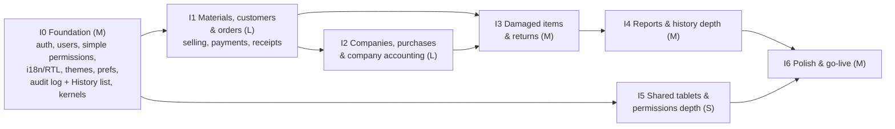

> Extracted from `spec/mizan-factory-system-spec-v1.2.md` (Deliverable 4). Section numbers are unchanged, so cross-references to other deliverables resolve in the full document or in the sibling files of this folder.

# Deliverable 4 — Development plan by iterations

Seven iterations, each ending in a demo-able state on staging. The order is chosen so that the client sees real business value as early as possible while nothing expensive is retrofitted: the foundation (I0) is kept deliberately small — permissions, i18n, RTL, theming and the audit log touch every screen and must exist first, but the full permission grid and shared-tablet quick sign-in do not, so they come later. The first business iteration is **selling** (materials, prices, customers, orders, payments, receipts): it is the factory's daily activity, and because selling below recorded stock is allowed with a warning, purchases are not a prerequisite. Buying and supplier accounting follow (companies must exist before purchases, and the ledger patterns proven on the customer side are reused). Damage comes after both counterparties exist because it links to either; reports and history depth read everything and come next; shared-tablet features and the advanced permission grid are polish that no one needs on day one; go-live closes. No calendar dates are given (A-40); sizes are relative (S < M < L, roughly 1 : 2 : 3).

Each iteration below is written as a standalone brief: it restates the entities, endpoints, screens and permissions it touches and points to the exact section of Deliverable 2 or 3 for the full definition. Items marked **Proposed — not requested** are optional within their iteration and can be dropped without touching the rest.

## 4.1 Definition of done (applies to every iteration)

An iteration is done only when all of the following hold for everything it delivered:

1. **Three languages**: every new string exists in `ckb-IQ`, `ar-IQ` and `en`, uses the glossary terms (section 1.6), and the build's missing-key check passes.
2. **RTL verified on a real phone**: every new screen checked in Kurdish and Arabic (RTL) and English (LTR) on a physical Android phone at 360 px; icons, animations, gestures, numeric inputs and currency placement follow section 2.10.6.
3. **Permissions enforced on the backend**: every new endpoint carries a permission decorator or `@AdminOnly()`, the generated permission-matrix test covers it, and the UI hides what the user cannot do.
4. **Every change recorded in History**: every new write path produces the expected `audit_log` rows (with old → new and the note where one exists) and, for balances, the before/after values; tests assert it.
5. **Every amount shows both currencies** through `DualAmount`, with ≈ for converted balances; stored values carry both currencies and the rate.
6. **Both themes and all four font sizes checked** on every new screen (automated screenshots for the eight key screens, manual check for the rest), with no horizontal overflow and contrast per the token sheet.
7. **Tests for any money or stock logic added** (unit + API integration), and the whole suite green in CI.
8. **States**: every new page has its skeleton, empty, error and offline states implemented as in section 3.3.
9. **Accessibility basics**: labels, focus order, 44 px targets, reduced-motion behaviour.
10. **Demo on staging** with seeded data, walked through with the demo script, and the client's feedback recorded as new open questions or tickets.

## 4.2 Iteration 0 — Foundation

**Goal.** Stand up the Mizan application with its distinct identity, sign-in without e-mail, user management with presets and the simple permission editor, three languages with RTL, two themes, the font-size scale, browser-persisted preferences, the audit log infrastructure with a plain History list, and the shared money/ledger/text kernels — so that every later iteration only adds business screens. Kept to a medium size on purpose: the advanced permission grid, PIN quick sign-in and user switching are I5.

**User-visible outcome.** An admin signs in on a phone in Kurdish, sees the plum Mizan shell (unmistakably not the palette system), creates employees from presets and adjusts the six everyday extras, switches language/theme/font size and sees them persist after reload, locks the screen and unlocks with the password, and reads every action in the History list.

**Scope.**

- *Data (section 2.2):* `users`, `user_permissions`, `sessions` (with `auth_method`), `login_attempts`, `idempotency_keys`, `settings`, `audit_log`; enum types; migrations framework; seed of the first admin from environment; database roles (`mizan_app` without UPDATE/DELETE on `audit_log`; `mizan_migrate`). `device_tickets` is created in I5.
- *Kernels:* `permissions` (catalog 1.5.2, presets and the six extras 1.5.3, implied-key expansion), `money` (integer minor units; entered-currency-authoritative line totals; conversion and rounding 2.3.4; settlement tolerance — unit-tested now, used from I1), `ledger` (append-only writer + reversal helper + audit before/after hook + posting-order running balance, tested against a throwaway table), `text` (search normalisation 2.10.7 with its test table), `i18n` (catalogs, ICU, `ckb` plural rule, formatting service 2.10.4 incl. Kurdish/Arabic month names and numerals).
- *API (section 2.9):* `/auth/login` (password), `/auth/logout`, `/auth/me`, `/auth/change-password`, `/auth/lock`, `/auth/unlock` (password only in this iteration); `/users` (list, create, read, update, deactivate, reactivate, reset-password, permissions get/put), `/users/directory`; `/permissions/catalog`, `/permissions/presets`; `/settings` (read; admin patch for idle-lock minutes, week start, date format); `/history` (cursor list with `done_by` and date filters; own-only without `history.view_all`), `/history/me`; `/health`. Guards: AuthGuard, PermissionGuard, SensitiveField interceptor, idempotency middleware, version-conflict handling, error format 2.9.2, rate limiting and lockout.
- *Frontend (sections 2.10, 3.2, 3.3):* app shell (`AppShell`, bottom tab bar computed from permissions, header with the Mizan mark), Login, Lock screen (current user, password unlock; the recent-users switcher is I5), Users list, User page (Details, Permissions in **simple mode** — preset + six extras — with the Advanced grid deferred to I5, Activity tab), History page (plain list with "done by" and date filters, expandable diffs), Settings (This device, My account incl. "My activity"; System: idle lock, week start), tokens for both themes (3.2.4) with the colour-vision simulation check, `--font-scale`, pre-paint script and localStorage preferences with fallbacks (2.10.10), `DualAmount`, `MoneyInput`, `NumberField` LTR-in-RTL, icon mirroring registry, direction-aware sheet/page transitions, `OfflineBar`, draft store, global states (403/404/conflict/offline).
- *Identity:* logo mark, wordmark, favicons, login illustration, empty-state illustration set, font subsets and the font-check page (3.7.1).
- *Ops (2.14):* repository, CI (lint incl. logical-property rule, type-check, unit, API integration with PostgreSQL, screenshot diffs for the key screens, bundle budget), staging deployment with TLS, nightly backup job and WAL archiving configured (restore drill is I6), error tracking and uptime check.

**Permissions touched.** Whole catalog stored and editable (simple mode writes the same set); admin-only routes for users and settings; `history.view` / `history.view_all` consumed by the History page; every other key exists in the catalog but has no consuming screen yet.

**Explicitly out of scope.** Any business entity (materials, purchases, customers, orders, companies, damage); Reports; History tabs on records (I4); the Advanced permission grid, PIN quick sign-in, device tickets, user switching and per-user language memory (I5); Dashboard; global search; exports.

**Acceptance criteria.**

- FR-101 to FR-105, FR-106 (lock and password unlock only), FR-107, FR-108, FR-201 to FR-204 (simple mode), FR-206, FR-901, FR-902 (plain list), FR-1101 to FR-1105, FR-1107 (device and account sections), FR-1108, FR-1201 to FR-1206, FR-1301, FR-1303, FR-1307, FR-1308 (pattern), FR-1311 meet their acceptance criteria.
- Permission-matrix test runs against every route in the codebase; the CI fails on an undecorated route.
- A first visit on a fresh browser opens in Kurdish, RTL, follow-device theme, default size, with no flash; a private-mode browser works with the notice in Settings.
- Contrast script passes for the token sheet; the colour-vision simulation shows every status chip distinguishable by icon and text; Lighthouse mobile ≥ 80 on the login and Users pages; app shell ≤ 250 kB gzipped.
- Side-by-side screenshots with the palette system reviewed and approved by the client (FR-1311); the **materials model workshop (Q-37) has been held** and its outcome recorded before I1 starts.

**Demo script.**

1. Open staging on a phone: Kurdish login screen with the Mizan mark; switch to Arabic then English; note the mirrored layout.
2. Sign in as the seeded admin; forced password change.
3. Create employee "Rebaz" from the Sales preset; show the temporary password; in Permissions turn on the extra "Can void"; save; open History and show the permission change as old set → new set.
4. Sign in as Rebaz on a second phone; show the bottom bar computed from his permissions; try a URL he may not open → friendly 403.
5. Settings: switch theme and font size; reload — persisted, no flash.
6. Lock the screen; unlock with the password; show both events in History.
7. Show CI: permission-matrix test and contrast test output.

**Risks and dependencies.** Access to the palette system's `@factory/ui` package and token pipeline (blocking; A-01); confirmation of the palette's exact primary colour (Q-01) before finalising tokens; Kurdish glyph rendering on the client's actual devices (mitigated by the font-check page); the client's availability for the identity review and for the Q-37 workshop.

**Size.** M.

## 4.3 Iteration 1 — Materials, customers & orders (selling)

**Goal.** Deliver the factory's daily activity end to end: materials with pricing unit and monthly price lists in both currencies, the global rate, customer profiles with assignment and scoping, order creation with lines, discount, payment type, the currency received on cash orders, partial payments and settle-in-full, derived order status, customer ledger and balance, edit/void with compensating movements, opening stock and opening customer debts — and, if kept, the order receipt, payment voucher and customer statement.

**User-visible outcome.** A sales employee creates a borrowed order on a phone in under a minute and shares the receipt; records a partial payment and later settles the rest in dollars with no residue; the customer's balance and the order status follow; stock and "last sold" update; the admin sees who did what and can hand a customer a statement.

**Scope.**

- *Data (2.2):* `items`, `item_month_prices`, `global_rates`, `customers` (incl. the seeded "Walk-in customer" — **Proposed — not requested** — and `credit_limit_*` — **Proposed — not requested**), `orders` (with `rate_iqd_per_usd` "rate for this order", `discount_*` — **Proposed — not requested**), `order_lines` (with the cost snapshot `cost_unit_*`, `cost_source`), `order_payment_type_changes`, `customer_ledger` (incl. `voucher_number` and `method` — **Proposed — not requested**), `stock_ledger` (`sale_out`, `opening`, `adjustment`, `reversal`), views `customer_balances`, `order_balances`, `ledger_running` (posting order), `item_stock` (priced measure + completeness flags), `item_stats`; sequences `order_number_seq`, `voucher_number_seq`; trigram indices on `items.name_normalized` and `customers.name_normalized`; settings `allow_negative_stock`, `rate_guard_percent`, `order_edit_window_days`, `allow_edit_after_payment`, `settle_tolerance_*`, `default_customer_currency`, `locked_through` (**Proposed — not requested**, FR-1109), `rate_stale_days` (**Proposed — not requested**).
- *Kernel:* `money` in real use (entered-currency-authoritative line totals, document rate, discount pair, settle-in-full manual-rate pairs); `ledger` customer writer (`order`, `cash_settlement` with received currency, `payment`, `credit`, `refund`, `adjustment`, `opening`, `reversal`) with before/after audit values and per-customer row locking; stock `sale_out`, `opening`, `adjustment`; order status derivation (2.4.3); payment-type switch (FR-605); edit/void algorithm (2.5.3) including the period-lock check; month-price lookup with silent carry-forward (FR-306); cost snapshot on lines (FR-602); ledger presentation grouping (2.4.5).
- *API (2.9.3):* `/items` (list with stock and this month's prices, create, read, update, deactivate, reactivate, soft delete), `/items/:id/prices`, `PUT /items/:id/prices/:month`, `/items/prices/copy-month`, `/items/:id/movements`, `/items/:id/opening-stock`, `/items/:id/stock-adjustments`, `/items/:id/history`; `/settings/global-rates` (get, post); `/customers` (list with scope, create with auto-assignment, read, update, deactivate, reactivate, soft delete), `PUT /customers/:id/assignment`, `PUT /customers/:id/settlement-currency` (admin, re-basing rule), `/customers/:id/ledger` (grouped, `as_of`), `/customers/:id/orders`, `/customers/:id/payments` (with `settle_in_full`, `split` — **Proposed**), `/customers/:id/credits`, `/customers/:id/refunds`, `/customers/:id/adjustments`, `/customers/:id/opening-balance`, `/customers/:id/ledger/:entry_id/reverse`, `/customers/:id/history`; `/orders` (list with filters and scope, create with `received_currency`, `rate_iqd_per_usd?`, `discount?`, read, put within the rules, void, payment-type, payments, history); **Proposed — not requested:** `GET /orders/:id/receipt`, `GET /customers/:id/ledger/:entry_id/voucher`, `GET /customers/:id/statement`.
- *Frontend (3.3, 3.4.1):* Materials list, Material detail (Overview, Prices with `MonthPriceEditor` and copy-last-month, Movements, History tab), New material sheet, Settings → System (global rate + history, stale-rate prompt if kept, period lock if kept), Customers list, Customer profile (Overview, Orders, Ledger with `LedgerList` grouping, History tab), New customer sheet, Orders list with date chips and filter sheet, New order form (customer picker, `PaymentTypeChip` segmented control with "Paid in", line cards, "More" with notes / rate for this order / done by, `TotalsFooter` with round-down if kept, drafts), Order detail (Lines, Payments with Record payment sheet incl. Settle in full, History incl. payment-type history), Change payment type sheet, Credit/Refund sheet, Opening balance sheet, Assign sheet, `OrderStatusChip`; **Proposed:** receipt/voucher/statement share sheets, split-payment sheet, credit-limit warning.
- *Permissions consumed:* `materials.view/create/edit/set_prices/opening_stock`, `settings.set_global_rate`, `orders.view/create/edit/void/change_payment_type/record_payment/credit`, `customers.view/view_all/create/edit/assign/opening_balance`, `fields.see_bought_price`, `fields.see_customer_balances`; scope rule 2.6.4.

**Explicitly out of scope.** Companies, purchases and company accounting (I2), damage and customer credits *from damage records* (I3 — the credit endpoint exists now), Reports and History tabs on records (I4), PIN quick sign-in (I5).

**Acceptance criteria.**

- FR-301 to FR-309, FR-501 to FR-507, FR-601 to FR-612, FR-205 (customers), FR-904 (customer side), FR-1106, FR-1107 (System), FR-1205 (materials, customers) meet their acceptance criteria; optional FR-310, FR-613, FR-614 and FR-615 (customer side), FR-616 (orders), FR-617 (customer side), FR-1109 if kept.
- Automated tests: line totals per the entered-currency rule (the 850 IQD/kg × 5,000 kg case); document rate change recomputes non-overridden lines only; cash order → order + cash_settlement with received currency, status Paid; borrowed → Unpaid → partial → Paid; settle in full leaves zero; switch both directions with note and history; void with and without payments (credit remains); edit → reversals + new; period lock refuses back-dated writes; scope: assigned-only employee cannot open another customer's order (404) and the duplicate warning names the assignee; customer balance invariant; running balance equals History before/after; cost snapshot stored per line and unchanged by a later price edit; silent carry-forward marker; negative stock warn/block setting.
- Order form usable one-handed at 360 px in Kurdish; three-line order saved in ≤ 60 s by a trained user in a timed session; saving on a throttled phone completes in ≤ 1.5 s after tap and is safe to retry.

**Demo script.**

1. As admin: set the global rate 1,310; create materials "Steel sheet 1.2 mm" (per piece) and "Copper wire 2 mm" (per kg); set September's bought and sale prices typing IQD and watching USD fill; record opening stock with a note.
2. Create customer "Kawa Trading" assigned to Rebaz; record an opening balance of 450,000 د.ع with a note.
3. As Rebaz (Sales preset) on a phone in Kurdish: New order for Kawa, two lines, borrowed; watch the totals; round the total down (if kept); save → Unpaid; share the receipt (if kept); stock decreased; "last sold" on the material.
4. Record a partial payment of 300,000 → Partially paid; ledger shows the running balance and the voucher number (if kept).
5. Settle the rest in dollars with "Settle in full" → Paid, zero residue; show the manual-rate pair on the entry.
6. Create a cash order for the Walk-in customer (if kept) paid in USD; show it is Paid immediately and that the customer's ledger tab is absent while the Orders list shows it.
7. Edit yesterday's order (still unpaid) → movements show reversal + new; void another with a reason → stock restored, the earlier payment remains as credit; record a refund.
8. Sign in as another Sales employee: Kawa is not visible; try to create "Kawa Trading" again → "exists, assigned to Rebaz — ask your admin"; as admin grant "Sees all customers" → visible.
9. Set the period lock to last month (if kept) and show a back-dated order being refused with the lock date.

**Risks and dependencies.** Depends on I0. The materials model decision (Q-37) must be settled first. Client answers to Q-06, Q-07 (prices), Q-10 (partial payments), Q-12 (cash orders in the ledger, walk-in customer), Q-13 (edit rules), Q-23 (receipts, vouchers, statements, discount) — all reversible by settings, labels or by dropping Proposed items.

**Size.** L.

## 4.4 Iteration 2 — Companies, purchases & company accounting (buying)

**Goal.** Deliver stock-in and supplier accounting: company profiles with settlement currency and rate history, the "Add material" purchase flow with lines and the rate for this purchase, stock movements, the company ledger with what we paid and what we owe per purchase (oldest-first allocation), payments with automatic conversion and settle-in-full, manual adjustments of the owed amount with mandatory notes, manual credits, opening company debts — and, if kept, company payment vouchers and statements.

**User-visible outcome.** A warehouse employee adds a purchase from a company on a phone in under a minute; stock and first-bought dates update; the accountant sets the company's rate, records a payment typing in either currency, adjusts the owed amount with a note, sees per-purchase remaining amounts without linking anything, and hands the supplier a statement.

**Scope.**

- *Data (2.2):* `companies`, `company_rates`, `purchases` (with `rate_iqd_per_usd` "rate for this purchase", `discount_*` — **Proposed**), `purchase_lines`, `company_ledger` (all types incl. `settlement_change`), `stock_ledger.purchase_in`, views `company_balances`, `purchase_balances` (FIFO display allocation), `item_stats.first_bought_on`; sequence `purchase_number_seq`; trigram index on `companies.name_normalized`; settings `purchase_edit_window_days`.
- *Kernel:* company vs global rate selection (2.3.3); ledger company writer (`purchase`, `payment`, `adjustment`, `credit`, `opening`, `settlement_change`, `reversal`) with before/after audit values and per-company row locking; reconciliation identity with oldest-first allocation (FR-712); edit/void reused from I1.
- *API (2.9.3):* `/companies` (list, create, read, update, deactivate, reactivate, soft delete), `PUT /companies/:id/settlement-currency` (admin, re-basing rule), `PUT /companies/:id/assignment`, `/companies/:id/rates` (get, post with ±20 % guard), `/companies/:id/ledger` (grouped, `as_of`), `/companies/:id/purchases` (with paid/remaining), `/companies/:id/payments` (with `settle_in_full`, `split` — **Proposed**), `/companies/:id/adjustments`, `/companies/:id/credits` (manual, `damage_id` optional), `/companies/:id/opening-balance`, `/companies/:id/ledger/:entry_id/reverse`, `/companies/:id/history`; `/purchases` (list, create, read, put within the rules, void, history), `/purchases/:id/balance`; **Proposed — not requested:** `GET /companies/:id/ledger/:entry_id/voucher`, `GET /companies/:id/statement`.
- *Frontend (3.3, 3.4.2):* Companies list with balances and "highest balance first", Company profile (Overview with rate and "since", Rate history sheet, Set rate sheet, Accounting tab with `LedgerList`, filter chips and the per-purchase section, Purchases tab, History tab), Record payment sheet (wireframe 3.4.2 with live preview and Settle in full), Adjust owed sheet (new balance or delta, note required, preview old → new), Manual credit sheet, Opening balance sheet, Add material / Purchase form (company picker with "No company — stock only", line cards, `QuantityInput`, `MoneyInput`, `TotalsFooter`, More with rate for this purchase, drafts, idempotent save), Purchase detail (with "We owe for this purchase", Edit/Void/Duplicate), Purchases list (tab in Materials and in Company), the material's Movements tab now showing purchases, signature moment "Balance settles"; **Proposed:** voucher/statement share sheets.
- *Permissions consumed:* `companies.view/create/edit/assign/set_rate/record_payment/adjust_owed/record_credit/opening_balance`, `purchases.view/create/edit/void`, `fields.see_bought_price`, `fields.see_company_balances`.

**Explicitly out of scope.** Damage-driven credits UI (I3), Reports incl. Payables (I4), exports.

**Acceptance criteria.**

- FR-401 to FR-408, FR-701 to FR-712, FR-205 (companies), FR-904 (company side), FR-1205 (companies) meet their acceptance criteria; the mapping in 2.4.2 is demonstrable in the database and on screen; optional FR-614, FR-615, FR-617 (company side), FR-616 (purchases) if kept.
- Automated tests: purchase with company → stock movements + one company entry copying the purchase totals; without company → movements only (FR-407); a USD-settled company's purchase valued at the company rate even when the month price was typed in IQD; payment entered in USD converts at the company rate and stores both + rate; override stores the implied rate as `manual`; settle in full leaves zero; adjustment writes exactly the delta with note and audit before/after; reversal negates exactly; per-purchase remaining with oldest-first allocation + unallocated remainder = balance (property test); settlement-currency change refused with a non-zero balance unless a re-basing rate is given, and the re-basing entry leaves exactly the agreed balance; ±20 % rate guard; rate change never alters stored entries.
- Saving a three-line purchase on a throttled phone completes in ≤ 1.5 s after tap; the company payment sheet is usable one-handed at 360 px in Arabic and the conversion is visible within 100 ms of typing.

**Demo script.**

1. As accountant: create company "Al-Noor Steel Co." (settlement IQD), set rate 1,310 (different from the global 1,300).
2. As warehouse employee on a phone (Kurdish): Add material from Al-Noor with two lines; watch the totals footer; save; show stock and "first bought" on the material; show the purchase in the company's Purchases tab with "remaining = total".
3. As accountant: record a payment typing 1,000,000 د.ع → USD fills at 1,310; save → balance rolls down; the per-purchase view shows the oldest purchase partly paid without any linking; record a second payment typing 500 $, override the IQD value → "manual rate" marker.
4. Adjust owed: "Change by −476,400" with a note → preview old → new → save; show History with old → new and the note; try without a note → refused.
5. Change the company's rate → new payments use it; earlier entries unchanged (open one). Change a USD-settled company's settlement currency with a re-basing rate → the marker row and the agreed balance.
6. Edit the purchase on the same day (quantity change) → movements show reversal + new; void a second purchase with a reason → stock restored.
7. Record an opening balance for a new company with a note; share its statement (if kept); show the Companies list sorted by highest balance.

**Risks and dependencies.** Depends on I0 and on the ledger patterns and materials from I1. Client confirmation of Q-09 (settlement currency), Q-11 (rate semantics), Q-18 (per-purchase meaning and oldest-first allocation), Q-29 (methods, split payments).

**Size.** L.

## 4.5 Iteration 3 — Damaged items & returns

**Goal.** Deliver the Damaged items page: damage records with optional reason and optional attribution (customer order, us, or the supplier company/purchase), the returnable flag and return status, the stock effect by attribution, "Return to stock" for usable goods, returns that credit the supplier company, and customer credits from damage records.

**User-visible outcome.** An employee logs a damaged item on the floor in under a minute, marks it returnable; when it goes back to the supplier, the accountant records the credit from the same record and the company's balance falls; damage attributed to a customer order does not touch stock and can lead to a customer credit or be put back in stock when usable.

**Scope.**

- *Data (2.2):* `damages` (with `attribution`, `order_id`, `company_id`, `purchase_id`, `is_returnable`, `return_status`, `stock_effect`, `est_value_*`), sequence `damage_number_seq`; `stock_ledger.damage_out` and `return_in`; `company_ledger.credit` and `customer_ledger.credit` rows with `damage_id`.
- *Kernel:* stock effect by attribution (2.5.1); credit valuation from the linked purchase line or the month bought price (A-39); edit/void with compensating movements.
- *API (2.9.3):* `/damages` (list with filters and totals, create, read, update, void, return, history); `/companies/:id/credits` now driven from the damage record; `/customers/:id/credits` with `damage_id`.
- *Frontend (3.3, 3.4.3):* Damaged items list with chips and period totals, Record damage form (`AttributionPicker` tiles, order/company/purchase pickers, returnable toggle, stock-effect sentence), Damage detail (chips, links, Mark returned / Written off / Record credit / Return to stock sheets), `ReturnStatusChip`, damage entries in the material's Movements and History tabs, "Damaged" links from order and purchase detail pages.
- *Permissions consumed:* `damages.view/create/edit/void/mark_returned`, `companies.record_credit`, `orders.credit`, `fields.see_bought_price` (values).

**Explicitly out of scope.** Damage report (I4), lot/batch tracking (never in v1). (Re-entry of usable returned goods is explicit — the "Return to stock" action — never automatic.)

**Acceptance criteria.**

- FR-801 to FR-807, FR-707 (from damage), FR-506 (from damage) meet their acceptance criteria.
- Automated tests: stock effect per attribution; return to stock writes `return_in`; edit quantity → reversal + new; void → reversal; return with credit → company entry linked to damage and purchase; customer credit linked to damage and order; est_value snapshot uses the damage month's bought price with fallback flag; check constraints on attribution links; period lock respected.

**Demo script.**

1. As warehouse employee on a phone: record 4 kg of copper wire damaged, attributed to Al-Noor and purchase #P-0231, returnable, with a reason; show "Stock will decrease by 4 kg"; save; material stock and movements reflect it.
2. Record damage attributed to order #1043 (came back damaged) → "No stock change" sentence; save.
3. As accountant: open the first record → Mark returned and record credit → amount pre-filled from the purchase line price, USD at the company rate → confirm → chip "Returned & credited"; company balance falls; ledger row links back to the damage.
4. On the second record → "Record customer credit" → customer balance falls; History shows both. On a third, customer-attributed record → "Return to stock" → stock rises by the quantity.
5. Filter the list by "Pending return" and by employee; show totals with and without the bought-price permission.

**Risks and dependencies.** Depends on I1 (materials, orders, customer credits) and I2 (companies, purchases, company credits). Client answers to Q-16 and Q-17 — both are switchable rules.

**Size.** M.

## 4.6 Iteration 4 — Reports & history depth

**Goal.** Deliver the eight reports (plus the daily cash-up if kept) with filtering by user (done by / assigned to, pinned per report for own-only users) and date range and month grouping, the History tab on every record, the full History page filters (assigned to, entity type, grouping of edits), and optionally the Proposed dashboard, global search and exports.

**User-visible outcome.** The admin filters History by employee and day and reads every change as old → new with the note; the accountant opens Payables and Receivables; the owner reads Sales and the margin report by month and the daily cash-up per employee; every report shows both currencies.

**Scope.**

- *Data:* no new tables; report queries over orders, purchases, ledgers, damages and audit_log with the indices of 2.2.5; `related` JSON on audit rows used for "assigned to" filtering; cost snapshots on order lines for the margin report.
- *API (2.9.3, 2.11):* `/history` extended (`assigned_to`, `entity_type`, `entity_id`, `action`, grouped edits), `…/:id/history` for every entity (some exist since I1–I3; complete the set), `/reports/sales`, `/reports/purchases`, `/reports/profit`, `/reports/stock`, `/reports/receivables`, `/reports/payables`, `/reports/damage`, `/reports/employee-activity` with `group_by` and the pinned filter for own-only users. Optional (**Proposed — not requested**): `/reports/cash-up`, `/reports/:name/export`, `/history/export`, `/search`, `/dashboard`.
- *Frontend (3.3):* History page completed (two user filters side by side, date chips, type sheet, expandable diffs in the user's language with `DualAmount` values, edit groups collapsed), History tab on orders, purchases, materials, customers, companies, damage records and users; Reports hub and eight report pages (filters → summary tiles → expandable table, month headers localised, fallback-cost flags, "margin vs. month price" label). Optional (**Proposed — not requested**): Daily cash-up page, Dashboard tiles per permission (incl. the stale-rate prompt), Search page, Export buttons.
- *Permissions consumed:* `history.view`, `history.view_all`, `reports.view`, `reports.view_all`, field flags per report (2.11); optional `dashboard.view`, `reports.export`, `history.export`.

**Explicitly out of scope.** New write paths (none); scheduling or e-mailing reports; charts beyond simple bars in tiles (**Proposed — not requested**, only if trivial with the component library).

**Acceptance criteria.**

- FR-902 (full), FR-903, FR-1001 to FR-1011 meet their acceptance criteria; optional FR-1012, FR-1013, FR-1309, FR-1310 if kept.
- Automated tests: each report's totals equal independent SQL sums over seeded data; margin formula per 2.11 from line snapshots, with the same sign in both currencies for every row; month grouping in Asia/Baghdad; History filters by done_by and assigned_to return disjoint, correct sets; pinned filters for own-only users per report; field stripping in report responses; cash-up totals equal the ledgers' entered-currency sums.
- History page at 2 million seeded rows returns the first page in ≤ 300 ms (NFR-03/NFR-13).

**Demo script.**

1. History: filter "Done by: Sara" and "Today" → expand a payment entry → old → new balance and the note; switch to "Assigned to: Rebaz" → Kawa's orders appear; an edited order shows as one "edited" entry, expandable.
2. Open Order #1043 → History tab → the whole story: created, partial payment, settle in full, type change.
3. Reports: Sales by month with dual totals and discounts (if kept); Margin vs. month price for September with a flagged fallback line and matching signs; Receivables sorted by balance (permission demo: the sales user sees only their assigned customers); Payables per company with per-purchase remaining; Damage; Employee activity for the month; Daily cash-up per employee and currency (if kept).
4. (If kept) Dashboard for admin vs. sales user; global search finding "كاوا" typed as "کاوا"; export a report to Excel.

**Risks and dependencies.** Depends on all previous iterations' data. Report performance at real volumes (Q-02) — mitigated by the indices and by testing against seeded data early in the iteration.

**Size.** M.

## 4.7 Iteration 5 — Shared tablets & permissions depth

**Goal.** Add what shared floor tablets need — PIN quick sign-in with device-bound tickets, fast user switching from the lock screen, per-user language memory, authentication-method tracking, the admin's Sessions tab — and the Advanced permission grid for the rare cases the simple editor does not cover.

**User-visible outcome.** Two employees share one tablet: the first locks it, the second taps their name, enters a six-digit PIN and continues in their own language; the admin can see and revoke sessions and tickets, and can open the full permission grid for an unusual role.

**Scope.**

- *Data (2.2):* `device_tickets`; `sessions.auth_method` used; audit rows carry the method; settings `pin_min_length_shared`, `pin_min_length_personal`, `allow_pin_switch_on_shared`.
- *API (2.9.3):* `/auth/login { ticket, pin }` with `switch_from_session`, `/auth/pin` (set/remove), `/auth/unlock` with PIN, `GET /users/:id/sessions`, `DELETE /users/:id/sessions/:sid`, `DELETE /users/:id/device-tickets`; the existing `PUT /users/:id/permissions` now driven by the Advanced grid too.
- *Frontend (3.3, 3.4.4):* Lock screen with `UserSwitcher` (recent users, PIN pad, last language per user), PIN setup in Settings → My account, Sessions tab on the user page, "Advanced" disclosure in the Permissions editor with the full `PermissionGrid`, `auth_method` shown on History entries written from PIN sessions.
- *Permissions consumed:* none new; admin-only session management.

**Explicitly out of scope.** Any business change; biometrics (not in v1).

**Acceptance criteria.**

- FR-106 (PIN quick sign-in, user switching), FR-204 (Advanced grid), FR-1304, FR-1103 (per-user language on switch) meet their acceptance criteria.
- Automated tests: a ticket is required for PIN sign-in and is bound to the user; 6-digit rule on shared devices; 5 wrong PINs → password; switch revokes the previous session; tickets revoked on password reset and deactivation; the admin toggle disables PIN switching; every audit row from a PIN session carries `ticket_pin`.

**Demo script.**

1. On a tablet marked "shared": Sara signs in with her password and sets a six-digit PIN; the tablet locks after the (demo-shortened) idle time; Sara unlocks with the PIN.
2. Sara taps "Switch user" → Rebaz → his PIN (he signed in with his password on this tablet earlier) → the app opens in Rebaz's last language; History shows Sara's lock and Rebaz's PIN sign-in.
3. Rebaz records a payment; the admin opens that History entry → "signed in with PIN on Floor tablet 2".
4. The admin opens Sessions for Rebaz and revokes the ticket; Rebaz's next switch asks for the password. The admin turns off PIN switching on shared devices → the lock screen offers passwords only.
5. The admin opens Advanced on a user and toggles a single key, watching implied keys; saves; shows old set → new set in History.

**Risks and dependencies.** Depends on I0 (sessions, lock screen) and on the client's answer to Q-25 (lock timings, PIN acceptability).

**Size.** S.

## 4.8 Iteration 6 — Polish & go-live

**Goal.** Make it feel finished and put it into production: animations and the signature moments, performance on low-end phones, accessibility, QA across three languages and both themes on real devices, the client's review of translations and the glossary, opening balances and first prices entered, backups and restore tested, documentation and training material; optionally the Proposed CSV import and PWA shortcut.

**User-visible outcome.** The client uses Mizan for real work on their own phones and tablets, in their language, with their opening stock, prices and debts loaded, and signs off on the look and feel.

**Scope.**

- *Design polish (3.6, 3.7):* all animation rules and the five signature moments; reduced-motion behaviour; final empty-state illustrations; font-check on the client's devices; theme and font-size sweep of every screen.
- *Performance (NFR-03):* bundle audit, route splitting review, image/font budgets, Lighthouse CI thresholds enforced, one seeded load test with NFR-13 volumes on staging, slow-query review, list virtualisation where needed.
- *Accessibility (NFR-10):* axe pass on all stories, keyboard traversal of every form, contrast and colour-vision re-check, screen-reader labels in all three languages.
- *QA (NFR-01, NFR-09):* full E2E suite on Android Chrome (real device), iOS Safari and desktop browsers; three-language screenshot review; RTL checklist per screen; bug-fix window.
- *Client reviews:* translation and glossary sign-off session (Q-26) with screenshots per language; identity sign-off (NFR-14).
- *Go-live:* production environment, secrets rotation, first admin, opening stock / customer debts / company debts entered by the admin (FR-308, FR-504, FR-708) — optionally via the Proposed CSV import (FR-1312); **a first price for every material** (FR-306); the global rate and every company rate confirmed; go-live date and period lock (if kept) set; backup job and WAL archiving verified; **restore drill executed and logged** (NFR-08); monitoring alerts wired to the operations channel.
- *Documentation and training:* admin guide (users, permissions, rates, prices, opening balances, period lock, backups), employee quick cards per preset (one page each, in all three languages), the runbook (deploy, backup, restore, incident), and a 30-minute training session per role recorded as a screen video.
- *Optional (Proposed — not requested):* FR-1312 CSV import, FR-1313 PWA shortcut.

**Permissions touched.** None new; final review of every preset with the client.

**Explicitly out of scope.** New features beyond the Proposed items listed; anything in section 2.15.

**Acceptance criteria.**

- Every NFR verified with evidence attached (Lighthouse and load-test reports, axe results, device screenshots, restore-drill log).
- FR-1204 client sign-off of the glossary and catalogs recorded; FR-1311 identity signed off.
- Opening balances entered and reconciled with the client's own figures (sum of customer balances, sum of company balances, stock counts) and the reconciliation kept in History via the notes; every active material has a current price.
- Zero open severity-1/2 defects; training delivered; runbook handed over.

**Demo script (go-live review).**

1. On the client's own tablet: sign in, create an order, watch the totals tick and the row land; share the receipt (if kept); record a payment that settles a balance (brass sweep).
2. Switch language mid-task; switch theme; extra-large font on a phone — nothing breaks.
3. Show the Receivables and Payables totals matching the client's opening figures.
4. Show the restore-drill log and the backup dashboard; show monitoring alerts.
5. Hand over the admin guide and quick cards; agree the support channel.

**Risks and dependencies.** Client availability for translation review and opening-balance entry (the longest pole); device diversity on the floor (Q-22); performance of the client's connectivity (mitigated by FR-1305 measures and PWA static caching if kept).

**Size.** M.

## 4.9 Dependency graph

I5 depends only on I0 and can run in parallel with I3 or I4 whenever a second developer is free; the client sees a complete sell-and-collect cycle at the end of I1 and a complete buy-and-pay cycle at the end of I2.

## 4.10 Requirements per iteration (inverse view of the traceability matrix)

| Iteration | Functional requirements delivered | Non-functional focus |
|---|---|---|
| **I0** | FR-101 to FR-105, FR-106 (lock, password unlock), FR-107, FR-108, FR-201 to FR-203, FR-204 (simple editor), FR-206, FR-901 (infrastructure), FR-902 (plain list), FR-1101 to FR-1105, FR-1107 (device/account), FR-1108, FR-1201 to FR-1206 (foundations; FR-1205 package), FR-1301, FR-1302 (component), FR-1303, FR-1305 (infrastructure), FR-1306 (columns), FR-1307, FR-1308 (pattern), FR-1311 | NFR-01, 02, 04, 07, 10, 12, 14 (identity review) |
| **I1** | FR-205 (customers), FR-301 to FR-309, FR-310 (optional), FR-501 to FR-507, FR-601 to FR-612, FR-613 to FR-617 (optional, customer side), FR-904 (customers), FR-1106, FR-1107 (System), FR-1109 (optional), FR-1205 (materials, customers); applied to every new screen: FR-1302, FR-1303, FR-1305, FR-1306, FR-1308 | NFR-05, 06, 07, 13 |
| **I2** | FR-205 (companies), FR-401 to FR-408, FR-701 to FR-712, FR-614, FR-615, FR-616, FR-617 (optional, company side), FR-904 (companies), FR-1205 (companies); applied to every new screen: FR-1302, FR-1303, FR-1305, FR-1306, FR-1308 | NFR-05, 06, 07 |
| **I3** | FR-801 to FR-807, FR-707 (from damage), FR-506 (from damage); applied to every new screen: FR-1302, FR-1303, FR-1305, FR-1306, FR-1308 | NFR-05, 06 |
| **I4** | FR-902 (full), FR-903, FR-1001 to FR-1011, FR-1012 (optional), FR-1013 (optional), FR-1309 (optional), FR-1310 (optional) | NFR-03 (query performance), NFR-13 |
| **I5** | FR-106 (PIN quick sign-in, switching), FR-204 (Advanced grid), FR-1103 (per-user language), FR-1304 | NFR-04 |
| **I6** | FR-1312 (optional), FR-1313 (optional), FR-1204 (client review), FR-306 (first prices), FR-308/FR-504/FR-708 data entry, all FRs re-verified | NFR-03, 08, 09, 10, 11, 14 |

Client raw lines by iteration: R-01–R-04, R-23, R-32–R-34 → I0; R-06–R-16 and R-20 → I1 (R-16 also I2 for companies); R-05, R-24–R-31 → I2; R-17–R-19 → I3; R-21–R-22 → I4 (R-21 History list already in I0); every line re-verified in I6.

---

# Self-check

1. **Every line of the raw requirements maps to at least one FR and one iteration.** Yes — the register in 1.2 lists R-01 to R-34 and C-01 to C-12 with their FRs; every one of those FRs appears in the traceability matrix (2.16) with an iteration, and 4.10 lists the client lines per iteration. R-20 is the client's repetition of R-10 and maps to the same FR-601. No raw line was judged "should not be built".
2. **Every entity has created_by, updated_by and soft-delete; every balance is a ledger sum.** Every *mutable* entity (users, items, item_month_prices, companies, customers, purchases, orders, damages) carries `created_by`, `updated_by`, `deleted_at` and `version`; lines (purchase_lines, order_lines) carry `created_by` and `deleted_at` and are versioned through their parent document, and `settings` rows carry `created_by`/`updated_by` with a fixed key set (2.2.1). The append-only tables (the three ledgers, audit_log, company_rates, global_rates, order_payment_type_changes, login_attempts, idempotency_keys, device_tickets) carry a creator and deliberately have no `updated_by` or `deleted_at`, because they are never updated or deleted — corrections are reversal rows; this is stated in 2.2.1 as the stronger guarantee. Every balance (company, customer, order remaining, purchase remaining, stock) is a view summing a ledger in the settlement currency (2.2.6, 2.4.3); the only cached numbers are document totals recomputed from lines in the same transaction, and they are never used to compute a balance; the per-purchase oldest-first allocation is computed for display and never stored.
3. **Every money field stores both currencies and the rate used.** Yes — month prices, lines (including the cost snapshot), document totals and discounts, ledger entries and opening entries all carry an IQD value, a USD-cents value, the entered currency (where applicable) and `rate_iqd_per_usd` with `rate_source` (2.2.3, 2.3.2). The one deliberate exception is the `settlement_change` re-basing row, which carries a single-currency amount by design (2.3.5) and is constrained as such. Balances are not stored; their ≈ conversion is computed on read and never persisted, and the other-currency column is never displayed as a balance.
4. **Every page in the page map has a mobile layout note and its empty, loading and error states.** Yes — the table in 3.3 gives all four for every page, including the Purchases list, Dashboard and Search (Proposed) and the global conflict/403/404/offline states.
5. **Every iteration has acceptance criteria, a demo script and a relative size.** Yes — I0 (M), I1 (L), I2 (L), I3 (M), I4 (M), I5 (S), I6 (M), each with goal, outcome, scope, out of scope, acceptance criteria, demo script, risks and dependencies.
6. **All Mermaid diagrams are syntactically valid.** The five diagrams (ERD 2.2.4, money/ledger flow 2.3.7, stock flow 2.5.2, authorization sequence 2.6.7, iteration dependency graph 4.9) were rendered with mermaid-cli during the preparation of this version without errors.
7. **Everything not requested by the client is labelled Proposed — not requested.** Yes — Dashboard, global search, exports, CSV import, material code/low-stock badge, order receipt, payment vouchers, account statements, discount/round-down and credit limit, payment method and split payments, daily cash-up, period lock, stale-rate prompt, month-start price banner, the profit comparison toggle, receivables ageing, PWA shortcut, the walk-in customer record and the fourth field flag (`fields.see_customer_balances`) are labelled at every appearance (FRs, permission keys, schema columns, page map, API, iterations) and consolidated in 1.8. Items that the brief (not the client) explicitly asked for — presets, idle lock and user switching, opening balances, partial payments, edit/void rules — are marked with their brief source or assumption number rather than as Proposed, so they can be recognised as our team's additions without being mistaken for the client's words.
