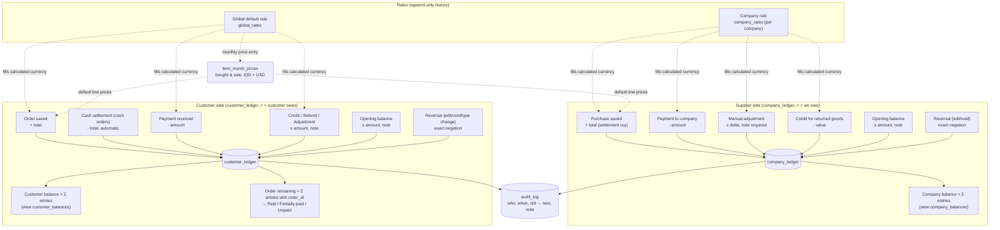
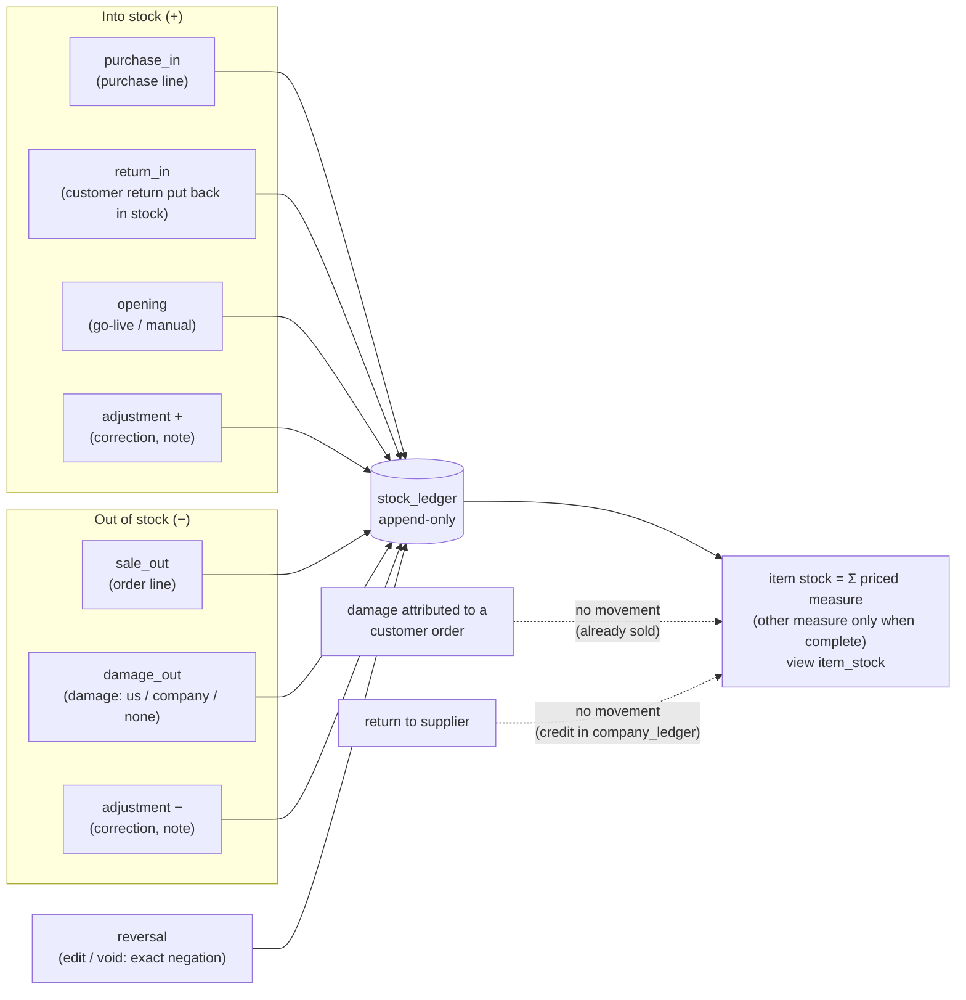
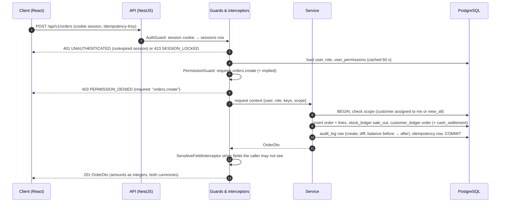
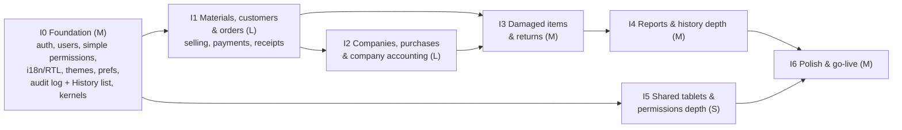

# Mizan — Factory Materials, Orders & Supplier-Accounting Web System

## Requirements Specification, Architecture, UX/UI Direction and Iteration Plan

| | |
|---|---|
| **Document status** | Draft for client sign-off (v1.2 — revised after the senior design review and a targeted verification of the new mechanisms; change log below) |
| **Prepared by** | Lead software architect / product designer |
| **Prepared for** | The factory (single tenant) and the implementation team |
| **Working product name** | **Mizan** (Arabic ميزان / Kurdish میزان — "scale, balance"). Working name only — see Open Question Q-01. |
| **Sibling system** | The existing "palette items" system built by our team for the same factory (blue/teal primary). Mizan reuses its stack and patterns and deliberately looks different. |
| **Tech stack (as supplied)** | React single-page application (TypeScript) + Node.js API (NestJS) + PostgreSQL, hosted the same way as the palette system. Unspecified details (component library, i18n library, ORM, hosting) are stated as assumptions A-01 to A-04. |
| **Palette-system identity (as supplied)** | Blue / teal primary. Mizan's primary hue is a deep plum, roughly 100° away on the hue wheel, on warm neutral surfaces. |
| **Locales** | Kurdish Sorani `ckb-IQ` (RTL, default), Arabic `ar-IQ` (RTL), English `en` (LTR) |
| **Currencies** | Iraqi Dinar (IQD) and US Dollar (USD); every amount is shown in both |
| **Timezone / calendar** | Asia/Baghdad; Gregorian; week starts Saturday (to confirm, Q-04) |

### How to read this document

- **Deliverable 1** is for the product owner and the client: every line of the client's request appears in the *Raw requirement register* (R-01…R-34) and is turned into numbered functional requirements (FR-xxx) with acceptance criteria. Anything we added that the client did not ask for is labelled **Proposed — not requested** wherever it appears, so it can be cut in one pass.
- **Deliverable 2** is for developers: the database schema, ledgers, API, permission checks and frontend architecture, written so that no question needs to be asked before building.
- **Deliverable 3** is for designers: identity, tokens, page map, mobile layouts, wireframes, flows, animation and typography — for a phone, in RTL, in both themes.
- **Deliverable 4** is for whoever runs the build: seven iterations, each a standalone brief with acceptance criteria and a demo script, plus a traceability matrix (in section 2.16) and a per-iteration requirement list (section 4.10).
- **Labels used throughout:** `R-nn` a verbatim client line; `C-nn` a project-context requirement from our brief; `FR-nnn` / `NFR-nn` requirements; `A-nn` assumptions; `Q-nn` open questions for the client; `I0…I6` iterations; **Proposed — not requested** for anything neither the client nor the brief asked for.

### Table of contents

**Deliverable 1 — Requirements specification**
1.1 The business in one paragraph (validated reading) · 1.2 Raw requirement register · 1.3 Functional requirements by module (Auth & Permissions, Users, Materials & Stock, Purchases, Customers, Orders & Payments, Supplier Companies & Accounting, Damaged Items & Returns, History, Reports, Settings & Preferences, i18n/RTL, Cross-cutting) · 1.4 Non-functional requirements · 1.5 Roles and permission catalog with presets · 1.6 Trilingual glossary · 1.7 Out of scope for v1 · 1.8 Proposed — not requested (consolidated list) · 1.9 Assumptions · 1.10 Open questions for the client

**Deliverable 2 — Architecture**
2.1 Stack, reuse and deviations · 2.2 Domain model and ERD · 2.3 Money model · 2.4 History model (ledgers and audit log) · 2.5 Stock model · 2.6 Authorization model · 2.7 Attribution and assignment · 2.8 Authentication and sessions · 2.9 API design · 2.10 Frontend architecture (routing, state, i18n, RTL, search normalisation, theming, font scale, persisted preferences, component reuse) · 2.11 Reports · 2.12 Test strategy · 2.13 Security · 2.14 Deployment, backups and monitoring · 2.15 Deliberately not built in v1 · 2.16 Traceability matrix

**Deliverable 3 — UX/UI direction**
3.1 Design principles · 3.2 Distinct identity and token sheet · 3.3 Page map with mobile layout notes and states · 3.4 Text wireframes · 3.5 Key flows · 3.6 Animation guidelines and signature moments · 3.7 Typography and numerals

**Deliverable 4 — Development plan by iterations**
4.1 Definition of done · 4.2 Iteration 0 — Foundation · 4.3 Iteration 1 — Materials, customers & orders (selling) · 4.4 Iteration 2 — Companies, purchases & company accounting (buying) · 4.5 Iteration 3 — Damaged items & returns · 4.6 Iteration 4 — Reports & history depth · 4.7 Iteration 5 — Shared tablets & permissions depth · 4.8 Iteration 6 — Polish & go-live · 4.9 Dependency graph · 4.10 Requirements per iteration

**Self-check**

### What changed in v1.1 (after the senior design review)

Money and history: the entered currency of a line is now authoritative and the other currency's line total is a conversion of it, never a rounded unit price times a quantity (2.3.4, A-41); each order line snapshots its cost so the Profit report is reproducible and its two currencies can never disagree in sign (FR-602, FR-1005, 2.11, A-42); changing a counterparty's settlement currency requires a zero balance or an explicit re-basing entry at an agreed rate, and the other-currency column is never shown as a balance (2.3.5, FR-702, A-20); running balances follow posting order so they match History (2.2.6, A-43); "settle in full" and a settlement tolerance remove residues (FR-606, FR-705); every purchase and order carries a "rate for this document" that can be agreed per deal (2.3.3); ledger noise is collapsed by explicit presentation rules (2.4.5); stock is tracked in the priced measure only (FR-303); unlinked supplier payments are allocated oldest-first for the per-purchase view (FR-712, A-29); a `return_in` movement puts usable customer returns back in stock (2.5.1).

Operations on the floor: cash orders record the currency physically received (FR-604); Proposed additions — order receipts, payment vouchers, account statements, order-level discount/round-down and credit limit, payment method and split payments, a daily cash-up per employee, a period lock, a stale-rate prompt (FR-613 to FR-617, FR-1013, FR-1109) — with the receipts family recommended for the first business iteration. Editing is allowed while unpaid until the period is locked instead of same-day only (A-25).

Permissions and auth: a simple permission editor (preset + six extras) with the full grid under Advanced (FR-204); `purchases.create` implies seeing bought prices; duplicate checks run across all customers; sessions last 30 days on personal devices and 12 hours on shared ones; PINs are six digits on shared devices, PIN switching is admin-controlled, and every session and History entry records the authentication method (FR-106, 2.8, A-44); the lock screen remembers each user's language on a shared tablet (FR-1103).

v1.2 verification fixes: the settlement-currency change always writes a re-basing entry (a zero old balance still leaves a mixed-rate sum in the new column) with an explicit delta formula, and re-basing rows are never reversed; the per-purchase reconciliation identity now includes a "General" bucket (opening balances, unlinked adjustments, settlement changes, entries of voided purchases, unallocated remainder) so it holds at go-live; lines carry their own rate and rate source, and a document-rate change recomputes every line where only one price was typed; ledgers gain a `posting_seq` because rows written in one transaction share `created_at`; the cash-settlement pair for a cash order paid in the other currency is fully specified and bounded by the settlement tolerance; a same-currency shortfall within tolerance is written as paid plus a residue credit/adjustment; a replaced order line keeps its cost snapshot unless its item or month changed; stock-ledger measures are nullable so "not carried" is distinguishable from zero; the six permission extras have a "partly" state; PIN length is stored so shared devices can refuse short PINs; the period lock covers reversals and fully ended months; stale iteration numbers in the Proposed list corrected.

Plan: I0 slimmed to a medium foundation; selling (materials, customers, orders, receipts) is now the first business iteration, buying the second; shared-tablet features and the advanced grid moved to a small I5; WAL archiving is standard (RPO 15 minutes) and the test/ops apparatus is trimmed to what protects money and stock (2.12, 2.14). A blocking question (Q-37, catalog vs. batch model of materials) must be settled in a workshop before I1.

---

# Deliverable 1 — Requirements specification

## 1.1 The business in one paragraph (validated reading)

The factory buys materials from **supplier companies** through **purchases**. A purchase adds the bought quantities (count and/or kilograms) to **stock** and, when a company is named, adds what the factory **owes** that company, valued at that company's own IQD⇄USD rate. The factory sells materials to **customers** through **orders**. An order removes the sold quantities from stock and, when the order is **borrowed** (on credit) rather than **cash**, adds what the customer owes the factory. Purchases and orders are mirror images: a header (counterparty, date, acting employee, notes, rate snapshot) and lines (item, count, kg, unit price, line total). Every material has a **monthly price list** — one bought price and one sale price per calendar month, each in IQD and USD. Goods get **damaged**; each damage record can optionally blame a customer order, the factory itself ("us"), or the supplier company the goods came from, and can be flagged as **returnable** with a return status. Every action is attributed to the employee who performed it, and the admin can view **history** and **reports** filtered by employee and by date. Supplier accounting is per company: what was paid, what is owed per purchase and per item, with a running balance; every manual change to an owed amount carries a note and stays in history forever. Admins **manage users** and decide exactly what each employee can see and do. The interface supports **two themes**, an adjustable **font size** and **three languages**, and those preferences are saved in the browser of each device.

**Terminology decision.** The client uses "order" for both sales to customers and purchases from companies. In this document and in every language of the product, **Order** always means a sale to a customer and **Purchase** always means buying from a supplier company (glossary, section 1.6). Where the client's raw text says "order" in the supplier context (R-25: "how much we owe per order and items") it is read as *purchase*.

**Two refinements to the brief's reading, adopted here and flagged for the client:**

1. *Cash orders also pass through the customer ledger.* Every order creates a receivable entry for the customer; a cash order additionally creates an immediate "cash settlement" payment entry in the same transaction. This keeps one status rule for all orders (balance of the order's entries = 0 → paid), makes "payment type can be changed in the future" (R-14) a reversible ledger operation instead of a special case, and keeps a customer's payment history complete. It is invisible in the UI unless the user opens the ledger. (Assumption A-24, Q-12.)
2. *Damage attributed to a customer order does not move stock.* The goods were already removed from stock when sold; recording them as damaged tells the story without double-counting. Damage attributed to "us" or to a supplier purchase does reduce stock (Assumption A-30, Q-16).

## 1.2 Raw requirement register

Every line of the client's request, verbatim, with an identifier used in the FR "Source" column and in the traceability matrix. Lines from the brief's project context that constrain the product (devices, languages, currencies, no e-mail, and so on) are registered as `C-nn` so they are traced too.

### 1.2.1 Client lines (verbatim)

| ID | Client text (verbatim) | Covered by |
|---|---|---|
| R-01 | "Website." | FR-1301 |
| R-02 | "Admin, admin can control what the employees see and do." | FR-102, FR-103, FR-104, FR-105, FR-204 |
| R-03 | "And employee users meaning authorization." | FR-101, FR-102, FR-104 |
| R-04 | "Support all three languages (Kurdish Sorani, Arabic, English)" | FR-1104, FR-1201, FR-1202, FR-1203, FR-1204 |
| R-05 | "Page: a page to add material." | FR-401, FR-403, FR-307 |
| R-06 | "Items have: quantity, name, bought price and sale price," | FR-301, FR-303, FR-305, FR-1006 |
| R-07 | "date bought and date sold," | FR-304 |
| R-08 | "each months prices bought and sold are prices," | FR-305, FR-306, FR-408, FR-609, FR-1005, FR-1011 |
| R-09 | "prices in iqd and usd," | FR-305, FR-1302 |
| R-10 | "order has notes," | FR-601 |
| R-11 | "items have kgs in the order," | FR-402, FR-602 |
| R-12 | "total per item in the order" | FR-402, FR-602, FR-603 |
| R-13 | "Order has payment types. cash or borrowed." | FR-604, FR-612 |
| R-14 | "Payment type can be change in the future" | FR-605, FR-606, FR-607 |
| R-15 | "Customers have profiles." | FR-501, FR-503, FR-505 |
| R-16 | "Who assigns to who." | FR-205, FR-502, FR-711, FR-1306, FR-902 |
| R-17 | "Page for damaged items," | FR-801, FR-804, FR-807 |
| R-18 | "reason can be assigned to an order or us or the company came from but optional," | FR-802 |
| R-19 | "and show if it can be returned." | FR-803, FR-805, FR-806 |
| R-20 | "Order has notes" (repeated by the client) | FR-601 (same requirement as R-10) |
| R-21 | "History and reports page." | FR-901, FR-1001, FR-1003 to FR-1010 |
| R-22 | "Filter Reports and history page based on user and date." | FR-902, FR-1002 |
| R-23 | "Manage users from the admin." | FR-201, FR-202, FR-203, FR-206 |
| R-24 | "Page for creating other companies" | FR-701, FR-710 |
| R-25 | "what we paid how much we owe per order and items" | FR-704, FR-712 |
| R-26 | "like an accounting page in which you can change how much you owe" | FR-706 |
| R-27 | "of course that should have notes" | FR-706, FR-709 |
| R-28 | "and change the price includes history." | FR-703, FR-706, FR-709, FR-903, FR-904 |
| R-29 | "The date you paid, who made the payment," | FR-705 |
| R-30 | "in iqd and usd should be calculated by itself iqd converts to usd and usd to iqd," | FR-705, FR-1106, FR-1302 |
| R-31 | "the rate conversion is different per company which can be set from the companies profile page." | FR-703, FR-404 |
| R-32 | "Two themes." | FR-1101 |
| R-33 | "And being able to control systems font sizes from the settings," | FR-1102 |
| R-34 | "These preferences will be saved inside of the browser." | FR-1103 |

### 1.2.2 Project-context lines (from our brief)

| ID | Context requirement | Covered by |
|---|---|---|
| C-01 | Single factory, single tenant — no multi-company or multi-tenant design. | FR-1301, section 2.15 |
| C-02 | Materials are sold by weight and by count. | FR-302, FR-402, FR-602 |
| C-03 | Track money owed in both directions (customers → factory, factory → companies). | FR-503, FR-612, FR-704 |
| C-04 | Track who did what. | FR-1306, FR-901 |
| C-05 | Reuse the palette system's stack and patterns; separate application; clearly distinct visual identity. | FR-1311, NFR-12 |
| C-06 | Phones and tablets on the factory floor and desktops in the office; mobile-first; usable one-handed. | FR-1303, NFR-02 |
| C-07 | Shared tablets; poor connectivity on the floor. | FR-106, FR-1304, FR-1305, NFR-11 |
| C-08 | Many employees have no e-mail; admin creates and resets accounts. | FR-101, FR-108, FR-201, FR-202 |
| C-09 | Three first-class languages; RTL is the primary direction, LTR the mirror. | FR-1201, FR-1202, FR-1206, NFR-01 |
| C-10 | Iraq; Asia/Baghdad; Gregorian; week starts Saturday (confirm). | FR-1108, FR-1203 |
| C-11 | IQD and USD; every amount shown in both. | FR-1302, FR-305, FR-603, FR-705 |
| C-12 | Priorities: simplicity/UX, then money-stock-history correctness, then polished UI with purposeful animation; design quality is a functional requirement. | NFR-14, FR-1311 |

## 1.3 Functional requirements by module

Format of each requirement: identifier and title; **Source** (client line `R-nn`, context line `C-nn`, the brief's default interpretation `A-nn`, or **Proposed — not requested**); **Statement**; **Acceptance criteria** (testable). Permission keys named here are defined in section 1.5 and section 2.6.

### 1.3.1 Auth & Permissions

**FR-101 — Sign in with username and password, no e-mail**

Source: C-08, R-03, A-27.

Statement: A user signs in with a username (or their phone number, which is accepted as an alias of the username) and a password. No e-mail address is required anywhere in the system, and no e-mail is ever sent.

Acceptance criteria:

- The login screen has exactly two fields (username or phone, password) and one primary button, and works on a 360 px-wide phone in all three languages.
- A wrong username or password shows a single generic message ("Username or password is incorrect") without revealing which one was wrong.
- After 5 failed attempts for the same username within 15 minutes, further attempts are refused for 15 minutes and the admin sees the lockout in History; a successful login resets the counter.
- A user flagged "must change password" is taken to a change-password screen before anything else.
- A deactivated user cannot sign in and sees "This account is deactivated — contact your admin".

**FR-102 — Two roles: admin and employee**

Source: R-02, R-03.

Statement: Every user is either an *admin* or an *employee*. Admins can do everything, including managing users and permissions. Employees can do only what their permission set allows.

Acceptance criteria:

- The role is set when the account is created and can be changed by an admin (logged in History with old → new).
- An admin implicitly holds every permission in the catalog; no permission row needs to be stored for admins.
- An employee with no permissions can sign in and sees only the Settings page and the lock screen; every other navigation item is hidden and every other endpoint returns 403.

**FR-103 — Per-employee permissions at page, action and field level**

Source: R-02.

Statement: For each employee the admin can grant, individually, (a) which pages they can see, (b) which actions they can perform on each page, and (c) which sensitive fields they can see (bought prices, profit, company balances, customer balances).

Acceptance criteria:

- The permission catalog in section 1.5 is the complete list; each key is either granted or not for a given employee.
- Granting an action implies granting the "view" permission of the same page (the editor enforces this and shows it).
- Field-level flags hide the values everywhere they would appear: lists, detail pages, forms, reports, search results and exports; the API omits the fields, it does not merely blank them in the UI.
- A change to an employee's permissions takes effect at their next request (no re-login required) and is recorded in History as old set → new set with the acting admin.

**FR-104 — The backend enforces permissions; the frontend only hides**

Source: R-02, R-03.

Statement: Every API endpoint checks the caller's role and permissions. The frontend derives its navigation, buttons and visible fields from the same permission set, but hiding is a courtesy, never the control.

Acceptance criteria:

- Calling any endpoint without the required permission returns HTTP 403 with the error code `PERMISSION_DENIED` and the name of the missing permission.
- There is an automated test for every endpoint that asserts the 403 for a user without the permission and success for a user with it (section 2.12).
- Navigation items, primary buttons and row actions are absent (not disabled) when the user lacks the permission.

**FR-105 — Permission presets**

Source: R-02 (brief, section "Roles and a permission catalog": presets an admin can start from).

Statement: When creating or editing an employee, the admin can apply a preset (Sales, Warehouse, Accountant) and then adjust individual permissions.

Acceptance criteria:

- Applying a preset replaces the current permission set with the preset's set and shows a diff before saving.
- After applying a preset, any individual key can be toggled; the user record shows "Preset: Sales (customised)" when it no longer matches the preset exactly.
- Presets are defined in code (section 1.5.3) and versioned; changing a preset later does not retroactively change existing users.

**FR-106 — Idle auto-lock, quick unlock and fast user switching on shared devices**

Source: C-07 (brief: "short idle auto-lock with quick re-login and fast user switching for shared tablets").

Statement: After a short idle period the app locks the screen. The same user can unlock quickly with a personal 4–6 digit PIN (or their password); a different employee can take over the device from the lock screen without the first user signing out manually.

Acceptance criteria:

- Default idle timeout is 5 minutes on devices marked "shared" and 30 minutes otherwise; both are admin settings (system settings, section 1.3.11). The device "shared" flag is a per-browser preference set from Settings. On a shared device a session lives at most 12 hours and expires 4 hours after locking; on a personal phone a session lives up to 30 days and can be unlocked with PIN or password at any time within that, so employees are not asked for their password every morning.
- The lock screen shows the current user's name and the last three users who signed in on this browser; tapping a user asks for that user's PIN (when they have one and signed in with their password on this browser within 7 days) or otherwise their password.
- Unlocking with the PIN keeps the same session; signing in as another user ends the previous user's session on that device and starts a new one. Any unsaved form is discarded with the previous session, and the app warns before locking if a form has unsaved changes (it counts down 30 seconds, then locks).
- While locked, every API call from that session is refused (HTTP 423) until unlocked.
- A PIN is optional, set by the user in Settings and stored hashed together with its length; the minimum is 4 digits, and a PIN shorter than 6 digits is refused on a shared device with a "set a longer PIN" prompt (password fallback) — both minimums are settings. It unlocks the user's own session, and — only on a browser where that user signed in with their password during the last 7 days, and only when the admin has left "PIN switching on shared devices" enabled — it also signs them in from the lock screen's recent-users list (device-bound quick sign-in, section 2.8). A PIN never works on a browser where the user has not recently signed in with a password, and never replaces the password on the Login page.
- Every session records how it was authenticated (password or PIN quick sign-in) and every History entry written from it carries that method, so a disputed payment recorded from a shared tablet can be traced to the sign-in method.

**FR-107 — Admin safety rules**

Source: A-27 (brief default 13).

Statement: An admin cannot remove their own admin role or deactivate themselves, and the system always keeps at least one active admin.

Acceptance criteria:

- The role selector and the "Deactivate" action are disabled with an explanatory tooltip on the admin's own user record.
- The API refuses (HTTP 409, `LAST_ADMIN`) any change that would leave zero active admins, including deactivating or demoting the last other admin.
- Both rules are covered by automated tests.

**FR-108 — Password rules and admin-managed resets**

Source: C-08, A-27.

Statement: Passwords are set by the admin at account creation and on reset, and by the user when changing their own password. There is no self-service "forgot password"; the admin resets it in person.

Acceptance criteria:

- Minimum length 8 characters; no composition rules; the 1,000 most common passwords and the username itself are rejected; passwords are stored with a modern slow hash (section 2.13).
- An admin reset generates or accepts a temporary password, shows it once on screen (with a "copy" action) and flags the account "must change password".
- Password changes and resets are recorded in History (who, when) without the password itself.

### 1.3.2 Users

**FR-201 — Admin creates user accounts**

Source: R-23, C-08.

Statement: The admin creates a user with a display name, a username, an optional phone number, a role, a temporary password and, for employees, an optional preset.

Acceptance criteria:

- Username is unique (case-insensitive), 3–32 characters, letters/digits/underscore/dot; the display name is free text in any script.
- Phone number, when present, is unique and can be used to sign in.
- On save, the temporary password is shown once, and the user record appears in the list immediately.
- Creation is logged in History.

**FR-202 — Admin edits users and resets passwords**

Source: R-23, C-08.

Statement: The admin can edit display name, username, phone, role and preset, and reset the password of any user (except the rules in FR-107).

Acceptance criteria:

- Each edit is logged in History as old → new per field.
- A password reset immediately invalidates the user's active sessions and forces a password change at next sign-in.

**FR-203 — Deactivate and reactivate; never delete**

Source: R-23 (brief: employees are deactivated, never deleted).

Statement: Users are deactivated rather than deleted, so every historical record keeps its author.

Acceptance criteria:

- Deactivation ends all of the user's sessions within one minute and blocks sign-in.
- Deactivated users remain visible in History, reports, "acting employee" fields and assignment history, marked "(deactivated)".
- Reactivation restores the account with its previous permissions; both actions are logged.
- There is no delete action for users anywhere in the UI or the API.

**FR-204 — Permissions editor per employee**

Source: R-02.

Statement: On an employee's record the admin edits the permission set. The default editor is deliberately simple — a preset plus six everyday extras (can void, sees bought prices, sees all customers, sees balances, can adjust what we owe, can set exchange rates); the full page × action grid with field-level flags is one tap away under "Advanced", on a phone as well as on a desktop.

Acceptance criteria:

- Simple mode shows the preset selector and the six extra toggles (on, off, or "partly" when only some of the group's keys are granted); Advanced mode shows every page as a collapsible group with its actions as toggles and a "view" master toggle, with field flags as a separate group. Both modes edit the same permission set (an extra toggle maps to a fixed list of keys, sections 1.5.3 and 2.6.5).
- Turning off "view" for a page turns off that page's actions; turning on any action turns on "view".
- Changes are saved explicitly (Save button) with a summary of what changed, and are logged as old set → new set.
- The editor is usable one-handed on a 360 px-wide phone (wireframe in section 3.4.4).

**FR-205 — Assign customers (and optionally companies) to employees**

Source: R-16 (A-15, reading (a) of "who assigns to who").

Statement: The admin (or a user with `customers.assign` / `companies.assign`) assigns each customer, and optionally each company, to one responsible employee.

Acceptance criteria:

- The assignment is a single field ("Assigned to") on the customer and company profiles; it can be empty.
- Assignment changes are logged in History as old employee → new employee with the acting user and an optional note.
- Filters "assigned employee" on Customers, Orders, Companies, History and Reports use this field; the "acting employee" filter (FR-1306) is offered alongside it and is never confused with it in labels (glossary: "assigned to" vs "done by").
- An employee whose `customers.view_all` permission is off sees only customers assigned to them (and their orders); see section 2.6.4 for the exact scope rule.

**FR-206 — User list**

Source: R-23.

Statement: The admin sees a searchable list of users with role, status (active/deactivated), preset, last sign-in and assigned customer count.

Acceptance criteria:

- Search matches display name, username and phone with script normalisation (FR-1205).
- Deactivated users are hidden by default behind a filter toggle.
- Tapping a row opens the user record with tabs: Details, Permissions, Activity (that user's History entries).

### 1.3.3 Materials & Stock

**FR-301 — Material (item) record**

Source: R-06.

Statement: A material has a name, a pricing unit (FR-302), optional notes and an active flag; its quantity in stock (FR-303), first-bought and last-sold dates (FR-304) and monthly prices (FR-305) are attached to it.

Acceptance criteria:

- Name is required, unique among active materials (compared after script normalisation, FR-1205), free text in any script.
- Optional short code/SKU: **Proposed — not requested** (FR-310).
- Creating and editing a material requires `materials.create` / `materials.edit`; every edit is logged as old → new.
- The material list shows name, stock in the priced measure (and the other measure when every movement carried it), this month's sale price (both currencies) and, for users with `fields.see_bought_price`, this month's bought price.

**FR-302 — Pricing unit per material (per kg or per piece)**

Source: C-02, A-16 (brief default 2).

Statement: Each material declares whether it is priced per kilogram or per piece. Order and purchase lines always allow both count and kg; the line total is unit price × the measure that matches the pricing unit; the other measure is informational and optional.

Acceptance criteria:

- Pricing unit is required on creation and shown on every line and price field ("per kg" / "per piece").
- Changing the pricing unit of a material that already has movements is allowed only by an admin, is logged, and does not recompute existing lines (they keep their snapshot of the priced measure).
- On a line, the measure that drives the price is required; the other measure is optional and clearly labelled "for information".

**FR-303 — Quantity in stock, derived from movements**

Source: R-06, C-02.

Statement: Stock per material is the sum of its stock movements in the material's priced measure. The other measure is summed only while every movement of that material carried it; otherwise it is shown as "—" (a partial sum would be wrong). Stock is never edited directly; corrections are movements with a note.

Acceptance criteria:

- The material detail page shows current stock in the priced measure (and the other measure when complete) and the movement list (type, date, quantity, reference, employee, note).
- Stock can go below zero only with an explicit warning on the line ("Stock is 12, you are selling 15"); an admin setting can block negative stock instead (default: warn and allow — Q-15).
- A stock correction is a movement of type "adjustment" with a mandatory note and `materials.opening_stock` permission (the same permission covers opening stock and corrections).

**FR-304 — Date first bought and date last sold (derived)**

Source: R-07, A-22 (brief default 8).

Statement: Each material shows the date it was first bought (earliest purchase line or opening-stock date) and the date it was last sold (latest active order line). Both are derived; neither is typed by hand.

Acceptance criteria:

- Both dates appear on the material card and detail page and update automatically when purchases and orders are created, edited or voided.
- Voided orders and purchases are excluded from the derivation.
- A material never bought shows "—" for date bought; a material never sold shows "—" for date sold.

**FR-305 — Monthly price list in both currencies**

Source: R-06, R-08, R-09, C-11, A-17 (brief default 3).

Statement: For each material and each calendar month there is one bought price and one sale price, each stored in IQD and USD. The user enters each price in one currency; the other is calculated at the global default rate and can be overridden.

Acceptance criteria:

- The material detail page has a "Prices by month" section listing months in reverse order with bought and sale prices in both currencies; the current month is highlighted.
- Setting or changing a month's prices requires `materials.set_prices`; the entered currency, the calculated currency, the rate used and the acting user are stored; every change is logged as old → new with an optional note.
- Bought prices are hidden entirely from users without `fields.see_bought_price`.
- Prices for past months can be edited (with a warning that existing lines and their cost snapshots keep their values; only new lines and the reports that read the month price directly — stock value and damage value — change).
- A bulk "copy last month's prices to this month" action exists for the start of the month (all materials or a selection) and is logged per material.

**FR-306 — Price fallback and warning when a month has no price**

Source: R-08, A-17 (brief default 3).

Statement: If the current month has no price for a material, new lines silently carry forward the most recent earlier month's price with a small "from July" marker on the line — not a warning, because on a floor with thousands of materials a warning on every line is noise; only when no price exists at all is the price field empty and must be typed, and only then does the document show a warning.

Acceptance criteria:

- The marker names the month the price came from ("from July") and, for users with `materials.set_prices`, links to "Set this month's prices"; a month-start banner on the Materials page ("September prices not set for 120 materials — copy August?") is **Proposed — not requested**.
- The go-live checklist requires a first price for every material so that no first order opens with empty price fields (section 4.8).
- Reports flag values computed from a fallback month (section 2.11).

**FR-307 — Materials list and material detail page**

Source: R-05, R-06.

Statement: The Materials page lists materials with search and filters; a material's detail page shows stock, dates, monthly prices, recent movements, and links to its purchases, orders and damage records.

Acceptance criteria:

- List supports search by name (script-normalised), filter by pricing unit and "in stock / out of stock / inactive", sorted by name by default.
- Detail page tabs: Overview (stock, dates, this month's prices), Prices by month, Movements, History (audit entries for this material).
- Both pages are fully usable on a phone (section 3.3).

**FR-308 — Opening stock**

Source: A-26 (brief default 12: opening balances at go-live).

Statement: At go-live (and later for corrections) a user with `materials.opening_stock` records the opening quantity of a material as a dated stock movement with a note.

Acceptance criteria:

- Opening stock is entered from the material detail page ("Record opening stock"): date, count and/or kg, optional value per unit in both currencies (for stock valuation), note (required).
- It appears in the movement list as "Opening stock" and in History; it never creates a company debt.
- A CSV import of opening stock is **Proposed — not requested** (FR-1312).

**FR-309 — Deactivate a material**

Source: A-32 (brief default 18: soft delete).

Statement: Materials are deactivated, not deleted; a deactivated material cannot be added to new lines but remains in history, reports and old documents.

Acceptance criteria:

- Deactivation requires `materials.edit`, is logged, and is reversible.
- Deactivated materials are hidden from pickers and from the default list, and shown with an "Inactive" badge when filtered in.
- Deletion (admin-only, only for a material with no movements, no lines and no prices) sets `deleted_at` and hides the material everywhere, including from the "inactive" filter; rows are never physically removed; the action is logged with a snapshot of the record.

**FR-310 — Material code and low-stock indicator — Proposed — not requested**

Source: Proposed — not requested.

Statement: An optional short code per material (for quick search and printed documents) and an optional minimum-stock threshold that shows a "Low" badge in the list.

Acceptance criteria:

- Both fields are optional and hidden when empty; no behaviour depends on them except the badge and search.
- Can be removed without affecting any other requirement.

### 1.3.4 Purchases (the "add material" page)

**FR-401 — "Add material" creates a purchase**

Source: R-05, A-19 (brief default 5).

Statement: The page the client calls "add material" creates a purchase with an optional supplier company, a date (default today), the acting employee (the signed-in user), notes, a rate snapshot and one or more lines.

Acceptance criteria:

- Entry point "Add material" is visible in Materials and in the global "+" action for users with `purchases.create`; the created record is titled "Purchase #n".
- Company is optional; when empty the purchase creates no debt and is labelled "No company (stock only)".
- The date cannot be in the future; back-dating is allowed and logged.
- Notes are free text (up to 2,000 characters) and are searchable in the purchase list.
- "Rate for this purchase" (under More) defaults to the company's rate (or the global rate without a company) and can be typed per deal; changing it recomputes the calculated currency of every line that was not overridden, tells the user, and is logged (section 2.3.3).
- Saving on a phone with three lines takes under a minute for a trained employee (section 3.5.2 flow).

**FR-402 — Purchase lines: item, count, kg, bought price, line total**

Source: R-06, R-11, R-12, C-02.

Statement: Each line names a material, the count and/or kg (per FR-302), the bought unit price in IQD and USD, and shows the line total in both currencies.

Acceptance criteria:

- The unit price is entered in one currency; the other is calculated at the purchase's rate (company rate if a company is set, otherwise global default) and may be overridden; entered/calculated flags and the rate are stored per line.
- Line total in the entered currency = unit price × priced measure, rounded; the line total in the other currency is that amount converted at the purchase rate — not the rounded other unit price × quantity, which drifts on large quantities (section 2.3.4). When both unit prices are typed, each total is its own product. Totals in both currencies are visible at all times while editing (sticky footer on phones).
- A line's price defaults to the material's monthly bought price (FR-408) and any override is logged as "price overridden (month price → entered price)".
- The same material may appear on two lines (for example two price tiers); a warning, not a block, is shown.

**FR-403 — A purchase increases stock**

Source: R-05, R-06.

Statement: Saving a purchase creates one stock movement of type "purchase in" per line, with the line's count and kg.

Acceptance criteria:

- Stock on the material updates in the same transaction as the purchase; a failed save leaves no partial movements.
- The movement references the purchase line; the material's movement list links back to the purchase.

**FR-404 — A purchase with a company increases what we owe that company**

Source: R-25, R-31.

Statement: Saving a purchase that names a company creates one company-ledger entry carrying the purchase totals in both currencies exactly as stored on the purchase (sums of the line totals, whose calculated side was computed at the purchase's document rate — the company's rate unless a rate was typed for this purchase), together with that rate.

Acceptance criteria:

- The company's balance (section 1.3.7) increases by the purchase total in the settlement currency immediately; the entry shows date, purchase number, employee, both amounts (copied from the purchase totals, never re-converted) and the rate snapshot.
- If the company's rate changes later, the stored entry never changes.
- A purchase without a company writes no ledger entry.

**FR-405 — Edit and void a purchase with compensating movements**

Source: A-25 (brief default 11).

Statement: A purchase can be edited by its creator or an admin (or a user with `purchases.edit`) while no payment has been linked to it and its date is not in a locked period (FR-1109); an admin may additionally restrict edits to a number of days after the purchase date (setting, off by default). Outside those rules it is voided with a mandatory reason and re-entered. The creator may also undo a purchase within 8 seconds of saving it (toast action); the undo is a void with reason "undo", fully logged, and needs no `purchases.void` key.

Acceptance criteria:

- Editing writes reversal stock movements and a reversal ledger entry for the old version, then new movements and a new ledger entry for the new version, all in one transaction, and logs a field-by-field diff.
- Voiding requires `purchases.void` and a reason; it reverses all live movements and ledger entries, marks the purchase "Void" (kept in lists with a badge, excluded from totals) and logs who/when/why.
- A voided purchase cannot be edited or un-voided; the UI offers "Duplicate as new purchase" instead.
- Attempting to edit outside the allowed window shows why and offers "Void and re-enter".

**FR-406 — Purchase list and detail**

Source: R-24, R-25.

Statement: The Purchases list (a tab within Materials and within a company's profile) shows purchases with filters by company, date range, acting employee and status; the detail page shows header, lines, totals in both currencies, the linked ledger entry and history.

Acceptance criteria:

- Default sort is date descending; pagination 25 per page on phones (infinite scroll) and 50 on desktop.
- Users without `fields.see_bought_price` cannot open purchase prices or totals; the list still shows dates, companies and quantities (Q-08 asks whether such users should see purchases at all).

**FR-407 — Purchase with no company creates no debt**

Source: A-19 (brief default 5).

Statement: See FR-401; recorded separately so that it is traceable.

Acceptance criteria:

- Automated test: a purchase without a company creates stock movements and zero ledger entries.

**FR-408 — Purchase line price defaults to the monthly bought price**

Source: R-08, A-17.

Statement: A new purchase line defaults its unit price to the material's bought price for the purchase's month (with the FR-306 fallback), taken in the currency that price was entered in; the other currency of the line is calculated at the purchase's rate snapshot (the company's rate when a company is set). The price can be overridden per line; overrides are logged.

Acceptance criteria:

- Changing the purchase date re-evaluates the default month for lines that were not overridden and tells the user.
- The line records whether its price came from the month price or was typed.

### 1.3.5 Customers

**FR-501 — Customer profile**

Source: R-15.

Statement: A customer has a name, phone, address, notes, a settlement currency (default IQD), an assigned employee (FR-502) and an active flag.

Acceptance criteria:

- Name is required; phone and address optional; duplicate names are allowed but the form warns when a script-normalised match exists ("A customer named … already exists — open it?").
- A customer created by a user who lacks `customers.view_all` is automatically assigned to that user (so they can see and use it immediately); users with `customers.assign` may choose another assignee at creation.
- The duplicate check runs across **all** customers regardless of the user's scope; when the match is a customer assigned to someone else, the warning says "A customer named … already exists and is assigned to Rebaz — ask your admin to assign it to you" instead of offering to open it, so the directory does not fragment into duplicates.
- **Proposed — not requested** (FR-616): an optional credit limit per customer; a borrowed order that would push the balance above it shows a warning (never a block).
- Creating and editing require `customers.create` / `customers.edit`; every edit is logged old → new.
- The profile page has tabs: Overview (balance, contact, assigned employee), Orders, Payments & ledger, History.
- **Proposed — not requested:** a system customer "Walk-in customer" exists for cash sales to unnamed buyers; it cannot be deactivated or assigned, and borrowed orders cannot be recorded against it (A-33, Q-12). If cut, every order names a real customer.

**FR-502 — Assigned employee on the customer**

Source: R-16 (A-15).

Statement: Each customer can be assigned to one employee; the assignment is shown on the profile and used for filtering and scoping.

Acceptance criteria:

- Set by users with `customers.assign`; changes logged old → new; an optional note can be attached.
- The Customers list can be filtered by assigned employee and shows the assignee's name on each row.

**FR-503 — Customer order history, outstanding balance and payment history**

Source: R-15, C-03.

Statement: The customer profile shows all orders, all payments and credits, and the outstanding balance as the sum of the customer's ledger entries.

Acceptance criteria:

- Balance is shown in the customer's settlement currency with the other currency "≈" at the current global default rate, and is hidden from users without `fields.see_customer_balances`.
- The ledger tab lists entries newest first in posting order: date, type (order, payment, cash settlement, credit, refund, adjustment, opening balance, settlement change, reversal), amount in both currencies, rate, employee, note, and the running balance after each entry (posting order, matching History's before → after; sorting by business date shows the balance as of that date instead). Edited documents, undone entries and cash-order pairs are collapsed per the presentation rules in section 2.4.5.
- The customer's settlement currency can be changed by an admin with a note; the change always writes a re-basing entry (at an agreed rate when the balance is not zero, section 2.3.5), never a silently different balance.
- Unpaid and partially paid orders are listed first in the Orders tab with their remaining amount.

**FR-504 — Opening customer debt**

Source: A-26 (brief default 12).

Statement: At go-live a user with `customers.opening_balance` records the amount a customer already owes (or is owed) as a dated ledger entry with a note.

Acceptance criteria:

- Entered from the customer profile ("Record opening balance"): date, amount in one currency (the other calculated at the global default rate, overridable), note (required).
- Appears in the ledger as "Opening balance"; can only be corrected by a reversal entry plus a new entry, never edited in place.

**FR-505 — Customer list with script-normalised search**

Source: R-15, C-09.

Statement: The Customers page lists customers with search by name and phone and filters by assigned employee, balance state (owes us / settled / credit) and active state.

Acceptance criteria:

- A customer typed on an Arabic keyboard is found when searched from a Kurdish keyboard and vice versa (FR-1205); phone search ignores spaces and leading zeros/country code.
- Each row shows name, phone, assigned employee and (with permission) the balance; sorted by name by default, with "highest balance first" available.

**FR-506 — Customer credit and refund (manual adjustment with note)**

Source: A-31 (brief default 10, customer side).

Statement: A user with `orders.credit` can record a credit that reduces what a customer owes (for example for goods returned damaged), and a refund that records money returned to a customer; both require a note.

Acceptance criteria:

- Credit and refund are ledger entries with date, amount in one currency (the other calculated), note (required), acting employee and an optional link to an order or a damage record.
- Both appear in the ledger and in History with old balance → new balance.

**FR-507 — Deactivate a customer**

Source: A-32.

Statement: Customers are deactivated, not deleted; a deactivated customer cannot receive new orders but keeps all history.

Acceptance criteria:

- Deactivating a customer with a non-zero balance shows a warning and requires a note; the balance remains visible in Receivables.
- The walk-in customer (**Proposed — not requested**) has no ledger tab; its orders are listed only in Orders.
- Deletion (admin-only, only for a customer with no orders and no ledger entries) sets `deleted_at`; rows are never physically removed.

### 1.3.6 Orders & Payments

**FR-601 — Create an order with notes**

Source: R-10, R-20, R-13.

Statement: An order names a customer, a date (default today), the acting employee (signed-in user), a payment type (FR-604), a "rate for this order" (defaults to the global rate; may be typed per deal under More, logged, and recomputes non-overridden lines — section 2.3.3), free-text notes and one or more lines (FR-602).

Acceptance criteria:

- Notes are optional, up to 2,000 characters, shown on the order detail and searchable in the Orders list.
- The date cannot be in the future; back-dating is allowed and logged.
- Requires `orders.create`; saving on a phone with three lines takes under a minute for a trained employee (flow 3.5.1).
- The order receives a sequential number ("Order #1042") and its document rate (the global default rate at creation, FR-1106, unless a rate was typed for this order).

**FR-602 — Order lines: item, count, kg, unit price, line total**

Source: R-11, R-12, C-02.

Statement: Each line names a material, count and/or kg (per the material's pricing unit), a sale unit price in IQD and USD, and shows the line total in both currencies.

Acceptance criteria:

- The unit price defaults to the material's monthly sale price for the order's month (FR-609) and may be overridden per line (logged).
- Line total in the entered currency = unit price × priced measure, rounded; the other currency's line total is that amount converted at the order rate (section 2.3.4); when both unit prices are typed each total is its own product. The informational measure is stored but does not affect the total.
- At save time each line snapshots the material's bought price pair for the order month (cost snapshot, with fallback marker) so that the Profit report is reproducible (FR-1005).
- Stock for the chosen material is shown on the line; selling more than the stock triggers the FR-303 warning.

**FR-603 — Order total in both currencies**

Source: R-12, C-11.

Statement: The order total in each currency is the sum of its line totals in that currency; both totals are visible while entering the order and on every list and detail view.

Acceptance criteria:

- Totals are never obtained by converting the other currency's total; they are sums of stored line values (minus the discount below, when kept).
- **Proposed — not requested** (FR-616): an order-level discount (a pair at the order rate) with a one-tap "round down" that sets it to the rounding difference (801,250 → 800,000); the ledger entry carries the net total; the discount is shown on the receipt and logged, so line prices are never hacked to round a total.
- On phones the totals live in a sticky footer that stays visible while lines are added (wireframe 3.4.1).

**FR-604 — Payment type: cash or borrowed**

Source: R-13.

Statement: Every order is either *cash* (paid at the time of sale) or *borrowed* (on credit, owed by the customer).

Acceptance criteria:

- The payment type is a two-option segmented control on the order form; the default is the customer's last used type (cash for the walk-in customer).
- A cash order creates a receivable entry and an immediate "cash settlement" entry for the same amount in the customer's ledger (A-24); a borrowed order creates only the receivable.
- A cash order records **which currency was physically received** (one-tap "Paid in IQD / USD" next to the segmented control, defaulting to the customer's last choice); the settlement entry stores it as its entered currency. When the received currency differs from the settlement currency, the entry's settlement-side amount is the exact order total (so the order is Paid) and its other side is the amount actually handed over (`received_amount`), with the implied rate stored as `manual`; the amount handed over must be within the settlement tolerance of the order total converted at the order rate — a larger difference is not a rate but a discount (FR-616) or a customer credit, and the form says so. This is what makes a daily cash-up per currency possible (FR-1013).
- The Orders list shows a "Cash" or "Borrowed" chip and the payment status (FR-607).

**FR-605 — Payment type can be changed later, with note and history**

Source: R-14.

Statement: A user with `orders.change_payment_type` can switch an order between cash and borrowed at any time while the order is not void; the change requires a note and is kept in a per-order history.

Acceptance criteria:

- Borrowed → cash: records a cash settlement for the order's remaining balance dated today (or a chosen date), by the acting employee.
- Cash → borrowed: reverses the cash settlement entry (a reversal entry, never a deletion) so the order becomes owed again.
- The order's "Payment type history" shows each change: who, when, old → new, note.
- Both directions are logged in History with old balance → new balance for the customer.

**FR-606 — Payments received against a borrowed order (partial payments)**

Source: R-14, A-21 (brief default 7).

Statement: A borrowed order can receive one or more payments. Each payment records the date, who received it (defaults to the acting employee), the amount entered in either currency with the other calculated at the global default rate at that moment, and a note.

Acceptance criteria:

- "Record payment" on the order shows the remaining balance and pre-fills it; a smaller amount is a partial payment; a larger amount is refused unless the user confirms "record the excess as customer credit".
- **Settle in full**: when the customer pays "the rest" in the other currency, the sheet's "Settle in full" option writes the exact remaining settlement-currency amount with the amount physically received as a manual-rate pair, so no 5-dinar residue keeps the order "partially paid". When the customer pays in the settlement currency itself and the shortfall is within the settlement tolerance (settings: 250 IQD / 25 cents), "Settle in full" records the payment as received plus an automatic credit for the residue (note "settlement tolerance", linked to the order), so the cash-up still counts exactly what was received.
- **Proposed — not requested** (FR-617): a payment received partly in IQD and partly in USD is entered in one "split" sheet and stored as two entries; a payment method (cash / transfer / other) can be recorded.
- Requires `orders.record_payment`; the payment is a ledger entry linked to the order and appears on the order, the customer ledger and History.
- A payment can be recorded from the customer profile without choosing an order ("general payment"); it reduces the customer balance and is shown as "not linked to an order" (Q-10).
- Payments are never edited; a mistaken payment is reversed with a note (`orders.record_payment` covers reversal of one's own payment on the same day; otherwise admin).

**FR-607 — Order status derived from the ledger**

Source: R-14, A-24.

Statement: The status of an order is derived, never set: *Void*; otherwise *Paid* if the sum of entries linked to the order is zero; *Partially paid* if some but not all has been paid; *Unpaid* if nothing has been paid.

Acceptance criteria:

- Status chips appear in the Orders list, the order detail and the customer's Orders tab, with distinct colours in both themes (section 3.2).
- Automated tests cover each transition: cash → paid; borrowed → unpaid → partially paid → paid; change of payment type in both directions; void.

**FR-608 — An order reduces stock**

Source: R-05, R-06, C-02.

Statement: Saving an order creates one stock movement of type "sale out" per line with the line's count and kg.

Acceptance criteria:

- Stock updates in the same transaction as the order; movements reference the order line and appear on the material's movement list.

**FR-609 — Order line price defaults to the monthly sale price**

Source: R-08, A-17.

Statement: A new order line defaults its unit price to the material's sale price for the order's month (with the FR-306 fallback), taken in the currency that price was entered in; the other currency of the line is calculated at the order's document rate (the global default rate unless a rate was typed for this order). The price can be overridden per line; overrides are logged and visibly marked on the line.

Acceptance criteria:

- Changing the order date re-evaluates defaults for lines that were not overridden and tells the user.
- The line stores whether the price came from the month price or was typed, and which month price was used.

**FR-610 — Edit and void an order with compensating movements**

Source: A-25 (brief default 11).

Statement: An order can be edited by its creator or an admin (or a user with `orders.edit`) while no manual payment has been recorded and its date is not in a locked period (FR-1109); an admin may additionally restrict edits to a number of days after the order date (setting, off by default, because a next-morning correction is common and a void changes the order number on a receipt the customer already holds). Outside those rules it is voided with a reason and re-entered. The creator may also undo an order within 8 seconds of saving it (toast action); the undo is a void with reason "undo", fully logged, hidden from lists by default, and needs no `orders.void` key.

Acceptance criteria:

- Editing writes reversal stock movements and reversal ledger entries for the old version and new ones for the new version in one transaction, and logs a field-by-field diff.
- Voiding requires `orders.void` and a reason; it reverses all live stock and ledger entries (including a cash settlement), marks the order "Void" and logs who/when/why. Payments already received against a voided order stay in the customer ledger as credit and the UI says so, offering "Record refund" (FR-506).
- A voided order cannot be edited or un-voided; "Duplicate as new order" is offered.

**FR-611 — Orders list with filters**

Source: R-22, R-13.

Statement: The Orders page lists orders with search (number, customer, notes) and filters by date range, customer, acting employee, assigned employee (of the customer), payment type and status.

Acceptance criteria:

- Default view: today and yesterday, newest first; quick chips "Today", "This week", "This month", "Unpaid".
- Each row shows number, customer, date, total in both currencies, payment chip and status chip; a row opens the order detail.
- Employees without `customers.view_all` see only orders of their assigned customers plus orders they created (section 2.6.4).

**FR-612 — A borrowed order creates money owed by the customer**

Source: R-13, C-03.

Statement: A borrowed order increases the customer's balance by the order total in the customer's settlement currency; the entry carries both currency totals exactly as stored on the order, plus the order's rate snapshot.

Acceptance criteria:

- Automated test: creating a borrowed order whose lines total 100,000 IQD and 7,634 US cents raises the customer's balance by exactly 100,000 IQD and stores 7,634 cents on the entry (copied from the order totals, not re-converted) together with the order's rate snapshot; a later change of the global rate does not change the stored entry.

**FR-613 — Order receipt (print or share) — Proposed — not requested**

Source: Proposed — not requested (strongly recommended: in Iraqi trade a credit sale is handed over with a signed وصل).

Statement: From an order, generate a one-page receipt (PDF or image via the phone's share sheet, typically to WhatsApp) in the current language, showing the order number, lines, discount, totals in both currencies, payment type, amount received and remaining balance, and the customer's balance after the order.

Acceptance criteria:

- Uses the same stored values as the screen; RTL and LTR layouts; the number printed is the order number; can be removed without affecting other requirements, but if kept it is delivered with the order screen in the same iteration (I1), not later.

**FR-614 — Payment voucher (customer and company payments) — Proposed — not requested**

Source: Proposed — not requested (سند قبض / سند صرف are expected for every cash movement).

Statement: Every customer payment, cash settlement, refund and company payment receives a sequential voucher number and can be printed or shared as a one-page voucher in the current language: number, date, counterparty, amount in both currencies with the rate, received/paid by, method (if kept), note, balance after.

Acceptance criteria:

- Voucher numbers come from one sequence, never reused, and appear on the ledger row; a reversed payment's voucher shows "cancelled"; removable without affecting other requirements.

**FR-615 — Account statement (customer or company) — Proposed — not requested**

Source: Proposed — not requested (كشف حساب is how debts are chased).

Statement: From a customer or company profile, generate a statement for a date range: opening balance, every entry with date, description, amounts in both currencies, running balance, closing balance, in the current language, as PDF or shareable image.

Acceptance criteria:

- Totals match the ledger tab for the same range; presentation rules of section 2.4.5 apply (edited documents collapsed); removable without affecting other requirements.

**FR-616 — Order-level discount, "round down" and customer credit limit — Proposed — not requested**

Source: Proposed — not requested (rounding a total down is daily practice; a credit limit is the first thing owners ask for once debts are visible).

Statement: An order (or purchase) can carry a discount stored as a pair at the document rate, with a one-tap "round down" that sets it to the rounding difference; the total and the ledger entry are net of the discount. A customer may have an optional credit limit; a borrowed order that would exceed it shows a warning.

Acceptance criteria:

- Discount ≤ Σ line totals; logged old → new; shown on the receipt; the Sales report shows gross, discount and net; the credit-limit warning never blocks; both removable without affecting other requirements.

**FR-617 — Payment method and split payments — Proposed — not requested**

Source: Proposed — not requested (Q-29).

Statement: A money entry can record a method (cash, transfer, other; default cash), and a payment received or made partly in IQD and partly in USD is entered in one sheet and stored as two entries that share a note.

Acceptance criteria:

- Method is optional and defaults to cash; the split sheet shows the remaining balance after both parts; removable without affecting other requirements.

### 1.3.7 Supplier Companies & Accounting

**FR-701 — Create and edit supplier companies**

Source: R-24.

Statement: A user with `companies.create` creates a company with name, contact person, phone, address, notes; `companies.edit` edits them.

Acceptance criteria:

- Name is required and unique among active companies (script-normalised); all edits are logged old → new.
- The company profile page has tabs: Overview (balance, rate, contact), Accounting (ledger), Purchases, History.

**FR-702 — Settlement currency per company**

Source: A-20 (brief default 6).

Statement: Each company has a settlement currency (IQD or USD) chosen on its profile. Its balance is kept in that currency; the other currency is shown for information at the company's current rate.

Acceptance criteria:

- Settlement currency is required at creation (default IQD); changing it later is admin-only and requires a note. The change always writes one re-basing entry: when the balance is not zero the admin types and confirms the rate ("4,500,000 IQD = $3,435.11 at 1,310"), and when it is zero the entry simply zeroes the new currency's column — either way the balance after the switch is a number somebody agreed, never a sum of old entries at mixed rates (section 2.3.5). Nothing stored is rewritten; the ledger shows the change as a marker row.
- Every amount on the company pages shows both currencies; the settlement currency is visually primary.

**FR-703 — Exchange rate per company, set on the profile, with history**

Source: R-31, R-28.

Statement: Each company has its own IQD-per-USD rate, set from the company profile by a user with `companies.set_rate`; every rate change is kept with who, when, old → new and a note.

Acceptance criteria:

- The current rate is shown on the company profile with "since <date>" and a "Rate history" list.
- A new rate takes effect immediately for new purchases, payments, credits and adjustments; nothing stored is recalculated.
- Setting a rate outside ±20 % of the previous rate asks for confirmation (typo guard).

**FR-704 — Company accounting page: what we paid, what we owe, per purchase and per item**

Source: R-25, R-26, C-03.

Statement: The company's Accounting tab shows the running balance (sum of the company ledger), every ledger entry with a running balance, and per purchase: its total, what has been paid or credited against it, and what remains; per item within a purchase: the line totals.

Acceptance criteria:

- Balance and all amounts are hidden from users without `fields.see_company_balances`.
- The per-purchase view lists each active purchase with total, paid, credited, adjusted and remaining. Payments, credits and adjustments explicitly linked to a purchase count against it; unlinked payments and credits are allocated **oldest purchase first** for display (opening balances, unlinked adjustments and settlement changes are never allocated) (supplier accounts are running accounts — nobody links lump-sum payments), and the rest — the unallocated remainder, opening balances, unlinked adjustments, settlement changes and entries of voided purchases — is shown as "General" (A-29, Q-18). The allocation is presentation only; the balance is always the sum of all entries.
- Entries are shown newest first in posting order with a running balance; edited, undone and re-based entries follow the presentation rules of section 2.4.5.
- Filters: date range, entry type, acting employee.

**FR-705 — Record a payment to a company with automatic conversion**

Source: R-29, R-30, R-31, C-11.

Statement: A user with `companies.record_payment` records a payment to a company: the date paid, who made the payment (defaults to the acting employee, can be another employee), the amount entered in IQD or USD, with the other currency calculated automatically at the company's current rate, an optional link to a purchase, and a note.

Acceptance criteria:

- Typing an amount in one currency fills the other instantly; the filled value can be overridden (then the implied rate is stored and marked "manual"); the rate used is displayed and stored on the entry.
- "Settle in full" writes the exact remaining settlement-currency balance with the amount physically paid in the other currency as a manual-rate pair; a same-currency shortfall within the settlement tolerance is written as paid plus an automatic adjustment for the residue (note "settlement tolerance", linked to the purchase when one is linked), as FR-606.
- Each payment receives a voucher number and can be shared as a voucher (FR-614, **Proposed — not requested**); a method and a split IQD/USD payment are FR-617 (**Proposed — not requested**).
- The payment reduces the company balance in the same transaction and appears in the ledger with date, payer, both amounts, rate, note and running balance.
- Payments are never edited; a mistake is reversed with a note and a new payment recorded.
- The form is usable one-handed on a phone (wireframe 3.4.2).

**FR-706 — Manually change how much we owe, with a mandatory note and history**

Source: R-26, R-27, R-28.

Statement: A user with `companies.adjust_owed` can change a company's owed amount by recording an adjustment: the new balance (or the delta), a mandatory note, an optional link to a purchase. The system records old balance → new balance, who and when, forever.

Acceptance criteria:

- The form shows the current balance, lets the user type either the new balance or the change amount (the other is computed), requires a note of at least 3 characters, and previews the resulting entry before saving.
- The adjustment is an append-only ledger entry; the balance changes by exactly the delta; History shows old → new, note, acting employee and timestamp.
- Adjustments cannot be edited or deleted; a wrong adjustment is corrected by another adjustment with a note.

**FR-707 — Credits for goods returned to a company**

Source: A-31 (brief default 10).

Statement: When a damaged item attributed to a company is marked returned, a user with `companies.record_credit` (or through the damage record's "Mark returned & credit" action) records a credit that reduces what we owe that company.

Acceptance criteria:

- The credit amount defaults to quantity × the bought unit price of the linked purchase line (or the month's bought price when no purchase is linked), in the company's settlement currency with the other currency at the company's rate; it can be edited before saving with a note.
- The credit appears in the company ledger linked to the damage record and, when known, to the purchase.

**FR-708 — Opening company debt**

Source: A-26.

Statement: At go-live a user with `companies.opening_balance` records what the factory already owes a company as a dated ledger entry with a note.

Acceptance criteria:

- Same behaviour as FR-504 with the company's rate for the calculated currency; appears as "Opening balance".

**FR-709 — Company ledger shows who, when, old → new and the note for every change**

Source: R-27, R-28.

Statement: Every entry that changes a company's balance (purchase, payment, adjustment, credit, opening balance, reversal) and every rate change is shown with the acting employee, the timestamp, the balance before and after, and the note.

Acceptance criteria:

- The ledger and the History tab of the company both show these fields; nothing that affected a balance can be missing from either.

**FR-710 — Companies list**

Source: R-24.

Statement: The Companies page lists companies with search, current balance (with permission), settlement currency, rate and assigned employee; sorted by name, with "highest balance first" available.

Acceptance criteria:

- Deactivated companies hidden behind a filter; a company with a non-zero balance cannot be deactivated without a note.

**FR-711 — Assign a company to an employee (optional)**

Source: R-16 (A-15, optional part of reading (a)).

Statement: A company may be assigned to one employee, for filtering and reporting; there is no scoping rule on companies (all users with `companies.view` see all companies).

Acceptance criteria:

- Same behaviour as FR-502 with `companies.assign`.

**FR-712 — Per-purchase and per-item owed/paid breakdown**

Source: R-25.

Statement: For each purchase the system shows total, paid, credited, adjusted and remaining; for each line, its total in both currencies. Payments can be optionally linked to one purchase at recording time; unlinked payments and credits are allocated oldest-first for display.

Acceptance criteria:

- Remaining per active purchase = purchase total − Σ linked entries − its oldest-first share of unlinked payments and credits (negative when over-linked); the "General" bucket = everything not attributable to an active purchase; identity, tested: Σ remaining + General = company balance; explicit links always take precedence over the automatic allocation.
- Automated test for the reconciliation identity.

### 1.3.8 Damaged Items & Returns

**FR-801 — Damaged items page and damage record**

Source: R-17.

Statement: A Damaged items page lists damage records and lets a user with `damages.create` record one: material, count and/or kg, date (default today), acting employee, an optional reason (free text), an optional attribution (FR-802), returnable flag (FR-803) and a note.

Acceptance criteria:

- The form is completable on a phone in under a minute (wireframe 3.4.3); the material picker shows current stock.
- Each record gets a sequential number ("Damage #17") and is logged in History.
- The list shows material, quantity, date, attribution chip, returnable/return-status chip and employee; filters: date range, material, attribution, return status, employee.

**FR-802 — Optional attribution: a customer order, "us", or the company it came from**

Source: R-18, A-23 (brief default 9).

Statement: The reason for damage can optionally be attributed to (a) a customer order (goods came back damaged), (b) "us" (damaged internally, no counterparty), or (c) the supplier company it came from, optionally naming the purchase it arrived in. Attribution is optional; the reason text is optional too.

Acceptance criteria:

- Attribution is a four-way choice: None / Customer order / Us / Company; choosing Customer order opens an order picker (filtered by material), choosing Company opens a company picker and an optional purchase picker (purchases of that company containing the material).
- No lot or batch tracking is used; the employee picks the link (A-23).
- Attribution can be changed later by a user with `damages.edit`; changes are logged old → new.

**FR-803 — Returnable flag and return status**

Source: R-19.

Statement: Each damage record says whether the goods can be returned (Yes/No) and, when yes, tracks a return status: Pending → Returned (→ Credited when a company credit was recorded), or Written off.

Acceptance criteria:

- The list and detail show a chip: "Not returnable", "Returnable — pending", "Returned", "Returned & credited", "Written off".
- "Mark returned" requires `damages.mark_returned`, records date and acting employee, and — when the attribution is a company — offers "and record credit" (FR-805).
- Every status change is logged old → new with note.

**FR-804 — Damage reduces stock (when the goods were in stock)**

Source: R-17 (brief: "Reduces stock"), A-30.

Statement: A damage record attributed to "us", to a company/purchase, or with no attribution creates a stock movement "damage out" for its count and kg. A damage record attributed to a customer order creates no stock movement, because the goods had already left stock when sold.

Acceptance criteria:

- The form states the stock effect explicitly before saving ("This will reduce stock by 15 kg" / "No stock change — goods were already sold").
- Editing quantities or attribution writes compensating movements; voiding the damage record reverses them (`damages.void`, reason required).
- A record attributed to a customer order offers "Return to stock" (`damages.edit`) for goods that turn out to be usable; it writes a `return_in` movement for the record's quantity and is logged.

**FR-805 — Return to a supplier company reduces what we owe (credit)**

Source: R-19, A-31 (brief default 10).

Statement: Marking a company-attributed damage record as returned lets the user record a credit in that company's ledger (FR-707). Stock is not changed by the return (it was already reduced by the damage record).

Acceptance criteria:

- The credit pre-fills from the linked purchase line price or the month's bought price and the company's current rate; the user can edit the amount with a note.
- Return status becomes "Returned & credited"; the credit entry links back to the damage record.

**FR-806 — Goods a customer returned damaged do not change the customer's balance unless a credit is recorded**

Source: R-19, A-31 (brief default 10).

Statement: A damage record attributed to a customer order does not change the customer's balance by itself; a user with `orders.credit` can record a customer credit from the damage record (FR-506).

Acceptance criteria:

- The damage record shows "Customer balance unchanged" and a "Record customer credit" action for users with the permission; the credit links to the damage record and the order.

**FR-807 — Damage list, filters and totals**

Source: R-17.

Statement: The Damaged items list supports the filters in FR-801 and shows period totals (count, kg and, with `fields.see_bought_price`, estimated value in both currencies).

Acceptance criteria:

- Estimated value = quantity × the month's bought price for the damage month (both currencies stored on the price), flagged when a fallback month was used.

### 1.3.9 History

**FR-901 — Audit log of every change**

Source: R-21, R-28, C-04.

Statement: Every create, update, void, delete, sign-in, sign-out, lockout, permission change, rate change, price change and ledger entry across the system is recorded with who, when, which record, what changed (old → new per field) and the note where one was given. Records are never modified or removed.

Acceptance criteria:

- Automated tests assert that every write endpoint produces exactly the expected History entries.
- Entries include the acting user, timestamp (stored UTC, displayed Asia/Baghdad), entity type and identifier, a human-readable label, the diff, the note, and the request identifier for support.
- Nothing in the UI or the API can edit or delete a History entry; database privileges for the application user disallow UPDATE/DELETE on the audit table (section 2.13).

**FR-902 — History page filterable by user and date**

Source: R-21, R-22, R-16 (filter by assigned employee).

Statement: The History page shows the audit log newest first, filterable by acting user ("done by"), by assigned employee ("assigned to", for records that have one), by date range, by entity type and by record.

Acceptance criteria:

- Requires `history.view`; without `history.view_all` the page shows only the user's own actions.
- Each entry expands to show the field diff in the user's language (field labels translated, values formatted per locale, amounts in both currencies).
- Date filter presets: Today, Yesterday, This week, This month, Custom; the "user" filter offers both meanings side by side with distinct labels.
- Infinite scroll on phones; 50 entries per page on desktop.

**FR-903 — History tab on every record**

Source: R-28.

Statement: Orders, purchases, materials, customers, companies, damage records and users each have a History tab showing that record's own audit entries.

Acceptance criteria:

- Same entry format as FR-902; includes ledger entries that reference the record.

**FR-904 — Balance changes are visible as history (old → new, who, when, note)**

Source: R-26, R-27, R-28.

Statement: Every change to any balance (customer or company) is visible as a ledger entry with the balance before and after; no balance can change without such an entry.

Acceptance criteria:

- Automated invariant test: for every customer and company, the running balances in the ledger view equal the cumulative sums of entries; there is no code path that updates a balance column (balances are computed, section 2.4).

### 1.3.10 Reports

**FR-1001 — Reports page**

Source: R-21.

Statement: A Reports page groups the reports FR-1003 to FR-1010; each report opens with the filters in FR-1002 and shows totals in both currencies.

Acceptance criteria:

- Requires `reports.view`; each report card states what it contains in one line; reports render as mobile-friendly summary cards with an expandable table.

**FR-1002 — Filter reports by user and date range**

Source: R-22.

Statement: Every report can be filtered by date range and by user, where "user" offers both the acting employee ("done by") and the assigned employee ("assigned to") where applicable.

Acceptance criteria:

- Without `reports.view_all` the user filter is pinned to the signed-in user, using the filter that makes sense for that report: "done by" for Sales, Purchases, Profit, Damage, Employee activity and the daily cash-up; "assigned to" for Receivables and Payables (a sales employee sees the debts of their own customers); the Stock report has no user filter (section 2.11 lists the pinning per report).
- Date presets as in FR-902; a custom range picker works in RTL with Saturday as the first weekday.

**FR-1003 — Sales report**

Source: R-21.

Statement: Totals of active orders by day/month, by customer, by material and by employee (done by / assigned to), in both currencies from stored line values; counts and kg sold; cash vs borrowed split; money collected in the period.

Acceptance criteria:

- Totals equal the sum of the order totals in the period (independent SQL check in tests); voided orders excluded; month grouping per FR-1011.
- Both currencies shown as separate sums, never converted.

**FR-1004 — Purchases report**

Source: R-21, R-25.

Statement: Totals of active purchases by day/month, by company, by material and by employee; counts and kg bought; money paid to companies in the period.

Acceptance criteria:

- Amount columns are omitted for users without `fields.see_bought_price` (quantities remain); voided purchases excluded; totals reconcile with the Purchases list for the same filters.

**FR-1005 — Profit report**

Source: R-21 (brief), R-08.

Statement: "Margin vs. month price": per material and month, Σ over active order lines of (sale unit price − the line's cost snapshot, i.e. the material's bought price for the order month taken at save time) × priced measure. The margin is computed once, in the line's entered currency, and converted to the other currency at the line's stored rate, so the two currencies never disagree in sign; grouped by month, material, customer and employee. It is a list-price margin — it ignores actual purchase cost and damage losses — and is labelled as such.

Acceptance criteria:

- Requires `fields.see_profit`; lines whose cost snapshot is empty (`cost_source = none`) are listed separately as "no cost price" and excluded from the sum; lines whose snapshot came from an earlier month (`fallback`) are flagged per row.
- Because the cost is snapshotted on the line, the report is reproducible: editing a past month's price never changes a margin already reported. **Proposed — not requested:** a "recompute with current month prices" toggle for comparison, and an actual-average-cost column from purchases.
- The formula is documented in section 2.11 and covered by a unit test with hand-computed expectations.

**FR-1006 — Stock report**

Source: R-21, R-06.

Statement: Current stock per material in its priced measure (and the other measure when complete), movements in the period by type, first-bought and last-sold dates, and stock value (stock × current month bought price, both currencies).

Acceptance criteria:

- Stock equals the sum of the stock ledger per material; value columns omitted without `fields.see_bought_price`; fallback-month prices flagged.

**FR-1007 — Receivables report (customers owe us)**

Source: R-21, C-03.

Statement: Balance per customer (settlement currency and ≈ other currency), unpaid and partially paid orders with remaining amounts, payments received in the period; filterable by assigned employee. Ageing buckets (0–30, 31–60, 61–90, 90+ days) are **Proposed — not requested**.

Acceptance criteria:

- Requires `fields.see_customer_balances`; the sum of balances equals the sum over all customer ledgers; sorted by balance descending by default.

**FR-1008 — Payables report (we owe companies)**

Source: R-21, R-25, C-03.

Statement: Balance per company, purchases, payments, credits and adjustments in the period, per-purchase remaining amounts.

Acceptance criteria:

- Requires `fields.see_company_balances`; the sum of balances equals the sum over all company ledgers; per-purchase remaining reconciles per FR-712.

**FR-1009 — Damage report**

Source: R-21, R-17.

Statement: Damage by material, attribution, return status and month in the period: count, kg, estimated value, and credits obtained from returns.

Acceptance criteria:

- Value columns omitted without `fields.see_bought_price`; voided damage records excluded; totals match the Damaged items list for the same filters.

**FR-1010 — Employee activity report**

Source: R-21, R-22, C-04.

Statement: Per employee in the period: orders created (count, totals), purchases created, customer payments received, company payments made, damage records, adjustments, voids and sign-ins, with links to the filtered History.

Acceptance criteria:

- Counts derived from `done_by`/`performed_by` fields and the audit log; without `reports.view_all` only the signed-in user's row is returned; each cell links to History filtered by that employee, action and period.

**FR-1013 — Daily cash-up per employee — Proposed — not requested**

Source: Proposed — not requested (the owner's nightly question: "how much IQD and how much USD should each employee hand over?").

Statement: For a day (or range) and per employee: cash received (customer payments and cash settlements, by the currency physically received), cash paid out (company payments and refunds, by the currency paid), and the net per physical currency; filterable by method when FR-617 is kept.

Acceptance criteria:

- Figures come from the ledgers' entered-currency column and the manual-rate pairs (FR-604, FR-606), never from conversions; the sales employee sees only their own line; removable without affecting other requirements.

**FR-1011 — Month grouping where prices are monthly**

Source: R-08.

Statement: Reports that involve prices (sales, purchases, profit, stock value, damage value) group by calendar month by default and show which month price was applied.

Acceptance criteria:

- Month headers use the locale's month names (Kurdish month names confirmed with the client, Q-04); a period spanning months shows one group per month plus a grand total.

**FR-1012 — Export of reports and history — Proposed — not requested**

Source: Proposed — not requested.

Statement: Export any report or the History list as CSV/Excel (and PDF for reports) in the current language, respecting field-level permissions.

Acceptance criteria: the export contains exactly the rows and columns the user can see on screen; requires `reports.export` / `history.export`; removable without affecting other requirements.

### 1.3.11 Settings & Preferences

**FR-1101 — Two themes: light and dark**

Source: R-32, A-13.

Statement: The whole interface is available in a light and a dark theme, chosen from Settings; "Follow device" is also offered.

Acceptance criteria:

- Every screen, chip, chart and state is designed in both themes with the contrast targets in NFR-10; theme switches without reload and without a flash of the other theme on load (FR-1103).
- The choice is a per-browser preference (FR-1103).

**FR-1102 — Font size controlled from Settings**

Source: R-33.

Statement: Settings offers four font sizes (Small, Default, Large, Extra large) that scale every text in the interface.

Acceptance criteria:

- The scale applies globally through one root variable (section 2.10.9); no screen overflows horizontally at Extra large on a 360 px phone; touch targets never shrink.
- The choice is a per-browser preference (FR-1103) and applies before first paint.

**FR-1103 — Preferences saved in the browser**

Source: R-34, A-14.

Statement: Language, theme, font size, numeral style and the "shared device" flag are stored in the browser (localStorage) of each device, not in the user's account.

Acceptance criteria:

- Preferences survive sign-out and browser restarts on the same device/browser; a new browser starts from defaults (language Kurdish Sorani, theme follow-device, font Default, Western numerals — Q-03, Q-20).
- If storage is unavailable (private mode, blocked), the app still works with in-memory preferences and shows a one-line notice in Settings.
- Preferences are applied before the first paint: no flash of wrong theme, size or direction.
- Consequence for shared tablets, stated in the UI: "These settings belong to this device, not to your account." To stop Kurdish- and Arabic-speaking colleagues fighting over one tablet, the lock screen remembers the last language each recent user chose (in the same browser storage, next to their name) and applies it on switch or unlock; theme and font size stay device-level.

**FR-1104 — Language switch**

Source: R-04.

Statement: The user can switch between Kurdish Sorani, Arabic and English from Settings and from the login/lock screen.

Acceptance criteria:

- Switching changes all text, direction, number and date formats immediately without reload; the language names are shown in their own script (کوردی، العربية, English).

**FR-1105 — Numeral style setting**

Source: A-09 (brief default 16).

Statement: Users can choose Western digits (0–9, default) or Eastern Arabic-Indic digits (٠–٩ / ۰–۹) for display; input accepts both and normalises.

Acceptance criteria:

- Applies to numbers, amounts and dates everywhere; the setting is per browser; the sign-in and lock screens follow it.

**FR-1106 — Global default exchange rate (customer side) with history**

Source: R-30, R-31 (the customer side needs a rate too), brief.

Statement: An admin (or a user with `settings.set_global_rate`) sets the global IQD-per-USD rate used for orders, customer payments, monthly price entry and any place where no company rate applies; every change is kept with who, when, old → new, note.

Acceptance criteria:

- Shown in Settings → System with its history; the same ±20 % typo guard as FR-703; nothing stored is recalculated when it changes.
- **Proposed — not requested:** when the rate is older than a set number of days (default 3), Settings and the Dashboard (if kept) show "Rate last updated 5 days ago — still 1,310?" with a one-tap confirm or edit, because a stale customer-side rate silently skews every USD figure.

**FR-1107 — Settings page structure**

Source: R-32, R-33, R-34 (brief).

Statement: Settings is split into "This device" (language, theme, font size, numerals, shared-device flag, device label), "My account" (change password, set PIN, "My activity" — the user's own History entries) and "System" (global rate and history — visible to admins and to users with `settings.set_global_rate`; idle-lock timings and PIN policy, negative-stock rule, edit windows, period lock (FR-1109, Proposed), settlement tolerance, week start, go-live date, backups status — admins only).

Acceptance criteria:

- Device preferences are labelled as saved on this device; system settings changes are logged in History; a user with `settings.set_global_rate` but not admin sees only the global-rate card in System.

**FR-1108 — Calendar, week start and date format**

Source: C-10.

Statement: Dates use the Gregorian calendar, Asia/Baghdad time, dd/MM/yyyy display, week starting Saturday.

Acceptance criteria:

- All date pickers start the week on Saturday (system setting, default Saturday, Q-04); timestamps are stored in UTC and displayed in Asia/Baghdad; "today" for defaults and edit windows is computed in Asia/Baghdad.

**FR-1109 — Period lock — Proposed — not requested**

Source: Proposed — not requested (an integrity control: without it, back-dating and past-month price edits silently change reports the owner has already read).

Statement: An admin can set a "locked through" date. Any write whose business date is on or before it — new back-dated orders, purchases, payments, damage records, opening entries, edits and voids of documents in that period, reversals of entries in that period, and price edits for months that had fully ended on or before the lock date — is refused with a clear message; the admin can move the date back with a note (logged).

Acceptance criteria:

- The lock is a system setting shown in Settings → System with who set it and when; the refusal names the lock date and the admin; automated tests cover each write path; removable without affecting other requirements (the edit windows then rely on the day-count settings alone).

### 1.3.12 i18n / RTL

**FR-1201 — All interface text in Kurdish Sorani, Arabic and English**

Source: R-04, C-09.

Statement: Every label, message, validation error, empty state, report header and notification exists in all three languages; there is no English-only corner.

Acceptance criteria:

- A missing translation fails the build; the glossary (section 1.6) is applied to the message catalogs and reviewed by the client before go-live (I6).
- Server-side messages (validation, permission errors) are returned as message keys with parameters and rendered in the user's language.

**FR-1202 — RTL as the primary direction, LTR as the mirror**

Source: R-04, C-09.

Statement: Kurdish and Arabic render right-to-left; English renders left-to-right as a mirror of the same layout.

Acceptance criteria:

- No screen uses physical left/right styling; layouts, icons that imply direction, gestures, progress and animations are mirrored (section 2.10.6); verified on a real phone in each language before an iteration is done (Definition of done, 4.1).

**FR-1203 — Locale-aware numbers, currencies and dates**

Source: R-04, C-10, C-11.

Statement: Numbers use locale separators; IQD shows no decimals, USD two; currency symbols are placed per locale; dates display dd/MM/yyyy and month names in the interface language.

Acceptance criteria:

- Formatting rules in sections 2.10.4 and 2.10.5 are implemented in one shared formatter used by every screen and report; a snapshot test covers each locale × currency × numeral style.

**FR-1204 — Glossary applied; "Order" and "Purchase" never confused**

Source: R-04, brief terminology note.

Statement: The trilingual glossary is the single source of domain terms; in every language a sale to a customer and a purchase from a company have distinct, non-overlapping words.

Acceptance criteria:

- Message catalogs use the glossary terms; a review checklist item in every iteration confirms no new term bypassed the glossary.

**FR-1205 — Search normalisation across Arabic and Kurdish script variants**

Source: C-09 (brief).

Statement: Searching names (materials, customers, companies, users) matches across script variants — ك/ک, ي/ی/ى, ه/ە/ة, أ/إ/آ/ا — and the Kurdish-specific letters ڵ ڕ ۆ ێ ە fold to their base letters, so a name typed on an Arabic keyboard is found from a Kurdish one and vice versa; diacritics, tatweel and digit styles are ignored.

Acceptance criteria:

- The normalisation algorithm in section 2.10.7 is implemented once (shared between the API and the client) with a test table of at least 30 pairs.

**FR-1206 — Direction-aware icons, animations, gestures and inputs**

Source: C-09 (brief).

Statement: Directional icons (back, next, chevrons) flip in RTL; slide animations and swipe gestures follow the reading direction; numeric and phone inputs stay LTR inside RTL forms; currency symbol placement follows the locale.

Acceptance criteria:

- The icon set is classified (mirror / do not mirror) in section 2.10.6; each new screen is checked against it.

### 1.3.13 Cross-cutting

**FR-1301 — A web application for a single factory**

Source: R-01, C-01.

Statement: Mizan is a browser-based web application (no app-store install required) for one factory; there is no multi-company or multi-tenant model.

Acceptance criteria:

- Runs in the browsers listed in NFR-09 on phones, tablets and desktops from a single URL over HTTPS.
- An installable PWA shortcut (home-screen icon, static-asset caching) is **Proposed — not requested** (FR-1313).

**FR-1302 — Every amount is shown in both currencies**

Source: C-11, R-09, R-30.

Statement: Every price, total, payment, balance and report figure is displayed in IQD and USD, from stored values where they exist and marked "≈" where derived at a current rate for information.

Acceptance criteria:

- A UI component "DualAmount" is the only way amounts are rendered; a screen that shows a single currency fails review.

**FR-1303 — Mobile-first and one-handed**

Source: C-06.

Statement: Every page is designed for a 360 px-wide phone first, with primary actions reachable by the thumb, and scales up to tablet and desktop.

Acceptance criteria:

- Primary action within the bottom 40 % of the screen on phones; bottom sheets instead of centred modals; no horizontal scrolling at any font size; tested on a real Android phone.

**FR-1304 — Shared tablets**

Source: C-07.

Statement: The lock and switch-user behaviour of FR-106 plus the "shared device" flag make one tablet safe for several employees.

Acceptance criteria:

- With the flag on, the idle timeout is short (FR-106), PINs must have six digits, PIN switching can be disabled by the admin, sessions expire 12 hours after sign-in, and the lock screen lists recent users with their last language; unsaved forms warn before locking.

**FR-1305 — Poor connectivity handling**

Source: C-07, A-12 (brief default 17).

Statement: The app is online-only but degrades gracefully: slow requests show progress, failed saves can be retried without retyping, forms are protected against loss, and the same save is never applied twice.

Acceptance criteria:

- Every save uses an idempotency key so a retry after a timeout cannot duplicate an order, purchase or payment.
- A draft of an in-progress order/purchase/damage/payment form is kept in the browser until saved or discarded (survives reload).
- A visible offline/online indicator; reads fall back to the last loaded list with a "may be out of date" notice.

**FR-1306 — Attribution: who did what**

Source: C-04, R-16 (reading (b)).

Statement: Every record stores who created it and who last updated it; every order, purchase, payment, damage record, adjustment and rate change records the acting employee; "who made the payment" can differ from the recorder.

Acceptance criteria:

- `created_by`/`updated_by` on every table (section 2.2); filters "done by" on lists, History and reports.

**FR-1307 — Soft delete everywhere**

Source: A-32.

Statement: Nothing is ever physically deleted; records are deactivated or voided, and the admin-only "delete" of an unreferenced record sets `deleted_at` (the record disappears from every list and picker but stays in the database and in History).

Acceptance criteria:

- Every mutable table has a `deleted_at` column; list endpoints exclude soft-deleted rows by default; delete endpoints check references, set `deleted_at` and are logged with a snapshot of the record; no code path issues a SQL DELETE on business tables.

**FR-1308 — Concurrency: two employees editing the same record**

Source: brief (NFR list) — A-11.

Statement: Editable records carry a version; a save with a stale version is rejected with a clear message and the current values, never silently overwritten. Ledgers are append-only, so concurrent payments never conflict.

Acceptance criteria:

- Orders, purchases, materials, customers, companies, users and damage records use optimistic locking; the UI shows "Someone changed this while you were editing" with a side-by-side view and "Reload".

**FR-1309 — Global search — Proposed — not requested**

Source: Proposed — not requested.

Statement: A single search box (header on desktop, search tab on phones) finds materials, customers and companies (and order/purchase numbers) the user is permitted to see, with script normalisation.

Acceptance criteria: results grouped by type, at most 5 per group with "show all"; removable without affecting other requirements.

**FR-1310 — Dashboard — Proposed — not requested**

Source: Proposed — not requested.

Statement: A home page with today's sales and purchases, unpaid orders, low stock (if FR-310 kept), company balances due, and the user's recent actions — each tile only when the user has the matching permission.

Acceptance criteria: every tile links to the filtered list behind it; removable — the home tab then opens Orders.

**FR-1311 — Distinct visual identity from the palette system**

Source: C-05, C-12.

Statement: Mizan reuses the palette system's component library and interaction patterns but has its own name, logo mark, favicon, primary hue, accent palette, login screen and header colour, so staff never confuse the two.

Acceptance criteria:

- Side-by-side screenshots of both apps' login, list and form screens are reviewed by the client in I0; the primary hue differs by at least 90° from the palette system's; the app name and logo appear on the login screen, the lock screen, the header and the browser tab.

**FR-1312 — CSV import for opening data — Proposed — not requested**

Source: Proposed — not requested (brief default 12 mentions it as Proposed).

Statement: Import materials, customers, companies, opening stock and opening balances from CSV templates at go-live, with a preview and per-row errors.

Acceptance criteria: imports create the same records and ledger entries as manual entry, attributed to the importing admin; removable without affecting other requirements.

**FR-1313 — Installable PWA shortcut — Proposed — not requested**

Source: Proposed — not requested.

Statement: A web manifest and static-asset caching so the app can be added to the home screen and opens instantly; data is never cached for offline editing (A-12).

Acceptance criteria: removable without affecting other requirements.

## 1.4 Non-functional requirements

**NFR-01 — Three languages and RTL as the primary direction**

Kurdish Sorani (`ckb-IQ`), Arabic (`ar-IQ`) and English (`en`) are complete and equal; RTL is designed first and LTR is the mirror. Acceptance: every screen passes a visual check in all three languages and both directions on a phone before its iteration is done; no untranslated key reaches production (build fails); font rendering of ڵ ڕ ۆ ێ ە is verified on Android Chrome, iOS Safari and desktop Chrome/Firefox/Edge.

**NFR-02 — Mobile-first and touch-friendly**

Designed for a 360 × 640 CSS-px phone first. Acceptance: no horizontal scroll at any font size; touch targets ≥ 44 × 44 CSS px with ≥ 8 px spacing; primary actions reachable one-handed; keyboards match the field (`inputmode="decimal"` for amounts, `tel` for phones); no hover-only affordances.

**NFR-03 — Performance on low-end Android phones and slow connections**

Reference device: a 2 GB-RAM Android phone with Chrome, on a throttled "slow 4G" profile (400 kbps, 400 ms RTT). Targets: first load of the app shell ≤ 5 s to interactive; repeat load ≤ 2 s (cached static assets); route change ≤ 300 ms; initial JavaScript ≤ 250 kB gzipped with route-level code splitting; fonts subset and preloaded (≤ 120 kB per script family); list endpoints p95 ≤ 300 ms and write endpoints p95 ≤ 500 ms at the volumes in NFR-13; saving an order round trip ≤ 1.5 s on the throttled profile; Lighthouse mobile performance ≥ 80 on the reference device. Measured in I6 and regression-checked in CI with a bundle-size budget.

**NFR-04 — Security**

HTTPS only (HSTS); passwords hashed with Argon2id; sessions server-side, revocable, httpOnly/secure cookies; CSRF protection; login rate limiting and lockout (FR-101); every endpoint enforces permissions (FR-104); all input validated server-side with allow-lists; parameterised queries only; security headers (CSP, frame-ancestors none, no-sniff); dependency vulnerability scanning in CI; secrets only in environment/secret store, never in the repository; admin actions audited. Detailed in section 2.13.

**NFR-05 — Auditability**

Every state change is attributable to a user and a time and is reconstructible from the audit log and ledgers (FR-901, FR-904). Acceptance: given the database, a developer can explain any balance and any stock quantity as a list of entries with authors; History cannot be altered by the application.

**NFR-06 — Money and stock integrity**

Money is stored as integers in minor units (IQD whole dinars, USD cents) — never floating point; every stored amount carries both currencies and the rate used; historical amounts are never recalculated from a later rate; balances and stock quantities are sums over append-only ledgers; every write that touches a ledger happens in one database transaction with the record it belongs to. Acceptance: property-based tests for rounding, reversal symmetry (entry + reversal = 0) and reconciliation identities (section 2.12).

**NFR-07 — Concurrency**

Two employees editing the same order, purchase, material, customer, company or user record cannot overwrite each other's changes: optimistic locking with a version number (FR-1308); ledger writes are append-only and serialised per counterparty by the database transaction; sequential numbers never collide; a gap left by a rolled-back transaction is acceptable and documented (2.9.5).

**NFR-08 — Backup and restore**

Automated nightly database backups with 30 daily and 12 monthly copies kept off the application server, plus continuous WAL archiving as standard (a cash ledger cannot afford to lose a day); restore procedure written and rehearsed before go-live and every quarter; recovery point objective 15 minutes; recovery time objective 4 hours. Backups include uploaded assets (none in v1 besides the database).

**NFR-09 — Browser support**

Chrome and Samsung Internet on Android 10+, Safari on iOS 15+, and the last two versions of Chrome, Edge, Firefox and Safari on desktop. Acceptance: the smoke tests in section 2.12 pass on Android Chrome (real device), iOS Safari (real device or simulator) and desktop Chrome; the app tells older browsers what to update.

**NFR-10 — Accessibility**

Font scaling to Extra large (125 %) and OS-level text scaling without layout breakage; WCAG 2.1 AA contrast in both themes (≥ 4.5:1 for text, ≥ 3:1 for large text, icons and control boundaries — token sheet in section 3.2 lists measured ratios); `prefers-reduced-motion` honoured (animations reduced to fades ≤ 100 ms); visible focus rings; every control labelled for screen readers in the current language; touch targets per NFR-02; colour never the only carrier of meaning (status chips have text and icon).

**NFR-11 — Availability and resilience on the factory floor**

Online-only with graceful degradation (FR-1305): idempotent saves, retry with backoff, draft protection, clear error states. Target availability during working hours 99.5 % monthly; planned maintenance outside 07:00–19:00 Asia/Baghdad; health endpoint and uptime monitoring (section 2.14).

**NFR-12 — Maintainability and reuse**

Mizan is built from the palette system's component library, auth pattern, i18n pipeline and theming tokens; only tokens, naming and branding differ (section 2.10.11). Code is TypeScript end to end; the permission catalog, glossary and message catalogs are single sources of truth shared by API and client; every ledger and money rule lives in one module with tests.

**NFR-13 — Data volumes and scalability**

Design point (A-11, Q-02): up to 500 orders and purchases per day, 5,000 materials, 10,000 customers, 500 companies, 2 million audit entries over five years, 30 concurrent users. Acceptance: indices and pagination in section 2.2 and 2.9; list endpoints meet NFR-03 at these volumes in a seeded load test (I6).

**NFR-14 — Design quality as a functional requirement**

The client's satisfaction with the look and feel is a delivery criterion (C-12). Acceptance: the identity, token sheet, animation guidelines and typography in Deliverable 3 are implemented as specified; the client reviews the visual design in I0 and signs off the polished product in I6; the signature moments in section 3.6 are demonstrated.

## 1.5 Roles and permission catalog

### 1.5.1 Roles

| Role | Description |
|---|---|
| **Admin** | Holds every permission implicitly. Manages users, permissions, system settings, opening balances and deletes (soft, unreferenced records only). Subject to the admin-safety rules (FR-107). |
| **Employee** | Holds exactly the permissions granted in their permission set. Starts from a preset (optional) and is customised per person. |

Only two roles exist (R-02). Anything finer is expressed through the permission set, so "supervisor", "cashier" or "storekeeper" are presets or custom sets, not roles.

### 1.5.2 Permission catalog (page × action, plus field-level flags)

Key naming: `<page>.<action>`; field-level flags are `fields.<flag>`. "Implied" means the editor turns it on automatically. Presets: **S** = Sales, **W** = Warehouse, **A** = Accountant (● granted, — not granted). Admin holds all keys.

| Page | Key | What it allows | Implied | S | W | A |
|---|---|---|---|---|---|---|
| Materials | `materials.view` | See the Materials page, material details, stock, sale prices | — | ● | ● | ● |
| Materials | `materials.create` | Create materials | `materials.view` | — | ● | — |
| Materials | `materials.edit` | Edit materials, deactivate/reactivate, change pricing unit (admin only for items with movements) | `materials.view` | — | ● | — |
| Materials | `materials.set_prices` | Set or change monthly bought and sale prices; copy last month's prices | `materials.view`, `fields.see_bought_price` | — | — | ● |
| Materials | `materials.opening_stock` | Record opening stock and stock corrections (adjustment movements) | `materials.view` | — | ● | — |
| Purchases | `purchases.view` | See purchases list and purchase details (amounts require `fields.see_bought_price`) | — | — | ● | ● |
| Purchases | `purchases.create` | Create a purchase ("Add material") | `purchases.view`, `materials.view`, `fields.see_bought_price` (a purchase cannot be typed without its prices) | — | ● | — |
| Purchases | `purchases.edit` | Edit a purchase within the edit window (creator can always edit own within the window) | `purchases.view` | — | ● | — |
| Purchases | `purchases.void` | Void a purchase with a reason | `purchases.view` | — | — | — |
| Orders | `orders.view` | See orders list and order details | — | ● | — | ● |
| Orders | `orders.create` | Create orders | `orders.view`, `customers.view`, `materials.view` | ● | — | — |
| Orders | `orders.edit` | Edit an order within the edit window | `orders.view` | ● | — | — |
| Orders | `orders.void` | Void an order with a reason | `orders.view` | — | — | — |
| Orders | `orders.change_payment_type` | Switch an order between cash and borrowed (note required) | `orders.view` | ● | — | ● |
| Orders | `orders.record_payment` | Record customer payments (against an order or general) and reverse own same-day payment | `orders.view`, `customers.view` | ● | — | ● |
| Orders | `orders.credit` | Record customer credits and refunds (note required) | `orders.view`, `customers.view` | — | — | ● |
| Customers | `customers.view` | See customers (scoped to assigned unless `customers.view_all`) | — | ● | — | ● |
| Customers | `customers.view_all` | See all customers and all orders, not only assigned ones | `customers.view` | — | — | ● |
| Customers | `customers.create` | Create customers | `customers.view` | ● | — | — |
| Customers | `customers.edit` | Edit, deactivate/reactivate customers | `customers.view` | ● | — | — |
| Customers | `customers.assign` | Change a customer's assigned employee | `customers.view` | — | — | — |
| Customers | `customers.opening_balance` | Record a customer's opening balance | `customers.view`, `fields.see_customer_balances` | — | — | ● |
| Companies | `companies.view` | See companies list and profiles (balances require `fields.see_company_balances`) | — | — | ● | ● |
| Companies | `companies.create` | Create companies | `companies.view` | — | — | ● |
| Companies | `companies.edit` | Edit, deactivate/reactivate companies; change settlement currency (admin only) | `companies.view` | — | — | ● |
| Companies | `companies.assign` | Change a company's assigned employee | `companies.view` | — | — | — |
| Companies | `companies.set_rate` | Set the company's exchange rate | `companies.view` | — | — | ● |
| Companies | `companies.record_payment` | Record payments to a company; reverse own same-day payment | `companies.view`, `fields.see_company_balances` | — | — | ● |
| Companies | `companies.adjust_owed` | Manually adjust what we owe (note required) | `companies.view`, `fields.see_company_balances` | — | — | ● |
| Companies | `companies.record_credit` | Record a credit for goods returned to a company | `companies.view`, `fields.see_company_balances` | — | — | ● |
| Companies | `companies.opening_balance` | Record a company's opening balance | `companies.view`, `fields.see_company_balances` | — | — | ● |
| Damaged items | `damages.view` | See the Damaged items page and records | — | ● | ● | ● |
| Damaged items | `damages.create` | Record damage | `damages.view`, `materials.view` | ● | ● | — |
| Damaged items | `damages.edit` | Edit a damage record (quantity, reason, attribution, returnable) | `damages.view` | — | ● | — |
| Damaged items | `damages.void` | Void a damage record with a reason | `damages.view` | — | — | — |
| Damaged items | `damages.mark_returned` | Mark returned / written off (credit needs `companies.record_credit`) | `damages.view` | — | ● | ● |
| History | `history.view` | See the History page (own actions only unless `history.view_all`) | — | ● | ● | ● |
| History | `history.view_all` | See everyone's actions | `history.view` | — | — | ● |
| History | `history.export` | Export History (**Proposed — not requested**) | `history.view` | — | — | — |
| Reports | `reports.view` | See the Reports page (own data only unless `reports.view_all`) | — | ● | — | ● |
| Reports | `reports.view_all` | Reports across all employees | `reports.view` | — | — | ● |
| Reports | `reports.export` | Export reports (**Proposed — not requested**) | `reports.view` | — | — | — |
| Settings | `settings.set_global_rate` | Set the global default exchange rate | — | — | — | ● |
| Dashboard | `dashboard.view` | See the Dashboard (**Proposed — not requested**) | — | ● | ● | ● |
| Fields | `fields.see_bought_price` | See bought prices, purchase amounts, stock value, damage value | — | — | ● | ● |
| Fields | `fields.see_profit` | See the Profit report and margins | `fields.see_bought_price` | — | — | ● |
| Fields | `fields.see_company_balances` | See company balances, ledgers and payables | — | — | — | ● |
| Fields | `fields.see_customer_balances` | See customer balances, ledgers and receivables (**Proposed — not requested**: a fourth flag for symmetry with the three in the brief; if cut, customer balances follow `customers.view`) | — | ● | — | ● |

Rules that apply to the whole catalog:

1. Users, permissions, system settings other than the global rate, deletes and settlement-currency changes are **admin-only** and have no grantable key (A-28, Q-24).
2. Personal settings (device preferences, own password, own PIN) need no permission.
3. Every user may always see their own History entries through "My activity" on their profile, even without `history.view` (it is their own audit trail); the History *page* still needs `history.view`.
4. Voiding is separated from editing on purpose: a preset never includes a void key; admins grant it individually. The only exception is the creator's 8-second Undo right after saving (a logged void with reason "undo"), which is part of the create permission (section 3.1, principle 5).
5. A key that is turned on turns on its implied keys; turning off a `*.view` key turns off every key of that page.

### 1.5.3 Presets

| Preset | Intended for | Summary of the set (see ● marks above) |
|---|---|---|
| **Sales** | Employees who sell on the floor and collect money | Orders (view, create, edit, change payment type, record payment), Customers (view assigned only, create, edit), Materials view, Damaged (view, create), History own, Reports own, Dashboard; sees customer balances, not bought prices |
| **Warehouse** | Storekeepers who receive material and handle damage | Materials (view, create, edit, opening stock), Purchases (view, create, edit), Companies view, Damaged (view, create, edit, mark returned), History own, Dashboard; sees bought prices, not balances |
| **Accountant** | The person who settles with companies and follows debts | Companies (all money actions, set rate, opening balances), Purchases view, Orders (view, change payment type, record payment, credit), Customers (view all, opening balance), Materials (view, set prices), History all, Reports all, global rate; sees every field flag |

Applying a preset is a starting point; the admin can then toggle any key (FR-105). Presets are code constants with a version, so the editor can show "differs from preset". The default editor shows the preset plus six everyday extras that map to fixed key groups — *can void* (`orders.void`, `purchases.void`, `damages.void`), *sees bought prices* (`fields.see_bought_price`), *sees all customers* (`customers.view_all`), *sees balances* (`fields.see_company_balances`, `fields.see_customer_balances`), *can adjust what we owe* (`companies.adjust_owed`, `companies.record_credit`), *can set exchange rates* (`companies.set_rate`, `settings.set_global_rate`) — and the full grid under "Advanced" (FR-204). An extra is shown *on* only when every key in its group is granted, *partly* (indeterminate, "see Advanced") when some are — a Sales employee, whose preset grants customer balances but not company balances, shows "Sees balances: partly" — and turning an extra off is refused with an inline note while another granted key still implies one of its keys (for example `purchases.create` implies bought prices).

## 1.6 Trilingual glossary (for client sign-off)

The glossary is the single source of domain terms for the message catalogs (FR-1204). Arabic follows Iraqi usage where it differs from formal Arabic (e.g. زبون rather than عميل). Kurdish Sorani terms use the standard Sorani orthography (ە، ێ، ۆ، ڕ، ڵ، ڤ). **Every row needs a tick from the client's native speakers**; where two candidates are common we list the alternative in the note and ask the client to choose (Q-26). The critical row is the separation of **Order** (sale to a customer) from **Purchase** (buying from a company): the three languages must never use one word for both.

| # | English (`en`) | Arabic (`ar-IQ`) | Kurdish Sorani (`ckb-IQ`) | Used for / note | Client OK |
|---|---|---|---|---|---|
| 1 | Material (item) | مادة | کەرەستە | Page "Materials" = المواد / کەرەستەکان. Alternative Kurdish: کاڵا (goods). | ☐ |
| 2 | Add material | إضافة مادة | زیادکردنی کەرەستە | The client's "page to add material"; it creates a Purchase. | ☐ |
| 3 | **Purchase** (from a company) | **شراء** | **کڕین** | Buying from a supplier. Never "طلب" / "ئۆردەر". List: المشتريات / کڕینەکان. | ☐ |
| 4 | **Order** (sale to a customer) | **طلب بيع** | **فرۆشتن** | Selling to a customer. Alternative Arabic: قائمة بيع; Kurdish loanword ئۆردەر is avoided unless the client prefers it. List: طلبات البيع / فرۆشتنەکان. | ☐ |
| 5 | Customer | زبون | کڕیار | Alternative Arabic: عميل. | ☐ |
| 6 | Supplier company / Company | شركة (مورّدة) | کۆمپانیا (دابینکەر) | Page "Companies" = الشركات / کۆمپانیاکان. | ☐ |
| 7 | Cash (payment type) | نقد | نەقد | Chip on orders. Kurdish colloquial: کاش. | ☐ |
| 8 | Borrowed (on credit) | آجل (دين) | قەرز | Chip on orders. The client's word "borrowed". | ☐ |
| 9 | Payment type | نوع الدفع | جۆری پارەدان | Order form field. | ☐ |
| 10 | Payment (received from a customer) | دفعة مستلمة | پارەی وەرگیراو | Customer ledger. | ☐ |
| 11 | Payment (paid to a company) | دفعة مدفوعة | پارەی دراو | Company ledger; "what we paid" = ما دفعناه / ئەوەی داومانە. | ☐ |
| 12 | Record payment | تسجيل دفعة | تۆمارکردنی پارەدان | Primary action. | ☐ |
| 13 | Paid | مدفوع | دراوە | Status chip. | ☐ |
| 14 | Unpaid | غير مدفوع | نەدراوە | Status chip. | ☐ |
| 15 | Partially paid | مدفوع جزئياً | بەشێکی دراوە | Status chip. | ☐ |
| 16 | We owe (to a company) | علينا | قەرزی ئێمە | "how much we owe" = كم علينا / چەند قەرزدارین. | ☐ |
| 17 | Owed to us (by a customer) | لنا | قەرزی کڕیار | Customer balance label. | ☐ |
| 18 | Balance | الرصيد | باڵانس | Alternative Kurdish: ماوە (remaining). | ☐ |
| 19 | Running balance | الرصيد الجاري | باڵانسی بەردەوام | Ledger column. | ☐ |
| 20 | Opening balance | الرصيد الافتتاحي | باڵانسی سەرەتایی | Go-live entries. | ☐ |
| 21 | Opening stock | المخزون الافتتاحي | کۆگای سەرەتایی | Go-live entries. | ☐ |
| 22 | Stock / In stock | المخزون / بالمخزون | کۆگا / لە کۆگادا | Material card. | ☐ |
| 23 | Quantity | الكمية | بڕ | Generic. | ☐ |
| 24 | Count (pieces) | العدد (قطعة) | ژمارە (دانە) | Line field. | ☐ |
| 25 | Weight (kg) | الوزن (كغم) | کێش (کگم) | Line field; the client's "kgs". | ☐ |
| 26 | Per piece | للقطعة | بۆ هەر دانەیەک | Pricing unit. | ☐ |
| 27 | Per kg | للكيلو | بۆ هەر کیلۆیەک | Pricing unit. | ☐ |
| 28 | Unit price | سعر الوحدة | نرخی یەکە | Line field. | ☐ |
| 29 | Bought price | سعر الشراء | نرخی کڕین | Monthly price; field-level permission. | ☐ |
| 30 | Sale price | سعر البيع | نرخی فرۆشتن | Monthly price. | ☐ |
| 31 | Monthly prices | الأسعار الشهرية | نرخە مانگانەکان | Material tab. | ☐ |
| 32 | Line total (total per item) | مجموع المادة | کۆی کاڵا | The client's "total per item in the order". | ☐ |
| 33 | Total | المجموع | کۆی گشتی | Order/purchase total. | ☐ |
| 34 | Notes | ملاحظات | تێبینییەکان | Everywhere. | ☐ |
| 35 | Reason | السبب | هۆکار | Damage record, void. | ☐ |
| 36 | Date bought | تاريخ الشراء | بەرواری کڕین | Derived on material. | ☐ |
| 37 | Date sold | تاريخ البيع | بەرواری فرۆشتن | Derived on material. | ☐ |
| 38 | Date paid | تاريخ الدفع | بەرواری پارەدان | Payment field. | ☐ |
| 39 | Who made the payment | من دفع | کێ پارەی داوە | Payment field ("done by"). | ☐ |
| 40 | Damaged | تالف | زیانلێکەوتوو | Chip. Alternative Kurdish: خراپبوو. | ☐ |
| 41 | Damaged items | المواد التالفة | کاڵا زیانلێکەوتووەکان | Page title. | ☐ |
| 42 | Us (the factory) | نحن (المعمل) | ئێمە (کارگە) | Attribution option. | ☐ |
| 43 | The company it came from | الشركة المصدر | کۆمپانیای سەرچاوە | Attribution option. | ☐ |
| 44 | Returnable | قابل للإرجاع | دەگەڕێنرێتەوە | Flag. | ☐ |
| 45 | Not returnable | غير قابل للإرجاع | ناگەڕێنرێتەوە | Flag. | ☐ |
| 46 | Returned | مُرجَع | گەڕێنراوەتەوە | Status. | ☐ |
| 47 | Written off | مشطوب | بە زیان تۆمارکراو | Status. | ☐ |
| 48 | Void (annul a record) | إبطال / مُبطَل | هەڵوەشاندنەوە / هەڵوەشێنراوە | Distinct from "Cancel" (a form). | ☐ |
| 49 | Cancel (a form) | إلغاء | پاشگەزبوونەوە | Secondary button. | ☐ |
| 50 | Adjustment (manual change of owed amount) | تعديل الرصيد | ڕاستکردنەوەی باڵانس | The client's "change how much you owe". | ☐ |
| 51 | Credit (reduces what is owed) | إشعار دائن (ينقص المستحق) | کەمکردنەوەی قەرز | Returns; customer credits. "خصم" is reserved for *discount* (row 91). | ☐ |
| 52 | Refund | استرجاع مبلغ | گەڕاندنەوەی پارە | Money returned to a customer. | ☐ |
| 53 | Reversal | قيد عكسي | پێچەوانەکردنەوە | Ledger entry type (shown in ledgers only). | ☐ |
| 54 | Exchange rate | سعر الصرف | نرخی ئاڵوگۆڕ | Rate fields; "IQD per USD". | ☐ |
| 55 | Company rate | سعر صرف الشركة | نرخی ئاڵوگۆڕی کۆمپانیا | Company profile. | ☐ |
| 56 | Global default rate | سعر الصرف العام | نرخی ئاڵوگۆڕی گشتی | Settings. | ☐ |
| 57 | Settlement currency | عملة الحساب | دراوی حیساب | Company/customer profile. | ☐ |
| 58 | Iraqi dinar (IQD) | دينار عراقي (د.ع) | دیناری عێراقی (د.ع) | Symbol د.ع after the number. | ☐ |
| 59 | US dollar (USD) | دولار أمريكي ($) | دۆلاری ئەمریکی ($) | Symbol $ ; placement per locale (2.10.5). | ☐ |
| 60 | History | السجل | مێژوو | Page title and tabs. | ☐ |
| 61 | Reports | التقارير | ڕاپۆرتەکان | Page title. | ☐ |
| 62 | Sales report | تقرير المبيعات | ڕاپۆرتی فرۆشتن | | ☐ |
| 63 | Purchases report | تقرير المشتريات | ڕاپۆرتی کڕین | | ☐ |
| 64 | Profit | الربح | قازانج | Field-level permission. | ☐ |
| 65 | Customers owe us (receivables) | ما لنا على الزبائن | قەرزی کڕیاران بۆ ئێمە | No accounting jargon in the UI. | ☐ |
| 66 | We owe companies (payables) | ما علينا للشركات | قەرزی ئێمە بۆ کۆمپانیاکان | | ☐ |
| 67 | Employee activity | نشاط الموظفين | چالاکی کارمەندان | Report. | ☐ |
| 68 | Users | المستخدمون | بەکارهێنەران | Admin page. | ☐ |
| 69 | Admin | مدير النظام | بەڕێوەبەر | Role. | ☐ |
| 70 | Employee | موظف | کارمەند | Role. | ☐ |
| 71 | Permissions | الصلاحيات | دەسەڵاتەکان | Editor. | ☐ |
| 72 | Preset | قالب صلاحيات | قاڵبی دەسەڵات | Editor. | ☐ |
| 73 | Assigned to | مُسنَد إلى | سپێردراوە بە | Assignment (reading (a) of R-16). | ☐ |
| 74 | Done by | بواسطة | لەلایەن | Acting employee (reading (b) of R-16). | ☐ |
| 75 | Active / Deactivated | نشط / معطّل | چالاک / ناچالاک | Users, customers, companies, materials. | ☐ |
| 76 | Settings | الإعدادات | ڕێکخستنەکان | Page title. | ☐ |
| 77 | Theme: Light / Dark / Follow device | المظهر: فاتح / داكن / حسب الجهاز | ڕووکار: ڕوون / تاریک / بەپێی ئامێر | Settings. | ☐ |
| 78 | Font size: Small / Default / Large / Extra large | حجم الخط: صغير / افتراضي / كبير / كبير جداً | قەبارەی فۆنت: بچووک / ئاسایی / گەورە / زۆر گەورە | Settings. | ☐ |
| 79 | Language | اللغة | زمان | Settings; names shown in their own script. | ☐ |
| 80 | Numerals | الأرقام | ژمارەکان | Settings. | ☐ |
| 81 | This device / Shared device | هذا الجهاز / جهاز مشترك | ئەم ئامێرە / ئامێری هاوبەش | Settings. | ☐ |
| 82 | Lock / Unlock | قفل / فتح القفل | داخستن / کردنەوە | Lock screen. | ☐ |
| 83 | Switch user | تبديل المستخدم | گۆڕینی بەکارهێنەر | Lock screen. | ☐ |
| 84 | PIN | رمز PIN | کۆدی PIN | Quick unlock. | ☐ |
| 85 | Search | بحث | گەڕان | Everywhere. | ☐ |
| 86 | Save / Undo / Edit | حفظ / تراجع / تعديل | پاشەکەوتکردن / گەڕانەوە / دەستکاریکردن | Buttons. | ☐ |
| 87 | Walk-in customer (**Proposed — not requested**) | زبون نقدي | کڕیاری نەقد | System customer for unnamed cash sales; only if kept. | ☐ |
| 88 | Dashboard (**Proposed — not requested**) | لوحة المعلومات | داشبۆرد | Only if kept. | ☐ |
| 89 | Export (**Proposed — not requested**) | تصدير | هەناردەکردن | Only if kept. | ☐ |
| 90 | Mizan (product name) | ميزان | میزان | Working name; Q-01. | ☐ |
| 91 | Discount / round down (**Proposed — not requested**) | خصم / تقريب للأدنى | داشکاندن / خڕکردنەوە بۆ خوارەوە | Order-level discount, FR-616. | ☐ |
| 92 | Receipt (order) (**Proposed — not requested**) | وصل | پسوولە | FR-613. | ☐ |
| 93 | Payment voucher (**Proposed — not requested**) | سند قبض / سند صرف | پسوولەی وەرگرتن / پسوولەی پارەدان | Received / paid, FR-614. | ☐ |
| 94 | Account statement (**Proposed — not requested**) | كشف حساب | کەشفی حیساب | FR-615. | ☐ |
| 95 | Settle in full | تسديد كامل | یەکلاکردنەوەی تەواو | FR-606, FR-705. | ☐ |
| 96 | Rate for this document | سعر الصرف لهذه العملية | نرخی ئاڵوگۆڕی ئەم مامەڵەیە | Per-deal rate, section 2.3.3. | ☐ |
| 97 | Paid in (currency received) | مدفوع بـ | پارەدراوە بە | Cash orders, FR-604. | ☐ |
| 98 | Period lock (**Proposed — not requested**) | إقفال الفترة | داخستنی ماوە | FR-1109. | ☐ |
| 99 | Daily cash-up (**Proposed — not requested**) | جرد الصندوق اليومي | ژمێرەی ڕۆژانەی سندوق | FR-1013. | ☐ |

Month names: Arabic uses the Iraqi/Levantine names (كانون الثاني، شباط، آذار، نيسان، أيار، حزيران، تموز، آب، أيلول، تشرين الأول، تشرين الثاني، كانون الأول). Kurdish Sorani uses the Kurdish names of the Gregorian months as commonly used in Iraqi Kurdistan (کانوونی دووەم، شوبات، ئازار، نیسان، ئایار، حوزەیران، تەممووز، ئاب، ئەیلوول، تشرینی یەکەم، تشرینی دووەم، کانوونی یەکەم) — to confirm (Q-04). Weekday names start with Saturday (السبت / شەممە).

## 1.7 Out of scope for v1

These are excluded from v1 by decision, not by omission. Each can be added later without changing the v1 data model (section 2.15 explains what keeps them cheap).

1. Lot/batch tracking of materials (which purchase a sold item physically came from).
2. Multiple warehouses or locations; stock is one pool.
3. Multi-company or multi-tenant operation.
4. Full offline mode with synchronisation; v1 is online-only with graceful degradation (FR-1305).
5. Double-entry accounting presentation (debits/credits, chart of accounts) in the UI; ledgers are shown in plain language.
6. E-mail or SMS notifications and reminders.
7. Self-service password recovery (no e-mail); the admin resets passwords.
8. Integrations with external accounting software, banks, or payment gateways.
9. Barcode/QR scanning and label printing.
10. Manufacturing/bill-of-materials (converting materials into products); Mizan tracks bought and sold materials only.
11. Customer-facing portal or public pages.
12. Native mobile apps; the web app is used on phones.

## 1.8 Proposed — not requested (consolidated list)

Everything below was added by us, is labelled at every appearance, and can be removed without touching a client requirement.

| Item | Where it appears | Why we propose it |
|---|---|---|
| Dashboard / home page | FR-1310, page map 3.3, I4 (optional) | Gives every role a useful first screen; costs one page. |
| Global search across materials, customers, companies | FR-1309, 3.3, I4 (optional) | Fast access on phones; reuses the script-normalised search already built. |
| Exports (CSV/Excel/PDF) of reports and History | FR-1012, permissions `reports.export`/`history.export`, 2.11, I4 (optional) | Clients usually ask for it after go-live; the design reserves permission keys so it can be added cleanly. |
| CSV import of opening data | FR-1312, I6 | Faster go-live if the client has lists in Excel. |
| Material code/SKU and low-stock threshold | FR-310 | Convenience only. |
| Order receipt (print/share) | FR-613 | Customers often want paper; cheap once the order screen exists. |
| Receivables ageing buckets | FR-1007 | Standard collections view. |
| Installable PWA shortcut with static caching | FR-1313 | Faster launches on the floor; no offline data. |
| "Walk-in customer" system record | FR-501, FR-604, A-33, glossary row 87 | Lets cash sales to unnamed buyers be recorded without inventing customers; if cut, every order names a real customer. |
| Fourth field flag `fields.see_customer_balances` | 1.5.2, FR-503, FR-1007 | Symmetry with "see company balances"; if cut, customer balances are visible to anyone with `customers.view`. |
| Payment vouchers with sequential numbers | FR-614, `voucher_number`, I1/I2 | سند قبض / سند صرف are expected for every cash movement; strongly recommended. |
| Account statements | FR-615, I1/I2 | كشف حساب is how debts are chased; strongly recommended. |
| Order-level discount / round down, customer credit limit | FR-616, `discount_*`, `credit_limit_*` | Rounding a total down is daily practice; a credit limit is asked for in week one. |
| Payment method and split IQD/USD payments | FR-617, `method` | Cash vs transfer, and one payment in two currencies. |
| Daily cash-up per employee | FR-1013, `/reports/cash-up` | "How much IQD and USD should each employee hand over tonight?" |
| Period lock | FR-1109, `locked_through` | Stops back-dating and past-month edits from silently changing reports already read. |
| Stale-rate prompt | FR-1106 | A forgotten customer-side rate skews every USD figure. |
| Month-start price banner | FR-306 | Reminds to copy last month's prices. |
| Profit "recompute with current prices" toggle and actual-average-cost column | FR-1005 | Comparison views over the snapshot-based margin. |

## 1.9 Assumptions

Each assumption states the decision built into this document and the design choice that keeps it cheap to reverse.

| # | Assumption | Reversal cost / design hedge |
|---|---|---|
| A-01 | The palette system's frontend is React 18 + TypeScript on Vite with React Router, TanStack Query, react-i18next (i18next) and an internal component library (referred to here as `@factory/ui`, built on accessible headless primitives and CSS variables). Mizan uses the same. | If the real libraries differ, only section 2.10 wording changes; the architecture is library-agnostic (tokens, message keys, query hooks). |
| A-02 | The backend is NestJS (TypeScript) with Prisma on PostgreSQL 15+, `argon2` for passwords and schema-based validation (zod/class-validator). | Any Node framework works; the ledger/money module is plain TypeScript. |
| A-03 | Hosting mirrors the palette system: Docker Compose on a Linux VPS behind Nginx/Caddy with Let's Encrypt TLS, PostgreSQL on the same host, off-site backup copies to object storage. | Section 2.14 lists what changes for a PaaS. |
| A-04 | The palette system uses cookie-based sessions; Mizan uses server-side opaque sessions in an httpOnly cookie. | If the palette uses JWTs, the session table still exists for revocation and lock state; only the transport changes. |
| A-05 | Working product name "Mizan"; identity built on a deep plum primary with warm neutral surfaces. | Name and colours are tokens and strings; changeable in one file each. |
| A-06 | The palette system's exact hex is unknown beyond "blue/teal"; Mizan's primary (hue ≈ 320°) is at least 90° away from any blue (≈ 200–250°) or teal (≈ 170–190°). | If the palette turns out to be purple-ish blue, switch Mizan to the alternative warm identity in 3.2.6. |
| A-07 | First visit on a new browser starts in Kurdish Sorani. | One constant. |
| A-08 | Gregorian calendar, Saturday week start, dd/MM/yyyy, Asia/Baghdad. | System settings for week start and date format. |
| A-09 | Western digits by default in all three languages; Eastern Arabic-Indic digits as a per-device setting. | One preference key. |
| A-10 | IQD stored as whole dinars (scale 0), USD as cents (scale 2), rates as IQD per USD with 4 decimals; rounding half away from zero at the line and entry level. | Scales are constants in the money module; a migration multiplies stored integers if scale changes. |
| A-11 | Volumes per NFR-13; concurrency handled by optimistic locking and append-only ledgers. | Indices and pagination sized for 10× the design point. |
| A-12 | Online-only with graceful degradation; no offline sync in v1. | Idempotency keys and drafts already exist, which is the base of a later offline queue. |
| A-13 | "Two themes" means light and dark. | Token-based theming supports any second colour scheme. |
| A-14 | Language, theme, font size and numerals are stored per browser in localStorage, as the client asked; on shared tablets, employees share them. | A per-user override could be added as a nullable account field later. |
| A-15 | "Who assigns to who" = (a) admin assigns customers (and optionally companies) to employees and (b) every action records the acting employee; (c) permissions are covered by the permission model. Filters offer both "assigned to" and "done by". | Assignment is one nullable column per table; scoping is one permission key. |
| A-16 | Each material has one pricing unit (per kg or per piece); the other measure is informational. | A per-line "priced measure" snapshot means a later "price both ways" option only adds a choice on the line. |
| A-17 | Monthly prices are entered manually (with "copy last month"); when a month has no price the latest earlier month's price is carried forward silently with a small marker (a warning only when no price exists at all); the monthly bought price is not derived from purchases. | An effective-dated price table with a derived monthly view is the cleaner engine if the client agrees; a derived (average) bought price can be added as a report column first. |
| A-18 | Amounts are entered in one currency; the other is calculated at the applicable rate and can be overridden; both values and the rate are stored; nothing is recomputed later. | Core rule of the money model; not intended to be reversed. |
| A-19 | "Add material" creates a purchase; a purchase without a company is allowed and creates no debt. | — |
| A-20 | Each company (and each customer) has a settlement currency; the balance is the sum of that currency's column, shown in the other currency only as ≈ at the current rate. Customers default to IQD. Changing the currency always writes an explicit re-basing entry (at an agreed rate when the balance is not zero) so the new column never shows a mixed-rate sum (2.3.5). | Settlement currency is a column; the ledger stores both currencies on every row, so the re-basing entry is the only cost of a switch. |
| A-21 | Borrowed orders accept multiple (partial) payments; payment type can be switched with a note. | If the client does not want partial payments, hide the amount field and pre-fill the full balance. |
| A-22 | "Date sold" and "date bought" on materials are derived. | — |
| A-23 | Damage attribution "order" means a customer order (came back damaged) and also allows a supplier purchase (arrived damaged); "us" is internal; "company" is the supplier; no lot tracking. | — |
| A-24 | Every order creates a receivable entry; cash orders add an immediate cash-settlement entry; status is derived from the order's entries. | Presentation hides these entries unless the ledger is opened. |
| A-25 | Orders and purchases are editable by the creator/admin (or with the edit permission) while no manual payment is linked and the period is not locked; the admin may add a day-count window; otherwise void with a note and re-enter; edits and voids write compensating movements and the creator has an 8-second undo. | Window rules are settings (`order_edit_window_days`, `purchase_edit_window_days`, `allow_edit_after_payment`, `locked_through`). |
| A-26 | Opening balances are dated ledger entries with notes, entered per material, customer and company at go-live. | CSV import is Proposed. |
| A-27 | Sign-in with username or phone + password; admins create and reset; an admin cannot deactivate or demote themselves; at least one active admin always exists. | — |
| A-28 | User and permission management is admin-only and not delegable to employees. | Adding `users.*` keys later is additive. |
| A-29 | "How much we owe per order (purchase)" is shown per purchase: explicitly linked entries first, then unlinked payments and credits allocated oldest-first for display; opening balances, unlinked adjustments, settlement changes, entries of voided purchases and the unallocated remainder form the "General" bucket; Σ remaining + General = balance. | The allocation is presentation only, never stored, so the rule can change without data migration. |
| A-30 | Damage attributed to a customer order does not move stock; other attributions reduce stock. | A per-record "affects stock" flag is stored on the movement, so the rule can change without data migration. |
| A-31 | Return to a supplier creates a credit that reduces what we owe (stock unchanged); goods a customer returned damaged do not change the customer's balance unless a credit is recorded. | Both are explicit actions with permissions. |
| A-32 | Soft delete everywhere; even the admin-only delete of an unreferenced record only sets `deleted_at`; nothing is physically removed. | — |
| A-33 | A system "Walk-in customer" record exists for cash sales to unnamed buyers (**Proposed — not requested**). | Can be removed if the client always names customers. |
| A-34 | Selling below stock is allowed with a warning; a system setting can block it. | One setting. |
| A-35 | Idle lock after 5 minutes on shared devices and 30 minutes otherwise; optional 4–6 digit PIN for unlocking. | Two settings; PIN is optional. |
| A-36 | Rates are expressed as IQD per 1 USD (e.g. 1,310). | Display only; the stored number is the same. |
| A-37 | Monthly prices convert the calculated currency at the global default rate at the time of entry. | A per-price manual override is stored. |
| A-38 | Past months' prices can be edited by users with `materials.set_prices`; existing lines keep their snapshots. | — |
| A-39 | Credits for supplier returns are valued at the linked purchase line's bought price, or the month's bought price when no purchase is linked, editable before saving. | — |
| A-40 | The team supplies no calendar dates; iterations are sized relatively (S/M/L). | — |
| A-41 | The entered currency of a line is authoritative: its total is unit price × measure; the other currency's line total is that amount converted at the document rate (never a rounded other unit price × quantity). | One rule in the `money` module. |
| A-42 | Each order line snapshots the material's bought price for the order month at save time; the Profit report reads the snapshot, so it is reproducible. | A "recompute with current prices" view is Proposed. |
| A-43 | Running balances follow posting order so they match History's before → after; date-sorted views show an "as of" balance instead. | Presentation only. |
| A-44 | Sessions: shared devices 12 h with a 4 h grace after locking; personal devices 30 days with PIN/password unlock; PIN quick sign-in is device-bound, 6 digits on shared devices, and can be disabled by the admin; every session and audit row records the authentication method. | All are settings. |

## 1.10 Open questions for the client (with the default designed for)

| # | Question | Default if unanswered |
|---|---|---|
| Q-01 | Is "Mizan" (ميزان / میزان) acceptable as the product name, and what exactly are the palette system's name and primary colour (hex)? | Mizan; plum identity per section 3.2. |
| Q-02 | Real volumes: orders and purchases per day, number of materials, customers, companies, employees, devices? | NFR-13 design point. |
| Q-03 | Should a new browser start in Kurdish Sorani? | Yes. |
| Q-04 | Week starts on Saturday? Date format dd/MM/yyyy? Are the Kurdish month names in section 1.6 the ones you use? | Saturday; dd/MM/yyyy; listed names. |
| Q-05 | "Who assigns to who": do you want customers assigned to employees, and should employees see only their assigned customers unless the admin allows more? Should companies also be assignable? | Both built; scoping via `customers.view_all`; companies assignable without scoping. |
| Q-06 | Is one pricing unit per material right (per kg or per piece), with the other measure recorded for information? Any material priced both ways? | One pricing unit per material. |
| **Q-37 — blocking for I1** | Do you think of materials as a **catalog** (one "Copper wire 2 mm" with a price list per month and a running stock — our reading) or as **batches** (each purchase is its own lot with its own bought price, "date bought" and "date sold" when it is gone)? We will settle this in a 30-minute session with a paper mock of both Materials pages before I1 starts. | Catalog with monthly prices; batch tracking stays out of v1 (section 2.15). |
| Q-07 | Monthly bought price: typed at the start of the month, or derived from actual purchases (average)? Should sale prices be typed per month or can they change any time? | Typed per month with "copy last month"; sale prices per month with per-line override. |
| Q-08 | Should an employee who may not see bought prices see purchases at all (quantities, companies, dates)? | Yes, without amounts. |
| Q-09 | Is a settlement currency per company (IQD or USD) right? Do customers settle in IQD by default, with USD payments converted at the global rate? | Yes to both. |
| Q-10 | Do you need partial payments on borrowed orders and general (unallocated) customer payments, or only "mark as paid"? | Partial and general payments supported. |
| Q-11 | Company rate: is it "IQD per 1 USD", who may set it, and how often does it change? | IQD per USD; accountant preset; unlimited changes with history. |
| Q-12 | Is it acceptable that cash orders appear in the customer's ledger as an order plus a cash settlement, and that unnamed cash buyers go to a "Walk-in customer"? | Yes. |
| Q-13 | Editing orders and purchases: allowed by the creator or admin while unpaid and while the period is not locked (no same-day limit unless you want one); otherwise void with a reason and re-enter? | As stated; a day-count limit is a setting. |
| Q-14 | How will opening balances be entered: typed by the admin, or from Excel/CSV lists (Proposed import)? | Typed. |
| Q-15 | May an employee sell more than the recorded stock (with a warning), or must it be blocked? | Warn and allow. |
| Q-16 | Damage attributed to a customer order: no stock change (goods were already sold)? Damage attributed to "us" or to a company: reduce stock? Should "order" also allow attributing to a supplier purchase (arrived damaged)? | As stated; yes. |
| Q-17 | When damaged goods are returned to a company, should what we owe them be reduced automatically (with an editable amount)? When a customer returns damaged goods, should their debt be reduced only when an employee records a credit? | Yes; yes. |
| Q-18 | "How much we owe per order and items": is "per purchase" (total, paid against it, remaining) plus line totals per material what you mean? Should lump-sum payments be applied to the oldest purchases first when they are not linked to one? | Yes; optional link; oldest-first display for unlinked payments. |
| Q-19 | "Two themes" = light and dark? | Yes. |
| Q-20 | Default digits: Western (0–9) or Eastern Arabic-Indic (٠–٩)? | Western, switchable. |
| Q-21 | Is online-only acceptable on the floor, with retry and draft protection, or is offline entry required in v1? | Online-only. |
| Q-22 | Which phones, tablets and browsers are in use (Android versions, iPads)? | NFR-09 list. |
| Q-23 | Which Proposed items do you want: order receipt, payment vouchers, account statements, discount / round down, credit limit, payment method and split payments, daily cash-up, period lock, dashboard, global search, exports, CSV import, material code and low-stock badge, ageing buckets, home-screen install, stale-rate prompt, month-start price banner? | Receipt, vouchers, statements, discount, cash-up and period lock strongly recommended; the rest built as listed unless cut. |
| Q-24 | Should any employee be able to manage users or permissions, or only admins? | Admins only. |
| Q-25 | Idle lock after 5 minutes on shared tablets and 30 minutes elsewhere, with an optional PIN for quick unlock? | As stated. |
| Q-26 | Glossary: please tick each row in section 1.6 and choose between alternatives (زبون/عميل, طلب بيع/قائمة بيع, فرۆشتن/ئۆردەر, کەرەستە/کاڵا, باڵانس/ماوە). | Left column terms. |
| Q-27 | Where may off-site backups be stored (cloud object storage) and who holds the admin credentials and the backup encryption key? | Object storage in the same region as hosting; two named admins. |
| Q-28 | Are USD unit prices with two decimals enough (e.g. $0.85 per kg), or do you price in fractions of a cent? | Two decimals. |
| Q-29 | Do payments need a method (cash / bank transfer / other), and do customers sometimes pay one debt partly in IQD and partly in USD? | Both offered as FR-617 (Proposed); if cut, the note field is used and two payments are recorded. |
| Q-30 | Should the customer-side rate be one global rate, or could some customers have their own rate like companies? | Global rate (a per-customer rate is a nullable column away). |
| Q-31 | Entering amounts: you type one currency and the other is calculated at the applicable rate — may the calculated value be overridden by hand (stored as a manual rate), or should it be locked? | Overridable, marked "manual". |
| Q-32 | "Add material" creates a purchase; a purchase with no company (opening stock, cash buy) is allowed and creates no debt — correct? | Yes. |
| Q-33 | "Date bought" and "date sold" on a material are derived from purchases and orders (never typed) — correct? | Derived. |
| Q-34 | Sign-in with username or phone + password, no e-mail, passwords reset only by an admin, and an admin can never remove their own admin rights — acceptable? | Yes. |
| Q-35 | Language, theme and font size are saved per device (browser), so on a shared tablet everyone shares them and a new browser starts from defaults — acceptable, or should they follow the user's account? | Per device, as requested. |
| Q-36 | Nothing is ever physically deleted: records are deactivated or voided and stay in history; only an admin can hide (soft-delete) an unreferenced record — acceptable? | Yes. |

---

# Deliverable 2 — Architecture

## 2.1 Stack, reuse and deviations

| Layer | Choice (same as the palette system) | Notes |
|---|---|---|
| Frontend | React 18 + TypeScript SPA (Vite), React Router, TanStack Query for server state, a small store for session/preferences, react-i18next with ICU messages, the palette component library (`@factory/ui`) and its design-token pipeline (A-01) | Mizan is a **separate application and repository** with its own token file, message catalogs, logo and name; it depends on `@factory/ui` as a package, never forks it. |
| Backend | Node.js + NestJS (TypeScript), REST API under `/api/v1`, Prisma ORM (A-02) | One module per bounded context (auth, users, materials, purchases, customers, orders, companies, damages, history, reports, settings) plus two shared kernels: `money` and `ledger`. |
| Database | PostgreSQL 15+ with extensions `pgcrypto` (uuid), `pg_trgm` (search), `citext` (usernames) | Single database; ledgers are ordinary tables with revoked UPDATE/DELETE privileges. |
| Hosting | Docker Compose on a Linux VPS behind Nginx/Caddy with TLS; PostgreSQL container with a persistent volume; nightly backups to object storage (A-03) | Section 2.14. |
| Auth transport | Opaque server-side session in an httpOnly, Secure, SameSite=Lax cookie (A-04) | Same login UI pattern as the palette system (username + password, no e-mail). |

**Deviations from the palette stack: none.** Every requirement is met on this stack. Two additions that are configuration, not deviations: the `pg_trgm` extension for script-normalised search and a per-request idempotency store (a table) for safe retries on poor connections.

**What is reused from the palette system (and how):** the component library and tokens pipeline, the i18n pipeline (message catalogs, build-time missing-key check, ICU plural rules), the RTL utilities (logical properties, direction context), the theming mechanism (data-theme attribute + CSS variables), the auth screens' behaviour, the list/detail/form page patterns, the permission-guard pattern on the API. Section 2.10.11 lists the components by name.

## 2.2 Domain model

### 2.2.1 Conventions

- Primary keys are `uuid` (generated by `gen_random_uuid()`); human-facing numbers (`number`) come from per-type sequences and are unique.
- **Mutable entities** (users, items, item_month_prices, companies, customers, purchases, purchase_lines, orders, order_lines, damages, settings) carry the audit set: `created_at timestamptz not null default now()`, `created_by uuid not null → users`, `updated_at timestamptz not null`, `updated_by uuid not null → users`, `deleted_at timestamptz null`, `deleted_by uuid null → users`, and `version integer not null default 1` for optimistic locking (lines and settings excepted, they are versioned through their parent).
- **Append-only tables** (customer_ledger, company_ledger, stock_ledger, audit_log, company_rates, global_rates, order_payment_type_changes, login_attempts, idempotency_keys) carry a creation timestamp and creator only (`created_at`/`created_by`, or the domain names `changed_at`/`changed_by` on payment-type changes and `attempted_at` on login attempts, which have no creator because the attempt may be anonymous); they are never updated or deleted (database privileges enforce it, section 2.13). A wrong ledger row is corrected by a *reversal* row. This is deliberate: an `updated_by` or `deleted_at` on a ledger row would be a way to change history.
- Money columns are `bigint` in minor units: `*_iqd` = whole dinars, `*_usd_cents` = cents. Rates are `numeric(14,4)` IQD per USD. Quantities: `qty_count integer`, `qty_kg numeric(12,3)`.
- Timestamps are `timestamptz` (stored UTC); business dates (`order_date`, `purchase_date`, `entry_date`, `month`) are `date` in Asia/Baghdad terms.
- Soft-deleted rows are excluded by default from every list query; unique constraints are partial (`where deleted_at is null`).
- Text search columns `name_normalized` are maintained by the application on every write using the algorithm in section 2.10.7.

### 2.2.2 Enumerations (PostgreSQL enum types)

| Type | Values |
|---|---|
| `user_role` | `admin`, `employee` |
| `currency` | `IQD`, `USD` |
| `pricing_unit` | `per_piece`, `per_kg` |
| `measure` | `count`, `kg` |
| `rate_source` | `company`, `global`, `manual` |
| `price_source` | `month`, `override` |
| `doc_status` | `active`, `void` |
| `payment_type` | `cash`, `borrowed` |
| `customer_entry_type` | `order`, `cash_settlement`, `payment`, `credit`, `refund`, `adjustment`, `opening`, `settlement_change`, `reversal` |
| `company_entry_type` | `purchase`, `payment`, `adjustment`, `credit`, `opening`, `settlement_change`, `reversal` |
| `payment_method` | `cash`, `transfer`, `other` — **Proposed — not requested** (FR-617); default `cash` |
| `auth_method` | `password`, `ticket_pin` |
| `cost_source` | `month`, `fallback`, `none` |
| `stock_movement_type` | `purchase_in`, `sale_out`, `damage_out`, `return_in`, `opening`, `adjustment`, `reversal` |
| `stock_ref_type` | `purchase_line`, `order_line`, `damage`, `manual` |
| `damage_attribution` | `none`, `customer_order`, `us`, `company` |
| `return_status` | `not_returnable`, `pending`, `returned`, `returned_credited`, `written_off` |
| `stock_effect` | `reduced`, `none`, `returned_in` |
| `audit_action` | `create`, `update`, `void`, `delete`, `login`, `logout`, `login_failed`, `lockout`, `lock`, `unlock`, `switch_user`, `permission_change`, `password_change`, `password_reset`, `rate_change`, `price_change`, `ledger_entry`, `assignment_change`, `status_change`, `settings_change`, `export` |

### 2.2.3 Entities and fields

Audit-set columns (2.2.1) are implied on mutable entities and not repeated. `→` marks a foreign key. `UK` unique (partial on `deleted_at is null` where the entity is soft-deletable).

**users**

| Field | Type | Rules |
|---|---|---|
| id | uuid PK | |
| username | citext UK | 3–32 chars `[a-z0-9._]`, stored lower-case |
| phone | text UK null | digits only after normalisation; sign-in alias |
| display_name | text | any script |
| role | user_role | |
| password_hash | text | Argon2id |
| must_change_password | boolean | default true on create/reset |
| pin_hash / pin_length | text null / integer null | Argon2id of the PIN and its digit count; used for unlocking and for device-bound quick sign-in (2.8); a PIN shorter than the shared-device minimum is refused on shared devices with a "set a longer PIN" prompt |
| preset_key | text null | `sales` / `warehouse` / `accountant` |
| preset_version | integer null | preset version applied |
| is_active | boolean | default true |
| last_login_at | timestamptz null | |
| failed_login_count | integer | reset on success |
| locked_until | timestamptz null | lockout (FR-101) |

**user_permissions** (set semantics; admins have no rows)

| Field | Type | Rules |
|---|---|---|
| user_id | uuid → users | PK part |
| permission_key | text | PK part; validated against the catalog in code |
| granted_by | uuid → users | |
| granted_at | timestamptz | |

**sessions**

| Field | Type | Rules |
|---|---|---|
| id | uuid PK | |
| user_id | uuid → users | |
| token_hash | text UK | SHA-256 of the opaque cookie token |
| created_at / last_seen_at | timestamptz | |
| absolute_expires_at | timestamptz | shared device: created + 12 h; personal device: created + 30 days |
| idle_expires_at | timestamptz | shared device: last_seen + 5 min lock timeout + 4 h lock grace; personal device: equals `absolute_expires_at` (PIN or password unlock any time until then); reset on unlock (2.8) |
| is_locked / locked_at | boolean / timestamptz null | FR-106 |
| is_shared_device | boolean | copied from the client preference at login |
| auth_method | auth_method | `password` or `ticket_pin` (quick sign-in); copied onto every audit row written by the session |
| device_label | text null | e.g. "Floor tablet 2" (client preference) |
| user_agent / ip | text / inet | |
| revoked_at / revoke_reason | timestamptz null / text null | logout, switch_user, deactivation, password reset |

**device_tickets**: `id uuid PK`, `user_id → users`, `ticket_hash text UK` (SHA-256 of the 256-bit device ticket), `device_label text null`, `created_at`, `expires_at` (created + 7 days), `last_used_at`, `revoked_at timestamptz null`. Issued at password sign-in; enables PIN quick sign-in from the lock screen on that browser only (2.8).

**login_attempts** (append-only): `id bigserial`, `username_attempted text`, `user_id uuid null`, `ip inet`, `succeeded boolean`, `attempted_at timestamptz`.

**idempotency_keys** (append-only, expiring): `key text PK`, `user_id uuid`, `request_hash text`, `response_status integer`, `response_body jsonb`, `created_at`, `expires_at` (24 h).

**settings** (one row per key, seeded at first boot): `key text PK`, `value jsonb`, `created_at`, `created_by`, `updated_at`, `updated_by`; no `deleted_at` (the key set is fixed) and no `version` (each key is a single value, last write wins and is logged). Keys: `week_start` ("sat"), `date_format` ("dd/MM/yyyy"), `idle_lock_shared_minutes` (5), `idle_lock_default_minutes` (30), `allow_negative_stock` (true), `go_live_date` (date), `default_customer_currency` ("IQD"), `rate_guard_percent` (20), `order_edit_window_days` (null = until the period is locked), `purchase_edit_window_days` (null), `allow_edit_after_payment` (false), `locked_through` (date, null — **Proposed — not requested**, FR-1109), `settle_tolerance_iqd` (250), `settle_tolerance_usd_cents` (25), `pin_min_length_shared` (6), `pin_min_length_personal` (4), `allow_pin_switch_on_shared` (true), `rate_stale_days` (3 — **Proposed — not requested**).

**global_rates** (append-only): `id uuid PK`, `rate_iqd_per_usd numeric(14,4)`, `effective_from timestamptz`, `note text`, `created_at`, `created_by`. Current rate = the row with the latest `effective_from ≤ now()`.

**items**

| Field | Type | Rules |
|---|---|---|
| id | uuid PK | |
| name | text | required |
| name_normalized | text | maintained by the app; UK among active items |
| code | text UK null | **Proposed — not requested** (FR-310) |
| pricing_unit | pricing_unit | required |
| min_stock_count / min_stock_kg | integer null / numeric(12,3) null | **Proposed — not requested** (FR-310) |
| notes | text null | |
| is_active | boolean | default true |

Derived (view `item_stats`, section 2.2.6): `stock_count`, `stock_kg`, `first_bought_on`, `last_sold_on`.

**item_month_prices**

| Field | Type | Rules |
|---|---|---|
| id | uuid PK | |
| item_id | uuid → items | |
| month | date | first day of month (check `extract(day)=1`); UK (item_id, month) |
| bought_iqd / bought_usd_cents | bigint null / bigint null | both present or both null |
| bought_entered_currency / bought_rate | currency null / numeric(14,4) null | rate used for the calculated side |
| sale_iqd / sale_usd_cents | bigint null / bigint null | both present or both null |
| sale_entered_currency / sale_rate | currency null / numeric(14,4) null | |
| note | text null | |

**companies**

| Field | Type | Rules |
|---|---|---|
| id | uuid PK | |
| name / name_normalized | text / text | name_normalized UK among active |
| contact_name / phone / address / notes | text null | |
| settlement_currency | currency | default IQD; change admin-only + note |
| assigned_user_id | uuid → users null | FR-711 |
| is_active | boolean | |

**company_rates** (append-only): `id uuid PK`, `company_id → companies`, `rate_iqd_per_usd numeric(14,4)`, `effective_from timestamptz`, `note text null`, `created_at`, `created_by`. Current rate = latest `effective_from ≤ now()`; a company with no rate row falls back to the global rate and the UI says so.

**customers**

| Field | Type | Rules |
|---|---|---|
| id | uuid PK | |
| name / name_normalized | text / text | duplicates allowed with a warning |
| phone / address / notes | text null | phone normalised digits for search |
| settlement_currency | currency | default from settings |
| assigned_user_id | uuid → users null | FR-502 |
| is_system | boolean | true only for "Walk-in customer" (**Proposed — not requested**) |
| credit_limit_iqd / credit_limit_usd_cents | bigint null / bigint null | **Proposed — not requested** (FR-616): warning when a borrowed order would exceed it |
| is_active | boolean | |

**purchases**

| Field | Type | Rules |
|---|---|---|
| id | uuid PK | |
| number | integer UK | sequence `purchase_number_seq` |
| company_id | uuid → companies null | null = stock only, no debt |
| purchase_date | date | ≤ today (Asia/Baghdad) |
| acting_user_id | uuid → users | defaults to created_by; admins may set another employee |
| notes | text null | ≤ 2,000 chars |
| rate_iqd_per_usd / rate_source | numeric(14,4) / rate_source | "rate for this document": defaults to the company rate (or global), may be typed per deal (`manual`); changing it recomputes the calculated side of non-overridden lines (2.3.3) |
| status | doc_status | |
| void_reason / voided_by / voided_at | text null / uuid null / timestamptz null | |
| discount_iqd / discount_usd_cents | bigint / bigint | default 0; **Proposed — not requested** (FR-616): order/purchase-level discount or "round down", a pair at the document rate |
| total_iqd / total_usd_cents | bigint / bigint | Σ active line totals − discount, per currency; recomputed in the same transaction (display cache; the ledger entry copies these values) |

**purchase_lines**

| Field | Type | Rules |
|---|---|---|
| id | uuid PK | |
| purchase_id | uuid → purchases | |
| line_no | integer | display order |
| item_id | uuid → items | |
| qty_count / qty_kg | integer null / numeric(12,3) null | the priced measure is required and > 0 |
| priced_measure | measure | snapshot of the item's pricing unit |
| unit_price_iqd / unit_price_usd_cents | bigint / bigint | the entered one is authoritative; the calculated one is stored rounded for display only |
| price_entered_currency | currency | |
| price_source / month_price_id | price_source / uuid → item_month_prices null | `month` = defaulted from the price list, `override` = unit price typed |
| rate_iqd_per_usd / rate_source | numeric(14,4) / rate_source | copied from the document rate at save; `manual` with the implied rate when **both** unit prices were typed; a document-rate change recomputes the calculated side of every line whose `rate_source ≠ manual`, whatever its `price_source` |
| line_total_iqd / line_total_usd_cents | bigint / bigint | entered currency: unit price × priced measure, rounded; other currency: the entered-currency line total converted at the document rate, rounded (2.3.4); when both unit prices were typed (`rate_source = manual` on the line) each total is its own product |
| note | text null | |
| created_at / created_by / deleted_at | | lines are replaced as a set on edit (old lines soft-deleted) |

**orders**: as `purchases` with `customer_id → customers` (required), `order_date`, `payment_type payment_type`, and the same status/void/total columns; `rate_source` is `global` or `manual`.

**order_lines**: as `purchase_lines` with `order_id → orders`; the price is the sale price; plus the **cost snapshot** taken at save time for the Profit report (2.11): `cost_unit_iqd bigint null`, `cost_unit_usd_cents bigint null` (the material's bought price pair for the order month, or the latest earlier month), `cost_month_price_id uuid → item_month_prices null`, `cost_source cost_source` (`month`, `fallback`, `none`). The snapshot never changes after save; editing a past month's price does not touch it. On an order edit, a replaced line **keeps the previous line's snapshot** when its item and the order month are unchanged; a line with a new item, or any line when the edit moves the order to another month, re-snapshots at that month's bought price.

**order_payment_type_changes** (append-only): `id uuid PK`, `order_id → orders`, `from_type payment_type`, `to_type payment_type`, `note text` (required), `ledger_entry_id → customer_ledger` (the settlement or reversal entry written), `changed_at`, `changed_by`.

**customer_ledger** (append-only) — sign convention: **positive increases what the customer owes**.

| Field | Type | Rules |
|---|---|---|
| id | uuid PK | |
| customer_id | uuid → customers | |
| entry_type | customer_entry_type | |
| amount_iqd / amount_usd_cents | bigint / bigint | signed; both always present |
| entered_currency | currency null | the currency typed or physically received; on `cash_settlement` rows it is the currency the customer handed over (FR-604); null only on `order`, `settlement_change` and `reversal` rows |
| rate_iqd_per_usd / rate_source | numeric(14,4) / rate_source | rate used to fill the calculated side |
| posting_seq | bigint | from `customer_ledger_seq`; defines posting order (2.2.6) — `created_at` is the transaction time and ties within one transaction |
| entry_date | date | business date |
| order_id | uuid → orders null | link for per-order status |
| damage_id | uuid → damages null | credits from returns |
| reverses_entry_id | uuid → customer_ledger null | set on `reversal` rows; a row may be reversed at most once (UK) |
| performed_by_user_id | uuid → users | who received/handled the money; defaults to created_by |
| note | text null | required for credit, refund, adjustment, opening, reversal |
| idempotency_key | text UK null | |
| voucher_number | integer UK null | sequence `voucher_number_seq`, assigned to `payment`, `refund` and `cash_settlement` rows for printed vouchers (**Proposed — not requested**, FR-614) |
| method | payment_method null | **Proposed — not requested** (FR-617); null on non-money rows |
| created_at / created_by | | |

**company_ledger** (append-only) — sign convention: **positive increases what we owe the company**. Same columns as customer_ledger with `company_id → companies`, `entry_type company_entry_type`, `purchase_id → purchases null`, `damage_id → damages null`, `performed_by_user_id` (who paid), `voucher_number` (payments to companies), `method` and `posting_seq` from `company_ledger_seq`.

**stock_ledger** (append-only) — sign convention: **positive adds to stock**.

| Field | Type | Rules |
|---|---|---|
| id | uuid PK | |
| item_id | uuid → items | |
| movement_type | stock_movement_type | |
| qty_count / qty_kg | integer null / numeric(12,3) null | signed; **null = this movement did not carry that measure** (never 0 as a stand-in); the item's priced measure is never null |
| posting_seq | bigint | from `stock_ledger_seq`; posting order for movement lists |
| ref_type / ref_id | stock_ref_type null / uuid null | purchase_line, order_line, damage, manual |
| reverses_entry_id | uuid → stock_ledger null | |
| entry_date | date | |
| unit_cost_iqd / unit_cost_usd_cents | bigint null / bigint null | opening stock valuation only |
| note | text null | required for opening, adjustment, reversal |
| created_at / created_by | | |

**damages**

| Field | Type | Rules |
|---|---|---|
| id | uuid PK | |
| number | integer UK | sequence `damage_number_seq` |
| item_id | uuid → items | |
| qty_count / qty_kg | integer null / numeric(12,3) null | at least one > 0 |
| damage_date | date | ≤ today |
| acting_user_id | uuid → users | |
| reason | text null | optional (R-18) |
| attribution | damage_attribution | default `none` |
| order_id | uuid → orders null | when attribution = customer_order |
| company_id | uuid → companies null | when attribution = company |
| purchase_id | uuid → purchases null | optional, when attribution = company |
| is_returnable | boolean | |
| return_status | return_status | derived default: `not_returnable` or `pending` |
| returned_at / returned_by | timestamptz null / uuid null | |
| stock_effect | stock_effect | `none` when attribution = customer_order, else `reduced` (A-30); `returned_in` after "Return to stock" on a customer-order damage record |
| est_value_iqd / est_value_usd_cents | bigint null / bigint null | snapshot: qty × month bought price (report use) |
| status / void_reason / voided_by / voided_at | doc_status / … | |
| notes | text null | |

**audit_log** (append-only)

| Field | Type | Rules |
|---|---|---|
| id | bigserial PK | |
| occurred_at | timestamptz | |
| actor_user_id | uuid → users null | null = system job |
| action | audit_action | |
| entity_type | text | table name or `session`, `settings` |
| entity_id | text | uuid or key |
| entity_label | text | e.g. "Order #1042", "Company: Al-Noor" |
| changes | jsonb | `{ "field": { "old": …, "new": … } }`; money as `{iqd, usd_cents}`; balances as `{before, after, currency}` |
| note | text null | user-supplied note/reason when the action had one |
| related | jsonb | ids for record-level History tabs, e.g. `{ "customer_id": "…", "order_id": "…" }` |
| request_id / session_id | uuid / uuid null | |
| ip / user_agent | inet null / text null | |

### 2.2.4 Entity-relationship diagram

```mermaid
erDiagram
    USERS ||--o{ USER_PERMISSIONS : "granted"
    USERS ||--o{ SESSIONS : "opens"
    USERS ||--o{ DEVICE_TICKETS : "quick_signin"
    USERS |o--o{ CUSTOMERS : "assigned_to"
    USERS |o--o{ COMPANIES : "assigned_to"
    USERS |o--o{ AUDIT_LOG : "acts"
    USERS ||--o{ GLOBAL_RATES : "sets"
    USERS ||--o{ SETTINGS : "updates"
    USERS ||--o{ IDEMPOTENCY_KEYS : "owns"
    USERS |o--o{ LOGIN_ATTEMPTS : "attempts"
    USERS ||--o{ PURCHASES : "acting_user"
    USERS ||--o{ ORDERS : "acting_user"
    USERS ||--o{ DAMAGES : "acting_user"
    USERS ||--o{ CUSTOMER_LEDGER : "performed_by"
    USERS ||--o{ COMPANY_LEDGER : "performed_by"
    USERS ||--o{ STOCK_LEDGER : "created_by"
    CUSTOMER_LEDGER ||--o{ ORDER_PAYMENT_TYPE_CHANGES : "settlement_or_reversal"
    COMPANIES ||--o{ COMPANY_RATES : "rate_history"
    COMPANIES |o--o{ PURCHASES : "supplies"
    COMPANIES ||--o{ COMPANY_LEDGER : "balance_entries"
    PURCHASES ||--|{ PURCHASE_LINES : "contains"
    PURCHASES |o--o{ COMPANY_LEDGER : "linked_to"
    ITEMS ||--o{ PURCHASE_LINES : "bought_as"
    ITEMS ||--o{ ORDER_LINES : "sold_as"
    ITEMS ||--o{ ITEM_MONTH_PRICES : "priced_per_month"
    ITEMS ||--o{ STOCK_LEDGER : "movements"
    ITEMS ||--o{ DAMAGES : "damaged"
    CUSTOMERS ||--o{ ORDERS : "places"
    CUSTOMERS ||--o{ CUSTOMER_LEDGER : "balance_entries"
    ORDERS ||--|{ ORDER_LINES : "contains"
    ORDERS ||--o{ ORDER_PAYMENT_TYPE_CHANGES : "type_history"
    ORDERS |o--o{ CUSTOMER_LEDGER : "linked_to"
    ORDERS |o--o{ DAMAGES : "attributed_order"
    PURCHASES |o--o{ DAMAGES : "attributed_purchase"
    COMPANIES |o--o{ DAMAGES : "attributed_company"
    DAMAGES |o--o{ COMPANY_LEDGER : "credit"
    DAMAGES |o--o{ CUSTOMER_LEDGER : "credit"
    PURCHASE_LINES |o--o{ STOCK_LEDGER : "purchase_in"
    ORDER_LINES |o--o{ STOCK_LEDGER : "sale_out"
    DAMAGES |o--o{ STOCK_LEDGER : "damage_out"
    ITEM_MONTH_PRICES |o--o{ ORDER_LINES : "default_price"
    ITEM_MONTH_PRICES |o--o{ PURCHASE_LINES : "default_price"

    USERS {
        uuid id PK
        citext username UK
        text phone UK
        text display_name
        user_role role
        text password_hash
        boolean must_change_password
        text pin_hash
        integer pin_length
        text preset_key
        boolean is_active
        timestamptz last_login_at
        integer version
    }
    USER_PERMISSIONS {
        uuid user_id PK
        text permission_key PK
        uuid granted_by FK
        timestamptz granted_at
    }
    SESSIONS {
        uuid id PK
        uuid user_id FK
        text token_hash UK
        timestamptz absolute_expires_at
        timestamptz idle_expires_at
        boolean is_locked
        boolean is_shared_device
        auth_method auth_method
        timestamptz revoked_at
    }
    DEVICE_TICKETS {
        uuid id PK
        uuid user_id FK
        text ticket_hash UK
        text device_label
        timestamptz expires_at
        timestamptz revoked_at
    }
    GLOBAL_RATES {
        uuid id PK
        numeric rate_iqd_per_usd
        timestamptz effective_from
        text note
        uuid created_by FK
    }
    SETTINGS {
        text key PK
        jsonb value
        uuid updated_by FK
        timestamptz updated_at
    }
    LOGIN_ATTEMPTS {
        bigint id PK
        text username_attempted
        uuid user_id FK
        inet ip
        boolean succeeded
        timestamptz attempted_at
    }
    IDEMPOTENCY_KEYS {
        text key PK
        uuid user_id FK
        text request_hash
        integer response_status
        jsonb response_body
        timestamptz expires_at
    }
    ITEMS {
        uuid id PK
        text name
        text name_normalized UK
        pricing_unit pricing_unit
        text notes
        boolean is_active
        integer version
    }
    ITEM_MONTH_PRICES {
        uuid id PK
        uuid item_id FK
        date month
        bigint bought_iqd
        bigint bought_usd_cents
        bigint sale_iqd
        bigint sale_usd_cents
        currency bought_entered_currency
        currency sale_entered_currency
        numeric bought_rate
        numeric sale_rate
    }
    COMPANIES {
        uuid id PK
        text name
        text name_normalized UK
        text contact_name
        text phone
        currency settlement_currency
        uuid assigned_user_id FK
        boolean is_active
        integer version
    }
    COMPANY_RATES {
        uuid id PK
        uuid company_id FK
        numeric rate_iqd_per_usd
        timestamptz effective_from
        text note
        uuid created_by FK
    }
    CUSTOMERS {
        uuid id PK
        text name
        text name_normalized
        text phone
        text address
        currency settlement_currency
        uuid assigned_user_id FK
        boolean is_system
        bigint credit_limit_iqd
        bigint credit_limit_usd_cents
        boolean is_active
        integer version
    }
    PURCHASES {
        uuid id PK
        integer number UK
        uuid company_id FK
        date purchase_date
        uuid acting_user_id FK
        text notes
        numeric rate_iqd_per_usd
        rate_source rate_source
        doc_status status
        bigint discount_iqd
        bigint discount_usd_cents
        bigint total_iqd
        bigint total_usd_cents
        integer version
    }
    PURCHASE_LINES {
        uuid id PK
        uuid purchase_id FK
        uuid item_id FK
        integer qty_count
        numeric qty_kg
        measure priced_measure
        bigint unit_price_iqd
        bigint unit_price_usd_cents
        currency price_entered_currency
        price_source price_source
        uuid month_price_id FK
        numeric rate_iqd_per_usd
        rate_source rate_source
        bigint line_total_iqd
        bigint line_total_usd_cents
    }
    ORDERS {
        uuid id PK
        integer number UK
        uuid customer_id FK
        date order_date
        uuid acting_user_id FK
        text notes
        payment_type payment_type
        numeric rate_iqd_per_usd
        rate_source rate_source
        doc_status status
        bigint discount_iqd
        bigint discount_usd_cents
        bigint total_iqd
        bigint total_usd_cents
        integer version
    }
    ORDER_LINES {
        uuid id PK
        uuid order_id FK
        uuid item_id FK
        integer qty_count
        numeric qty_kg
        measure priced_measure
        bigint unit_price_iqd
        bigint unit_price_usd_cents
        currency price_entered_currency
        price_source price_source
        uuid month_price_id FK
        numeric rate_iqd_per_usd
        rate_source rate_source
        bigint line_total_iqd
        bigint line_total_usd_cents
        bigint cost_unit_iqd
        bigint cost_unit_usd_cents
        uuid cost_month_price_id FK
        cost_source cost_source
    }
    ORDER_PAYMENT_TYPE_CHANGES {
        uuid id PK
        uuid order_id FK
        payment_type from_type
        payment_type to_type
        text note
        uuid ledger_entry_id FK
        uuid changed_by FK
        timestamptz changed_at
    }
    CUSTOMER_LEDGER {
        uuid id PK
        uuid customer_id FK
        bigint posting_seq
        customer_entry_type entry_type
        bigint amount_iqd
        bigint amount_usd_cents
        currency entered_currency
        numeric rate_iqd_per_usd
        rate_source rate_source
        date entry_date
        uuid order_id FK
        uuid damage_id FK
        uuid reverses_entry_id FK
        uuid performed_by_user_id FK
        integer voucher_number UK
        payment_method method
        text note
        uuid created_by FK
    }
    COMPANY_LEDGER {
        uuid id PK
        uuid company_id FK
        bigint posting_seq
        company_entry_type entry_type
        bigint amount_iqd
        bigint amount_usd_cents
        currency entered_currency
        numeric rate_iqd_per_usd
        rate_source rate_source
        date entry_date
        uuid purchase_id FK
        uuid damage_id FK
        uuid reverses_entry_id FK
        uuid performed_by_user_id FK
        integer voucher_number UK
        payment_method method
        text note
        uuid created_by FK
    }
    STOCK_LEDGER {
        uuid id PK
        uuid item_id FK
        bigint posting_seq
        stock_movement_type movement_type
        integer qty_count
        numeric qty_kg
        stock_ref_type ref_type
        uuid ref_id
        uuid reverses_entry_id FK
        date entry_date
        text note
        uuid created_by FK
    }
    DAMAGES {
        uuid id PK
        integer number UK
        uuid item_id FK
        integer qty_count
        numeric qty_kg
        date damage_date
        uuid acting_user_id FK
        text reason
        damage_attribution attribution
        uuid order_id FK
        uuid company_id FK
        uuid purchase_id FK
        boolean is_returnable
        return_status return_status
        stock_effect stock_effect
        doc_status status
        integer version
    }
    AUDIT_LOG {
        bigint id PK
        timestamptz occurred_at
        uuid actor_user_id FK
        audit_action action
        text entity_type
        text entity_id
        text entity_label
        jsonb changes
        text note
        jsonb related
        uuid request_id
    }
```



### 2.2.5 Indices and constraints

| Table | Index / constraint | Purpose |
|---|---|---|
| users | unique lower(username); unique phone where not null; check role | sign-in, aliases |
| user_permissions | PK (user_id, permission_key) | set semantics |
| sessions / device_tickets | unique token_hash / unique ticket_hash; (user_id); (idle_expires_at) / (expires_at) | lookup, revocation, cleanup |
| items | unique name_normalized where deleted_at is null; GIN trigram on name_normalized; (is_active) | search |
| item_month_prices | unique (item_id, month) where deleted_at is null; (month) | lookup, fallback (`month ≤ X order by month desc limit 1`) |
| companies / customers | unique name_normalized (companies only); GIN trigram on name_normalized; (assigned_user_id); (phone) on customers | search, scoping |
| purchases / orders | unique number; (purchase_date desc) / (order_date desc); (company_id / customer_id, date desc); (acting_user_id, date desc); (status) | lists and filters |
| purchase_lines / order_lines | (purchase_id / order_id) where deleted_at is null; (item_id, created_at) | detail, item stats |
| customer_ledger | (customer_id, posting_seq); (customer_id, entry_date); (order_id) where not null; unique reverses_entry_id where not null; unique idempotency_key where not null | running balance, "as of" queries, per-order status, single reversal |
| company_ledger | (company_id, posting_seq); (company_id, entry_date); (purchase_id) where not null; unique reverses_entry_id; unique idempotency_key | running balance, "as of" queries, per-purchase view |
| stock_ledger | (item_id, posting_seq); (item_id, entry_date); (ref_type, ref_id); unique reverses_entry_id | stock sums, movement lists, single reversal |
| damages | unique number; (damage_date desc); (item_id); (company_id); (order_id); (return_status) | lists and filters |
| audit_log | (occurred_at desc); (actor_user_id, occurred_at desc); (entity_type, entity_id, occurred_at desc); GIN on related | History page and record tabs |
| Check constraints | line: exactly the priced measure > 0; money pairs both null or both set; `month` day = 1; ledger `reversal` rows have `reverses_entry_id`, others do not; ledger rows other than `settlement_change` have both amounts with the same sign (or zero) and a rate; `settlement_change` rows have a zero in the *old* settlement currency's column (the new-currency delta may be zero), carry the agreed rate with `rate_source = manual`, and are never reversed (a `reversal` row may not reference one); damages: attribution ↔ nullable links consistent; `stock_effect` ≠ `reduced` iff attribution = customer_order | data integrity independent of application code |

### 2.2.6 Derived views (never stored as editable columns)

| View | Definition |
|---|---|
| `customer_balances` | per customer: the sum of the settlement-currency column over customer_ledger — this is *the* balance. The other column's sum is never shown as a balance (it mixes historical rates); the API shows the other currency only as ≈ at the current rate (2.3.6) |
| `company_balances` | same over company_ledger |
| `order_balances` | per order: sum of customer_ledger rows with that `order_id` in the customer's settlement currency → status (2.4.3) |
| `purchase_balances` | per **active** purchase: `remaining = total − Σ linked entries (payments, credits, adjustments with that purchase_id) − oldest-first share of unlinked payments and credits`; a purchase whose linked entries exceed its total shows a negative remaining (over-paid) rather than pushing the excess elsewhere. The **general bucket** = Σ of every entry not attributable to an active purchase: the unlinked payment/credit remainder after allocation, `opening`, unlinked `adjustment`, `settlement_change`, and any entry linked to a voided purchase. Identity, tested: `Σ remaining (active purchases) + general bucket = company balance`. Computed in the API (FR-712, A-29); the allocation is presentation only and is never stored |
| `item_stock` | per item: `sum` of the priced measure over stock_ledger (the stock figure); the other measure is summed only when every movement of the item carried it — `kg_complete = bool_and(qty_kg is not null)`, `count_complete = bool_and(qty_count is not null)` — otherwise shown as "—" (FR-303) |
| `item_stats` | `item_stock` + `first_bought_on` = min(entry_date) over stock_ledger where movement_type in (purchase_in, opening) and not reversed; `last_sold_on` = max(order_date) over active orders' lines |
| `ledger_running` | window-function views giving the running balance per counterparty in **posting order** (`posting_seq` — `created_at` cannot serve because rows written in one transaction share it), so each row's "after" value equals the before/after recorded in its audit row; a collapsed group (2.4.5) sits at the position of its latest row and shows that row's running balance; a ledger sorted by business date shows an "as of that date" balance (Σ entries with `entry_date ≤ date`) instead of a running column (FR-503, FR-704); statements (FR-615) use the same posting order |

At the design volumes these views are computed on demand with the indices above (a customer's ledger has hundreds of rows, not millions). If a list of 10,000 customers with balances ever becomes slow, the reversal-safe optimisation is a materialised view refreshed after each ledger transaction — still a sum over the ledger, never an edited field.

## 2.3 Money model

### 2.3.1 Storage precision

| Quantity | Storage | Scale | Example |
|---|---|---|---|
| IQD amounts | `bigint` whole dinars | 0 (fils are not used in practice) | 1,250,000 |
| USD amounts | `bigint` cents | 2 | 95,350 = $953.50 |
| Exchange rate | `numeric(14,4)` IQD per 1 USD | 4 | 1310.0000 |
| Kilograms | `numeric(12,3)` | 3 | 12.500 |
| Count | `integer` | 0 | 40 |

Floating point is never used for money anywhere: not in the database, not in the API (amounts travel as integers in JSON, e.g. `"amount_iqd": 1250000, "amount_usd_cents": 95350`), not in the client (formatting takes integers; arithmetic on the client is done with integer helpers from the shared `money` package and is display-only — the server recomputes every total). Kilograms travel as strings (`"12.500"`) to avoid float coercion, and are multiplied as integers of grams internally. The scales are constants in the `money` module; changing them is a data migration, not a code hunt (A-10, Q-28).

### 2.3.2 Dual-currency fields: entered vs calculated

Every money value is a **pair plus a rate**: `{ amount_iqd, amount_usd_cents, entered_currency, rate_iqd_per_usd, rate_source }`.

1. The user types one currency (`entered_currency`). The applicable rate is chosen automatically (2.3.3) and the other currency is calculated and shown immediately.
2. The user may overwrite the calculated side. Then `rate_source = manual` and `rate_iqd_per_usd` is set to the implied rate `amount_iqd / (amount_usd_cents / 100)` (rounded to 4 decimals) so the pair stays self-describing.
3. Both values, the entered currency and the rate are stored. **Nothing stored is ever recomputed from a later rate.** Displays of stored values always show the stored pair. Only *balances* are shown with a "≈" conversion at the current rate (2.3.6), and that conversion is never stored.

### 2.3.3 Which rate applies

| Context | Rate used for the calculated side | `rate_source` |
|---|---|---|
| Purchase with a company; payment, adjustment, credit, opening balance for that company | The company's current rate (latest `company_rates` row); if the company has none, the global rate (UI states "using global rate") | `company` (or `global`) |
| Purchase without a company | Global default rate | `global` |
| Order; customer payment, credit, refund, adjustment, opening balance | Global default rate | `global` |
| Monthly price entry | Global default rate at the time of entry (A-37) | `global` |
| Any override of the calculated side | Implied rate from the two typed values | `manual` |

Each purchase and order carries a **"rate for this document"** (`rate_iqd_per_usd`/`rate_source`): it defaults to the company rate (purchases with a company) or the global rate, and can be typed per deal under "More" — Iraqi trade often agrees "today's dollar" per transaction — which sets `rate_source = manual` and is logged. Changing it before or during editing recomputes the calculated side of every line whose `rate_source ≠ manual` (i.e. every line where only one unit price was typed — whatever its `price_source`, defaulted or typed) and of the discount pair, and tells the user; lines where both unit prices were typed keep both; it never touches payments, which use the rate current at payment time. A line whose price defaults from the month price list takes the price **in the currency it was entered in** (`*_entered_currency` on the price row) and calculates the other currency **at the document rate** — so a purchase from a USD-settled company is valued at that company's rate even when the month price was typed in IQD. The month price's own calculated side (computed at the global rate when the price was entered, A-37) is used only for display in the price list. Companies may keep a rate that differs from the global rate; the global rate is the customer-side rate (FR-1106, Q-30).

### 2.3.4 Rounding rules

- Conversions: `usd_cents = round_half_away_from_zero(amount_iqd × 100 / rate)`; `amount_iqd = round_half_away_from_zero(usd_cents × rate / 100)`. Intermediate arithmetic uses arbitrary-precision decimals (the `money` module wraps `decimal.js`/`big.js`), never JavaScript numbers.
- Line totals — **the entered currency is authoritative**: `line_total_entered = round_half_away_from_zero(unit_price_entered × priced_measure)` (for `per_kg` items the measure is grams/1000, the product computed in exact decimal before rounding); `line_total_other = round_half_away_from_zero(convert(line_total_entered, document rate))`. The other-currency *unit price* is stored rounded (cents / whole dinars) and displayed with the "≈" marker for information only; it is never multiplied, because multiplying a rounded unit price by a large quantity drifts (850 IQD/kg at 1,310 is 64.89 ¢, and 65 ¢ × 5,000 kg would give $3,250 instead of $3,244.27). When the user types **both** unit prices (an override), each currency's total is its own product and the line's `rate_source` is `manual` with the implied rate stored.
- Document totals: `total_iqd = Σ line_total_iqd − discount_iqd`, `total_usd_cents = Σ line_total_usd_cents − discount_usd_cents` — sums per currency, never a conversion of the other total (the discount is a pair at the document rate; **Proposed — not requested**, FR-616 — zero when cut). Because each line was rounded separately, the two totals can differ from a direct conversion by a few cents; this is expected and shown on screen as "totals are sums of lines".
- Ledger entries copy the document's totals in both currencies (purchase/order entries — never a re-conversion of one total) or the payment's pair, and carry the document's rate snapshot for reference; a reversal is the exact negation of the reversed entry, so entry + reversal = 0 in both currencies by construction.
- Balances: the sum of the **settlement-currency** column of the ledger is *the* balance. The other column is never summed into a displayed balance — a sum of amounts converted at different historical rates is not a balance in that currency — so the only other-currency figure shown next to a balance is "≈ now", the settlement balance converted at the current rate.

### 2.3.5 Settlement currency per counterparty

Each company and each customer has `settlement_currency` (A-20). It answers "in which currency do we count this relationship". The ledger stores both currencies on every entry regardless, so the settlement currency is a *reading rule*: balance = Σ of the settlement column.

**Changing the settlement currency** (admin, note required, logged; endpoints `PUT /companies/:id/settlement-currency` and `PUT /customers/:id/settlement-currency`) must not invent a balance. The switch **always** writes one **re-basing entry** of type `settlement_change`, because the new currency's column is a sum at mixed historical rates even when the old balance is zero (a purchase at 1,310 paid at 1,300 leaves 0 IQD but a few dollars of junk). The entry carries a zero in the old currency's column and, in the new currency, the delta `amount_new = round(convert(B_old, agreed_rate)) − Σ new_column_before`, where `B_old` is the balance in the old currency; when `B_old = 0` the delta is simply `−Σ new_column_before` and no rate is needed. The agreed rate is typed by the admin (required unless `B_old = 0`), stored on the row with `rate_source = manual`, and the audit row records "balance 4,500,000 IQD → $3,435.11 at 1,310 (agreed with the supplier)". The delta may be zero (the marker row is still written). A re-basing row is never reversed — a mistake is corrected by another currency change. The ledger shows it as a marker row. This is the only entry type exempt from the "two amounts at one rate" rule (2.2.5), and it is the hedge that keeps A-20 cheap to reverse without ever displaying a phantom balance.

### 2.3.6 How totals and balances are displayed in both currencies

The `DualAmount` component renders every amount as a primary and a secondary figure:

| Case | Primary | Secondary | Marker |
|---|---|---|---|
| Stored pair (line, total, payment, price) | the counterparty's settlement currency (or the entered currency when there is none, e.g. a price) | the other stored value | none — both are stored facts |
| Balance (company, customer, order remaining, purchase remaining) | settlement-currency sum | conversion at the current applicable rate | "≈" prefix and tooltip "at today's rate 1,310" |
| Report totals | sums of stored values per currency | — | "sum of recorded values" |
| Settle in full (received currency ≠ settlement currency) | the exact remaining settlement-currency amount | the amount physically received in the other currency (manual-rate pair) | "settled in full" — see FR-606 |
| Settle in full (same currency, shortfall within tolerance) | the amount actually received | — | plus an automatic `credit` (customers) or `adjustment` (companies) row for the residue, note "settlement tolerance", so the cash-up counts what was received |

Formatting per locale is in section 2.10.5. A screen that shows an amount in one currency only fails review (FR-1302).

### 2.3.7 Money and ledger flow



## 2.4 History model

Three **append-only ledgers** hold everything that is a balance; one **audit log** holds everything else, and also a summary row for every ledger write. Balances are sums over the ledger and are never stored as editable fields (views in 2.2.6).

### 2.4.1 The three ledgers

| Ledger | Row types (sign) | Written by |
|---|---|---|
| `company_ledger` (+ = we owe) | `purchase` (+), `payment` (−), `adjustment` (±), `credit` (−), `opening` (±), `settlement_change` (re-basing, 2.3.5), `reversal` (negation) | purchase save/edit/void; company payment; manual adjustment; return credit; opening balance; settlement-currency change |
| `customer_ledger` (+ = customer owes) | `order` (+), `cash_settlement` (−, automatic for cash orders, carrying the currency physically received), `payment` (−), `credit` (−), `refund` (+), `adjustment` (±), `opening` (±), `settlement_change` (re-basing), `reversal` (negation) | order save/edit/void; payment-type change; customer payment; credit/refund; opening balance; settlement-currency change |
| `stock_ledger` (+ = into stock) | `purchase_in` (+), `sale_out` (−), `damage_out` (−), `return_in` (+), `opening` (+), `adjustment` (±), `reversal` (negation) | purchase; order; damage; goods returned by a customer and put back in stock; opening stock; stock correction; edit/void |

Rules common to all three:

1. Rows are inserted inside the same database transaction as the record that caused them. If the transaction fails, nothing is written.
2. Rows are never updated or deleted. The application's database role has no UPDATE/DELETE privilege on these tables (2.13).
3. A mistake is corrected by a `reversal` row that references the wrong row (`reverses_entry_id`, unique) and negates it exactly, followed by the correct row. An edit of a document is "reverse everything live, then write the new version".
4. Every row has `created_by` (who recorded it), `performed_by_user_id` on money rows (who paid/received — FR-1306), `entry_date` (business date) and `note` (required for adjustment, credit, refund, opening, reversal).
5. The API computes `balance_before` and `balance_after` inside the transaction and writes them into the audit_log row for that ledger write, so History can show "old → new" for every balance change without storing balances on the ledger. The ledger screen's running balance is computed in the same **posting order** (`posting_seq`, one sequence per ledger; `created_at` cannot serve because rows written in one transaction share it), so the two never disagree; a back-dated entry appears in date order only in views that show an "as of date" balance instead of a running column.

### 2.4.2 "Change how much you owe, with notes, with history" — the exact mapping

The client's sentence maps onto three records written in one transaction when a user with `companies.adjust_owed` submits the adjustment form for company *Al-Noor* (settlement IQD, current balance 4,500,000 IQD, rate 1,310):

| Record | Content |
|---|---|
| `company_ledger` row | `entry_type = adjustment`, `amount_iqd = −500,000`, `amount_usd_cents = −38,168` (calculated at 1,310, `rate_source = company`), `entered_currency = IQD`, `entry_date = 2026-09-18`, `purchase_id = <optional>`, `performed_by_user_id = <acting user>`, `note = "Agreed discount for late delivery"` (required), `created_by = <acting user>` |
| `audit_log` row | `action = ledger_entry`, `entity_type = company`, `entity_id = <Al-Noor>`, `entity_label = "Company: Al-Noor"`, `changes = { "balance": { "before": {"iqd": 4500000, "currency": "IQD"}, "after": {"iqd": 4000000, "currency": "IQD"} }, "entry": { "type": "adjustment", "amount_iqd": -500000, "amount_usd_cents": -38168, "rate": "1310.0000" } }`, `note = "Agreed discount for late delivery"`, `actor_user_id`, `occurred_at`, `related = { "company_id": …, "ledger_entry_id": … }` |
| Screen | The company's Accounting tab shows a new line "Adjustment · −500,000 IQD (≈ −$381.68) · by Sara · 18/09/2026 14:02 · 'Agreed discount for late delivery' · balance 4,500,000 → 4,000,000"; the History page and the company's History tab show the same. |

"Change the price includes history" (R-28) maps the same way for rates (`company_rates` row + `audit_log` with `rate_change` old → new) and for monthly prices (`item_month_prices` update under optimistic locking + `audit_log` with `price_change` old → new per currency).

### 2.4.3 Derived statuses

| Status | Rule |
|---|---|
| Order remaining | Σ `customer_ledger.amount_<settlement>` where `order_id = O` (order +, settlement/payments/credits −, reversals) |
| Order status | `void` if `orders.status = void`; else `paid` if remaining = 0; else `partially_paid` if 0 < remaining < order total; else `unpaid` |
| Purchase remaining | purchase total − Σ linked entries − oldest-first share of unlinked payments/credits (view `purchase_balances`, 2.2.6); over-linked purchases show a negative remaining |
| Company / customer balance | Σ over the ledger in the settlement currency |
| Stock | Σ of the item's priced measure over `stock_ledger`; the other measure only when every movement carried it (`item_stock`, 2.2.6) |

### 2.4.4 The audit log

Every write endpoint emits at least one `audit_log` row through a single `AuditService` call inside the transaction, with `changes` computed as a field-level diff of the entity before and after (for creates, all fields as `new`; for voids, `status: active → void` plus the reason as `note`). Sensitive fields (password_hash, pin_hash, token_hash) are never written to the log. Field-level permissions apply when *reading* the log: a user without `fields.see_bought_price` sees a purchase's audit entries with price fields replaced by "hidden". Sign-ins, sign-outs, lockouts, locks/unlocks, user switches, permission changes, password changes/resets, rate changes, price changes, assignment changes, settings changes and exports are all logged (enum `audit_action`).

### 2.4.5 Ledger presentation rules (so the append-only truth stays readable)

The ledgers are correct by construction but noisy by nature: a cash order writes two rows, every edit writes a reversal plus a replacement, an undo leaves a pair forever. The API returns rows grouped so the screens can stay calm:

| Rule | Behaviour |
|---|---|
| Edited documents | An (entry, reversal, replacement) group is shown as **one row** labelled "edited" with the current amounts; expanding it shows the three underlying rows with who/when/note. |
| Undone entries | An (entry, reversal with note "undo") pair collapses to one greyed row "undone by …", hidden by default behind "show undone". |
| Cash orders | The `order` + `cash_settlement` pair is shown as one row "Cash order #1043 · paid in IQD" by default; a "show money movements only" toggle lists payments, settlements, credits and adjustments without order rows. |
| Walk-in customer | Has no ledger tab at all (its net is always zero); its orders appear in the Orders list only. |
| Re-basing | `settlement_change` rows render as a full-width marker: "Settlement currency changed IQD → USD at 1,310 · by … · note". |
| Running balance | In posting order (2.4.1 rule 5); a collapsed group sits at the position of its latest row and shows that row's running balance; when the user sorts by business date the column becomes "balance as of this date". |
| History page | The same grouping applies to audit rows of edits (one "edited" entry with the field diff, expandable to the reversal details). |
| Void by undo | Documents voided through the 8-second undo (reason "undo") are hidden from lists by default; the "Void" filter shows them with the reason. |

## 2.5 Stock model

### 2.5.1 Movement types and their effect

| Event | Movement rows written | Count / kg effect |
|---|---|---|
| Purchase saved | one `purchase_in` per line (`ref = purchase_line`) | + line count, + line kg |
| Order saved | one `sale_out` per line (`ref = order_line`) | − line count, − line kg |
| Damage recorded, attribution `none` / `us` / `company` | one `damage_out` (`ref = damage`), `damages.stock_effect = reduced` | − qty |
| Damage recorded, attribution `customer_order` | none; `damages.stock_effect = none` (goods were already sold) | 0 |
| Damage marked returned to a company | none (already out); company credit only | 0 |
| Damage attributed to a customer order marked "usable — returned to stock" | one `return_in` (`ref = damage`); `damages.stock_effect` becomes `returned_in` | + qty |
| Opening stock | one `opening` (`ref = manual`) with optional unit cost | + qty |
| Stock correction | one `adjustment` (`ref = manual`, note required) | ± qty |
| Edit of a purchase / order / damage | one `reversal` per live movement of the old version, then new movements for the new version | net = new − old |
| Void of a purchase / order / damage | one `reversal` per live movement | back to before |

Stock is *the sum of the priced measure*; the other measure is summed only while every movement of the item carried it (`item_stock.kg_complete` / `count_complete`), otherwise the material shows "—" for it rather than a misleading partial sum (FR-303). Negative stock is allowed with a warning unless `allow_negative_stock = false`, in which case the save is refused with `STOCK_INSUFFICIENT` naming the item and the available quantity (A-34).

### 2.5.2 Stock flow



### 2.5.3 Edit and void algorithm (orders, purchases, damage)

1. Load the document `FOR UPDATE`; check `version` (409 on mismatch); check the **period lock** (`locked_through`, **Proposed — not requested**, FR-1109: a business date on or before it is refused with `PERIOD_LOCKED` for edits, voids, reversals, new back-dated documents, payments, opening entries, and price edits of months that had fully ended on or before the lock date); check the edit window (creator/admin or edit permission; by default any time until the period is locked, or within `*_edit_window_days` when the admin sets one; no manual payment linked unless `allow_edit_after_payment` is on) — otherwise refuse with `EDIT_WINDOW_CLOSED` and the UI offers "Void and re-enter".
2. Write `reversal` rows for every live movement and ledger entry of the document (live = not already reversed).
3. For an **edit**: soft-delete old lines, insert new lines (an order line whose item and order month are unchanged carries over the old line's cost snapshot; otherwise it re-snapshots), recompute totals, write new movements and a new ledger entry (and, for a cash order, a new cash settlement carrying the received currency, re-confirmed by the user when the total changed); bump `version`; write one `audit_log` row with the diff (header fields, lines added/removed/changed, totals old → new, balance old → new).
4. For a **void**: set `status = void`, `void_reason`, `voided_by`, `voided_at`; write one `audit_log` row (`action = void`).
5. Commit. Everything above is one transaction; the idempotency key of the request is stored with the response so a retry returns the same result.

## 2.6 Authorization model

### 2.6.1 Storage

- The **catalog** (section 1.5.2) is a TypeScript constant `PERMISSIONS` in a shared package used by both API and client: each key with its page, its implied keys, its label key for i18n, and whether it is *Proposed*. The catalog is the only place permissions are defined; unknown keys are rejected on write.
- **Presets** are constants `PRESETS = { sales: {version: 1, keys: [...]}, warehouse: …, accountant: … }` in the same package.
- An employee's set is the rows in `user_permissions`. Admins have no rows and pass every check by role.
- The **effective set** for a request is loaded once per request (cached per session for 60 seconds, invalidated on any permission change for that user) and attached to the request context together with role, user id and the "scope" flags.

### 2.6.2 Backend enforcement on every endpoint

- Every controller method carries a `@RequirePermission('orders.create')` decorator (or `@AdminOnly()`); a global guard runs after authentication and refuses with 403 `PERMISSION_DENIED { required: 'orders.create' }` when the key is not in the effective set (implied keys are expanded by the catalog at check time). A CI test walks every route and fails if a route has neither decorator (no route can be accidentally open).
- **Field-level flags** are enforced by response serialisation: DTOs mark fields with `@SensitiveField('fields.see_bought_price')`; an interceptor strips such fields from any response when the caller lacks the flag, in lists, details, reports, search results and exports alike. Write endpoints that require a hidden field (e.g. setting a purchase price) also require the flag through implication in the catalog (`materials.set_prices` implies `fields.see_bought_price`).
- **Scope** (section 2.6.4) is applied inside repository queries from the request context, not in controllers, so no list can forget it.
- **Ownership and period rules** (edit own order while unpaid, the optional day-count window, the period lock) are checked in the service with the record loaded, after the permission check.

### 2.6.3 Frontend derivation from the same set

`GET /auth/me` returns the user, role and effective permission keys. A `usePermission(key)` hook and a `<Can permission="orders.create">` component gate navigation items, primary buttons, row actions, form fields and tabs. The bottom tab bar on phones is computed from the set: the first four of [Orders, Materials, Customers, Companies, Damaged] that the user can view, then "More". A 403 from the API (permission removed since the page was loaded) shows a friendly "You no longer have access to this — ask your admin" state and refreshes the permission set.

### 2.6.4 Scope rules

| Rule | Applies when | Effect |
|---|---|---|
| Assigned customers only | `customers.view` without `customers.view_all` | Customers list, customer search, customer pickers and Receivables show only customers with `assigned_user_id = me`; a customer such a user creates is auto-assigned to them (FR-501); Orders list shows orders whose customer is assigned to me **or** whose `created_by = me`; opening any other order/customer returns 404 (not 403, to avoid confirming existence). The walk-in customer (**Proposed — not requested**, A-33) is always visible. |
| Own history only | `history.view` without `history.view_all` | History page filtered to `actor_user_id = me`; record History tabs still show all entries of records the user can open. |
| Own reports only | `reports.view` without `reports.view_all` | The employee filter is pinned to the current user and cannot be changed — "done by" on Sales, Purchases, Profit, Damage, Employee activity and Cash-up; "assigned to" on Receivables and Payables (section 2.11). |
| Companies | `companies.view` | No scoping; all companies visible (A-15). |
| Duplicate checks | any create | Name/phone duplicate warnings run over **all** records regardless of scope; for a customer assigned to someone else the warning offers "ask your admin to assign it to you" rather than opening it (FR-501). Scope limits balances, ledgers and orders, not the existence of names. |

### 2.6.5 Admin UI for editing permissions

On the user record (admin only), **simple mode** by default: a preset selector and six extra toggles that map to fixed key groups (section 1.5.3) — can void, sees bought prices, sees all customers, sees balances, can adjust what we owe, can set exchange rates — and an "Advanced" disclosure that opens the full grid of pages with a "View" master toggle and action toggles plus a Fields group. Both modes edit one permission set. An extra is *on* only when every key of its group is granted and *partly* (indeterminate, "see Advanced") when only some are — a Sales employee shows "Sees balances: partly" because the preset grants customer but not company balances; turning an extra off is refused with an inline note while another granted key still implies one of its keys (`purchases.create` → bought prices). When the set does not match "preset + extras" exactly, simple mode shows "customised in Advanced". Implied keys switch on automatically with an inline note ("also turned on: View materials"). Turning off View turns off the page's actions after a confirm-free undo toast. A sticky Save bar shows "n changes"; saving writes the whole set (PUT) and logs old set → new set. Wireframe in 3.4.4.

### 2.6.6 Admin-safety rules (A-27)

Enforced in the service and covered by tests: an admin cannot change their own role; cannot deactivate their own account; the last active admin cannot be deactivated or demoted by anyone (`LAST_ADMIN` 409); a deactivated admin does not count. The seed creates the first admin from environment variables at first boot with `must_change_password = true`.

### 2.6.7 Authorization flow



## 2.7 Attribution and assignment

- **created_by / updated_by** on every mutable entity, **created_by** on every append-only row, **acting_user_id** on purchases, orders and damages (defaults to the signed-in user; an admin may record on behalf of another employee — logged), **performed_by_user_id** on money rows ("who made the payment", "who received it"). The UI label is "Done by" everywhere.
- **User directory**: `GET /users/directory` (any signed-in user) supplies display names for every picker and filter that names an employee, so non-admins never need the admin-only `/users` endpoints.
- **Assignment**: `customers.assigned_user_id` and `companies.assigned_user_id` (single assignee, nullable). Changes go through dedicated endpoints (`PUT /customers/:id/assignment`) so they can carry a note and produce an `assignment_change` audit row. The UI label is "Assigned to".
- **"Filter by user" with both meanings**: lists, History and reports expose two independent filters, `done_by=<user_id>` and `assigned_to=<user_id>`, always rendered as two separate controls with the glossary labels (never a single "User" dropdown). History entries for records that have an assignee carry `related.assigned_user_id` at write time so the filter works without joins and reflects the assignment *at that time*.
- **Employee activity report** (FR-1010) counts by `done_by`; Receivables groups by `assigned_to`.

## 2.8 Authentication and sessions

| Aspect | Design |
|---|---|
| Credentials | Username (or phone alias) + password. Passwords Argon2id (memory 64 MB, iterations 3, parallelism 1), minimum 8 characters, deny-list of the 1,000 most common passwords and the username. No e-mail anywhere. |
| Account lifecycle | Admin creates with a temporary password shown once; `must_change_password` forces a change at first sign-in; admin resets the same way; resets revoke all sessions. |
| Session | Opaque 256-bit random token, SHA-256 stored in `sessions`, delivered as an httpOnly, Secure, SameSite=Lax cookie `mizan_session`; `last_seen_at` updated at most once a minute; `auth_method` (`password` / `ticket_pin`) recorded and copied onto every audit row the session writes. **Shared devices:** absolute lifetime 12 hours (a shift); the client locks after 5 idle minutes and the session stays valid for a 4-hour grace so the same user can unlock with a PIN, then a password sign-in is required. **Personal devices:** absolute lifetime 30 days; the client locks after 30 idle minutes and the user unlocks with PIN or password at any time within the 30 days (no daily passwords, no stream of admin resets). Sessions are listed and revocable per user by the admin. |
| Lock | The client locks after the idle timeout (activity-based timer) or on "Lock" tap; it calls `POST /auth/lock`, which sets `is_locked`; the server also treats any request after the idle timeout as locked. While locked the API returns 423 for everything except unlock/login/logout/me; unlocking resets `idle_expires_at`. |
| Quick unlock | `POST /auth/unlock` with the PIN (Argon2id-hashed; minimum 4 digits, and at least 6 on shared devices — a shorter PIN is refused there with a "set a longer PIN" prompt; 5 attempts then password required) or the password; keeps the same session and drafts. |
| Fast user switching | Lock screen shows the last three users of this browser (display names in localStorage). Tapping another user asks for their **password**, or for their **PIN** when a *device ticket* exists for them on this browser: at every password sign-in the server issues a random 256-bit device ticket (`device_tickets` row, hash stored, 7-day expiry, revocable), which the client keeps in localStorage next to the display name. `POST /auth/login { ticket, pin }` is accepted only when the ticket is valid for that user and the PIN matches (5 attempts, then password). On a shared tablet everyone holds the device, so the PIN is effectively the only secret: that is why shared devices require 6-digit PINs, why the admin can switch PIN sign-in off for shared devices (`allow_pin_switch_on_shared`), and why every payment or void recorded from such a session is traceable to `auth_method = ticket_pin` in History. `switch_from_session=true` revokes the previous session with reason `switch_user`; both events are logged. Tickets are revoked on password reset, deactivation and from the admin's Sessions tab. |
| CSRF | SameSite=Lax cookie plus a double-submit header `X-CSRF-Token` for state-changing requests. |
| Rate limiting | 5 failed sign-ins per username per 15 minutes → 15-minute lockout; 20 per IP per minute; PIN 5 attempts then password. |
| Logout | Revokes the session server-side; the client clears the draft store on every sign-out and user switch (2.10.2). |

## 2.9 API design

### 2.9.1 Conventions

- Base path `/api/v1`, JSON only, UTF-8. Money as integers (`*_iqd`, `*_usd_cents`), rates and kg as strings, dates as `YYYY-MM-DD`, timestamps as ISO-8601 UTC.
- Every state-changing request carries `Idempotency-Key: <uuid>` (generated per form submission). A repeated key with the same request hash returns the stored response; a different hash returns 422 `IDEMPOTENCY_MISMATCH`.
- Every editable resource returns `version`; updates send it back (`If-Match: <version>` header or body field); mismatch → 409 `VERSION_CONFLICT` with the current representation.
- Lists: `?page=1&page_size=25` (max 100) with `X-Total-Count`; History uses cursor pagination `?cursor=…&limit=50` for stable infinite scroll. Sorting `?sort=-order_date`.
- Common filters: `from` / `to` (dates, inclusive, Asia/Baghdad), `done_by=<user_id>`, `assigned_to=<user_id>`, `q=<search>` (normalised), `status`, `include_inactive=true`.
- Field-level stripping and scope are applied by the framework (2.6.2, 2.6.4).
- Language: `Accept-Language` (`ckb-IQ`, `ar-IQ`, `en`) selects server-side labels only where text is generated server-side (entity labels in History, exports); validation and errors are returned as message keys plus parameters and rendered by the client.

### 2.9.2 Error format

```json
{
  "error": {
    "code": "VALIDATION_FAILED",
    "message_key": "errors.validation_failed",
    "params": {},
    "fields": [
      { "path": "lines[0].qty_kg", "code": "REQUIRED", "message_key": "errors.field.required", "params": { "field": "qty_kg" } },
      { "path": "lines[1].qty_kg", "code": "STOCK_INSUFFICIENT", "message_key": "errors.stock_insufficient", "params": { "item": "Copper wire 2mm", "available_kg": "12.500" } }
    ],
    "request_id": "8b2a…"
  }
}
```

Codes: `UNAUTHENTICATED` 401, `SESSION_LOCKED` 423, `PERMISSION_DENIED` 403, `NOT_FOUND` 404, `VALIDATION_FAILED` 422, `VERSION_CONFLICT` 409, `LAST_ADMIN` 409, `EDIT_WINDOW_CLOSED` 409, `PERIOD_LOCKED` 409 (**Proposed — not requested**, FR-1109), `REBASE_RATE_REQUIRED` 422, `RECEIVED_AMOUNT_OUT_OF_TOLERANCE` 422, `DOCUMENT_VOID` 409, `STOCK_INSUFFICIENT` 422, `RATE_GUARD` 422 (needs `confirm=true`), `IDEMPOTENCY_MISMATCH` 422, `RATE_LIMITED` 429, `INTERNAL` 500.

### 2.9.3 Endpoints

Permissions in brackets; **admin** = admin-only. All list endpoints accept the common filters.

**Auth**

| Method & path | Purpose | Permission |
|---|---|---|
| POST `/auth/login` | Sign in with `{ username_or_phone, password }` or, from the lock screen, `{ ticket, pin }` (device-bound quick sign-in); plus `device_label?`, `is_shared_device?`, `switch_from_session?` | public (rate-limited) |
| POST `/auth/logout` | Revoke session | session |
| GET `/auth/me` | User, role, permission keys, must_change_password, lock state | session |
| POST `/auth/change-password` | Own password (`current`, `new`) | session |
| PUT `/auth/pin` · DELETE `/auth/pin` | Set/remove own PIN (password confirmation) | session |
| POST `/auth/lock` · POST `/auth/unlock` | Lock / unlock (`pin` or `password`) | session |

**Users** (admin)

| Method & path | Purpose |
|---|---|
| GET `/users` · POST `/users` · GET `/users/:id` · PATCH `/users/:id` | List/create/read/update (display_name, username, phone, role, preset) |
| POST `/users/:id/deactivate` · POST `/users/:id/reactivate` | Status (FR-203, FR-107) |
| POST `/users/:id/reset-password` | Returns a temporary password once |
| GET `/users/:id/permissions` · PUT `/users/:id/permissions` | Effective set; replace set (`{ preset_key?, keys: [...] }`) |
| GET `/users/:id/sessions` · DELETE `/users/:id/sessions/:sid` · DELETE `/users/:id/device-tickets` | Session list / revoke; revoke all quick sign-in tickets |
| GET `/permissions/catalog` · GET `/permissions/presets` | Catalog and presets with i18n label keys |
| GET `/users/directory` | **Any signed-in user**: id, display name, role and active flag of all users (no other fields) for "Assigned to", "Paid by / Received by", "Done by" pickers and filters |

**Materials & stock**

| Method & path | Purpose | Permission |
|---|---|---|
| GET `/items` | List with stock, this month's prices; filters `q`, `pricing_unit`, `stock=in\|out`, `include_inactive` | `materials.view` |
| POST `/items` · GET `/items/:id` · PATCH `/items/:id` | Create/read/update | `materials.create` / `.view` / `.edit` |
| POST `/items/:id/deactivate` · POST `/items/:id/reactivate` · DELETE `/items/:id` | Status; delete = set `deleted_at` (unreferenced records only; rows are never physically removed) | `materials.edit` / admin |
| GET `/items/:id/prices` · PUT `/items/:id/prices/:month` | Month list; set bought/sale pair for `YYYY-MM` (version on the price row) | `materials.view` (+flag) / `materials.set_prices` |
| POST `/items/prices/copy-month` | Copy prices from `source_month` to `target_month` for `item_ids` or all | `materials.set_prices` |
| GET `/items/:id/movements` | Stock ledger for the item | `materials.view` |
| POST `/items/:id/opening-stock` · POST `/items/:id/stock-adjustments` | Opening / correction movement (note required) | `materials.opening_stock` |
| GET `/items/:id/history` | Audit entries for the item | `materials.view` |

**Purchases**

| Method & path | Purpose | Permission |
|---|---|---|
| GET `/purchases` | Filters: `company_id`, `from`, `to`, `done_by`, `status`, `q` | `purchases.view` |
| POST `/purchases` | Create with lines (`company_id?`, `purchase_date`, `notes`, `rate_iqd_per_usd?` — the rate for this document, `discount?` (**Proposed**), `lines[]`, `acting_user_id?` admin) | `purchases.create` |
| GET `/purchases/:id` · PUT `/purchases/:id` | Read; full replace within the edit window (`version`) | `purchases.view` / `purchases.edit` (or creator) |
| POST `/purchases/:id/void` | `{ reason }` | `purchases.void` |
| GET `/purchases/:id/history` | Audit + ledger entries | `purchases.view` |
| GET `/purchases/:id/balance` | Total, linked paid/credited/adjusted, remaining (FR-712) | `purchases.view` + `fields.see_company_balances` |

**Customers**

| Method & path | Purpose | Permission |
|---|---|---|
| GET `/customers` · POST · GET `/:id` · PATCH `/:id` | CRUD; filters `q`, `assigned_to`, `balance=owes\|settled\|credit` | `customers.view` / `.create` / `.edit` |
| POST `/customers/:id/deactivate` · `/reactivate` · DELETE | Status; delete = set `deleted_at` (unreferenced only) | `customers.edit` / admin |
| PUT `/customers/:id/assignment` | `{ user_id\|null, note? }` | `customers.assign` |
| GET `/customers/:id/ledger` | Entries with running balance in posting order, grouped per 2.4.5 (`?raw=true` returns every row); `?as_of=` gives the balance at a date | `customers.view` + `fields.see_customer_balances` |
| PUT `/customers/:id/settlement-currency` | `{ currency, note, rebase_rate? }` — always writes a `settlement_change` entry (2.3.5); `rebase_rate` is required when the balance is not zero (`REBASE_RATE_REQUIRED` 422) | admin |
| GET `/customers/:id/statement?from&to&format=pdf\|image` | Account statement — **Proposed — not requested** (FR-615) | `customers.view` + `fields.see_customer_balances` |
| GET `/customers/:id/ledger/:entry_id/voucher` | Payment voucher — **Proposed — not requested** (FR-614) | `customers.view` |
| GET `/customers/:id/orders` | Orders of the customer | `orders.view` |
| POST `/customers/:id/payments` | Payment (`order_id?`, `entry_date`, `amount`, `currency`, `other_amount?`, `settle_in_full?` — writes the exact remaining balance with the received amount as a manual-rate pair, `performed_by?`, `method?` and `split?: [{amount, currency}]` (**Proposed**, FR-617), `note?`) | `orders.record_payment` |
| POST `/customers/:id/credits` · POST `/customers/:id/refunds` · POST `/customers/:id/adjustments` | Credit / refund / adjustment (note required, optional `order_id`, `damage_id`) | `orders.credit` |
| POST `/customers/:id/opening-balance` | Opening entry (note required) | `customers.opening_balance` |
| POST `/customers/:id/ledger/:entry_id/reverse` | Reversal (note required; own same-day payment, else admin) | `orders.record_payment` / admin |
| GET `/customers/:id/history` | Audit entries | `customers.view` |

**Orders**

| Method & path | Purpose | Permission |
|---|---|---|
| GET `/orders` | Filters: `customer_id`, `from`, `to`, `done_by`, `assigned_to`, `payment_type`, `status=unpaid\|partially_paid\|paid\|void`, `q` | `orders.view` (scoped) |
| POST `/orders` | Create (`customer_id`, `order_date`, `payment_type`, `received_currency` for cash orders (+ `received_amount?` when a rounded amount was handed over), `notes`, `rate_iqd_per_usd?` — the rate for this document, `discount?` (**Proposed**), `lines[]`, `acting_user_id?` admin) | `orders.create` |
| GET `/orders/:id` · PUT `/orders/:id` | Read; full replace within the rules (`version`; for a cash order whose total changes, `received_currency`/`received_amount?` are re-confirmed) | `orders.view` / `orders.edit` (or creator) |
| POST `/orders/:id/void` | `{ reason }` | `orders.void` |
| POST `/orders/:id/payment-type` | `{ to: cash\|borrowed, note, entry_date?, received_currency?, received_amount? }` — the received fields are required when switching to cash (FR-604, FR-605) | `orders.change_payment_type` |
| POST `/orders/:id/payments` | Payment against this order (same body as customer payment) | `orders.record_payment` |
| GET `/orders/:id/history` | Audit, ledger entries, payment-type changes | `orders.view` |
| GET `/orders/:id/receipt` | PDF/HTML receipt — **Proposed — not requested** | `orders.view` |

**Companies & accounting**

| Method & path | Purpose | Permission |
|---|---|---|
| GET `/companies` · POST · GET `/:id` · PATCH `/:id` | CRUD; filters `q`, `assigned_to`, `include_inactive` | `companies.view` / `.create` / `.edit` |
| POST `/companies/:id/deactivate` · `/reactivate` · DELETE | Status; delete = set `deleted_at` (unreferenced only) | `companies.edit` / admin |
| PUT `/companies/:id/settlement-currency` | `{ currency, note, rebase_rate? }` — always writes a `settlement_change` entry (2.3.5); `rebase_rate` is required when the balance is not zero (`REBASE_RATE_REQUIRED` 422) | admin |
| GET `/companies/:id/statement?from&to&format=pdf\|image` | Account statement — **Proposed — not requested** (FR-615) | `companies.view` + `fields.see_company_balances` |
| GET `/companies/:id/ledger/:entry_id/voucher` | Payment voucher — **Proposed — not requested** (FR-614) | `companies.view` |
| PUT `/companies/:id/assignment` | `{ user_id\|null, note? }` | `companies.assign` |
| GET `/companies/:id/rates` · POST `/companies/:id/rates` | Rate history; new rate `{ rate_iqd_per_usd, note?, confirm? }` (±20 % guard) | `companies.view` / `companies.set_rate` |
| GET `/companies/:id/ledger` | Entries with running balance in posting order, grouped per 2.4.5 (`?raw=true` for every row); filters `type`, `from`, `to`, `done_by`; `?as_of=` gives the balance at a date | `companies.view` + `fields.see_company_balances` |
| GET `/companies/:id/purchases` | Purchases with per-purchase paid/remaining | `purchases.view` (+flag for amounts) |
| POST `/companies/:id/payments` | Payment (`purchase_id?`, `entry_date`, `amount`, `currency`, `other_amount?`, `settle_in_full?`, `performed_by?`, `method?`, `split?` (**Proposed**), `note?`) | `companies.record_payment` |
| POST `/companies/:id/adjustments` | `{ new_balance \| delta, currency, purchase_id?, note }` (FR-706) | `companies.adjust_owed` |
| POST `/companies/:id/credits` | `{ damage_id?, purchase_id?, amount, currency, other_amount?, note }` — `damage_id` links a return; without it the credit is a manual credit and the note must say why | `companies.record_credit` |
| POST `/companies/:id/opening-balance` | Opening entry (note required) | `companies.opening_balance` |
| POST `/companies/:id/ledger/:entry_id/reverse` | Reversal (note required; own same-day payment, else admin) | `companies.record_payment` / admin |
| GET `/companies/:id/history` | Audit entries | `companies.view` |

**Damaged items**

| Method & path | Purpose | Permission |
|---|---|---|
| GET `/damages` | Filters: `item_id`, `from`, `to`, `attribution`, `return_status`, `done_by`, `company_id` | `damages.view` |
| POST `/damages` · GET `/damages/:id` · PATCH `/damages/:id` | Create / read / update (compensating movements on quantity or attribution change) | `damages.create` / `.view` / `.edit` |
| POST `/damages/:id/void` | `{ reason }` | `damages.void` |
| POST `/damages/:id/return` | `{ status: returned\|written_off, returned_at?, note?, credit?: { amount, currency, other_amount?, note } }` | `damages.mark_returned` (+ `companies.record_credit` for credit) |
| GET `/damages/:id/history` | Audit entries | `damages.view` |

**History, reports, settings, search**

| Method & path | Purpose | Permission |
|---|---|---|
| GET `/history` | Cursor list; filters `done_by`, `assigned_to`, `from`, `to`, `entity_type`, `entity_id`, `action` | `history.view` (scoped) |
| GET `/history/me` | The caller's own audit entries ("My activity" in Settings → My account) | session |
| GET `/history/export` | CSV — **Proposed — not requested** | `history.export` |
| GET `/reports/sales` · `/purchases` · `/profit` · `/stock` · `/receivables` · `/payables` · `/damage` · `/employee-activity` | Report data; `from`, `to`, `done_by`, `assigned_to`, `group_by=month\|day\|item\|customer\|company\|employee` | `reports.view` (+ field flags per report, 2.11) |
| GET `/reports/cash-up?date` | Daily cash-up per employee and physical currency — **Proposed — not requested** (FR-1013) | `reports.view` |
| GET `/reports/:name/export?format=csv\|xlsx\|pdf` | **Proposed — not requested** | `reports.export` |
| GET `/settings` · PATCH `/settings` | System settings | session (read: admin fields filtered) / admin |
| GET `/settings/global-rates` · POST `/settings/global-rates` | Rate history; new rate (±20 % guard) | session / `settings.set_global_rate` |
| GET `/search?q=` | Materials, customers, companies, order/purchase numbers — **Proposed — not requested** | per-resource view keys |
| GET `/dashboard` | Tiles per permission — **Proposed — not requested** | `dashboard.view` |
| GET `/health` | Liveness/readiness | public |

### 2.9.4 Filtering by user and date

`from`/`to` filter on the business date (`order_date`, `purchase_date`, `entry_date`, `damage_date`) or, for History, on `occurred_at` converted to Asia/Baghdad days. `done_by` filters `acting_user_id` (documents), `performed_by_user_id` (money rows) or `actor_user_id` (History). `assigned_to` filters through the counterparty's `assigned_user_id` (documents, ledgers) or `related.assigned_user_id` (History). Both may be combined.

### 2.9.5 Optimistic locking and concurrency

- Orders, purchases, damages, items, customers, companies, users and price rows carry `version`; every PUT/PATCH must send it; the service updates `… where id = ? and version = ?` and bumps it, else 409 with the current record for the UI to show side by side.
- Ledger writes take a row lock on the counterparty (`select … for update` on the customer/company row) so running balances (before/after in the audit row) are computed serially per counterparty; different counterparties never block each other.
- Sequential numbers come from PostgreSQL sequences inside the transaction; gaps from rolled-back transactions are acceptable and documented.
- Idempotency keys make retries safe on poor connections (2.9.1).

## 2.10 Frontend architecture

### 2.10.1 Routing and page map

Routes are lazy-loaded per page (code splitting); the app shell (auth, i18n runtime, tokens, navigation) loads first. Every route declares the permission it needs; the router redirects to the first permitted tab when a route is not allowed.

| Route | Page | Needs |
|---|---|---|
| `/login` | Sign in | public |
| `/lock` | Lock screen (overlay route; keeps the underlying page mounted) | session |
| `/` | Home → Dashboard (**Proposed — not requested**) or the first permitted tab | session |
| `/orders` · `/orders/new` · `/orders/:id` · `/orders/:id/edit` | Orders list; new order; order detail (tabs: Lines, Payments, History); edit | `orders.view` / `orders.create` / `orders.edit` |
| `/materials` · `/materials/new` · `/materials/:id` (tabs: Overview, Prices, Movements, History) | Materials | `materials.view` / `materials.create` |
| `/purchases` · `/purchases/new` · `/purchases/:id` · `/purchases/:id/edit` | Purchases (also reachable as a tab inside Materials and inside a company) | `purchases.view` / `purchases.create` / `purchases.edit` |
| `/customers` · `/customers/new` · `/customers/:id` (tabs: Overview, Orders, Ledger, History) | Customers | `customers.view` / `customers.create` |
| `/companies` · `/companies/new` · `/companies/:id` (tabs: Overview, Accounting, Purchases, History) | Companies | `companies.view` / `companies.create` |
| `/damages` · `/damages/new` · `/damages/:id` | Damaged items | `damages.view` / `damages.create` |
| `/history` | History | `history.view` |
| `/reports` · `/reports/:name` | Reports hub; one report | `reports.view` |
| `/users` · `/users/new` · `/users/:id` (tabs: Details, Permissions, Activity, Sessions) | Users & permissions | admin |
| `/settings` (sections: This device, My account with "My activity", System) | Settings | session (System: admins, and users holding `settings.set_global_rate`, who see only the global-rate card) |
| `/search` | Global search (**Proposed — not requested**; on desktop the header box opens the same view) | session |

Bottom sheets for the quick actions (record payment, change payment type, record damage return, adjust owed, set rate, opening balance) are rendered as child routes (`/companies/:id/pay`) so that the browser back button closes them and a reload restores them.

### 2.10.2 State management

- **Server state**: TanStack Query; one query key per endpoint and filter set; lists paginated with `keepPreviousData`; mutations invalidate the affected keys (order → orders list, customer ledger, item stock, dashboard). Optimistic UI only for non-money toggles (assignment, active flag); money mutations wait for the server (the server is the only calculator of totals).
- **Session & permissions**: a small store (Zustand or the palette equivalent) holding `me`, permission keys, lock state, online state; refreshed from `/auth/me` on focus and after any 403.
- **Preferences**: read from localStorage before first paint (2.10.10) into the same store; written through on change.
- **Drafts**: an in-progress order/purchase/damage/payment form is serialised to localStorage under `mizan.draft.<form>.<id|new>` on every change (debounced 300 ms) together with its idempotency key; restored on reload; cleared on successful save, explicit discard, sign-out or user switch.
- **Forms**: react-hook-form (or the palette's form layer) with the shared zod schemas from the API package, so client validation messages use the same keys as server errors.

### 2.10.3 i18n

- Message catalogs: `locales/ckb-IQ/*.json`, `locales/ar-IQ/*.json`, `locales/en/*.json`, one namespace per module plus `common` and `glossary`; ICU message format for plurals and selects; a build step fails on any key missing from any language and on any key not present in the glossary namespace when it is a glossary term.
- Plural rules: English `one/other`; Arabic `zero/one/two/few/many/other`; Kurdish Sorani `one/other` (CLDR). Because `Intl.PluralRules('ckb')` is unsupported in several browsers (it silently falls back to the default locale's rules), the plural resolver is our own function keyed by language, using `Intl.PluralRules` only for `ar` and `en`, and a hand-written `ckb` rule (`n === 1 ? 'one' : 'other'`).
- Language switching: `i18n.changeLanguage()` updates the `lang` and `dir` attributes on `<html>`, the query cache is not cleared (data is language-neutral; labels come from catalogs), and server-generated labels (History entity labels) are re-fetched lazily.
- Translation workflow: English is the source; Kurdish and Arabic are translated from the glossary first, then reviewed by the client's native speakers in I6; screenshots per language are generated automatically for the review.

### 2.10.4 Locale-aware date and number formatting — and the `ckb` fallback plan

`Intl` support for `ckb` is patchy: Chrome and Safari have no `ckb` number or date data and fall back to the default locale, which would silently produce English month names or wrong digit shapes. Mizan therefore has one **formatting service** with explicit rules per language instead of trusting `Intl.*('ckb')`:

| Concern | `en` | `ar-IQ` | `ckb-IQ` |
|---|---|---|---|
| Numbers engine | `Intl.NumberFormat('en')` | `Intl.NumberFormat('ar-IQ-u-nu-latn')` or `…-u-nu-arab` per numeral setting | `Intl.NumberFormat('ar-IQ-u-nu-latn')` for separators; digit shaping done by our own digit map when Eastern digits are selected (Persian-style `۴ ۵ ۶` glyphs, which differ from Arabic `٤ ٥ ٦`) |
| Grouping/decimal | `1,250,000.50` | `١٬٢٥٠٬٠٠٠٫٥٠` or `1,250,000.50` | `1,250,000.50` or `۱٬۲۵۰٬۰۰۰٫۵۰` |
| IQD | `IQD 1,250,000` | `1,250,000 د.ع` | `1,250,000 د.ع` |
| USD | `$953.50` | `953.50 $` | `953.50 $` |
| Dates | `18/09/2026` | `18/09/2026` | `18/09/2026` |
| Month names | `Intl` | Iraqi names (كانون الثاني …) from our catalog, not `Intl` (which returns يناير …) | Kurdish names from our catalog |
| Weekday names, "today/yesterday", relative time | `Intl.RelativeTimeFormat('en')` | our catalog | our catalog |
| Date library | `date-fns` with `enGB` | `date-fns` with a custom `arIQ` locale object | `date-fns` with a custom `ckb` locale object (month/day names, ordinal, formatDistance strings) |
| Calendar | Gregorian, week starts Saturday (setting) | same | same |

All dates are computed in Asia/Baghdad using `date-fns-tz`; "today" for defaults and edit windows is `formatInTimeZone(now, 'Asia/Baghdad', 'yyyy-MM-dd')`. The numeral setting is applied by the formatting service only (digits are never stored in Eastern form). Numeric inputs accept Eastern digits and normalise to ASCII on input.

### 2.10.5 Currency symbol placement and dual amounts

`DualAmount` renders `<bdi>` wrapped numbers so that a number never reorders with surrounding RTL text. In RTL locales the symbol follows the number with a thin space (`1,250,000 د.ع`, `953.50 $`); in English the ISO code or `$` precedes. Negative amounts use a leading minus inside the `<bdi>` (`−500,000 د.ع`), never parentheses. The secondary currency is rendered smaller, muted, and prefixed with `≈` for derived figures — converted balances (2.3.6) and calculated unit prices (2.3.4) — never for stored pairs.

### 2.10.6 RTL strategy

RTL is the primary layout; the code never says left or right.

1. **Logical CSS only**: `margin-inline-start`, `padding-inline-end`, `inset-inline-start`, `border-start-start-radius`, `text-align: start`; flex/grid with logical alignment; a lint rule (`stylelint-use-logical`) fails the build on physical properties. The `dir` attribute is set on `<html>` before first paint (2.10.10).
2. **Icons**: classified in the icon registry as *mirror* (back, forward, chevrons, "next/previous", undo/redo, indent, list-ordering, "send", tree expanders) or *do not mirror* (clock, search, refresh, checkmark, calendar, warning, currency, phone, delete, add). Mirroring uses `transform: scaleX(-1)` in `[dir=rtl]` via a `data-mirror` attribute; no duplicate icon assets.
3. **Direction-aware animations**: sheets enter from the *end* edge (`translateX(calc(var(--dir) * 100%))` with `--dir: 1` in RTL and `-1` in LTR — the CSS custom property is set together with `dir`); page transitions slide in reading direction; progress bars fill from start to end; number roll animations are direction-neutral.
4. **Gestures**: swipe-to-go-back starts from the *start* edge (right edge in RTL); row swipe actions reveal from the end edge; carousels advance in reading direction; the gesture layer reads `--dir`.
5. **Numeric and phone inputs** are `dir="ltr"` with `text-align: end` inside RTL forms; `inputmode="decimal"`/`"tel"`; unit adornments (kg, د.ع, $) sit at the inline end; caret and selection behave as LTR runs within the RTL form.
6. **Mixed content**: user-entered names (any script) inside sentences are wrapped in `<bdi>`; tables keep column order logical; numbers in table cells align end.
7. **Charts and progress**: axes and legends mirror; the x-axis runs from start to end.
8. **Verification**: each screen has a Storybook-style story rendered in `ckb-IQ` (RTL), `ar-IQ` (RTL) and `en` (LTR) with visual snapshots; the Definition of done requires a real-phone RTL check.

### 2.10.7 Search normalisation across Arabic and Kurdish script variants

One pure function `normalizeForSearch(text)` shared by API and client (package `@mizan/text`), applied to stored `name_normalized` columns on write and to the query on read (`ILIKE '%q%'` with a trigram index; also used for in-memory picker filtering):

1. Unicode NFKC normalisation; lower-case Latin; trim and collapse whitespace.
2. Remove tatweel (U+0640), Arabic diacritics (U+064B–U+0652, U+0670), zero-width joiners/non-joiners (U+200C, U+200D) and bidi marks (U+200E, U+200F).
3. Map Eastern Arabic-Indic (U+0660–U+0669) and Persian/Kurdish digits (U+06F0–U+06F9) to ASCII digits.
4. Fold letter variants to one canonical form:

| Input characters | Canonical | Note |
|---|---|---|
| ك (U+0643), ک (U+06A9), ڪ | ک | Arabic kaf vs Kurdish/Persian keheh |
| ي (U+064A), ی (U+06CC), ى (U+0649), ې | ی | yeh variants incl. alef maksura |
| ه (U+0647), ە (U+06D5), ة (U+0629), ھ (U+06BE) | ه | heh, Kurdish ae, teh marbuta, heh doachashmee |
| أ (U+0623), إ (U+0625), آ (U+0622), ٱ (U+0671), ا (U+0627) | ا | alef with hamza forms |
| ؤ (U+0624) | و | waw with hamza |
| ئ (U+0626) | ی | yeh with hamza (common at Kurdish word start) |
| ڵ (U+06B5) | ل | Kurdish lam with small v |
| ڕ (U+0695) | ر | Kurdish reh with small v |
| ۆ (U+06C6) | و | Kurdish oe |
| ێ (U+06CE) | ی | Kurdish yeh with small v |
| ڤ (U+06A4) | ف | veh (also accept ڤ typed as ف) |
| گ (U+06AF), چ (U+0686), پ (U+067E), ژ (U+0698) | kept | distinct Kurdish letters; Arabic keyboards type ك/ج/ب/ز instead, so a *second, fuzzy* pass maps گ→ک, چ→ج, پ→ب, ژ→ز on both sides when the strict pass finds nothing |
| ء (U+0621) standalone | removed | hamza alone |

Step 5 — result: the normalised string is stored lower-case; the trigram index makes substring search fast. A test table of at least 30 pairs (e.g. "كوردستان" ↔ "کوردستان", "هه‌ولێر" ↔ "هەولێر", "احمد" ↔ "أحمد", "علي" ↔ "علی", "ڕێباز" ↔ "ريباز") guards the function. Phone numbers are normalised separately: digits only, strip a leading `+964`/`00964` to `0`.

### 2.10.8 Theming through design tokens

- Two layers: **primitive** tokens (`--plum-600`, `--stone-100`, …) and **semantic** tokens (`--color-bg`, `--color-surface`, `--color-text`, `--color-primary`, `--color-on-primary`, `--color-border`, `--color-success`, `--color-warning`, `--color-danger`, `--color-muted`, …). Components consume semantic tokens only; the palette system's components already do.
- Theme selection: `<html data-theme="light|dark">`, set before first paint; `data-theme="auto"` resolves via `prefers-color-scheme` with a listener. Both themes define every semantic token (3.2.4). `color-scheme: light dark` is declared so native controls follow.
- Status colours (paid/unpaid/partially/void, cash/borrowed, returnable states) are semantic tokens too, with text and icon, never colour alone.
- The `theme-color` meta tag and the favicon switch with the theme.

### 2.10.9 Font-size scale through a root variable

`:root { --font-scale: 1; }` and `html { font-size: calc(100% * var(--font-scale)); }`; every size in the app is in `rem` (including spacing that must stay proportional to text; touch-target minimums are in `px` so they never shrink). Steps: Small 0.875, Default 1, Large 1.125, Extra large 1.25 (3.7.3). The inline pre-paint script sets `style="--font-scale: 1.125"` on `<html>` from the stored preference. Layout is verified at 1.25 on a 360 px viewport with no horizontal overflow (NFR-02, NFR-10).

### 2.10.10 Browser-persisted preferences (before first paint, with safe fallbacks)

- Storage: `localStorage['mizan.prefs.v1']` = JSON `{ lang: 'ckb-IQ'|'ar-IQ'|'en', theme: 'light'|'dark'|'auto', fontScale: 0.875|1|1.125|1.25, numerals: 'latn'|'arab', sharedDevice: boolean, deviceLabel?: string }`; `localStorage['mizan.recentUsers.v1']` = up to three `{ username, displayName, lastAt, lang, deviceTicket? }` (`lang` is that user's last language on this device and is applied when they unlock or switch in, FR-1103; the device ticket enables PIN quick sign-in for that user on this browser only, section 2.8; session tokens are never stored); drafts as in 2.10.2.
- **Pre-paint**: `index.html` contains a tiny inline script (≈ 40 lines, CSP hash-allowed) that runs before any stylesheet: reads the prefs inside `try/catch`, validates each value against the allowed set, and sets `<html lang dir data-theme style="--font-scale">` plus `<meta name="theme-color">`. Fonts for the chosen script are preloaded from the same script. Result: no flash of wrong theme, size or direction.
- **Fallbacks**: if storage throws (private mode, quota, disabled) or the JSON is invalid, defaults apply (`ckb-IQ`, `auto`, `1`, `latn`, not shared) and the app keeps preferences in memory for the session; Settings shows "Preferences cannot be saved on this browser". Multiple tabs stay in sync through the `storage` event.
- Preferences are **never** sent to or stored on the server (the client asked for browser storage), except the `sharedDevice` flag and `deviceLabel`, which are sent with the login request so the server can apply the shorter idle expiry.

### 2.10.11 Components reused from the palette system, and how the distinct identity is achieved through tokens alone

Reused as-is from `@factory/ui` (behaviour, accessibility, RTL support, spacing scale, icon set): `AppShell` (header, bottom tab bar, drawer), `Page`, `List`/`ListItem` with swipe actions, `DataTable` (desktop), `Form`, `TextField`, `NumberField` (LTR-in-RTL aware), `Select`/`Combobox` with async search, `DatePicker` (week start configurable), `SegmentedControl`, `Toggle`, `Chip`/`Badge`, `Tabs`, `BottomSheet`, `Dialog` (used sparingly), `Toast` with undo, `Skeleton`, `EmptyState`, `ErrorState`, `Button`, `IconButton`, `Avatar`, `Stepper`, `Tooltip`, `ThemeProvider`, `I18nProvider`, `DirectionProvider`, `PermissionGate` pattern, the login form.

New in Mizan (built with the same primitives): `DualAmount`, `MoneyInput` (enter one currency, see the other, override), `QuantityInput` (count/kg with the priced measure highlighted), `RateBadge`, `LedgerList` (running balance rows), `OrderStatusChip`, `PaymentTypeChip`, `ReturnStatusChip`, `MonthPriceEditor`, `AttributionPicker`, `PermissionGrid` (simple mode + Advanced), `LockScreen` with `UserSwitcher`, `DraftBanner`, `OfflineBar`, `TotalsFooter` (animated totals, discount/round-down when kept), `SettleInFullRow`, `RebaseCurrencySheet` (admin), and — **Proposed — not requested** — `ShareDocumentSheet` (receipt, voucher, statement as PDF/image via the share sheet), `SplitPaymentSheet`, `CashUpTable`.

Identity through tokens only: Mizan overrides the primitive palette (plum and warm stone instead of blue/teal and cool grey), the semantic token values for both themes, the logo mark and wordmark assets, the favicon, the login-screen illustration, the header background token, the empty-state illustration set and the font pairing tokens. Not a single component is forked; the same component renders "blue" in the palette system and "plum" in Mizan because it reads `--color-primary`. Section 3.2 gives the values.

## 2.11 Reports

All reports read stored values (line totals, ledger amounts, month prices) — never converted at a current rate — and return both currencies as separate sums. `from`/`to` are inclusive business dates; `group_by` defaults to `month` for anything involving prices (FR-1011). Field flags apply per column; a column the caller may not see is omitted from the response. Every report marks rows that depended on a fallback month price (`price_fallback: true`).

| Report | Rows / grouping | Definition and formulas | Needs · pinned filter for own-only users |
|---|---|---|---|
| **Sales** | by month (default), day, customer, material, employee (`done_by`), assigned employee | Over active orders with `order_date` in range: `count_orders`, `sum(total_iqd)`, `sum(total_usd_cents)`; per material: `sum(qty_count)`, `sum(qty_kg)`, `sum(line_total_*)`; `cash_total`, `borrowed_total` split by `payment_type` at report time; `collected_*` = Σ customer payments + cash settlements in the period | `reports.view` |
| **Purchases** | by month, day, company, material, employee | Over active purchases with `purchase_date` in range: `count_purchases`, `sum(total_*)`; per material: quantities and `sum(line_total_*)`; `paid_to_companies_*` = Σ company payments in the period | `reports.view`, amounts need `fields.see_bought_price` |
| **Profit** ("margin vs. month price") | by month, material, customer, employee | For each active order line L in range, using the **cost snapshot stored on the line** (`cost_unit_*`, taken at save time from the month bought price, `cost_source` = month / fallback / none): in the line's entered currency `margin_e = (L.unit_price_e − L.cost_unit_e) × measure(L)`, rounded half away from zero; the other currency `margin_o = convert(margin_e, L.rate)`, rounded — one computation, so the two currencies never disagree in sign; `measure(L)` = `qty_count` or `qty_kg` per `priced_measure`; `profit = Σ margin` per group; `revenue = Σ line_total`; rows with `cost_source = fallback` flagged; lines with `cost_source = none` listed under "no cost price" and excluded. The report is labelled as a list-price margin (it ignores actual purchase cost and damage losses); a "recompute with current month prices" toggle and an actual-average-cost column are **Proposed — not requested** | `reports.view`, `fields.see_profit` · pinned `done_by` |
| **Stock** | by material (current) and movements by type in range | `stock_count`, `stock_kg` from `item_stock`; `moved_in/out` by movement type in range; `stock_value_* = stock × current month bought price` (flagged if fallback); `first_bought_on`, `last_sold_on` | `reports.view`, value needs `fields.see_bought_price` |
| **Receivables** (customers owe us) | by customer; totals; optional ageing buckets (**Proposed — not requested**) | `balance` = Σ customer_ledger in settlement currency (all time, as of `to`); `orders_unpaid` list with remaining; `received_in_period` = Σ payments in range; ageing = remaining per order by days since `order_date` in 0–30 / 31–60 / 61–90 / 90+ | `reports.view`, `fields.see_customer_balances` · pinned `assigned_to` |
| **Payables** (we owe companies) | by company; totals | `balance` as of `to`; `purchased_in_period`, `paid_in_period`, `credits_in_period`, `adjustments_in_period`; per purchase remaining (FR-712) | `reports.view`, `fields.see_company_balances` |
| **Damage** | by material, attribution, return status, month | `count`, `kg`, `est_value_*` (snapshot on the damage record: qty × month bought price at record time); returned / credited totals (Σ credits linked to damage records in range) | `reports.view`, value needs `fields.see_bought_price` |
| **Employee activity** | by employee (`done_by`), by day/month | Counts and totals of orders created, purchases created, customer payments recorded (`performed_by`), company payments made, damage records, adjustments, voids, sign-ins (from audit_log) in range; link to History filtered by that employee and range | `reports.view` (`reports.view_all` to see others) · pinned `done_by` |
| **Daily cash-up** (**Proposed — not requested**, FR-1013) | by employee (`performed_by`) and physical currency, for a day or range | `received_iqd` = Σ over `cash_settlement`, `payment` rows with `entered_currency = IQD` of the IQD amount (and likewise USD); `paid_out_*` = Σ company payments and refunds by entered currency; `net_*` = received − paid out; split payments count each part in its own currency; optional breakdown by `method` | `reports.view` · pinned `done_by` |

Sales, Purchases and Damage pin `done_by`; Payables pins `assigned_to`; Stock has no user filter. Month grouping uses `date_trunc('month', business_date)` in Asia/Baghdad; month headers are localised by the client. Exports (**Proposed — not requested**): CSV/XLSX generated server-side from the same query with localised headers and the same field stripping; PDF via a headless browser render of the report page in the current language and direction.

## 2.12 Test strategy

| Level | What | Tooling |
|---|---|---|
| Unit — money | conversions and rounding in both directions; pair completion; implied-rate derivation; line totals under the entered-currency rule (the entered total is unit price × measure, the other total is its conversion at the document rate; both products only when both prices were typed — incl. the 850 IQD/kg × 5,000 kg case); document rate change recomputes only non-overridden lines; discount pair subtracted per currency; settle-in-full pair leaves an exact zero; sums never converted; property tests: `round(x) + round(−x) = 0`, conversion is monotonic, totals equal sums for random line sets | Vitest + fast-check |
| Unit — ledger | entry + reversal = 0 in both currencies; order status derivation for every transition (cash, borrowed, partial, paid, settle in full, type switch both ways, void with and without payments); per-purchase reconciliation identity under oldest-first allocation (Σ remaining over active purchases + General bucket = company balance, with opening balances, unlinked adjustments, settlement changes, entries of voided purchases and over-linked purchases in the property test; explicit links taking precedence); same-currency tolerance writes payment + residue credit/adjustment; settlement-currency change refused with a non-zero balance unless re-based, and the re-basing entry leaves exactly the agreed balance; running balance in posting order equals the audit rows' before/after | Vitest against an in-memory ledger model, then the same cases against PostgreSQL |
| Unit — stock | movement effects per event; edit = reversal + new; void restores; damage stock effect by attribution; negative stock rule | Vitest |
| Unit — text & formatting | normalisation table (≥ 30 pairs incl. every Kurdish-specific letter); number/date/currency snapshots per locale × numeral style; plural resolver for ckb | Vitest snapshot tests |
| API integration | every endpoint: happy path, validation errors (message keys), version conflict, idempotent retry returns the same response; **permission matrix test generated from route metadata**: for each route, a user without the key gets 403, with the key succeeds, admin succeeds, locked session gets 423, deactivated user 401; scope tests (assigned-only customers, own-only history) | Jest/Vitest + Supertest against a PostgreSQL test container; migrations applied |
| Audit | every write endpoint produces exactly the expected `audit_log` rows with correct `changes` and `note`; ledger writes carry balance before/after | same harness |
| Admin safety | last-admin, self-deactivate, self-demote refusals | same harness |
| Visual / RTL / i18n | Storybook stories for every screen (used for manual review); automated screenshot diffs limited to eight key screens (Login, Lock, Orders list, New order, Order detail, Company accounting, Record payment, Permissions) × `ckb-IQ`/`en` × light/dark × font 1.0/1.25 at 360 px; physical-property lint; icon mirroring registry test | Storybook + Playwright screenshots + stylelint |
| Accessibility | axe checks on stories; keyboard traversal of forms; contrast of the token sheet computed in CI from token values (3.2.4) | axe-core, custom token test |
| End-to-end (phone viewport 360 × 640, RTL `ckb-IQ`, plus one `en` run) | sign in → create order (borrowed) → record partial payment → change to cash → void; add material as purchase from a company → company balance; record company payment with auto-conversion → balance; log damage → mark returned → credit; admin edits permissions → employee loses a button and gets 403; switch language/theme/font; lock → switch user | Playwright, real Chromium mobile emulation; a real-device run by the team at the end of each iteration (Definition of done) |
| Performance | bundle-size budget in CI; Lighthouse CI on the app shell and the New order page; one seeded load test with NFR-13 volumes against staging before go-live (a k6 script kept in the repo, not a recurring pipeline) | size-limit, Lighthouse CI, k6 |
| Restore drill | scripted restore of last night's backup into a fresh database + integrity checks (row counts, ledger invariants, sequence positions) | shell script in the runbook, run before go-live and quarterly |

## 2.13 Security

| Area | Measures |
|---|---|
| Transport | HTTPS only with HSTS (1 year, preload); TLS 1.2+; HTTP redirects to HTTPS. |
| Authentication | Argon2id password hashes; PINs hashed the same way; generic error messages; per-username and per-IP rate limiting with lockout; sessions revocable; sign-in, sign-out, failures and lockouts audited. |
| Sessions | Opaque token, SHA-256 at rest, httpOnly + Secure + SameSite=Lax cookie; absolute and idle expiry; server-side lock state; rotation on privilege change; all sessions revoked on password reset or deactivation. |
| CSRF | SameSite=Lax plus double-submit `X-CSRF-Token` on every state-changing request; `Origin` check. |
| Authorization | Role and permission guard on every route (CI test forbids undecorated routes); field-level stripping interceptor; scope in repositories; admin-safety rules; 404 instead of 403 for out-of-scope records. |
| Input validation | zod schemas shared by client and server; allow-lists for enums; size limits (notes 2,000 chars, lines ≤ 200 per document, page size ≤ 100); integer money; kg as decimal strings; dates validated and bounded (not in the future, not before go-live minus 10 years). |
| Database | Parameterised queries only (Prisma); application role `mizan_app` has no UPDATE/DELETE on ledgers, `audit_log`, `company_rates`, `global_rates`, `order_payment_type_changes`, `login_attempts`; migrations run under a separate role; `pg_hba` restricts connections to the app network. |
| Headers | CSP (`default-src 'self'`; inline pre-paint script allowed by hash; fonts self-hosted), `X-Content-Type-Options: nosniff`, `Referrer-Policy: same-origin`, `frame-ancestors 'none'`, `Permissions-Policy` minimal. |
| Secrets | Environment variables from a root-only env file or Docker secrets; never in the repository; database password, session pepper, backup encryption key rotated on staff change; first admin credentials from env, forced change at first sign-in. |
| Audit of admin actions | User creation/edit/deactivation, permission changes, password resets, settings and rate changes, deletes, exports — all in `audit_log` with actor, IP and user agent. |
| Logging & privacy | Structured logs with request id and user id, no passwords, tokens, PINs or full notes; 30-day log retention; access to logs limited to the operations team. |
| Dependencies | Lockfiles; `npm audit`/Dependabot in CI; base images updated monthly; no third-party scripts in the app (no analytics). |
| Backups | Encrypted at rest (age/GPG) before leaving the host; restore tested (2.14). |

## 2.14 Deployment, backups and monitoring

| Topic | Design |
|---|---|
| Environments | **dev** (developer machine, Docker Compose with PostgreSQL, seeded demo data); **staging** (same VPS shape as production, anonymised seed, used for every iteration demo and the client's translation review); **production**. Separate databases, secrets and backup buckets per environment. |
| Build & deploy | CI on every push: lint (incl. logical-property lint), type-check, unit, API integration (PostgreSQL service), Storybook screenshots, E2E on pull requests to main, bundle budget. Images tagged by commit; staging deploys automatically from `main`; production deploys from a release tag after a manual approval. Migrations run as a one-off job before the new API starts; the API refuses to start on a pending migration. |
| Runtime | Docker Compose: `web` (Nginx/Caddy serving the SPA and proxying `/api`), `api` (NestJS, one replica is enough at the design volumes; a second is a Compose scale command), `db` (PostgreSQL 15 with a persistent volume), `backup` (cron container). Caddy manages TLS via Let's Encrypt. Health endpoint `/api/v1/health` checks the database. |
| Backups | Nightly at 03:00 Asia/Baghdad: `pg_dump --format=custom`, integrity-checked (`pg_restore --list`), encrypted, uploaded to S3-compatible object storage (Q-27); retention 30 daily + 12 monthly; continuous WAL archiving (`wal-g`) to the same bucket as standard, giving a 15-minute RPO for the cash ledger. A dead-man's-switch alert fires if a backup does not complete. |
| Restore procedure (tested) | Runbook: provision a fresh database container → download and decrypt the chosen backup → `pg_restore` → run the integrity script (row counts vs. the backup manifest, ledger invariants, sequence positions, latest audit entry time) → point a staging API at it and sign in → sign off. Rehearsed before go-live (I6) and every quarter; the rehearsal is logged. Target RTO 4 hours. |
| Monitoring | Uptime checks on `/health` from outside every minute; error tracking (Sentry-compatible) for API and client with request ids; structured logs with retention; host alerts for disk > 80 %, CPU, memory; PostgreSQL slow-query log (> 500 ms); backup success/failure alerts; a weekly summary of 5xx rate, p95 latency and failed sign-ins to the operations channel. |
| Maintenance | Deploys outside 07:00–19:00 Asia/Baghdad unless hot-fix; the app shows a short banner from a settings flag 15 minutes before a planned restart. |

If the palette system is hosted on a PaaS instead of a VPS (A-03), the same containers deploy there; only the backup cron moves to the PaaS scheduler and object storage stays the off-site copy.

## 2.15 Deliberately not built in v1 (unless the client asks)

| Not built | What in the v1 design keeps it cheap later |
|---|---|
| Lot/batch tracking | Stock movements already reference the purchase line; adding a `lot_id` to movements and lines is additive. |
| Multiple warehouses | `stock_ledger` gains a `location_id`; views group by it. |
| Multi-tenant | Deliberately absent (C-01); a later `tenant_id` on every table would be a large but mechanical migration — not planned. |
| Full offline sync | Idempotency keys and local drafts exist; an outbox queue that replays drafts is the missing piece. |
| Double-entry accounting jargon in the UI | The ledgers are already sign-consistent; an accountant's view (debit/credit columns) is a presentation layer over the same rows. |
| E-mail/SMS notifications | Events are in `audit_log`; a notifier would subscribe to it; no e-mail field exists on users by design (C-08). |

## 2.16 Traceability matrix (requirement → architecture components → iteration)

Component keys: **DB** = tables/views (2.2), **API** = endpoints (2.9), **UI** = pages/components (2.10, 3.3), **Kernel** = shared modules (`money`, `ledger`, `text`, `permissions`, `i18n`). Iterations are defined in Deliverable 4. "Proposed" rows are cut-able.

| Requirement | Source | Architecture components | Iteration |
|---|---|---|---|
| FR-101 | C-08, R-03 | DB users, sessions, login_attempts; API /auth/login, /auth/me; UI Login | I0 |
| FR-102 | R-02, R-03 | DB users.role; Kernel permissions; API guards | I0 |
| FR-103 | R-02 | DB user_permissions; Kernel permissions catalog; API PUT /users/:id/permissions; SensitiveField interceptor | I0 |
| FR-104 | R-02, R-03 | PermissionGuard on every route; route-metadata CI test; UI `Can`/`usePermission` | I0 |
| FR-105 | R-02 | Kernel PRESETS; UI PermissionGrid preset selector | I0 |
| FR-106 | C-07 | DB sessions.is_locked, users.pin_hash; API /auth/lock, /unlock, login switch; UI LockScreen, UserSwitcher | I0 (lock, password unlock), I5 (PIN quick sign-in, user switching) |
| FR-107 | A-27 | API users service admin-safety rules; tests | I0 |
| FR-108 | C-08, A-27 | API /auth/change-password, /users/:id/reset-password; Argon2id | I0 |
| FR-201 | R-23, C-08 | API POST /users; UI Users/new | I0 |
| FR-202 | R-23, C-08 | API PATCH /users/:id, reset-password; UI user Details tab | I0 |
| FR-203 | R-23 | API deactivate/reactivate; sessions revocation | I0 |
| FR-204 | R-02 | UI PermissionGrid; API GET/PUT permissions | I0 (simple editor), I5 (Advanced grid) |
| FR-205 | R-16 | DB customers/companies.assigned_user_id; API PUT …/assignment; UI Assigned-to field | I1 (customers), I2 (companies) |
| FR-206 | R-23 | API GET /users; UI Users list | I0 |
| FR-301 | R-06 | DB items; API /items; UI Materials list/detail | I1 |
| FR-302 | C-02, A-16 | DB items.pricing_unit, lines.priced_measure; Kernel money line totals; UI QuantityInput | I1 |
| FR-303 | R-06, C-02 | DB stock_ledger, view item_stock; API /items/:id/movements, stock-adjustments | I1 |
| FR-304 | R-07, A-22 | DB view item_stats | I1 |
| FR-305 | R-06, R-08, R-09, C-11, A-17 | DB item_month_prices; API /items/:id/prices, copy-month; UI MonthPriceEditor | I1 |
| FR-306 | R-08, A-17 | API price lookup with fallback; UI warning | I1 |
| FR-307 | R-05, R-06 | UI Materials list, Material detail tabs | I1 |
| FR-308 | A-26 | DB stock_ledger.opening; API /items/:id/opening-stock; UI Record opening stock | I1 |
| FR-309 | A-32 | API deactivate / soft delete; UI Inactive badge | I1 |
| FR-310 (Proposed) | Proposed | DB items.code, min_stock_*; UI Low badge | I1 (optional) |
| FR-401 | R-05, A-19 | DB purchases; API POST /purchases; UI Add material / Purchase form | I2 |
| FR-402 | R-06, R-11, R-12, C-02 | DB purchase_lines; Kernel money; UI line editor, TotalsFooter | I2 |
| FR-403 | R-05, R-06 | Kernel ledger stock purchase_in | I2 |
| FR-404 | R-25, R-31 | Kernel ledger company purchase entry; company_rates lookup | I2 |
| FR-405 | A-25 | API PUT /purchases/:id, /void; reversal algorithm 2.5.3 | I2 |
| FR-406 | R-24, R-25 | API GET /purchases; UI Purchases list/detail | I2 |
| FR-407 | A-19 | Kernel ledger (no company → no entry); test | I2 |
| FR-408 | R-08, A-17 | API month price default on lines; UI price source marker | I2 |
| FR-501 | R-15 | DB customers; API /customers; UI Customers, Customer profile | I1 |
| FR-502 | R-16 | DB customers.assigned_user_id; API PUT assignment | I1 |
| FR-503 | R-15, C-03 | DB customer_ledger, views customer_balances, ledger_running; API /customers/:id/ledger, /orders; UI LedgerList | I1 |
| FR-504 | A-26 | API /customers/:id/opening-balance | I1 |
| FR-505 | R-15, C-09 | Kernel text normalisation; DB trigram index; UI Customers list | I1 |
| FR-506 | A-31 | API /customers/:id/credits, /refunds, /adjustments | I1 (I3 link from damage) |
| FR-507 | A-32 | API deactivate; UI | I1 |
| FR-601 | R-10, R-20, R-13 | DB orders; API POST /orders; UI New order | I1 |
| FR-602 | R-11, R-12, C-02 | DB order_lines; Kernel money; UI line editor | I1 |
| FR-603 | R-12, C-11 | Kernel money sums; UI TotalsFooter | I1 |
| FR-604 | R-13 | DB orders.payment_type; Kernel ledger order + cash_settlement | I1 |
| FR-605 | R-14 | DB order_payment_type_changes; API POST /orders/:id/payment-type | I1 |
| FR-606 | R-14, A-21 | API POST /orders/:id/payments, /customers/:id/payments; UI Record payment sheet | I1 |
| FR-607 | R-14, A-24 | DB view order_balances; UI OrderStatusChip | I1 |
| FR-608 | R-05, R-06, C-02 | Kernel ledger stock sale_out | I1 |
| FR-609 | R-08, A-17 | API month sale price default | I1 |
| FR-610 | A-25 | API PUT /orders/:id, /void; reversal algorithm | I1 |
| FR-611 | R-22, R-13 | API GET /orders filters + scope; UI Orders list | I1 |
| FR-612 | R-13, C-03 | Kernel ledger customer order entry; test | I1 |
| FR-613 (Proposed) | Proposed | API GET /orders/:id/receipt; UI share/print | I1 (optional, with the order screen) |
| FR-614 (Proposed) | Proposed | DB `voucher_number` on ledgers; API …/ledger/:entry_id/voucher | I1 (customer side), I2 (company side) |
| FR-615 (Proposed) | Proposed | API /customers/:id/statement, /companies/:id/statement | I1 (customer side), I2 (company side) |
| FR-616 (Proposed) | Proposed | DB `discount_*` on orders/purchases, `credit_limit_*` on customers; Kernel money totals; UI TotalsFooter "round down" | I1 (orders, credit limit), I2 (purchases) |
| FR-617 (Proposed) | Proposed | DB `method` on ledgers; API `split?` on payment endpoints; UI split sheet | I1 (customer side), I2 (company side) |
| FR-701 | R-24 | DB companies; API /companies; UI Companies, Company profile | I2 |
| FR-702 | A-20 | DB companies.settlement_currency; API PUT settlement-currency | I2 |
| FR-703 | R-31, R-28 | DB company_rates; API GET/POST /companies/:id/rates; UI Rate history | I2 |
| FR-704 | R-25, R-26, C-03 | DB company_ledger, views company_balances, purchase_balances; API /companies/:id/ledger, /purchases; UI Accounting tab | I2 |
| FR-705 | R-29, R-30, R-31, C-11 | API POST /companies/:id/payments; Kernel money conversion; UI Company payment sheet (MoneyInput) | I2 |
| FR-706 | R-26, R-27, R-28 | API POST /companies/:id/adjustments; audit before/after; UI Adjust owed sheet | I2 |
| FR-707 | A-31 | API POST /companies/:id/credits | I2 (endpoint), I3 (from damage) |
| FR-708 | A-26 | API POST /companies/:id/opening-balance | I2 |
| FR-709 | R-27, R-28 | UI LedgerList + History tab; audit rows | I2 |
| FR-710 | R-24 | API GET /companies; UI Companies list | I2 |
| FR-711 | R-16 | DB companies.assigned_user_id; API PUT assignment | I2 |
| FR-712 | R-25 | DB view purchase_balances; API /purchases/:id/balance; UI per-purchase view | I2 |
| FR-801 | R-17 | DB damages; API /damages; UI Damaged items, Damage form | I3 |
| FR-802 | R-18, A-23 | DB damages.attribution + links; UI AttributionPicker | I3 |
| FR-803 | R-19 | DB damages.is_returnable, return_status; API /damages/:id/return; UI ReturnStatusChip | I3 |
| FR-804 | R-17, A-30 | Kernel ledger stock damage_out by attribution; damages.stock_effect | I3 |
| FR-805 | R-19, A-31 | API /damages/:id/return with credit → company_ledger credit | I3 |
| FR-806 | R-19, A-31 | UI "Record customer credit" from damage → /customers/:id/credits | I3 |
| FR-807 | R-17 | API GET /damages filters, totals; UI list | I3 |
| FR-901 | R-21, R-28, C-04 | DB audit_log; Kernel AuditService in every write; DB privileges | I0 (infrastructure, used by every iteration) |
| FR-902 | R-21, R-22, R-16 | API GET /history; UI History page | I0 (plain list), I4 (full filters and grouping) |
| FR-903 | R-28 | API …/:id/history; UI History tab on records | I4 |
| FR-904 | R-26, R-27, R-28 | Ledger views; invariant tests | I1 (customers), I2 (companies) |
| FR-1001 | R-21 | UI Reports hub | I4 |
| FR-1002 | R-22 | API report filters done_by/assigned_to/from/to | I4 |
| FR-1003 to FR-1010 | R-21, R-22, R-25, R-17, R-08, R-06, C-03, C-04 | API /reports/*; UI report pages | I4 |
| FR-1011 | R-08 | API group_by=month; UI month headers | I4 |
| FR-1012 (Proposed) | Proposed | API /reports/:name/export, /history/export | I4 (optional) |
| FR-1013 (Proposed) | Proposed | API /reports/cash-up; ledgers' entered-currency column | I4 (optional) |
| FR-1101 | R-32, A-13 | Tokens 3.2.4; ThemeProvider; pre-paint script | I0 |
| FR-1102 | R-33 | `--font-scale`; Settings | I0 |
| FR-1103 | R-34, A-14 | localStorage prefs; pre-paint script; fallbacks | I0 (I5 per-user language on switch) |
| FR-1104 | R-04 | i18n runtime; Settings, Login language switch | I0 |
| FR-1105 | A-09 | Formatting service numerals; Settings | I0 |
| FR-1106 | R-30, R-31 | DB global_rates; API /settings/global-rates; UI Settings → System | I1 |
| FR-1107 | R-32 to R-34 | UI Settings sections | I0 (device, account), I1 (System) |
| FR-1108 | C-10 | Formatting service; settings week_start; DatePicker | I0 |
| FR-1109 (Proposed) | Proposed | settings `locked_through`; `PERIOD_LOCKED` check in every business-date write (2.5.3) | I1 (optional) |
| FR-1201 | R-04, C-09 | Message catalogs; build check | I0 (shell), every iteration (new keys) |
| FR-1202 | R-04, C-09 | Logical CSS lint; DirectionProvider; pre-paint dir | I0 |
| FR-1203 | R-04, C-10, C-11 | Formatting service; DualAmount | I0 |
| FR-1204 | R-04 | Glossary namespace; review checklist | I0 (applied), I6 (client review) |
| FR-1205 | C-09 | Kernel text normalisation; trigram indices | I0 (package), I1 (materials, customers), I2 (companies) |
| FR-1206 | C-09 | Icon registry; direction-aware animation/gesture layer; NumberField | I0 |
| FR-1301 | R-01, C-01 | SPA + API + PostgreSQL deployment | I0 |
| FR-1302 | C-11, R-09, R-30 | DualAmount component; review rule | I0 (component), every money screen |
| FR-1303 | C-06 | Mobile-first layouts; BottomSheet; TotalsFooter | I0, every iteration |
| FR-1304 | C-07 | sharedDevice preference; idle lock; UserSwitcher | I5 |
| FR-1305 | C-07, A-12 | Idempotency keys; drafts; OfflineBar; retry policy | I0 (infrastructure), I1–I3 (each form) |
| FR-1306 | C-04, R-16 | Audit columns; acting_user_id; performed_by_user_id; done_by filters | I0 (columns), I1–I3 |
| FR-1307 | A-32 | deleted_at on every mutable table; default filters | I0 |
| FR-1308 | A-11 | version columns; 409 handling; conflict UI | I0 (pattern), I1–I3 |
| FR-1309 (Proposed) | Proposed | API /search; UI Search | I4 (optional) |
| FR-1310 (Proposed) | Proposed | API /dashboard; UI Dashboard | I4 (optional) |
| FR-1311 | C-05, C-12 | Token overrides, logo, favicon, login art, header token | I0 |
| FR-1312 (Proposed) | Proposed | Import job + preview UI | I6 (optional) |
| FR-1313 (Proposed) | Proposed | Web manifest; static caching service worker | I6 (optional) |

| Non-functional | Where it is met | Iteration |
|---|---|---|
| NFR-01 | i18n/RTL foundations (2.10.3–2.10.6); DoD | I0, all |
| NFR-02 | Mobile layouts (3.3), component library | I0, all |
| NFR-03 | Code splitting, budgets, Lighthouse CI, one load test before go-live | I0 (budgets), I6 (measurement) |
| NFR-04 | Section 2.13 | I0, I6 (review) |
| NFR-05 | Audit log and ledgers (2.4) | I0–I2 |
| NFR-06 | Money model (2.3), ledgers (2.4), tests (2.12) | I1–I2 |
| NFR-07 | Optimistic locking, row locks, sequences (2.9.5) | I0 pattern, I1–I3 |
| NFR-08 | Backups with WAL archiving and restore drill (2.14) | I0 (setup), I6 (drill) |
| NFR-09 | Browser matrix in E2E and manual QA | I6 |
| NFR-10 | Token contrast test, reduced motion, focus, targets | I0 (tokens), I6 (audit) |
| NFR-11 | FR-1305, monitoring | I0, I6 |
| NFR-12 | Reuse of `@factory/ui`, shared kernels | I0 |
| NFR-13 | Indices (2.2.5), pagination, load test | I0–I4, I6 |
| NFR-14 | Deliverable 3 implemented; client reviews in I0 and I6 | I0, I6 |

---

# Deliverable 3 — UX/UI direction

## 3.1 Design principles

1. **Few screens, progressive disclosure.** Ten primary pages. Detail lives in tabs and bottom sheets, not in new pages. Advanced fields (override a calculated currency, link a payment to a purchase, back-date) are collapsed behind "More" until needed.
2. **One primary action per screen.** Every page has exactly one filled plum button (New order, Add material, Record payment, Save). Secondary actions are text buttons or live in the row/overflow menu.
3. **A form an employee completes on a phone in under a minute.** Defaults do the work: today's date, the signed-in employee, the customer's usual payment type, this month's price. The keyboard matches the field. Pickers open as bottom sheets with search focused and recent choices first.
4. **Totals always visible.** While entering an order or purchase, a sticky footer shows the running total in both currencies and animates when it changes. The user never scrolls to find out what the total is.
5. **Undo where safe, confirm only where not.** Saving, assigning, deactivating, toggling a permission and marking a return all show a toast with Undo (8 s). Undo of a just-saved order, purchase, damage record or payment is available only to the user who saved it, only for 8 seconds, and is implemented as the corresponding compensating write (a void with reason "undo", or a reversal entry with note "undo") — fully logged, and permitted as part of the create permission (no `*.void` key needed for this one case). Void, delete and permission save with "n changes" use a confirm sheet, because they are not safely undoable.
6. **Skeletons, not spinners.** Every list and detail page has a skeleton shaped like its content; no page shows a centred spinner.
7. **Zero dead ends.** Every empty, loading and error state says what happened and what to do next, with a button (section 3.3 lists them per page). A 403 explains who to ask. A conflict shows both versions.
8. **Money is never ambiguous.** Both currencies everywhere; the settlement currency is visually primary; converted balances are marked ≈; the entered currency is the one with the caret.
9. **Direction is designed, not flipped.** RTL first; icons, animations, gestures, numbers and symbols follow section 2.10.6.
10. **Calm surfaces, warm materials.** Plum is used for the one primary action, selected states and the header; everything else is warm stone. Colour appears where it means something (status), never as decoration.
11. **Same hands, different room.** Staff who know the palette system find every control where they expect it; they know which app they are in from the colour of the header and the logo in the corner before reading a word.

## 3.2 Distinct identity from the palette system

### 3.2.1 What stays the same

Layout grid (4 px base, 8/12/16/24 spacing steps), the app shell (header, bottom tab bar on phones, side navigation on desktop), list/detail/form patterns, all component behaviour (pickers, sheets, toasts with undo, skeletons), the icon set (Lucide-style outline icons), touch-target sizes, motion durations and curves, form validation behaviour, the login form layout, keyboard and screen-reader behaviour. Staff feel at home immediately.

### 3.2.2 What is different

| Element | Palette system | Mizan |
|---|---|---|
| Primary hue | Blue / teal (≈ 175–225°) | **Deep plum**, hue ≈ 318° (`#7A2E63` light, `#E79ACF` dark) — 97° from blue, 143° from teal |
| Neutrals | Cool greys (assumed) | **Warm stone** (`#FAF7F4` … `#221B20`), dark theme with a faint plum cast |
| Accent | — | **Brass** (`#8C6A12` / `#E4C260`), used only in the logo mark, the login illustration and the "settled" signature moment |
| App name | (palette name) | **Mizan** — ميزان / میزان |
| Logo mark | (palette mark) | A balance beam with two pans drawn as a single continuous plum stroke; the right pan holds a small stack of three bars (materials), the left a coin. Monochrome plum on light, light plum on dark; brass version for the login screen only. |
| Favicon | (palette) | Plum square, white beam glyph; dark-theme variant inverted |
| Login screen | (palette) | Split layout on desktop — plum panel with the brass mark and a line-art beam animation; on phones, a plum header band with the mark above the form |
| Header colour | (palette blue/teal) | Light theme: plum header (`#5E1F4B`) with white text; dark theme: dark surface with a 2 px plum accent line and the plum mark |
| Empty-state illustration style | (palette) | Two-tone line illustrations in plum + brass on stone, with a rounded "beam" motif recurring (empty list = an empty pan) |
| Typography | (palette pair) | Vazirmatn (Arabic script) + Inter (Latin), section 3.7 |

### 3.2.3 Mood words

**Balanced · Warm · Precise · Unhurried.** The product should feel like a well-kept ledger book on a clean desk: nothing flashy, everything exactly where it should be, with a small sense of reward when a balance settles.

### 3.2.4 Token sheet (both themes, contrast measured)

Semantic tokens consumed by components. Ratios are WCAG 2.1 contrast ratios computed from the hex values (script in CI, section 2.12). Targets: text ≥ 4.5:1, large text / icons / control boundaries ≥ 3:1.

| Token | Light | Dark | Measured contrast (light / dark) |
|---|---|---|---|
| `--color-bg` (page) | `#FAF7F4` | `#161116` | — |
| `--color-surface` (cards, sheets) | `#FFFFFF` | `#211A21` | — |
| `--color-surface-2` (subtle fills, table stripes) | `#F3EEE9` | `#2C232C` | — |
| `--color-text` | `#221B20` | `#F4ECF1` | 16.9 on surface, 15.8 on bg / 14.7 on surface, 16.1 on bg |
| `--color-text-muted` | `#6B5F68` | `#B4A5AF` | 6.1 on surface, 5.3 on surface-2 / 7.2 on surface, 6.5 on surface-2 |
| `--color-border` (dividers) | `#E4DCD8` | `#3B2F3A` | decorative, no target |
| `--color-border-strong` (inputs, control boundaries) | `#9E9098` | `#756573` | 3.05 / 3.13 on surface |
| `--color-primary` | `#7A2E63` | `#E79ACF` | 8.8 on surface, 8.2 on bg / 8.0 on surface, 8.8 on bg |
| `--color-primary-hover` | `#66244F` | `#F0B0DC` | — |
| `--color-on-primary` | `#FFFFFF` | `#33112A` | 8.8 on primary, 10.9 on hover / 7.9 on primary, 9.5 on hover |
| `--color-primary-soft` (selected rows, borrowed chip) | `#F7E6F1` | `#3C1F35` | — |
| `--color-on-primary-soft` | `#6A2555` | `#F2C4E4` | 8.7 / 9.6 on primary-soft |
| `--color-success` (paid, returned & credited) | `#1E7A4C` | `#63CF98` | 5.3 on surface, 4.6 on success-soft / 8.8 on surface, 7.1 on success-soft |
| `--color-success-soft` | `#E3F3EA` | `#163325` | — |
| `--color-warning` (partially paid, pending return, fallback price) | `#8F5400` | `#F0B450` | 6.1 on surface, 5.2 on warning-soft / 9.2 on surface, 7.5 on warning-soft |
| `--color-warning-soft` | `#FBEBD1` | `#3A2A10` | — |
| `--color-danger` (unpaid, void, destructive) | `#B3261E` | `#F58B84` | 6.5 on surface, 5.4 on danger-soft / 7.2 on surface, 6.5 on danger-soft |
| `--color-danger-soft` | `#FCE4E2` | `#3E1A18` | — |
| `--color-header` | `#5E1F4B` | `#211A21` (+ 2 px `--color-primary` line) | on-header text 11.8 / 14.7 |
| `--color-on-header` | `#FFFFFF` | `#F4ECF1` | — |
| `--color-brass` (brand accent only) | `#8C6A12` | `#E4C260` | 5.0 / 9.9 on surface (icon use only) |
| `--color-focus` (3 px ring, 2 px offset) | `#7A2E63` | `#E79ACF` | 8.8 / 8.0 on surface |
| `--color-neutral-chip` (cash, void) | text `#6B5F68` on `#F3EEE9` | text `#B4A5AF` on `#2C232C` | 5.3 / 6.5 |
| `--shadow-sheet` | `0 -8px 24px rgba(34,27,32,.12)` | `0 -8px 24px rgba(0,0,0,.5)` | — |
| `--radius-sm / md / lg` | 6 / 10 / 16 px | same | — |

Colour-vision check: plum (318°) and danger red (≈ 0°) sit close for some colour-vision deficiencies, so I0 includes a deuteranopia/protanopia simulation of every chip and button state; chips never rely on colour alone. Status mapping: Paid → success chip with check icon; Partially paid → warning chip with half-circle icon; Unpaid → danger-soft chip with danger text and clock icon; Void → neutral chip with strike icon; Cash → neutral chip; Borrowed → primary-soft chip; Returnable pending → warning; Returned → success outline; Returned & credited → success filled; Not returnable / Written off → neutral. Every chip carries its word; colour is never the only signal.

### 3.2.5 Logo, favicon and header in use

- Header (phones): 56 px tall, `--color-header`, the mark at the inline start (24 px), the page title centred, one action icon at the inline end. Desktop: a 240 px side navigation with the mark and the wordmark "Mizan / میزان" at the top; the header becomes a slim toolbar.
- Lock screen and login show the mark at 64 px above the form and the app name in the current language, so a shared tablet's home screen is unmistakable.
- Browser tab: favicon plus the title pattern "Order #1042 · Mizan".

### 3.2.6 Alternative identity (only if the palette system turns out to be purple-leaning)

If the palette's "blue" is a violet-blue near 250°, plum at 318° is still 68° away but less distinct. The fallback is a **deep copper** primary (`#9A3F12` light, `#F0A277` dark) on the same warm stone neutrals, with warning shifted to a clear yellow (`#7A5C00` / `#F2D35C`) to keep semantics apart. Same tokens, different values.

## 3.3 Page map with mobile layout notes and states

Global patterns applied to every page: skeleton on load; an `OfflineBar` when the network is unreachable; a `DraftBanner` when a saved draft exists; a bottom tab bar on phones with the first four permitted of Orders · Materials · Customers · Companies · Damaged, then More (History, Reports, Users, Settings, Dashboard, Search); the global "+" action in the header opening a sheet with New order / Add material / Damaged item / Company payment / Customer payment, filtered by permission. Desktop uses a left navigation and two-column detail pages; content max-width 1,200 px.

| Page | Purpose | Mobile layout note | Empty state | Loading state | Error state |
|---|---|---|---|---|---|
| **Login** | Sign in without e-mail | Plum header band with the mark; two fields; one button; language switch as three chips below the form; password visibility toggle; numeric keyboard when the username looks like a phone | — | Button shows inline progress; fields stay editable | Inline generic message; after lockout: "Try again in 14 min" with countdown; offline: "No connection — check Wi-Fi" |
| **Lock screen** | Idle lock, quick unlock, switch user | Full-screen overlay: current user avatar + name, PIN pad (large 44 px keys) or password field, "Switch user" showing up to three recent users as cards (PIN pad when a device ticket exists for that user, password field otherwise), language chips | No recent users → only the current user | — | Wrong PIN: shake + "2 attempts left"; 5 failures → password required |
| **Dashboard** (**Proposed — not requested**) | First screen with today's numbers | Vertical stack of tiles (2 per row ≥ 400 px): Today's sales, Unpaid orders, Purchases today, We owe companies, Low stock (if kept), My recent actions; each tile links to its filtered list; tiles hidden without permission | "Nothing yet today — start with New order" | Tile skeletons | Tile-level error with Retry; other tiles keep working |
| **Materials** | Find materials, see stock and prices | Search bar pinned at top; filter chips (In stock / Out / Inactive / per kg / per piece); list rows: name, stock in the priced measure (other measure when complete), this month's sale price (dual); bought price line when permitted; FAB "Add material" (purchase) for `purchases.create`; "New material" in the overflow | "No materials yet — add your first material" with button; search empty: "No match for '…' — check the spelling or add it" | 8 skeleton rows | "Couldn't load materials" + Retry; keeps last list with "may be out of date" |
| **Material detail** | Stock, dates, prices, movements | Header card: name, pricing unit, stock (large), first bought / last sold; tabs Overview · Prices · Movements · History; Prices tab lists months with dual bought/sale and a "Set this month's prices" sheet; Movements is a ledger list | Prices: "No prices yet — set September's prices"; Movements: "No movements yet" | Skeleton header + tab content | Tab-level Retry |
| **Purchases** (list; a tab in Materials and in each company, also `/purchases`) | Find purchases | Date chips + filter sheet (company, done by, status); rows: number, company or "Stock only", date, total (dual, with permission), status chip; FAB "Add material" | "No purchases in this period — Add material" | Skeleton rows | Retry; keeps last list |
| **Add material / Purchase (new & edit)** | Record a purchase | Company picker (optional, sheet with search, "No company — stock only" row), date (default today), lines as cards with material, count/kg, unit price (MoneyInput with the other currency computed), line total; "Add line" button; "More" (notes, rate for this purchase, done by, discount — **Proposed — not requested**); sticky TotalsFooter with Save | Lines empty: inline "Add your first line" | New: none (empty form); edit: skeleton form until the purchase loads, fields disabled meanwhile | Save failed: toast with Retry (draft kept); conflict: side-by-side sheet; stock warnings inline on the line; edit outside the window: explanation with "Void and re-enter" |
| **Purchase detail** | Review a purchase | Header: number, company, date, done by, status chip; totals (dual); lines list; linked ledger entry (paid/remaining, with permission); History tab; actions: Edit (in window), Void, Duplicate | — | Skeleton | Retry |
| **Orders** | Find orders | Date chips (Today · Week · Month · Unpaid) + filter sheet (customer, done by, assigned to, payment type, status); rows: number, customer, total (dual), payment chip, status chip; FAB "New order" | "No orders in this period — New order" | Skeleton rows | Retry; keeps last list |
| **New order (& edit)** | Create a sale | Wireframe 3.4.1: customer picker at top (recent first, walk-in pinned if kept), payment-type segmented control with "Paid in IQD / USD" for cash, line cards, "More" (notes, rate for this order, done by), sticky totals with "Round down / discount" (**Proposed — not requested**) and Save | Lines empty: inline "Add your first line" | New: none (empty form); edit: skeleton form until the order loads | Same as purchase form |
| **Order detail** | Review, pay, change type, void | Header: number, customer, date, done by, payment chip, status chip; totals and remaining (dual); tabs Lines · Payments (ledger rows + "Record payment" button) · History (incl. payment-type history); actions: Change payment type (sheet with note), Edit, Void, Duplicate, Receipt / share (**Proposed — not requested**); payment rows offer Voucher (**Proposed — not requested**) | Payments: "No payments yet" with Record payment | Skeleton | Retry |
| **Customers** | Find customers | Search pinned; filter chips (Owes us · Settled · Assigned to me · Inactive); rows: name, phone, assigned employee, balance (dual, with permission); FAB "New customer" | "No customers yet — add one" / search empty | Skeleton | Retry |
| **Customer profile** | Balance, orders, ledger | Header card: name, phone (tap to call), assigned employee, balance (large, dual ≈); tabs Overview · Orders · Ledger · History; Ledger rows show running balance; actions: Record payment (with Settle in full), Credit/Refund (permission), Opening balance, Assign, Edit, Deactivate, Statement (**Proposed — not requested**); ledger collapses edited/undone/cash pairs (2.4.5) | Orders: "No orders yet — New order for this customer" | Skeleton | Retry |
| **Damaged items** | Log and track damage | Filter chips (Pending return · Returnable · This month); rows: material, quantity, date, attribution chip, return-status chip; FAB "Record damage" | "No damage recorded — that's good" with the button | Skeleton | Retry |
| **Damage record (new & detail)** | Record / update damage | Wireframe 3.4.3; detail shows stock effect line, attribution links, return actions (Mark returned / Written off / Record credit / Return to stock) | New: none (empty form) | New: none; detail: skeleton | Save failed toast with Retry; detail: Retry |
| **Companies** | Find companies | Search pinned; rows: name, settlement currency, rate, balance (dual, with permission), assigned employee; FAB "New company" | "No companies yet — add one" | Skeleton | Retry |
| **Company profile & accounting** | Rate, balance, ledger, purchases | Header card: name, contact (tap to call), settlement currency, current rate with "since", balance (large, dual ≈); tabs Overview · Accounting · Purchases · History; Accounting = ledger list with running balance and filter chips (Payments · Adjustments · Credits · Purchases); per-purchase section with oldest-first allocation; actions: Record payment (wireframe 3.4.2, with Settle in full), Adjust owed, Set rate, Opening balance, Assign, Edit, Statement (**Proposed — not requested**) | Accounting: "No entries yet"; Purchases: "No purchases from this company yet — Add material" | Skeleton | Retry |
| **History** | Audit log | Two user filters side by side ("Done by", "Assigned to") + date chips + type filter sheet; entries as cards: actor avatar, action sentence, time, expandable diff (old → new rows); infinite scroll | "Nothing in this period" | Skeleton cards | Retry; keeps loaded entries |
| **Reports** | Hub and reports | Hub: cards per report with one-line description (incl. Daily cash-up, **Proposed — not requested**); report page: filters (date chips, done by, assigned to, group by) → summary tiles (dual amounts) → expandable table (horizontal scroll inside the card only) → Export (Proposed) | "No data for this period" | Tile + table skeleton | Retry |
| **Users & permissions** | Admin management | List with status chips; user page tabs Details · Permissions (simple mode with Advanced grid, wireframe 3.4.4) · Activity · Sessions; sticky Save bar | "No employees yet — add one" | Skeleton | Retry; LAST_ADMIN and self-change rules explained inline |
| **Settings** | Device, account, system | Sections as cards: This device (language chips, theme segmented, font size stepper with live preview text, numerals, shared device toggle + device label), My account (change password, PIN), System (admin: global rate + history with the stale-rate prompt (**Proposed — not requested**), idle lock minutes and PIN policy, negative stock rule, edit windows, period lock (**Proposed — not requested**), settlement tolerance, week start, go-live date, backups status; a user with only `settings.set_global_rate` sees the rate card) | — | — | "Preferences cannot be saved on this browser" notice when storage fails; system save errors inline |
| **Search** (**Proposed — not requested**) | Find anything | Full-screen search with keyboard focused; grouped results (Materials, Customers, Companies, Orders, Purchases) | "Type to search" / "No results for '…'" | Row skeletons | Retry |
| **Conflict / 403 / 404 / offline** (global) | System states | Conflict: sheet with "Your version / Current version" and Reload; 403: "You no longer have access — ask your admin"; 404: "This record isn't available"; offline: bar with Retry | — | — | — |

Tablet (≥ 768 px): the bottom tab bar becomes a side rail; lists show two columns; detail pages show the header card and tabs side by side. Desktop (≥ 1,024 px): master–detail for lists with a detail pane, and forms as centred sheets of max 640 px.

## 3.4 Text wireframes (phone, 360 px, RTL as designed; English mirrors)

Conventions: `[ ]` button, `( )` segmented/radio, `[x]` toggle on, `[ ]` toggle off, `[◐]` toggle partly on (indeterminate), `▾` opens a bottom sheet, `⋮` overflow, `≡` drag handle, `←` back (drawn on the right edge because the layout is RTL; in English it sits on the left). Labels are shown in English for readability; the real screens use the glossary terms.

### 3.4.1 New order

```text
┌──────────────────────────────────────────────┐
│  ⋮                New order              ←   │  header: plum, 56 px
├──────────────────────────────────────────────┤
│  Customer                                    │
│  ┌──────────────────────────────────────┐    │
│  │ Kawa Trading ▾           Owes 450,000│    │  picker sheet: search, recent first,
│  └──────────────────────────────────────┘    │  "Walk-in customer" pinned; balance
│                                              │  shown only with permission
│  Payment type      ( Cash ) (● Borrowed )    │  default = customer's last type
│  Paid in           ( IQD ) ( USD )           │  cash orders only: currency received
│  Date              18/09/2026 ▾              │  default today; back-date allowed
│                                              │
│  Lines                                       │
│  ┌──────────────────────────────────────┐    │
│  │ ≡  Copper wire 2 mm        per kg   ⋮│    │  line card 1
│  │    Kg   [  12.500 ]  Count [   —   ] │    │  priced measure first & highlighted
│  │    Price  [ 6,500 ] د.ع  ≈ 4.96 $    │    │  MoneyInput: type one, see other
│  │    This month's price · override ▾   │    │  price source marker
│  │    Line total   81,250 د.ع · 62.02 $ │    │  IQD entered: 6,500 × 12.5; USD = 81,250 ÷ 1,310
│  │    Stock 240.5 kg                    │    │  stock hint; warning if exceeded
│  └──────────────────────────────────────┘    │
│  ┌──────────────────────────────────────┐    │
│  │ ≡  Steel sheet 1.2 mm    per piece  ⋮│    │  line card 2
│  │    Count [   40 ]   Kg   [ 96.000 ]  │    │
│  │    Price  [ 18,000 ] د.ع ≈ 13.74 $   │    │
│  │    Line total 720,000 د.ع · 549.62 $ │    │
│  └──────────────────────────────────────┘    │
│  [ + Add line ]                              │  opens material picker sheet
│                                              │
│  ▸ More (notes, rate for this order, done by)│  collapsed; rate defaults to 1,310
│                                              │
├──────────────────────────────────────────────┤
│  Discount   [ 0 ]  · Round down ▸            │  Proposed — not requested (FR-616)
│  Total   801,250 د.ع  ·  611.64 $            │  sticky TotalsFooter, sums per currency
│  [            Save order (2 lines)         ] │  primary, full width, thumb zone
└──────────────────────────────────────────────┘
```

Material picker sheet (opened from "Add line"): search field focused with the keyboard up, "Recent" section, then all materials with stock and this month's sale price; tapping a row adds the line and returns to the form with the quantity field focused and the numeric keyboard shown. Save shows a success toast "Order #1043 saved · Undo" and returns to the Orders list with the new row highlighted.

### 3.4.2 Company payment

```text
┌──────────────────────────────────────────────┐
│                Record payment            ←   │  bottom sheet over Company profile
├──────────────────────────────────────────────┤
│  Al-Noor Steel Co.                           │
│  We owe   4,500,000 د.ع   ≈ 3,435.11 $       │  balance (settlement first, ≈ other)
│  Rate     1 $ = 1,310 د.ع  (company rate)    │  RateBadge; "since 01/09/2026"
│                                              │
│  Amount                                      │
│  ┌────────────────────┐ ┌──────────────────┐ │
│  │ 1,000,000     د.ع  │ │  763.36       $  │ │  type in either; the other fills
│  └────────────────────┘ └──────────────────┘ │  instantly; caret marks entered side
│  Calculated at 1,310 · [ edit calculated ]   │  override → "manual rate" marker
│                                              │
│  Date paid        18/09/2026 ▾               │
│  Paid by          Sara (you) ▾               │  "who made the payment"
│  ▸ More: link to a purchase, note            │  purchase picker: open purchases
│                                              │  of this company with remaining
├──────────────────────────────────────────────┤
│  After this payment: 3,500,000 د.ع ≈ 2,671 $ │  live preview of new balance
│  [            Record payment               ] │
└──────────────────────────────────────────────┘
```

On save: the sheet collapses into the ledger list, the new row slides in at the top, and the balance in the header rolls from 4,500,000 to 3,500,000 (signature moment 3, section 3.6). Toast: "Payment recorded · Undo" (undo = reversal entry with note "undo", allowed for 8 s and only for the recording user).

### 3.4.3 Damaged item

```text
┌──────────────────────────────────────────────┐
│                Record damage             ←   │
├──────────────────────────────────────────────┤
│  Material                                    │
│  ┌──────────────────────────────────────┐    │
│  │ Copper wire 2 mm ▾      Stock 228 kg │    │
│  └──────────────────────────────────────┘    │
│  Quantity    Kg [ 4.000 ]   Count [  —  ]    │  priced measure first
│  Date        18/09/2026 ▾                    │
│                                              │
│  Where did it come from?  (optional)         │  attribution, four large tiles
│  ┌────────┐ ┌────────┐ ┌────────┐ ┌────────┐ │
│  │ None   │ │Customer│ │  Us    │ │Company │ │  selected tile filled plum
│  │        │ │ order  │ │        │ │   ●    │ │
│  └────────┘ └────────┘ └────────┘ └────────┘ │
│  Company     Al-Noor Steel Co. ▾             │  appears for Company
│  Purchase    #P-0231 (05/09/2026) ▾ optional │  purchases of that company w/ item
│                                              │
│  Can it be returned?        [x] Yes          │  returnable flag
│  Reason (optional)                           │
│  ┌──────────────────────────────────────┐    │
│  │ Arrived with cracked insulation      │    │
│  └──────────────────────────────────────┘    │
│  ▸ More: note                                │
├──────────────────────────────────────────────┤
│  Stock will decrease by 4.000 kg             │  stock-effect sentence (or "No stock
│  [            Save damage record           ] │  change — goods were already sold")
└──────────────────────────────────────────────┘
```

Detail view after saving shows the chip "Returnable — pending" and the actions "Mark returned" (with "and record credit" when a company is attributed, opening the credit sheet pre-filled from the purchase line price) and "Written off".

### 3.4.4 Permissions editor (admin)

```text
┌──────────────────────────────────────────────┐
│  ⋮        Rebaz Ahmed · Permissions      ←   │
├──────────────────────────────────────────────┤
│  Preset   [ Sales ▾ ]                        │  apply preset → diff sheet → confirm
│  ──────────────────────────────────────────  │
│  Extras                                      │  six everyday toggles (1.5.3)
│      Can void orders / purchases      [ ]    │
│      Sees bought prices               [ ]    │
│      Sees all customers               [ ]    │  off = assigned customers only
│      Sees balances                    [◐]    │  partly: customers yes, companies no
│      Can adjust what we owe           [ ]    │
│      Can set exchange rates           [ ]    │
│  ──────────────────────────────────────────  │
│  ▸ Advanced — full permission grid           │  opens the page × action grid
│      (customised in Advanced: Orders › Edit) │  shown when the set ≠ preset + extras
│                                              │
│  When expanded:                              │
│  ▾ Orders                       View  [x]    │  page group; master toggle
│      Create                           [x]    │
│      Edit (while unpaid)              [x]    │
│      Void                             [ ]    │
│      Change payment type              [x]    │
│      Record payment                   [x]    │
│      Credit / refund                  [ ]    │
│  ▸ Materials · Purchases · Customers · …     │  collapsed groups show View state
│  ▾ Fields                                    │
│      See bought prices                [ ]    │
│      See profit                       [ ]    │  greyed: needs bought prices
│      See company balances             [ ]    │
│      See customer balances            [x]    │
├──────────────────────────────────────────────┤
│  3 changes                                   │  sticky bar; lists the changes on tap
│  [ Discard ]        [   Save permissions   ] │  confirm sheet lists old → new
└──────────────────────────────────────────────┘
```

Simple mode is what most admins ever need: a preset and six toggles. In Advanced, toggling "Create" with View off turns View on and shows an inline note "also turned on: View orders"; turning View off collapses the group and turns off its actions with an Undo toast. Rows are 48 px tall for one-handed use.

## 3.5 Key flows (step by step)

### 3.5.1 Create an order on a phone (Sales employee)

1. From the Orders tab, tap the plum "New order" button (or "+" in the header → New order).
2. The customer picker opens automatically with the keyboard: type two letters (any script), tap "Kawa Trading". The picker closes; the form shows the customer with their balance (if permitted).
3. Payment type is pre-selected from the customer's last order (Borrowed). Date is today. (For a cash order the "Paid in IQD / USD" chip appears and defaults to the customer's last choice.)
4. Tap "Add line" → material picker (recent first) → tap "Copper wire 2 mm" → the line card appears with the Kg field focused and the decimal keyboard up. Type 12.5. The price is pre-filled from September's sale price in the currency it was typed in, the other side at the order rate; the line total appears.
5. Tap "Add line" again → "Steel sheet 1.2 mm" → Count 40 → done. The sticky footer total ticks up with each change.
6. (Optional) Expand "More" to add a note.
7. Tap "Save order (2 lines)". The button shows progress; the API writes order, lines (with their cost snapshots), stock movements and ledger entries in one transaction. Toast "Order #1043 saved · Undo · Share receipt" (receipt **Proposed — not requested**); the Orders list shows the new row highlighted. Total time for a trained user: about 40 seconds.
8. If the network fails mid-save, the toast says "Couldn't save — Retry" and the draft is kept; a retry reuses the idempotency key, so the order is never duplicated.

### 3.5.2 Add material as a purchase from a company (Warehouse employee)

1. Materials tab → "Add material" (FAB). The company picker opens: choose "Al-Noor Steel Co." (or "No company — stock only"). The rate badge shows the company's rate.
2. Date today; "Rate for this purchase" under More shows the company's 1,310 and can be changed if a different dollar was agreed for this delivery. Add line → "Steel sheet 1.2 mm" → Count 200 → the unit price pre-fills from September's bought price in the currency it was typed in (visible because the Warehouse preset sees bought prices); the USD side fills at the purchase rate.
3. Add a second line for a new material: in the picker, tap "New material" → a short sheet (name, pricing unit) → saved and selected in one go.
4. Footer shows the total in both currencies; tap "Save purchase". Stock increases, and the company's balance increases by the total (visible to users who may see balances). Toast with Undo.
5. The Purchase detail shows "We owe for this purchase: 3,600,000 د.ع" (with permission) and links to the company.

### 3.5.3 Record a company payment with auto-conversion (Accountant)

1. Companies tab → "Al-Noor Steel Co." → the header shows the balance and rate; tap "Record payment".
2. The sheet (3.4.2) opens with the amount fields; type 1,000,000 in the IQD field; the USD field fills with 763.36 at 1,310. (Typing in the USD field instead fills the IQD field.)
3. Optionally tap "edit calculated" to overwrite the USD value (the sheet then shows "manual rate 1,305").
4. Confirm the date, "Paid by" (defaults to you; choose another employee if they physically paid), optionally link to a purchase and add a note.
5. The preview line shows the balance after the payment. Tap "Record payment". The ledger list gets a new row with running balance and voucher number; the balance rolls down; History gets "Payment · 1,000,000 د.ع · by Sara · balance 4,500,000 → 3,500,000"; the toast offers "Share voucher" (**Proposed — not requested**).
6. Paying the last instalment in dollars: tap "Settle in full", type the $ amount actually handed over — the entry stores the exact remaining IQD balance with that USD amount as a manual-rate pair, and the balance lands on zero (no residue).

### 3.5.4 Change an order's payment type and record a partial payment

1. Open Order #1043 (Borrowed, Unpaid, 801,250 د.ع). Tab "Payments" → "Record payment".
2. The sheet pre-fills the remaining amount; change it to 300,000 د.ع (USD fills at the global rate); date today; "Received by" you; optional note. Save → chip changes to "Partially paid"; remaining shows 501,250 د.ع.
3. Later, the customer pays the rest in cash at the counter: tap "Change payment type" → choose Cash → the sheet explains "This records a cash settlement of the remaining 501,250 د.ع today" and asks "Paid in IQD / USD" → note required ("paid at counter") → Confirm. The order becomes Paid; the payment-type history shows Borrowed → Cash with the note, who and when. (Had the customer paid the rest in dollars through "Record payment", "Settle in full" would have written the exact remainder and the received dollars as a manual-rate pair.)
4. Reverse direction (Cash → Borrowed) works the same way: the sheet explains "The cash settlement will be reversed and the order will be owed again"; note required.

### 3.5.5 Log a damaged item and mark it returnable

1. Damaged items tab → "Record damage" (or "+" → Damaged item).
2. Pick "Copper wire 2 mm", type 4 kg, keep today's date.
3. Under "Where did it come from?" tap "Company" → pick "Al-Noor Steel Co." → optionally pick purchase #P-0231. Toggle "Can it be returned?" on. Type the reason.
4. The footer says "Stock will decrease by 4.000 kg". Save. The list shows the record with "Returnable — pending".
5. When the goods go back: open the record → "Mark returned" → "and record credit" is pre-ticked (accountant permission) → the credit sheet shows 4 kg × 5,900 د.ع (purchase line price) = 23,600 د.ع ≈ 18.02 $ at the company rate, editable with a note → Confirm. Chip becomes "Returned & credited"; the company ledger shows the credit; the balance falls.

### 3.5.6 Adjust a company's owed amount with a note (Accountant)

1. Company profile → "Adjust owed". The sheet shows the current balance (3,476,400 د.ع).
2. Choose "Set new balance" or "Change by": type −476,400 as a change (or 3,000,000 as the new balance; the other field updates). The USD side fills at the company rate.
3. Note is required ("Agreed discount for late delivery, per phone call with Mr. Ali"); optionally link to a purchase.
4. The preview shows "3,476,400 → 3,000,000 د.ع". Tap "Save adjustment". The ledger shows "Adjustment −476,400 · by Sara · note"; History shows old → new. The entry cannot be edited; a mistake is corrected by another adjustment.

### 3.5.7 Void an order

1. Open order #1044 (Borrowed, 801,250 د.ع, 300,000 د.ع received so far) → overflow "⋮" → "Void order". If the user lacks `orders.void`, the item is absent.
2. A confirm sheet explains the effect: "Stock for 2 materials will be restored; the order's 801,250 د.ع will be removed from the customer's balance; the 300,000 د.ع already received stays on the customer's account as credit (balance −300,000)." Reason field required.
3. Confirm → the order shows a "Void" chip, greyed lines, and a banner "Voided by Sara on 18/09/2026: reason". Reversal movements and entries are written; History shows the void. "Duplicate as new order" is offered.

### 3.5.8 Admin edits an employee's permissions

1. More → Users → tap "Rebaz Ahmed" → tab "Permissions" (3.4.4), which opens in simple mode: the preset and six extras.
2. Optionally apply a preset; a diff sheet lists what turns on and off; confirm. Toggle an extra ("Can void") if needed.
3. Only for an unusual case, open "Advanced" and toggle individual keys; implied keys switch on with an inline note; the sticky bar counts changes.
4. Tap "Save permissions" → a confirm sheet lists old → new → Confirm. The change applies at Rebaz's next request: a button he had disappears; a request in flight returns 403 with a friendly message. History records the change with old set → new set.

### 3.5.9 Switch language, theme and font size

1. More → Settings → "This device". Language: tap "کوردی / العربية / English" chips — the whole app re-renders and mirrors direction with a 300 ms cross-fade; numbers and dates reformat; nothing reloads.
2. Theme: segmented Light / Dark / Follow device — surfaces cross-fade (200 ms); the header, favicon and status bar colour follow.
3. Font size: stepper Small / Default / Large / Extra large with a live preview sentence; the entire app scales through `--font-scale`; layout is verified at Extra large.
4. All three are saved on this device immediately; the card says "Saved on this device". Reloading the page starts in the chosen language, theme and size with no flash.

### 3.5.10 Handing a shared tablet to another employee

1. Sara finishes a purchase; she taps the lock icon in the header (or the tablet locks itself after 5 minutes idle; if a form has unsaved changes, a 30-second countdown appears first).
2. The lock screen shows Sara's avatar and PIN pad, and "Switch user" with the recent users Rebaz and Ahmed.
3. Rebaz taps his card → enters his PIN (because he signed in with his password on this tablet earlier this week; otherwise his password) → Sara's session is revoked (`switch_user`), Sara's drafts are discarded, Rebaz's session starts on his last page. History records Sara's lock and Rebaz's sign-in.
4. Theme and font size stay as set on the tablet, as the client requested; the language switches to Rebaz's last choice on this device (remembered next to his name in the same browser storage), so a Kurdish and an Arabic speaker can share one tablet without fighting the setting. The lock screen notes "Settings on this device are shared".

## 3.6 Animation guidelines and signature moments

### 3.6.1 Rules

| Rule | Specification |
|---|---|
| Micro-interactions (toggles, chips, buttons, focus, checkmarks) | 150–250 ms, `cubic-bezier(0.2, 0, 0, 1)` (ease-out); pressed state 100 ms |
| Page and sheet transitions | 250–400 ms; pages slide 24 px in reading direction and fade; bottom sheets rise with a spring (stiffness 300, damping 30) and dim the backdrop to 40 % |
| List items | Enter: fade + 8 px slide in reading direction, staggered 30 ms up to 8 items; exit: collapse height 200 ms then fade; new row after save: 600 ms plum-soft highlight that fades |
| Success feedback on save | Button morphs to a check (200 ms), toast slides from the bottom (250 ms) with the Undo action; the saved row highlights in the list |
| Totals that change | Digits roll (odometer) 300 ms per change, tabular figures so width is stable; a subtle scale 1.00 → 1.02 → 1.00 on the total when a line is added |
| Bottom sheets and drawers on mobile | Drag-to-dismiss with velocity; snap points 60 % and 100 %; keyboard pushes the sheet up rather than covering fields |
| Direction | All horizontal motion uses `--dir` (2.10.6): sheets from the end edge, swipes from the start edge, progress start → end; vertical motion is unchanged |
| Reduced motion | With `prefers-reduced-motion: reduce`: transitions become 80–100 ms opacity fades, no slides, no odometer (numbers just update), no stagger, no spring; toasts still appear |
| Never block input | Animations run on transform/opacity only (compositor), never on layout properties; forms accept input during transitions; a save's progress state is shown in the button, not in a blocking overlay |
| Loading | Skeletons shimmer 1.2 s loop; no spinners; a skeleton appears only after 150 ms so fast responses never flicker |
| Budget | No animation on lists longer than 50 items; disabled entirely on devices reporting `navigator.hardwareConcurrency ≤ 2` and `saveData` |

### 3.6.2 Signature moments (where Mizan should feel delightful)

1. **The total ticks.** Adding a line to an order or purchase makes the footer total roll up digit by digit in both currencies with a soft scale pulse — the employee sees the sale grow.
2. **Balance settles.** When a payment brings an order or a company balance to zero, the number rolls down to 0, the status chip flips to Paid with a check drawn in 250 ms, and a thin brass line sweeps across the card once (the only place the brass accent moves).
3. **The row lands.** After Save, the sheet collapses towards the list and the new row slides into place with the highlight, so the user sees where their work went instead of a blank success page.
4. **Handover.** On the lock screen, the recent-user cards slide in from the end edge; tapping one flips the card to the PIN pad — quick, and clearly "someone else is here now".
5. **Language mirror.** Switching between Kurdish/Arabic and English cross-fades the whole layout while it mirrors (300 ms), rather than snapping — a small moment that shows all three languages were designed, not bolted on.

## 3.7 Typography and numerals

### 3.7.1 Fonts

| Role | Font | Reason |
|---|---|---|
| Arabic script (Kurdish Sorani and Arabic UI text, names, notes) | **Vazirmatn** (variable, open licence, self-hosted), fallback **Noto Sans Arabic** | Complete Arabic-script coverage including the Kurdish letters ڵ ڕ ۆ ێ ە ڤ گ چ پ ژ (U+06B5, U+0695, U+06C6, U+06CE, U+06D5, U+06A4, U+06AF, U+0686, U+067E, U+0698), clean at small sizes on low-end screens, matching x-height with Inter, tabular Eastern digits available |
| Latin (English UI, numbers in all languages) | **Inter** (variable), fallback system sans | Tabular figures (`font-variant-numeric: tabular-nums`) for amounts, wide language support |
| Numbers inside Arabic-script text | Inter for Western digits; Vazirmatn for Eastern digits | Keeps digit shapes consistent per numeral setting |

Font stacks: `--font-arabic: "Vazirmatn", "Noto Sans Arabic", "Segoe UI", Tahoma, sans-serif;` and `--font-latin: "Inter", system-ui, sans-serif;` applied by `lang` (`:lang(ckb), :lang(ar) { font-family: var(--font-arabic) }`). Fonts are subset (Arabic + Latin ranges + digits), `font-display: swap`, preloaded by the pre-paint script for the active language; total ≤ 120 kB per family.

**Glyph verification (done in I0, repeated in I6):** a hidden "font check" page renders the string `ڵ ڕ ۆ ێ ە ڤ گ چ پ ژ ئ — هەولێر، سلێمانی، کەرکووک — ١٢٣ ۱۲۳ 123 — د.ع $` in every font size and both themes; screenshots are compared on Android Chrome, Samsung Internet, iOS Safari, desktop Chrome/Firefox/Edge/Safari; any tofu box or wrong joining form fails the check. The Kurdish letters must render as their own glyphs (not fallback shapes) and join correctly in initial/medial/final forms.

### 3.7.2 Sizes and rhythm

| Style | Size (rem) | Line height | Weight | Use |
|---|---|---|---|---|
| Display | 1.75 | 1.25 | 600 | Balance on profile headers |
| Title | 1.25 | 1.3 | 600 | Page titles, sheet titles |
| Heading | 1.0625 | 1.4 | 600 | Card titles, section headings |
| Body | 1 | 1.5 (Latin) / **1.65 (Arabic script)** | 400 | Everything |
| Label | 0.875 | 1.4 / 1.55 | 500 | Field labels, chips |
| Caption | 0.75 | 1.4 / 1.55 | 400 | Secondary amounts, timestamps |
| Amount (primary) | 1.125 | 1.3 | 600, tabular | DualAmount primary |
| Amount (secondary) | 0.875 | 1.3 | 400, tabular, muted | DualAmount secondary |

Arabic-script adjustments: line-height 10 % larger than Latin (ascenders/descenders and diacritics), **letter-spacing always 0** (positive tracking breaks joining), no all-caps transforms (meaningless in Arabic script, and `text-transform` is disabled for `:lang(ar), :lang(ckb)`), slightly heavier weight (500 instead of 400) at Caption size on dark backgrounds for legibility, underline offset increased (`text-underline-offset: 0.2em`) to clear descenders. Latin display sizes may use −0.01 em tracking; body Latin uses 0.

### 3.7.3 Font-size scale (Settings)

| Setting | `--font-scale` | Body size at 16 px base | Notes |
|---|---|---|---|
| Small | 0.875 | 14 px | For dense desktop use |
| Default | 1 | 16 px | |
| Large | 1.125 | 18 px | Recommended for floor tablets |
| Extra large | 1.25 | 20 px | Verified: no horizontal overflow at 360 px; touch targets stay ≥ 44 px (they are in px, text in rem) |

The scale multiplies every `rem` in the app (2.10.9), including spacing that should breathe with text; it stacks with the OS text-size setting (`html { font-size: calc(100% * var(--font-scale)) }` keeps the browser's default as the base). The Settings stepper shows a live preview line in the current language.

### 3.7.4 Numerals

- Setting "Numerals": Western (0–9, default) or Eastern Arabic-Indic. For Arabic the Eastern set is ٠١٢٣٤٥٦٧٨٩ (`nu-arab`); for Kurdish the Persian/Kurdish shapes ۰۱۲۳۴۵۶۷۸۹ (`nu-arabext`), because ۴ ۵ ۶ differ from ٤ ٥ ٦. English always shows Western digits.
- Amounts, quantities, dates, order numbers and phone numbers follow the setting; input fields accept either and normalise (2.10.4).
- Digits are always rendered with tabular figures in tables, totals and ledgers so columns align in both directions.

---

# Deliverable 4 — Development plan by iterations

Seven iterations, each ending in a demo-able state on staging. The order is chosen so that the client sees real business value as early as possible while nothing expensive is retrofitted: the foundation (I0) is kept deliberately small — permissions, i18n, RTL, theming and the audit log touch every screen and must exist first, but the full permission grid and shared-tablet quick sign-in do not, so they come later. The first business iteration is **selling** (materials, prices, customers, orders, payments, receipts): it is the factory's daily activity, and because selling below recorded stock is allowed with a warning, purchases are not a prerequisite. Buying and supplier accounting follow (companies must exist before purchases, and the ledger patterns proven on the customer side are reused). Damage comes after both counterparties exist because it links to either; reports and history depth read everything and come next; shared-tablet features and the advanced permission grid are polish that no one needs on day one; go-live closes. No calendar dates are given (A-40); sizes are relative (S < M < L, roughly 1 : 2 : 3).

Each iteration below is written as a standalone brief: it restates the entities, endpoints, screens and permissions it touches and points to the exact section of Deliverable 2 or 3 for the full definition. Items marked **Proposed — not requested** are optional within their iteration and can be dropped without touching the rest.

## 4.1 Definition of done (applies to every iteration)

An iteration is done only when all of the following hold for everything it delivered:

1. **Three languages**: every new string exists in `ckb-IQ`, `ar-IQ` and `en`, uses the glossary terms (section 1.6), and the build's missing-key check passes.
2. **RTL verified on a real phone**: every new screen checked in Kurdish and Arabic (RTL) and English (LTR) on a physical Android phone at 360 px; icons, animations, gestures, numeric inputs and currency placement follow section 2.10.6.
3. **Permissions enforced on the backend**: every new endpoint carries a permission decorator or `@AdminOnly()`, the generated permission-matrix test covers it, and the UI hides what the user cannot do.
4. **Every change recorded in History**: every new write path produces the expected `audit_log` rows (with old → new and the note where one exists) and, for balances, the before/after values; tests assert it.
5. **Every amount shows both currencies** through `DualAmount`, with ≈ for converted balances; stored values carry both currencies and the rate.
6. **Both themes and all four font sizes checked** on every new screen (automated screenshots for the eight key screens, manual check for the rest), with no horizontal overflow and contrast per the token sheet.
7. **Tests for any money or stock logic added** (unit + API integration), and the whole suite green in CI.
8. **States**: every new page has its skeleton, empty, error and offline states implemented as in section 3.3.
9. **Accessibility basics**: labels, focus order, 44 px targets, reduced-motion behaviour.
10. **Demo on staging** with seeded data, walked through with the demo script, and the client's feedback recorded as new open questions or tickets.

## 4.2 Iteration 0 — Foundation

**Goal.** Stand up the Mizan application with its distinct identity, sign-in without e-mail, user management with presets and the simple permission editor, three languages with RTL, two themes, the font-size scale, browser-persisted preferences, the audit log infrastructure with a plain History list, and the shared money/ledger/text kernels — so that every later iteration only adds business screens. Kept to a medium size on purpose: the advanced permission grid, PIN quick sign-in and user switching are I5.

**User-visible outcome.** An admin signs in on a phone in Kurdish, sees the plum Mizan shell (unmistakably not the palette system), creates employees from presets and adjusts the six everyday extras, switches language/theme/font size and sees them persist after reload, locks the screen and unlocks with the password, and reads every action in the History list.

**Scope.**

- *Data (section 2.2):* `users`, `user_permissions`, `sessions` (with `auth_method`), `login_attempts`, `idempotency_keys`, `settings`, `audit_log`; enum types; migrations framework; seed of the first admin from environment; database roles (`mizan_app` without UPDATE/DELETE on `audit_log`; `mizan_migrate`). `device_tickets` is created in I5.
- *Kernels:* `permissions` (catalog 1.5.2, presets and the six extras 1.5.3, implied-key expansion), `money` (integer minor units; entered-currency-authoritative line totals; conversion and rounding 2.3.4; settlement tolerance — unit-tested now, used from I1), `ledger` (append-only writer + reversal helper + audit before/after hook + posting-order running balance, tested against a throwaway table), `text` (search normalisation 2.10.7 with its test table), `i18n` (catalogs, ICU, `ckb` plural rule, formatting service 2.10.4 incl. Kurdish/Arabic month names and numerals).
- *API (section 2.9):* `/auth/login` (password), `/auth/logout`, `/auth/me`, `/auth/change-password`, `/auth/lock`, `/auth/unlock` (password only in this iteration); `/users` (list, create, read, update, deactivate, reactivate, reset-password, permissions get/put), `/users/directory`; `/permissions/catalog`, `/permissions/presets`; `/settings` (read; admin patch for idle-lock minutes, week start, date format); `/history` (cursor list with `done_by` and date filters; own-only without `history.view_all`), `/history/me`; `/health`. Guards: AuthGuard, PermissionGuard, SensitiveField interceptor, idempotency middleware, version-conflict handling, error format 2.9.2, rate limiting and lockout.
- *Frontend (sections 2.10, 3.2, 3.3):* app shell (`AppShell`, bottom tab bar computed from permissions, header with the Mizan mark), Login, Lock screen (current user, password unlock; the recent-users switcher is I5), Users list, User page (Details, Permissions in **simple mode** — preset + six extras — with the Advanced grid deferred to I5, Activity tab), History page (plain list with "done by" and date filters, expandable diffs), Settings (This device, My account incl. "My activity"; System: idle lock, week start), tokens for both themes (3.2.4) with the colour-vision simulation check, `--font-scale`, pre-paint script and localStorage preferences with fallbacks (2.10.10), `DualAmount`, `MoneyInput`, `NumberField` LTR-in-RTL, icon mirroring registry, direction-aware sheet/page transitions, `OfflineBar`, draft store, global states (403/404/conflict/offline).
- *Identity:* logo mark, wordmark, favicons, login illustration, empty-state illustration set, font subsets and the font-check page (3.7.1).
- *Ops (2.14):* repository, CI (lint incl. logical-property rule, type-check, unit, API integration with PostgreSQL, screenshot diffs for the key screens, bundle budget), staging deployment with TLS, nightly backup job and WAL archiving configured (restore drill is I6), error tracking and uptime check.

**Permissions touched.** Whole catalog stored and editable (simple mode writes the same set); admin-only routes for users and settings; `history.view` / `history.view_all` consumed by the History page; every other key exists in the catalog but has no consuming screen yet.

**Explicitly out of scope.** Any business entity (materials, purchases, customers, orders, companies, damage); Reports; History tabs on records (I4); the Advanced permission grid, PIN quick sign-in, device tickets, user switching and per-user language memory (I5); Dashboard; global search; exports.

**Acceptance criteria.**

- FR-101 to FR-105, FR-106 (lock and password unlock only), FR-107, FR-108, FR-201 to FR-204 (simple mode), FR-206, FR-901, FR-902 (plain list), FR-1101 to FR-1105, FR-1107 (device and account sections), FR-1108, FR-1201 to FR-1206, FR-1301, FR-1303, FR-1307, FR-1308 (pattern), FR-1311 meet their acceptance criteria.
- Permission-matrix test runs against every route in the codebase; the CI fails on an undecorated route.
- A first visit on a fresh browser opens in Kurdish, RTL, follow-device theme, default size, with no flash; a private-mode browser works with the notice in Settings.
- Contrast script passes for the token sheet; the colour-vision simulation shows every status chip distinguishable by icon and text; Lighthouse mobile ≥ 80 on the login and Users pages; app shell ≤ 250 kB gzipped.
- Side-by-side screenshots with the palette system reviewed and approved by the client (FR-1311); the **materials model workshop (Q-37) has been held** and its outcome recorded before I1 starts.

**Demo script.**

1. Open staging on a phone: Kurdish login screen with the Mizan mark; switch to Arabic then English; note the mirrored layout.
2. Sign in as the seeded admin; forced password change.
3. Create employee "Rebaz" from the Sales preset; show the temporary password; in Permissions turn on the extra "Can void"; save; open History and show the permission change as old set → new set.
4. Sign in as Rebaz on a second phone; show the bottom bar computed from his permissions; try a URL he may not open → friendly 403.
5. Settings: switch theme and font size; reload — persisted, no flash.
6. Lock the screen; unlock with the password; show both events in History.
7. Show CI: permission-matrix test and contrast test output.

**Risks and dependencies.** Access to the palette system's `@factory/ui` package and token pipeline (blocking; A-01); confirmation of the palette's exact primary colour (Q-01) before finalising tokens; Kurdish glyph rendering on the client's actual devices (mitigated by the font-check page); the client's availability for the identity review and for the Q-37 workshop.

**Size.** M.

## 4.3 Iteration 1 — Materials, customers & orders (selling)

**Goal.** Deliver the factory's daily activity end to end: materials with pricing unit and monthly price lists in both currencies, the global rate, customer profiles with assignment and scoping, order creation with lines, discount, payment type, the currency received on cash orders, partial payments and settle-in-full, derived order status, customer ledger and balance, edit/void with compensating movements, opening stock and opening customer debts — and, if kept, the order receipt, payment voucher and customer statement.

**User-visible outcome.** A sales employee creates a borrowed order on a phone in under a minute and shares the receipt; records a partial payment and later settles the rest in dollars with no residue; the customer's balance and the order status follow; stock and "last sold" update; the admin sees who did what and can hand a customer a statement.

**Scope.**

- *Data (2.2):* `items`, `item_month_prices`, `global_rates`, `customers` (incl. the seeded "Walk-in customer" — **Proposed — not requested** — and `credit_limit_*` — **Proposed — not requested**), `orders` (with `rate_iqd_per_usd` "rate for this order", `discount_*` — **Proposed — not requested**), `order_lines` (with the cost snapshot `cost_unit_*`, `cost_source`), `order_payment_type_changes`, `customer_ledger` (incl. `voucher_number` and `method` — **Proposed — not requested**), `stock_ledger` (`sale_out`, `opening`, `adjustment`, `reversal`), views `customer_balances`, `order_balances`, `ledger_running` (posting order), `item_stock` (priced measure + completeness flags), `item_stats`; sequences `order_number_seq`, `voucher_number_seq`; trigram indices on `items.name_normalized` and `customers.name_normalized`; settings `allow_negative_stock`, `rate_guard_percent`, `order_edit_window_days`, `allow_edit_after_payment`, `settle_tolerance_*`, `default_customer_currency`, `locked_through` (**Proposed — not requested**, FR-1109), `rate_stale_days` (**Proposed — not requested**).
- *Kernel:* `money` in real use (entered-currency-authoritative line totals, document rate, discount pair, settle-in-full manual-rate pairs); `ledger` customer writer (`order`, `cash_settlement` with received currency, `payment`, `credit`, `refund`, `adjustment`, `opening`, `reversal`) with before/after audit values and per-customer row locking; stock `sale_out`, `opening`, `adjustment`; order status derivation (2.4.3); payment-type switch (FR-605); edit/void algorithm (2.5.3) including the period-lock check; month-price lookup with silent carry-forward (FR-306); cost snapshot on lines (FR-602); ledger presentation grouping (2.4.5).
- *API (2.9.3):* `/items` (list with stock and this month's prices, create, read, update, deactivate, reactivate, soft delete), `/items/:id/prices`, `PUT /items/:id/prices/:month`, `/items/prices/copy-month`, `/items/:id/movements`, `/items/:id/opening-stock`, `/items/:id/stock-adjustments`, `/items/:id/history`; `/settings/global-rates` (get, post); `/customers` (list with scope, create with auto-assignment, read, update, deactivate, reactivate, soft delete), `PUT /customers/:id/assignment`, `PUT /customers/:id/settlement-currency` (admin, re-basing rule), `/customers/:id/ledger` (grouped, `as_of`), `/customers/:id/orders`, `/customers/:id/payments` (with `settle_in_full`, `split` — **Proposed**), `/customers/:id/credits`, `/customers/:id/refunds`, `/customers/:id/adjustments`, `/customers/:id/opening-balance`, `/customers/:id/ledger/:entry_id/reverse`, `/customers/:id/history`; `/orders` (list with filters and scope, create with `received_currency`, `rate_iqd_per_usd?`, `discount?`, read, put within the rules, void, payment-type, payments, history); **Proposed — not requested:** `GET /orders/:id/receipt`, `GET /customers/:id/ledger/:entry_id/voucher`, `GET /customers/:id/statement`.
- *Frontend (3.3, 3.4.1):* Materials list, Material detail (Overview, Prices with `MonthPriceEditor` and copy-last-month, Movements, History tab), New material sheet, Settings → System (global rate + history, stale-rate prompt if kept, period lock if kept), Customers list, Customer profile (Overview, Orders, Ledger with `LedgerList` grouping, History tab), New customer sheet, Orders list with date chips and filter sheet, New order form (customer picker, `PaymentTypeChip` segmented control with "Paid in", line cards, "More" with notes / rate for this order / done by, `TotalsFooter` with round-down if kept, drafts), Order detail (Lines, Payments with Record payment sheet incl. Settle in full, History incl. payment-type history), Change payment type sheet, Credit/Refund sheet, Opening balance sheet, Assign sheet, `OrderStatusChip`; **Proposed:** receipt/voucher/statement share sheets, split-payment sheet, credit-limit warning.
- *Permissions consumed:* `materials.view/create/edit/set_prices/opening_stock`, `settings.set_global_rate`, `orders.view/create/edit/void/change_payment_type/record_payment/credit`, `customers.view/view_all/create/edit/assign/opening_balance`, `fields.see_bought_price`, `fields.see_customer_balances`; scope rule 2.6.4.

**Explicitly out of scope.** Companies, purchases and company accounting (I2), damage and customer credits *from damage records* (I3 — the credit endpoint exists now), Reports and History tabs on records (I4), PIN quick sign-in (I5).

**Acceptance criteria.**

- FR-301 to FR-309, FR-501 to FR-507, FR-601 to FR-612, FR-205 (customers), FR-904 (customer side), FR-1106, FR-1107 (System), FR-1205 (materials, customers) meet their acceptance criteria; optional FR-310, FR-613, FR-614 and FR-615 (customer side), FR-616 (orders), FR-617 (customer side), FR-1109 if kept.
- Automated tests: line totals per the entered-currency rule (the 850 IQD/kg × 5,000 kg case); document rate change recomputes non-overridden lines only; cash order → order + cash_settlement with received currency, status Paid; borrowed → Unpaid → partial → Paid; settle in full leaves zero; switch both directions with note and history; void with and without payments (credit remains); edit → reversals + new; period lock refuses back-dated writes; scope: assigned-only employee cannot open another customer's order (404) and the duplicate warning names the assignee; customer balance invariant; running balance equals History before/after; cost snapshot stored per line and unchanged by a later price edit; silent carry-forward marker; negative stock warn/block setting.
- Order form usable one-handed at 360 px in Kurdish; three-line order saved in ≤ 60 s by a trained user in a timed session; saving on a throttled phone completes in ≤ 1.5 s after tap and is safe to retry.

**Demo script.**

1. As admin: set the global rate 1,310; create materials "Steel sheet 1.2 mm" (per piece) and "Copper wire 2 mm" (per kg); set September's bought and sale prices typing IQD and watching USD fill; record opening stock with a note.
2. Create customer "Kawa Trading" assigned to Rebaz; record an opening balance of 450,000 د.ع with a note.
3. As Rebaz (Sales preset) on a phone in Kurdish: New order for Kawa, two lines, borrowed; watch the totals; round the total down (if kept); save → Unpaid; share the receipt (if kept); stock decreased; "last sold" on the material.
4. Record a partial payment of 300,000 → Partially paid; ledger shows the running balance and the voucher number (if kept).
5. Settle the rest in dollars with "Settle in full" → Paid, zero residue; show the manual-rate pair on the entry.
6. Create a cash order for the Walk-in customer (if kept) paid in USD; show it is Paid immediately and that the customer's ledger tab is absent while the Orders list shows it.
7. Edit yesterday's order (still unpaid) → movements show reversal + new; void another with a reason → stock restored, the earlier payment remains as credit; record a refund.
8. Sign in as another Sales employee: Kawa is not visible; try to create "Kawa Trading" again → "exists, assigned to Rebaz — ask your admin"; as admin grant "Sees all customers" → visible.
9. Set the period lock to last month (if kept) and show a back-dated order being refused with the lock date.

**Risks and dependencies.** Depends on I0. The materials model decision (Q-37) must be settled first. Client answers to Q-06, Q-07 (prices), Q-10 (partial payments), Q-12 (cash orders in the ledger, walk-in customer), Q-13 (edit rules), Q-23 (receipts, vouchers, statements, discount) — all reversible by settings, labels or by dropping Proposed items.

**Size.** L.

## 4.4 Iteration 2 — Companies, purchases & company accounting (buying)

**Goal.** Deliver stock-in and supplier accounting: company profiles with settlement currency and rate history, the "Add material" purchase flow with lines and the rate for this purchase, stock movements, the company ledger with what we paid and what we owe per purchase (oldest-first allocation), payments with automatic conversion and settle-in-full, manual adjustments of the owed amount with mandatory notes, manual credits, opening company debts — and, if kept, company payment vouchers and statements.

**User-visible outcome.** A warehouse employee adds a purchase from a company on a phone in under a minute; stock and first-bought dates update; the accountant sets the company's rate, records a payment typing in either currency, adjusts the owed amount with a note, sees per-purchase remaining amounts without linking anything, and hands the supplier a statement.

**Scope.**

- *Data (2.2):* `companies`, `company_rates`, `purchases` (with `rate_iqd_per_usd` "rate for this purchase", `discount_*` — **Proposed**), `purchase_lines`, `company_ledger` (all types incl. `settlement_change`), `stock_ledger.purchase_in`, views `company_balances`, `purchase_balances` (FIFO display allocation), `item_stats.first_bought_on`; sequence `purchase_number_seq`; trigram index on `companies.name_normalized`; settings `purchase_edit_window_days`.
- *Kernel:* company vs global rate selection (2.3.3); ledger company writer (`purchase`, `payment`, `adjustment`, `credit`, `opening`, `settlement_change`, `reversal`) with before/after audit values and per-company row locking; reconciliation identity with oldest-first allocation (FR-712); edit/void reused from I1.
- *API (2.9.3):* `/companies` (list, create, read, update, deactivate, reactivate, soft delete), `PUT /companies/:id/settlement-currency` (admin, re-basing rule), `PUT /companies/:id/assignment`, `/companies/:id/rates` (get, post with ±20 % guard), `/companies/:id/ledger` (grouped, `as_of`), `/companies/:id/purchases` (with paid/remaining), `/companies/:id/payments` (with `settle_in_full`, `split` — **Proposed**), `/companies/:id/adjustments`, `/companies/:id/credits` (manual, `damage_id` optional), `/companies/:id/opening-balance`, `/companies/:id/ledger/:entry_id/reverse`, `/companies/:id/history`; `/purchases` (list, create, read, put within the rules, void, history), `/purchases/:id/balance`; **Proposed — not requested:** `GET /companies/:id/ledger/:entry_id/voucher`, `GET /companies/:id/statement`.
- *Frontend (3.3, 3.4.2):* Companies list with balances and "highest balance first", Company profile (Overview with rate and "since", Rate history sheet, Set rate sheet, Accounting tab with `LedgerList`, filter chips and the per-purchase section, Purchases tab, History tab), Record payment sheet (wireframe 3.4.2 with live preview and Settle in full), Adjust owed sheet (new balance or delta, note required, preview old → new), Manual credit sheet, Opening balance sheet, Add material / Purchase form (company picker with "No company — stock only", line cards, `QuantityInput`, `MoneyInput`, `TotalsFooter`, More with rate for this purchase, drafts, idempotent save), Purchase detail (with "We owe for this purchase", Edit/Void/Duplicate), Purchases list (tab in Materials and in Company), the material's Movements tab now showing purchases, signature moment "Balance settles"; **Proposed:** voucher/statement share sheets.
- *Permissions consumed:* `companies.view/create/edit/assign/set_rate/record_payment/adjust_owed/record_credit/opening_balance`, `purchases.view/create/edit/void`, `fields.see_bought_price`, `fields.see_company_balances`.

**Explicitly out of scope.** Damage-driven credits UI (I3), Reports incl. Payables (I4), exports.

**Acceptance criteria.**

- FR-401 to FR-408, FR-701 to FR-712, FR-205 (companies), FR-904 (company side), FR-1205 (companies) meet their acceptance criteria; the mapping in 2.4.2 is demonstrable in the database and on screen; optional FR-614, FR-615, FR-617 (company side), FR-616 (purchases) if kept.
- Automated tests: purchase with company → stock movements + one company entry copying the purchase totals; without company → movements only (FR-407); a USD-settled company's purchase valued at the company rate even when the month price was typed in IQD; payment entered in USD converts at the company rate and stores both + rate; override stores the implied rate as `manual`; settle in full leaves zero; adjustment writes exactly the delta with note and audit before/after; reversal negates exactly; per-purchase remaining with oldest-first allocation + unallocated remainder = balance (property test); settlement-currency change refused with a non-zero balance unless a re-basing rate is given, and the re-basing entry leaves exactly the agreed balance; ±20 % rate guard; rate change never alters stored entries.
- Saving a three-line purchase on a throttled phone completes in ≤ 1.5 s after tap; the company payment sheet is usable one-handed at 360 px in Arabic and the conversion is visible within 100 ms of typing.

**Demo script.**

1. As accountant: create company "Al-Noor Steel Co." (settlement IQD), set rate 1,310 (different from the global 1,300).
2. As warehouse employee on a phone (Kurdish): Add material from Al-Noor with two lines; watch the totals footer; save; show stock and "first bought" on the material; show the purchase in the company's Purchases tab with "remaining = total".
3. As accountant: record a payment typing 1,000,000 د.ع → USD fills at 1,310; save → balance rolls down; the per-purchase view shows the oldest purchase partly paid without any linking; record a second payment typing 500 $, override the IQD value → "manual rate" marker.
4. Adjust owed: "Change by −476,400" with a note → preview old → new → save; show History with old → new and the note; try without a note → refused.
5. Change the company's rate → new payments use it; earlier entries unchanged (open one). Change a USD-settled company's settlement currency with a re-basing rate → the marker row and the agreed balance.
6. Edit the purchase on the same day (quantity change) → movements show reversal + new; void a second purchase with a reason → stock restored.
7. Record an opening balance for a new company with a note; share its statement (if kept); show the Companies list sorted by highest balance.

**Risks and dependencies.** Depends on I0 and on the ledger patterns and materials from I1. Client confirmation of Q-09 (settlement currency), Q-11 (rate semantics), Q-18 (per-purchase meaning and oldest-first allocation), Q-29 (methods, split payments).

**Size.** L.

## 4.5 Iteration 3 — Damaged items & returns

**Goal.** Deliver the Damaged items page: damage records with optional reason and optional attribution (customer order, us, or the supplier company/purchase), the returnable flag and return status, the stock effect by attribution, "Return to stock" for usable goods, returns that credit the supplier company, and customer credits from damage records.

**User-visible outcome.** An employee logs a damaged item on the floor in under a minute, marks it returnable; when it goes back to the supplier, the accountant records the credit from the same record and the company's balance falls; damage attributed to a customer order does not touch stock and can lead to a customer credit or be put back in stock when usable.

**Scope.**

- *Data (2.2):* `damages` (with `attribution`, `order_id`, `company_id`, `purchase_id`, `is_returnable`, `return_status`, `stock_effect`, `est_value_*`), sequence `damage_number_seq`; `stock_ledger.damage_out` and `return_in`; `company_ledger.credit` and `customer_ledger.credit` rows with `damage_id`.
- *Kernel:* stock effect by attribution (2.5.1); credit valuation from the linked purchase line or the month bought price (A-39); edit/void with compensating movements.
- *API (2.9.3):* `/damages` (list with filters and totals, create, read, update, void, return, history); `/companies/:id/credits` now driven from the damage record; `/customers/:id/credits` with `damage_id`.
- *Frontend (3.3, 3.4.3):* Damaged items list with chips and period totals, Record damage form (`AttributionPicker` tiles, order/company/purchase pickers, returnable toggle, stock-effect sentence), Damage detail (chips, links, Mark returned / Written off / Record credit / Return to stock sheets), `ReturnStatusChip`, damage entries in the material's Movements and History tabs, "Damaged" links from order and purchase detail pages.
- *Permissions consumed:* `damages.view/create/edit/void/mark_returned`, `companies.record_credit`, `orders.credit`, `fields.see_bought_price` (values).

**Explicitly out of scope.** Damage report (I4), lot/batch tracking (never in v1). (Re-entry of usable returned goods is explicit — the "Return to stock" action — never automatic.)

**Acceptance criteria.**

- FR-801 to FR-807, FR-707 (from damage), FR-506 (from damage) meet their acceptance criteria.
- Automated tests: stock effect per attribution; return to stock writes `return_in`; edit quantity → reversal + new; void → reversal; return with credit → company entry linked to damage and purchase; customer credit linked to damage and order; est_value snapshot uses the damage month's bought price with fallback flag; check constraints on attribution links; period lock respected.

**Demo script.**

1. As warehouse employee on a phone: record 4 kg of copper wire damaged, attributed to Al-Noor and purchase #P-0231, returnable, with a reason; show "Stock will decrease by 4 kg"; save; material stock and movements reflect it.
2. Record damage attributed to order #1043 (came back damaged) → "No stock change" sentence; save.
3. As accountant: open the first record → Mark returned and record credit → amount pre-filled from the purchase line price, USD at the company rate → confirm → chip "Returned & credited"; company balance falls; ledger row links back to the damage.
4. On the second record → "Record customer credit" → customer balance falls; History shows both. On a third, customer-attributed record → "Return to stock" → stock rises by the quantity.
5. Filter the list by "Pending return" and by employee; show totals with and without the bought-price permission.

**Risks and dependencies.** Depends on I1 (materials, orders, customer credits) and I2 (companies, purchases, company credits). Client answers to Q-16 and Q-17 — both are switchable rules.

**Size.** M.

## 4.6 Iteration 4 — Reports & history depth

**Goal.** Deliver the eight reports (plus the daily cash-up if kept) with filtering by user (done by / assigned to, pinned per report for own-only users) and date range and month grouping, the History tab on every record, the full History page filters (assigned to, entity type, grouping of edits), and optionally the Proposed dashboard, global search and exports.

**User-visible outcome.** The admin filters History by employee and day and reads every change as old → new with the note; the accountant opens Payables and Receivables; the owner reads Sales and the margin report by month and the daily cash-up per employee; every report shows both currencies.

**Scope.**

- *Data:* no new tables; report queries over orders, purchases, ledgers, damages and audit_log with the indices of 2.2.5; `related` JSON on audit rows used for "assigned to" filtering; cost snapshots on order lines for the margin report.
- *API (2.9.3, 2.11):* `/history` extended (`assigned_to`, `entity_type`, `entity_id`, `action`, grouped edits), `…/:id/history` for every entity (some exist since I1–I3; complete the set), `/reports/sales`, `/reports/purchases`, `/reports/profit`, `/reports/stock`, `/reports/receivables`, `/reports/payables`, `/reports/damage`, `/reports/employee-activity` with `group_by` and the pinned filter for own-only users. Optional (**Proposed — not requested**): `/reports/cash-up`, `/reports/:name/export`, `/history/export`, `/search`, `/dashboard`.
- *Frontend (3.3):* History page completed (two user filters side by side, date chips, type sheet, expandable diffs in the user's language with `DualAmount` values, edit groups collapsed), History tab on orders, purchases, materials, customers, companies, damage records and users; Reports hub and eight report pages (filters → summary tiles → expandable table, month headers localised, fallback-cost flags, "margin vs. month price" label). Optional (**Proposed — not requested**): Daily cash-up page, Dashboard tiles per permission (incl. the stale-rate prompt), Search page, Export buttons.
- *Permissions consumed:* `history.view`, `history.view_all`, `reports.view`, `reports.view_all`, field flags per report (2.11); optional `dashboard.view`, `reports.export`, `history.export`.

**Explicitly out of scope.** New write paths (none); scheduling or e-mailing reports; charts beyond simple bars in tiles (**Proposed — not requested**, only if trivial with the component library).

**Acceptance criteria.**

- FR-902 (full), FR-903, FR-1001 to FR-1011 meet their acceptance criteria; optional FR-1012, FR-1013, FR-1309, FR-1310 if kept.
- Automated tests: each report's totals equal independent SQL sums over seeded data; margin formula per 2.11 from line snapshots, with the same sign in both currencies for every row; month grouping in Asia/Baghdad; History filters by done_by and assigned_to return disjoint, correct sets; pinned filters for own-only users per report; field stripping in report responses; cash-up totals equal the ledgers' entered-currency sums.
- History page at 2 million seeded rows returns the first page in ≤ 300 ms (NFR-03/NFR-13).

**Demo script.**

1. History: filter "Done by: Sara" and "Today" → expand a payment entry → old → new balance and the note; switch to "Assigned to: Rebaz" → Kawa's orders appear; an edited order shows as one "edited" entry, expandable.
2. Open Order #1043 → History tab → the whole story: created, partial payment, settle in full, type change.
3. Reports: Sales by month with dual totals and discounts (if kept); Margin vs. month price for September with a flagged fallback line and matching signs; Receivables sorted by balance (permission demo: the sales user sees only their assigned customers); Payables per company with per-purchase remaining; Damage; Employee activity for the month; Daily cash-up per employee and currency (if kept).
4. (If kept) Dashboard for admin vs. sales user; global search finding "كاوا" typed as "کاوا"; export a report to Excel.

**Risks and dependencies.** Depends on all previous iterations' data. Report performance at real volumes (Q-02) — mitigated by the indices and by testing against seeded data early in the iteration.

**Size.** M.

## 4.7 Iteration 5 — Shared tablets & permissions depth

**Goal.** Add what shared floor tablets need — PIN quick sign-in with device-bound tickets, fast user switching from the lock screen, per-user language memory, authentication-method tracking, the admin's Sessions tab — and the Advanced permission grid for the rare cases the simple editor does not cover.

**User-visible outcome.** Two employees share one tablet: the first locks it, the second taps their name, enters a six-digit PIN and continues in their own language; the admin can see and revoke sessions and tickets, and can open the full permission grid for an unusual role.

**Scope.**

- *Data (2.2):* `device_tickets`; `sessions.auth_method` used; audit rows carry the method; settings `pin_min_length_shared`, `pin_min_length_personal`, `allow_pin_switch_on_shared`.
- *API (2.9.3):* `/auth/login { ticket, pin }` with `switch_from_session`, `/auth/pin` (set/remove), `/auth/unlock` with PIN, `GET /users/:id/sessions`, `DELETE /users/:id/sessions/:sid`, `DELETE /users/:id/device-tickets`; the existing `PUT /users/:id/permissions` now driven by the Advanced grid too.
- *Frontend (3.3, 3.4.4):* Lock screen with `UserSwitcher` (recent users, PIN pad, last language per user), PIN setup in Settings → My account, Sessions tab on the user page, "Advanced" disclosure in the Permissions editor with the full `PermissionGrid`, `auth_method` shown on History entries written from PIN sessions.
- *Permissions consumed:* none new; admin-only session management.

**Explicitly out of scope.** Any business change; biometrics (not in v1).

**Acceptance criteria.**

- FR-106 (PIN quick sign-in, user switching), FR-204 (Advanced grid), FR-1304, FR-1103 (per-user language on switch) meet their acceptance criteria.
- Automated tests: a ticket is required for PIN sign-in and is bound to the user; 6-digit rule on shared devices; 5 wrong PINs → password; switch revokes the previous session; tickets revoked on password reset and deactivation; the admin toggle disables PIN switching; every audit row from a PIN session carries `ticket_pin`.

**Demo script.**

1. On a tablet marked "shared": Sara signs in with her password and sets a six-digit PIN; the tablet locks after the (demo-shortened) idle time; Sara unlocks with the PIN.
2. Sara taps "Switch user" → Rebaz → his PIN (he signed in with his password on this tablet earlier) → the app opens in Rebaz's last language; History shows Sara's lock and Rebaz's PIN sign-in.
3. Rebaz records a payment; the admin opens that History entry → "signed in with PIN on Floor tablet 2".
4. The admin opens Sessions for Rebaz and revokes the ticket; Rebaz's next switch asks for the password. The admin turns off PIN switching on shared devices → the lock screen offers passwords only.
5. The admin opens Advanced on a user and toggles a single key, watching implied keys; saves; shows old set → new set in History.

**Risks and dependencies.** Depends on I0 (sessions, lock screen) and on the client's answer to Q-25 (lock timings, PIN acceptability).

**Size.** S.

## 4.8 Iteration 6 — Polish & go-live

**Goal.** Make it feel finished and put it into production: animations and the signature moments, performance on low-end phones, accessibility, QA across three languages and both themes on real devices, the client's review of translations and the glossary, opening balances and first prices entered, backups and restore tested, documentation and training material; optionally the Proposed CSV import and PWA shortcut.

**User-visible outcome.** The client uses Mizan for real work on their own phones and tablets, in their language, with their opening stock, prices and debts loaded, and signs off on the look and feel.

**Scope.**

- *Design polish (3.6, 3.7):* all animation rules and the five signature moments; reduced-motion behaviour; final empty-state illustrations; font-check on the client's devices; theme and font-size sweep of every screen.
- *Performance (NFR-03):* bundle audit, route splitting review, image/font budgets, Lighthouse CI thresholds enforced, one seeded load test with NFR-13 volumes on staging, slow-query review, list virtualisation where needed.
- *Accessibility (NFR-10):* axe pass on all stories, keyboard traversal of every form, contrast and colour-vision re-check, screen-reader labels in all three languages.
- *QA (NFR-01, NFR-09):* full E2E suite on Android Chrome (real device), iOS Safari and desktop browsers; three-language screenshot review; RTL checklist per screen; bug-fix window.
- *Client reviews:* translation and glossary sign-off session (Q-26) with screenshots per language; identity sign-off (NFR-14).
- *Go-live:* production environment, secrets rotation, first admin, opening stock / customer debts / company debts entered by the admin (FR-308, FR-504, FR-708) — optionally via the Proposed CSV import (FR-1312); **a first price for every material** (FR-306); the global rate and every company rate confirmed; go-live date and period lock (if kept) set; backup job and WAL archiving verified; **restore drill executed and logged** (NFR-08); monitoring alerts wired to the operations channel.
- *Documentation and training:* admin guide (users, permissions, rates, prices, opening balances, period lock, backups), employee quick cards per preset (one page each, in all three languages), the runbook (deploy, backup, restore, incident), and a 30-minute training session per role recorded as a screen video.
- *Optional (Proposed — not requested):* FR-1312 CSV import, FR-1313 PWA shortcut.

**Permissions touched.** None new; final review of every preset with the client.

**Explicitly out of scope.** New features beyond the Proposed items listed; anything in section 2.15.

**Acceptance criteria.**

- Every NFR verified with evidence attached (Lighthouse and load-test reports, axe results, device screenshots, restore-drill log).
- FR-1204 client sign-off of the glossary and catalogs recorded; FR-1311 identity signed off.
- Opening balances entered and reconciled with the client's own figures (sum of customer balances, sum of company balances, stock counts) and the reconciliation kept in History via the notes; every active material has a current price.
- Zero open severity-1/2 defects; training delivered; runbook handed over.

**Demo script (go-live review).**

1. On the client's own tablet: sign in, create an order, watch the totals tick and the row land; share the receipt (if kept); record a payment that settles a balance (brass sweep).
2. Switch language mid-task; switch theme; extra-large font on a phone — nothing breaks.
3. Show the Receivables and Payables totals matching the client's opening figures.
4. Show the restore-drill log and the backup dashboard; show monitoring alerts.
5. Hand over the admin guide and quick cards; agree the support channel.

**Risks and dependencies.** Client availability for translation review and opening-balance entry (the longest pole); device diversity on the floor (Q-22); performance of the client's connectivity (mitigated by FR-1305 measures and PWA static caching if kept).

**Size.** M.

## 4.9 Dependency graph



I5 depends only on I0 and can run in parallel with I3 or I4 whenever a second developer is free; the client sees a complete sell-and-collect cycle at the end of I1 and a complete buy-and-pay cycle at the end of I2.

## 4.10 Requirements per iteration (inverse view of the traceability matrix)

| Iteration | Functional requirements delivered | Non-functional focus |
|---|---|---|
| **I0** | FR-101 to FR-105, FR-106 (lock, password unlock), FR-107, FR-108, FR-201 to FR-203, FR-204 (simple editor), FR-206, FR-901 (infrastructure), FR-902 (plain list), FR-1101 to FR-1105, FR-1107 (device/account), FR-1108, FR-1201 to FR-1206 (foundations; FR-1205 package), FR-1301, FR-1302 (component), FR-1303, FR-1305 (infrastructure), FR-1306 (columns), FR-1307, FR-1308 (pattern), FR-1311 | NFR-01, 02, 04, 07, 10, 12, 14 (identity review) |
| **I1** | FR-205 (customers), FR-301 to FR-309, FR-310 (optional), FR-501 to FR-507, FR-601 to FR-612, FR-613 to FR-617 (optional, customer side), FR-904 (customers), FR-1106, FR-1107 (System), FR-1109 (optional), FR-1205 (materials, customers); applied to every new screen: FR-1302, FR-1303, FR-1305, FR-1306, FR-1308 | NFR-05, 06, 07, 13 |
| **I2** | FR-205 (companies), FR-401 to FR-408, FR-701 to FR-712, FR-614, FR-615, FR-616, FR-617 (optional, company side), FR-904 (companies), FR-1205 (companies); applied to every new screen: FR-1302, FR-1303, FR-1305, FR-1306, FR-1308 | NFR-05, 06, 07 |
| **I3** | FR-801 to FR-807, FR-707 (from damage), FR-506 (from damage); applied to every new screen: FR-1302, FR-1303, FR-1305, FR-1306, FR-1308 | NFR-05, 06 |
| **I4** | FR-902 (full), FR-903, FR-1001 to FR-1011, FR-1012 (optional), FR-1013 (optional), FR-1309 (optional), FR-1310 (optional) | NFR-03 (query performance), NFR-13 |
| **I5** | FR-106 (PIN quick sign-in, switching), FR-204 (Advanced grid), FR-1103 (per-user language), FR-1304 | NFR-04 |
| **I6** | FR-1312 (optional), FR-1313 (optional), FR-1204 (client review), FR-306 (first prices), FR-308/FR-504/FR-708 data entry, all FRs re-verified | NFR-03, 08, 09, 10, 11, 14 |

Client raw lines by iteration: R-01–R-04, R-23, R-32–R-34 → I0; R-06–R-16 and R-20 → I1 (R-16 also I2 for companies); R-05, R-24–R-31 → I2; R-17–R-19 → I3; R-21–R-22 → I4 (R-21 History list already in I0); every line re-verified in I6.

---

# Self-check

1. **Every line of the raw requirements maps to at least one FR and one iteration.** Yes — the register in 1.2 lists R-01 to R-34 and C-01 to C-12 with their FRs; every one of those FRs appears in the traceability matrix (2.16) with an iteration, and 4.10 lists the client lines per iteration. R-20 is the client's repetition of R-10 and maps to the same FR-601. No raw line was judged "should not be built".
2. **Every entity has created_by, updated_by and soft-delete; every balance is a ledger sum.** Every *mutable* entity (users, items, item_month_prices, companies, customers, purchases, orders, damages) carries `created_by`, `updated_by`, `deleted_at` and `version`; lines (purchase_lines, order_lines) carry `created_by` and `deleted_at` and are versioned through their parent document, and `settings` rows carry `created_by`/`updated_by` with a fixed key set (2.2.1). The append-only tables (the three ledgers, audit_log, company_rates, global_rates, order_payment_type_changes, login_attempts, idempotency_keys, device_tickets) carry a creator and deliberately have no `updated_by` or `deleted_at`, because they are never updated or deleted — corrections are reversal rows; this is stated in 2.2.1 as the stronger guarantee. Every balance (company, customer, order remaining, purchase remaining, stock) is a view summing a ledger in the settlement currency (2.2.6, 2.4.3); the only cached numbers are document totals recomputed from lines in the same transaction, and they are never used to compute a balance; the per-purchase oldest-first allocation is computed for display and never stored.
3. **Every money field stores both currencies and the rate used.** Yes — month prices, lines (including the cost snapshot), document totals and discounts, ledger entries and opening entries all carry an IQD value, a USD-cents value, the entered currency (where applicable) and `rate_iqd_per_usd` with `rate_source` (2.2.3, 2.3.2). The one deliberate exception is the `settlement_change` re-basing row, which carries a single-currency amount by design (2.3.5) and is constrained as such. Balances are not stored; their ≈ conversion is computed on read and never persisted, and the other-currency column is never displayed as a balance.
4. **Every page in the page map has a mobile layout note and its empty, loading and error states.** Yes — the table in 3.3 gives all four for every page, including the Purchases list, Dashboard and Search (Proposed) and the global conflict/403/404/offline states.
5. **Every iteration has acceptance criteria, a demo script and a relative size.** Yes — I0 (M), I1 (L), I2 (L), I3 (M), I4 (M), I5 (S), I6 (M), each with goal, outcome, scope, out of scope, acceptance criteria, demo script, risks and dependencies.
6. **All Mermaid diagrams are syntactically valid.** The five diagrams (ERD 2.2.4, money/ledger flow 2.3.7, stock flow 2.5.2, authorization sequence 2.6.7, iteration dependency graph 4.9) were rendered with mermaid-cli during the preparation of this version without errors.
7. **Everything not requested by the client is labelled Proposed — not requested.** Yes — Dashboard, global search, exports, CSV import, material code/low-stock badge, order receipt, payment vouchers, account statements, discount/round-down and credit limit, payment method and split payments, daily cash-up, period lock, stale-rate prompt, month-start price banner, the profit comparison toggle, receivables ageing, PWA shortcut, the walk-in customer record and the fourth field flag (`fields.see_customer_balances`) are labelled at every appearance (FRs, permission keys, schema columns, page map, API, iterations) and consolidated in 1.8. Items that the brief (not the client) explicitly asked for — presets, idle lock and user switching, opening balances, partial payments, edit/void rules — are marked with their brief source or assumption number rather than as Proposed, so they can be recognised as our team's additions without being mistaken for the client's words.
